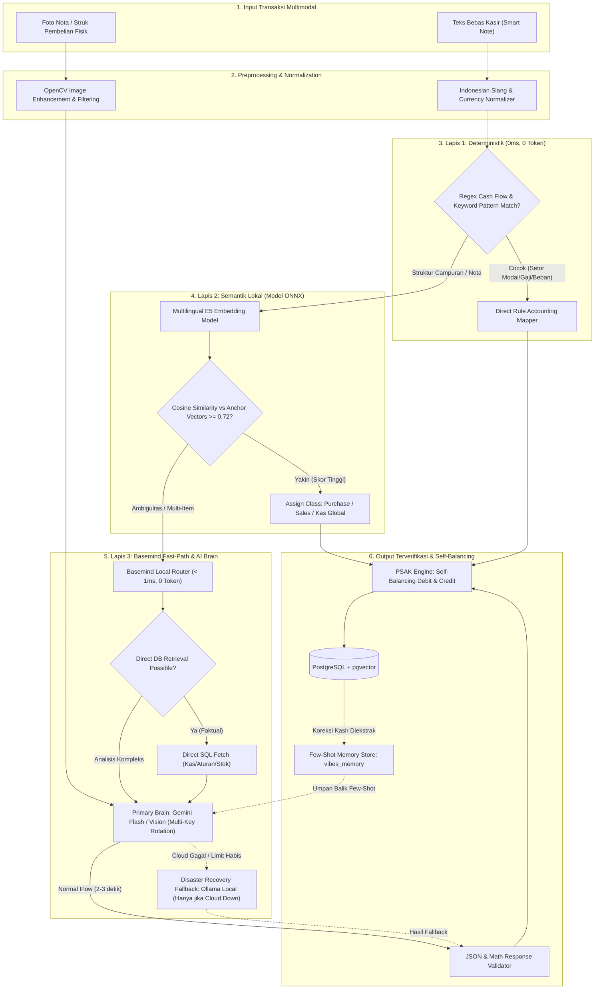
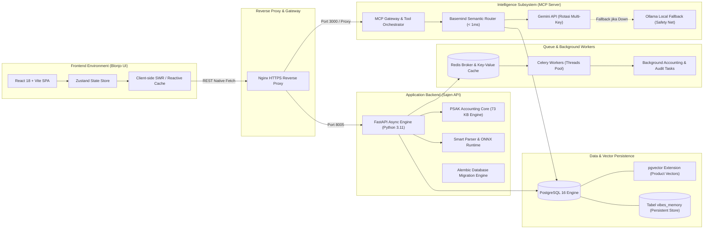
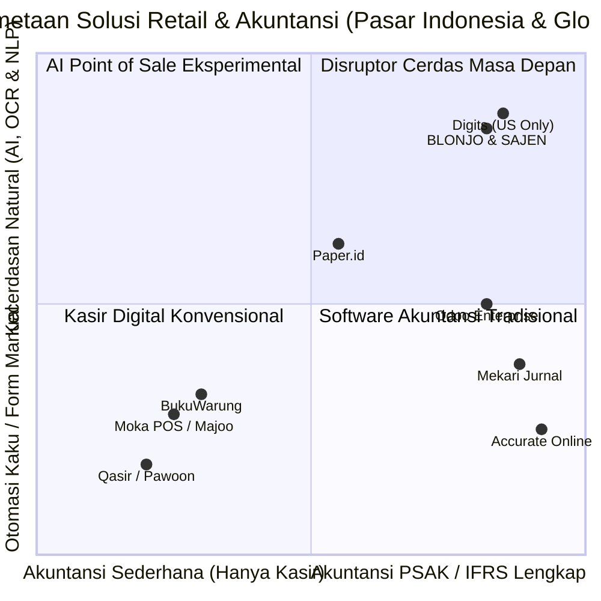
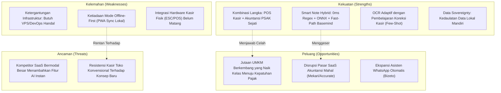

# Analisa Arsitektur Kecerdasan, Kompleksitas, dan Komparasi Pasar
## Ekosistem Retail Accounting & AI: BLONJO, SAJEN & MCP Server

---

## 📌 Ringkasan Eksekutif & Kartu Skor

Dokumen ini menyajikan evaluasi independen, jujur, dan menyeluruh terhadap arsitektur perangkat lunak, kapabilitas kecerdasan buatan (*Artificial Intelligence*), kompleksitas rekayasa sistem, fungsionalitas operasional, serta posisi kompetitif aplikasi **BLONJO & SAJEN** di pasar solusi ritel dan akuntansi.

### Kartu Skor Evaluasi Sistem (Skala 0 s/d 10)

| Dimensi Evaluasi | Skor | Status Industri | Ringkasan Penilaian Arsitektural |
| :--- | :---: | :---: | :--- |
| **Kecerdasan (Intelligence)** | **8.4 / 10** | **Top Tier UMKM** | Pipeline hybrid adaptif (*0ms Regex* ➔ *Vektor Semantik ONNX Lokal* ➔ *Basemind Zero-Token Fast-Path* ➔ *Gemini Flash Multi-Key Rotation* ➔ *Ollama Disaster Fallback*). Bukan bot generatif biasa. |
| **Kompleksitas (Complexity)** | **8.7 / 10** | **Enterprise-Grade** | Arsitektur multi-service terdistribusi tingkat tinggi (*FastAPI*, *Celery*, *Redis*, *PostgreSQL pgvector*, *MCP Intelligence Server*, *React Vite Zustand*). Kokoh, namun memiliki biaya pemeliharaan (*maintenance tax*) yang signifikan. |
| **Fungsionalitas (Functionality)** | **7.8 / 10** | **Kuat & Komprehensif** | Menyatukan antarmuka kasir cepat (*Smart Note*) dengan kepatuhan buku besar akuntansi *double-entry* PSAK UMKM otomatis (*self-balancing* desimal). Celah utama ada pada kesiapan integrasi perangkat keras kasir fisik. |
| **Daya Saing Pasar (Competitiveness)** | **8.2 / 10** | **Disruptif (Niche Khusus)** | Mengisi kekosongan besar antara aplikasi kasir instan (*Moka/Majoo*) yang minim akuntansi dan software akuntansi korporat (*Mekari Jurnal/Accurate*) yang kaku bagi operasional kasir harian warung. |

---

## 🧠 1. Bedah Arsitektur Kecerdasan (Intelligence Deep-Dive)

Kecerdasan sistem BLONJO & SAJEN dirancang dengan prinsip **efisiensi biaya, latensi minimal (< 3 detik), dan zero-hallucination**. 

Berdasarkan evolusi arsitektural di logbook proyek:
1. **Gemini API (Flash & Vision)** dengan rotasi multi-API key berperan sebagai **Otak Kognitif Utama (Primary Brain)**.
2. **Basemind Local Semantic Router & ONNX** berperan sebagai **Jalur Cepat Nol Token (< 1ms)**.
3. **Ollama (Local LLM)** telah direposisi menjadi **Secondary Disaster Fallback** (hanya aktif jika layanan cloud global terputus), guna menghindari latensi ekstrem 4,5 menit dan halusinasi fatal model visi lokal kecil.

### Diagram Alur Pemrosesan Transaksi Cerdas (Hybrid Cognitive Pipeline)

### Analisa Keunggulan Teknis
1. **Basemind Fast-Path Zero-Token Architecture**:
   Pertanyaan faktual operasional toko (saldo kas, aturan margin, daftar produk tanpa harga) tidak melalui proses *ReAct reasoning loop* yang boros token. Data langsung ditarik dari database PostgreSQL dan hanya diproses dalam **satu kali pemanggilan sintesis Gemini Flash**, memangkas latensi dari ~15 detik menjadi **~2–3 detik**.
2. **Dynamic Few-Shot Grounding & Anti-Hallucination**:
   Sistem menyuntikkan riwayat master data distributor (*Indomarco*, *Alfamart*, dll.) dan akun COA aktif. Ketika kasir memperbaiki nama barang atau diskon yang meleset, koreksi tersebut dicatat di `vibes_memory` dan diinjeksikan sebagai *few-shot context* untuk ekstraksi berikutnya.
3. **Analitik Prediktif Berbasis Data Riil**:
   Fitur proyeksi omset dan kalkulasi *stock-out alert* (≤ 3 hari) dihitung secara matematis melalui rumus *consumption run-rate* 30 hari terakhir, bukan hasil karangan generatif LLM.

### Batasan Riil & Pelajaran Lapangan (Changelog Reality)
- **Eliminasi OCR Ollama LLaVA**: Di awal proyek, OCR dicoba menggunakan model LLaVA lokal via Ollama. Namun pengujian lapangan membuktikan model vision lokal berukuran kecil rentan mengalami *prompt bleed* (berhalusinasi mencantumkan distributor besar seperti Indomarco padahal struk bertuliskan toko lain) dan memicu *timeout* hingga 4 menit. Oleh karena itu, jalur vision Ollama telah **dihapus secara permanen** dan dialihkan ke Gemini Vision.
- **Ketergantungan API Key Cloud**: Meskipun terdapat rotasi *multi-key* Gemini, dependensi utama terhadap penyedia cloud membuat performa sistem rentan terpengaruh jika terjadi lonjakan latensi jaringan internasional atau perubahan kebijakan kuota API eksternal.

---

## 🏗️ 2. Analisa Kompleksitas Sistem & Arsitektur Terdistribusi

Sistem mengadopsi arsitektur layanan terdistribusi modular yang memisahkan beban kerja antarmuka (*client-side*), kalkulasi bisnis (*synchronous API*), pemrosesan asinkron (*worker queues*), dan orkestrasi kecerdasan (*MCP AI runtime*).

### Diagram Topologi Arsitektur Terdistribusi

### Evaluasi Arsitektur
- **Pemisahan Peran Kognitif & Transaksional yang Sangat Bersih**: Backend transaksional (`sajen-api`) tidak terbebani oleh logika LLM yang berat; seluruh orkestrasi model ditangani secara mandiri oleh `mcp-server`.
- **In-Database Vector Engine**: Pemanfaatan `pgvector` di PostgreSQL mengeliminasi kebutuhan klaster database vektor terpisah seperti Pinecone atau Qdrant, menjaga kesatuan ACID transaksi finansial dan vektor produk.
- **Maintenance Tax**: Menjalankan ekosistem ini membutuhkan keahlian DevOps tingkat lanjut untuk mengelola kontainer Docker, Celery queue, migrasi skema Alembic, dan sertifikat HTTPS reverse proxy.

---

## 💼 3. Evaluasi Fungsionalitas & Keselarasan Operasional UMKM

Aplikasi BLONJO & SAJEN menyelesaikan kontradiksi terbesar dalam digitalisasi UMKM: **menghilangkan beban input akuntansi manual tanpa mengorbankan kepatuhan standar keuangan**.

### Matriks Kesiapan Fungsionalitas

| Komponen Bisnis | Tingkat Kesiapan | Kekuatan Utama | Celah yang Harus Dilengkapi |
| :--- | :---: | :--- | :--- |
| **Pencatatan Kasir (POS)** | **8.5 / 10** | Smart Note bahasa gaul pasar, katalog produk cepat, kalkulasi otomatis. | Belum ada mode offline (*IndexedDB Sync*) jika koneksi terputus tiba-tiba. |
| **Akuntansi PSAK UMKM** | **9.0 / 10** | Jurnal perpetual otomatis, pengakuan PPN Masukan/Keluaran, isolasi DP, neraca seimbang. | Belum memiliki fitur penutupan buku tahunan otomatis (*closing fiscal year*). |
| **Manajemen Rantai Pasok** | **8.2 / 10** | *Purchasing Matrix*, pelacakan hutang distributor, rekomendasi kulakan cerdas. | Belum terhubung langsung ke katalog elektronik distributor nasional (*EDI*). |
| **Dukungan Hardware Fisik** | **5.5 / 10** | Ekspor cetak PDF dan antarmuka browser standar. | Belum ada driver bawaan direct raw ESC/POS (Bluetooth/USB) & trigger laci kasir otomatis. |

---

## ⚔️ 4. Matriks Komparasi Pesaing Industri

### Diagram Posisi Pasar (Market Positioning Landscape)

### Tabel Komparasi Fitur Mendalam

| Fitur Kritis | **BLONJO & SAJEN** | **Moka POS / Majoo** | **Mekari Jurnal** | **Paper.id** | **Accurate Online** | **Digits.com (Global)** |
| :--- | :---: | :---: | :---: | :---: | :---: | :---: |
| **Input Bahasa Alami (Smart Note)** | **Lengkap (Hybrid AI)** | ❌ Manual | ❌ Manual | ❌ Manual | ❌ Manual | ⚠️ Terbatas (English) |
| **OCR Struk Distributor Grosir** | **Gemini Vision + Dynamic RAG** | ❌ Tidak Ada | ⚠️ Add-on Terbatas | **Kuat (Invoice AI)** | ❌ Tidak Ada | **Kuat (Format US)** |
| **Standar Double-Entry PSAK Otomatis** | **PSAK UMKM Penuh** | ❌ Kas Masuk/Keluar Saja | **PSAK Lengkap** | ⚠️ Terbatas Piutang/Hutang | **PSAK Lengkap** | **US GAAP** |
| **Kedaulatan Data (Self-Hosted/On-Prem)**| **Penuh (VPS Mandiri)** | ❌ Vendor Lock Cloud | ❌ Vendor Lock Cloud | ❌ Vendor Lock Cloud | ⚠️ Server Lokal Kaku | ❌ Cloud SaaS Tertutup |
| **Asisten Analitik Multi-Agent (CFO AI)** | **Ada (Basemind 9 Peran)** | ❌ Tidak Ada | ❌ Tidak Ada | ❌ Tidak Ada | ❌ Tidak Ada | **Ada (Digits AI)** |
| **Model Biaya Kepemilikan (TCO)** | **Biaya Server Pribadi** | Langganan / Cabang | Langganan Tinggi | Freemium + Trx Fee | Biaya Lisensi Tinggi | Sangat Mahal ($$$) |

---

## 🛡️ 5. Analisa SWOT & Keunggulan Tak Tertandingi (Moat)

---

## 🎯 6. Rekomendasi Roadmap Strategis & Perbaikan Arsitektur

Untuk menaikkan nilai fungsionalitas dari **7.8** menuju **9.5**, langkah-langkah strategis berikut direkomendasikan untuk dieksekusi:

1. **Implementasi Offline-First Architecture (PWA + IndexedDB)**:
   Tambahkan *service worker* dan penampung transaksi lokal di peramban web (*browser*). Saat koneksi terputus, kasir tetap dapat mencatat penjualan tanpa hambatan dan data akan diunggah otomatis ke Sajen API begitu koneksi kembali aktif.
2. **Native Web Serial & Web Bluetooth ESC/POS Engine**:
   Bangun pustaka pencetakan langsung berbasis biner ESC/POS di sisi *client* untuk menghubungkan Blonjo UI dengan printer kasir Bluetooth (58mm/80mm) dan laci uang (*cash drawer*) tanpa ketergantungan pada dialog cetak sistem operasi.
3. **Penyempurnaan Ambang Batas Semantik (*Threshold Hardening*)**:
   Tingkatkan ambang batas kemiripan kosinus ONNX ke `0.78` untuk transaksi kategori khusus guna mencegah anomali kata kunci produk beririsan dengan istilah modal/beban usaha.
4. **Modul Penutupan Buku Periode Akuntansi**:
   Lengkapi modul akuntansi dengan fitur otomatisasi penutupan saldo pendapatan dan beban ke akun *Laba Ditahan* pada akhir periode pembukuan tahunan.
