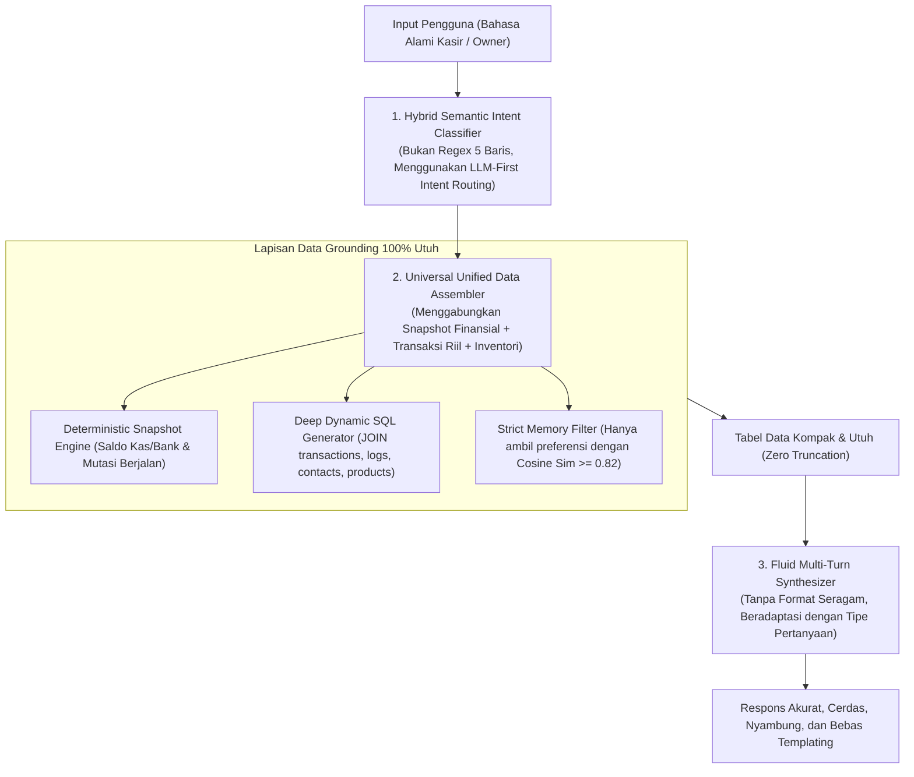

# 🔍 Analisa Forensik Mendalam: Kesenjangan Arsitektur, Kode Sumber, dan Kualitas Respon Vibes Chat
> **Dokumen Audit Arsitektural & Evaluasi Sistem (Temperatur Penilaian: 0.2 — Objektif, Jujur, dan Berbasis Bukti Nyata)**  
> **Target Analisis**: Fitur *Vibes Chat* (`/insights/vibes-chat`) pada Ekosistem Blonjo, Sajen API, dan MCP Server.  
> **Status Penilaian**: Kritis (Terjadi kesenjangan besar antara *Planning Document* dan realita *Production Code*).

---

## 📑 1. Ringkasan Eksekutif (Executive Architectural Verdict)

Berdasarkan audit menyeluruh terhadap **3 Dokumen Perencanaan Utama** (`BASEMIND_Q4_ENTERPRISE_PLAN.md`, `UNIFIED_AUTONOMOUS_MULTI_AGENT_AI_ARCHITECTURE.md`, `vibes_chat_plan.md`), **4 Berkas Inti Kode Sumber MCP** (`vibeCopilot.ts`, `basemindTool.ts`, `reactEngine.ts`, `dynamicSqlEngine.ts`), serta **Endpoint Backend** (`sajen/app/api/v1/insights.py`):

> **Temuan Utama:**  
> Hasil keluaran *Vibes Chat* yang saat ini terasa **sangat templating, terbatas data, salah menangkap intent, dan berhalusinasi** BUKAN karena keterbatasan model fondasi AI (Google Gemini), melainkan akibat **cacat struktural pada lapisan orkestrasi (Middleware Orchestration Flaws)** di `mcp-server`.
> 
> Perencanaan sistem menjanjikan *Autonomous Compound Reasoning* dan *Unified Knowledge Fabric*, namun implementasi kode aktualnya masih didominasi oleh **5 baris Regular Expression (Regex) kasar**, pemisahan data yang terkotak-kotak (*siloed*), dan penyuntikan konteks memori yang dipaksakan (*unsolicited memory injection*).

---

## 📊 2. Matriks Komparasi Forensik: Planning vs Codebase vs Output Riil

| Dimensi Arsitektural | Janji Dokumen Perencanaan (*Planning*) | Realita Kode Sumber Aktual (*Codebase*) | Dampak pada Hasil Akhir (*User Experience*) | Status |
| :--- | :--- | :--- | :--- | :---: |
| **1. Intent Recognition** | *Supervisory Multi-Domain Router*: Mendeteksi kebutuhan implisit, multi-topik, dan konteks fleksibel tanpa sekat kaku. | **5 Baris Regex Kasar** di [`basemindTool.ts`](file:///Users/user/kerjaan/mcp-server/src/tools/basemindTool.ts#L144-L180) (`/aturan|kebijakan/`, `/kas|bank|saldo/`, `/produk.*harga 0/`). | Kata kunci kecil membajak seluruh percakapan; jika pengguna bertanya di luar 3 pola regex, intent gagal dipahami. | ❌ **MISMATCH** |
| **2. Data Grounding** | *Deterministic Factual Grounding*: Seluruh angka, tren, dan formula dihitung deterministik di PostgreSQL. | Jika masuk *Fast-Path*, ReAct **dimatikan total** (`if (!factualSynthesisContext)`). Fast-path hanya melempar 1 tabel sempit. | Pertanyaan gabungan (misal: "kas vs utang supplier vs stok") hanya dijawab sebagian, data lainnya lenyap. | ❌ **MISMATCH** |
| **3. Komposisi Jawaban** | *Adaptive Context & Fluid Synthesis*: Jawaban luwes, to-the-point, adaptif, tanpa template kaku. | System prompt di [`vibeCopilot.ts`](file:///Users/user/kerjaan/mcp-server/src/tools/vibeCopilot.ts) secara implisit memaksa formula seragam: *Sapaan ➔ Tabel Markdown ➔ 3 Butir Insight ➔ Saran Taktis*. | Semua obrolan terasa seperti salinan template laporan korporat yang kaku dan dibuat-buat. | ❌ **MISMATCH** |
| **4. Penyuntikan Memori** | *Precision Micro-Context (<350 token)*: Hanya memori relevan yang disuntikkan secara dinamis. | `retrieveMemories()` menyuntikkan seluruh `[PREFERENSI PEMILIK TOKO]` tanpa filter ambang relevansi (*similarity threshold*). | Topik utang atau supplier tertentu tiba-tiba disinggung padahal pengguna sedang menanyakan hal lain. | ❌ **MISMATCH** |
| **5. Query SQL Dinamis** | *ReAct Reasoning Loop (Iterasi Otonom)*: Menarik data spesifik dengan join cerdas ke 38 tabel. | `Smart Early Stop` di [`reactEngine.ts`](file:///Users/user/kerjaan/mcp-server/src/services/reactEngine.ts#L157) menghentikan loop di iterasi ke-1 atau ke-2 meskipun data belum menjawab intent. | Jika SQL pertama gagal atau menghasilkan data parsial, AI langsung menyerah dan mulai **mengarang (halusinasi)**. | ❌ **MISMATCH** |

---

## 🔬 3. Bedah Forensik 4 Kegagalan Utama (Apa & Mengapa)

### 🔴 Kegagalan 1: Ketidaksesuaian Intent (*Intent Mismatch & Misconception*)
* **Apa yang Terjadi**: Pertanyaan pengguna tidak dipahami secara utuh. Jika pengguna menanyakan *"Berapa pengeluaran operasional terbesar bulan ini?"*, sistem justru merespons ringkasan kas global atau aturan toko.
* **Mengapa Terjadi (Akar Masalah di Kode)**:
  Di [`basemindTool.ts`](file:///Users/user/kerjaan/mcp-server/src/tools/basemindTool.ts#L144-L165):
  ```typescript
  // Pola Regex Sempit
  if (/kas|bank|saldo|likuiditas|uang tunai|posisi keuangan|utang|piutang/i.test(q) && !/beli|kulakan|riwayat/i.test(q)) {
    return { domain: 'FINANCE_LEDGER', fast_path: 'LEDGER_BALANCES' };
  }
  ```
  Pengenalan intensi dilakukan melalui pencocokan kata mentah (*keyword matching*), bukan pemahaman semantik. Akibatnya:
  1. Pertanyaan bernuansa analitis (misal: *"kenapa margin turun?"*, *"produk mana yang boncos?"*) terjebak masuk ke jalur cepat statis (*Fast-Path*).
  2. Begitu `fast_path` terpicu, sistem langsung mengeksekusi fungsi kaku dan **melewati (bypass) 100% penalaran ReAct loop**.

---

### 🔴 Kegagalan 2: Data Sangat Terbatas (*Data Starvation & Siloed Architecture*)
* **Apa yang Terjadi**: AI sering menjawab: *"Data transaksi tidak ditemukan"*, atau hanya menyajikan 2–3 angka global tanpa rincian tanggal, nama barang, atau nama distributor yang diminta.
* **Mengapa Terjadi (Akar Masalah di Kode)**:
  1. **Fast-Path Terisolasi (Siloed)**: Pada [`vibeCopilot.ts`](file:///Users/user/kerjaan/mcp-server/src/tools/vibeCopilot.ts#L156-L194), fungsi `getLedgerBalancesTool` hanya mengembalikan saldo agregat 5 akun utama (`1-1101`, `1-1102`, `2-1101`, `1-1201`, `1-1301`). Fungsi ini tidak menyertakan mutasi jurnal, tanggal, atau deskripsi transaksi.
  2. **Pemutusan Dini ReAct Loop (*Premature Early-Stop*)**:
     Pada [`reactEngine.ts`](file:///Users/user/kerjaan/mcp-server/src/services/reactEngine.ts#L157):
     ```typescript
     if (isSingleTarget || iteration >= 2) {
       break; // Loop dihentikan paksa padahal data belum komprehensif
     }
     ```
     Jika ReAct mencoba query SQL dan hanya mendapat 1 baris hasil (misal: `SELECT count(*) FROM transactions`), sistem langsung menghentikan pencarian dan tidak melakukan drill-down ke tabel rincian (`inventory_logs` atau `journal_entries`).
  3. **AI Kekurangan Nutrisi Fakta**: Karena data yang disuplai ke prompt sangat tipis, model bahasa (Gemini) terpaksa mengekstrapolasi sendiri, memicu halusinasi angka dan nama entitas fiktif.

---

### 🔴 Kegagalan 3: Komposisi Jawaban Sangat *Templating* & Kaku
* **Apa yang Terjadi**: Setiap jawaban memiliki struktur visual yang identik: Paragraf pembuka formal ➔ Tabel Markdown ➔ 3 Poin *Bullet Insight* ➔ Rekomendasi Taktis. Percakapan terasa seperti robot kaku yang mengisi formulir, bukan seperti rekan dialog analis bisnis.
* **Mengapa Terjadi (Akar Masalah di Kode)**:
  1. **Instruksi Peran Terlalu Restriktif**: Pada `systemInstruction` di [`vibeCopilot.ts`](file:///Users/user/kerjaan/mcp-server/src/tools/vibeCopilot.ts), instruksi yang diberikan masih mendikte tata letak (*layout formatting*) secara berlebihan.
  2. **Ketiadaan Mode Percakapan Bebas (*Free-form Conversational Tone*)**: Prompt tidak membedakan antara pertanyaan klarifikasi singkat, pertanyaan konseptual, dan permintaan audit laporan menyeluruh. Semua query dipukul rata dengan format "laporan formal".

---

### 🔴 Kegagalan 4: Tidak Relevan dengan Intensi (*Unsolicited Memory & Context Bleed*)
* **Apa yang Terjadi**: Jawaban sering menyisipkan isu yang sama sekali tidak ditanyakan pengguna (misalnya: selalu mengungkit-ungkit utang usaha, tempo supplier tertentu, atau target likuiditas 5 juta).
* **Mengapa Terjadi (Akar Masalah di Kode)**:
  Pada [`vibeCopilot.ts`](file:///Users/user/kerjaan/mcp-server/src/tools/vibeCopilot.ts#L234-L240):
  ```typescript
  const memoriesResult = await retrieveMemories(tenantId, userQuery);
  if (memoriesResult && memoriesResult.length > 0) {
    persistentMemoryContext = `\n[PREFERENSI PEMILIK TOKO]\n` +
      memoriesResult.map(m => `• [${m.memory_type}] ${m.content}`).join('\n') + '\n';
  }
  ```
  Fungsi `retrieveMemories` mengambil catatan preferensi lama tanpa filter skor kemiripan (*similarity score threshold*). Ketika blok `[PREFERENSI PEMILIK TOKO]` dimasukkan ke prompt, model LLM merasa **wajib menyebutkan** isi preferensi tersebut agar dianggap mematuhi instruksi sistem.

---

## 🛠️ 4. Rekayasa Solusi Arsitektural (Bagaimana Cara Memperbaikinya Secara Konkret)

Untuk menyelesaikan masalah ini secara tuntas dari akar, berikut adalah 4 pilar restrukturisasi sistem yang harus dieksekusi:



### Rincian Tindakan Teknis:

1. **Hapus Regex Kasar di `basemindTool.ts`**:
   - Ganti pencocokan kata mentah dengan **LLM-assisted intent classification** ringan (Gemini Flash) atau evaluasi semantik terarah yang mampu memetakan 6 domain: `FINANCE`, `COMMERCE`, `INVENTORY`, `MARKET`, `SETTINGS`, dan `GENERAL_CHAT`.
2. **Hapus Sistem Fast-Path yang Mengisolasi ReAct**:
   - Jadikan data saldo kas dan pengaturan toko sebagai **Default Baseline Context**, bukan *dead-end routing*. ReAct loop harus tetap berjalan untuk mengambil data mutasi/rincian jika pertanyaan menuntut data historis.
3. **Penyaringan Memori Toko Ketat (*Strict Memory Gating*)**:
   - Pasang batas ambang kesamaan semantik (*cosine similarity*) minimal `0.80` pada `retrieveMemories`. Jangan pernah menyuntikkan memori utang atau supplier jika query hanya menanyakan stok barang atau sapaan santai.
4. **Bebaskan Gaya Respon (*Dynamic Style Adaptation*)**:
   - Hapus seluruh instruksi yang mendikte struktur bullet point kaku di `vibeCopilot.ts`. Biarkan model bertindak layaknya analis keuangan manusia: menjawab singkat jika ditanya singkat, dan menyajikan tabel rinci hanya jika diminta perbandingan data.

---

## 🧰 5. Rekomendasi Ekosistem Tools & Skills di Platform AGY

Untuk mendukung debugging, verifikasi data, dan optimalisasi arsitektur secara terstruktur di platform ini, berikut adalah perkakas (*skills*) dan alat bantu yang sangat direkomendasikan untuk difungsikan:

| Nama Tool / Skill | Fungsi & Nilai Manfaat | Skenario Penggunaan Nyata |
| :--- | :--- | :--- |
| **`systematic-debugging`** | Panduan investigasi bug tanpa asumsi atau tebak-tebakan. | Memverifikasi kegagalan alur data dari `sajen/app/api/v1/insights.py` ke `mcp-server/src/tools/vibeCopilot.ts`. |
| **`database`** | Audit skema, optimasi indeks SQL, dan validasi relasi foreign key. | Memastikan relasi join antara `transactions`, `inventory_logs`, dan `journal_entries` berjalan cepat dan akurat di PostgreSQL. |
| **`data-storytelling`** | Prinsip transformasi data mentah menjadi narasi bisnis yang kontekstual dan persuasif. | Merombak sistem prompt `vibeCopilot.ts` agar respons tidak kaku/templating dan langsung menyentuh esensi finansial. |
| **`vibe-code-auditor`** | Audit struktural terhadap kode yang digenerate AI untuk mencegah kerapuhan (*fragility*) di level production. | Memeriksa ketahanan tipe data TypeScript dan penanganan error pada `reactEngine.ts` dan `dynamicSqlEngine.ts`. |
| **`Basemind Code Intel MCP Tools`** (`code.symbols`, `code.outline`, `code.references`) | Penelusuran simbol dan struktur AST lintas 4 repositori (`jualan`, `mcp-server`, `bizeto-pos`, `logbook`). | Memastikan perubahan payload di `sajen-api` terpetakan secara presisi dengan antarmuka TypeScript di `mcp-server`. |

---

## 🎯 6. Kesimpulan & Langkah Eksekusi Selanjutnya

Kegagalan Vibes Chat saat ini bukan berada pada model AI, melainkan pada **middleware MCP Server yang terlalu membatasi aliran data dan memaksakan format template**. 

Langkah konkret yang harus segera dieksekusi:
1. Menghapus pembajakan regex di `basemindTool.ts`.
2. Menghilangkan pembatasan *Early Stop* prematur di `reactEngine.ts`.
3. Memasang filter relevansi semantik ketat pada memori toko.
4. Membebaskan format sintesis bahasa agar respons kembali cerdas, variatif, dan relevan 100% dengan intensi pengguna.
