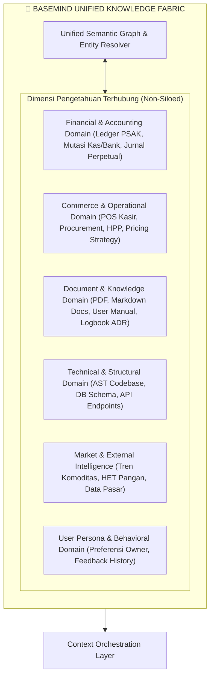
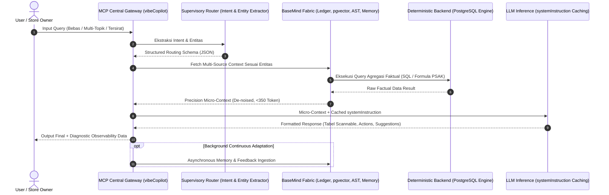

# 📋 System Architecture & Specification: BaseMind Q4 Cognitive Engine

> **Document Type:** Software Architecture Document (SAD) & Engineering Specification  
> **Module Target:** Sajen Intelligence Engine (`/insights/sajen-intelligence`)  
> **Architectural Pattern:** Unified Knowledge Fabric & Supervisory Multi-Domain Orchestration  

---

## 1. Architectural Rationale & System Objectives

Dokumen ini mendefinisikan spesifikasi arsitektur modul **Sajen Intelligence** yang mengintegrasikan **BaseMind Knowledge Fabric**, **Quadrant 4 Multi-Disciplinary Cognitive Model**, dan **Supervisory Intent Routing**.

### 1.1 Core Engineering Mandates
1. **Holistic Knowledge Resolution (Non-Siloed)**:
   - Sistem memandang seluruh ekosistem (data transaksional, buku besar keuangan, master data, panduan SOP, skema database, kode sumber, riset pasar, dan histori perubahan) sebagai satu kesatuan graf pengetahuan (*Unified Knowledge Graph*).
   - Domain-domain sistem tidak terkotak secara kaku, melainkan saling beririsan secara dinamis sesuai kebutuhan query pengguna.
2. **Deterministic Factual Grounding**:
   - Perhitungan angka, saldo keuangan, dan formula bisnis wajib dieksekusi secara deterministik di level database/backend (PostgreSQL), bukan dikalkulasi secara generatif oleh model LLM.
3. **Adaptive Context De-Noising & Token Optimization**:
   - Menghilangkan *greedy data ingestion*. Konteks yang disuntikkan ke LLM harus memiliki korelasi semantik tinggi (*Precision Micro-Context* <350 token), menghilangkan konfigurasi internal atau data mentah yang tidak relevan dengan intent.
4. **Implicit Intent Awareness & Executive Formatting**:
   - Model dilatih untuk meresolusi kebutuhan tersirat pengguna (misalnya korelasi antara stok fisik dan laju penjualan harian) tanpa melakukan *unsolicited oversharing* (menggurui pengguna tentang konfigurasi internal sistem).
   - Jawaban disajikan secara *direct-to-point* dengan format tabel Markdown terstruktur dan opsi navigasi kontekstual.
5. **Continuous Memory & Behavioral Adaptation**:
   - Sistem menyerap preferensi, koreksi, dan umpan balik pengguna (upvote/downvote) sebagai memori adaptif untuk mempersonalisasi gaya respons secara berkelanjutan.

---

## 2. Universal Knowledge Fabric (BaseMind Engine)

BaseMind bertindak sebagai fondasi pengindeks dan penghubung relasional lintas seluruh dimensi ekosistem aplikasi:



---

## 3. Supervisory Multi-Domain Orchestration Pipeline

Alur pemrosesan dari input pengguna hingga output akhir dieksekusi melalui pipeline multi-tahap:



### 3.1 Spesifikasi Structured Routing Schema
Supervisory Router menghasilkan metadata routing tanpa teks percakapan:
```typescript
interface SupervisoryRoute {
  primary_domain: 'FINANCE' | 'COMMERCE' | 'DOCUMENT_KNOWLEDGE' | 'TECHNICAL' | 'MARKET' | 'HYBRID';
  sub_intents: string[];
  entities: {
    target_accounts?: string[];
    item_keywords?: string[];
    date_range?: { start: string; end: string; is_cumulative: boolean };
    document_references?: string[];
    system_symbols?: string[];
  };
  required_evaluations: ('LEDGER_SNAPSHOT' | 'DYNAMIC_SQL' | 'VECTOR_SEARCH' | 'CODEBASE_AST' | 'WEB_INTEL')[];
  confidence_score: number;
}
```

---

## 4. Engineering Contract: Aturan Format & Perilaku Agen

Setiap agen/worker yang menghasilkan teks ke pengguna wajib mematuhi kontrak perilaku berikut:

### 4.1 Visual & Scannable Hierarchy
1. **Line 1 (Direct Response)**: Wajib menyajikan data inti, metrik utama, atau nominal tebal langsung pada baris pertama tanpa kalimat pembuka klise (*anti-template mandate*).
2. **Data Presentation**: Seluruh rincian perbandingan, multi-item, atau data akun wajib disajikan dalam **Tabel Markdown** dengan perataan kolom presisi.
3. **Actionable Deep-Links**: Menyertakan blok `<!-- ACTIONS -->` yang berisi rute navigasi internal aplikasi yang relevan secara dinamis.
4. **Contextual Suggestions**: Menyertakan persis 3 butir rekomendasi pertanyaan lanjutan di dalam blok `<!-- SUGGESTIONS -->`.

### 4.2 Anti-Mansplaining & Silent Guardrails
- Parameter konfigurasi internal (seperti `stock_maintenance`, `cogs_rate`, `voice_rules`) berfungsi sebagai **pembatas logika internal (silent filter)**.
- Agen **dilarang keras** mencetak penjelasan status konfigurasi kepada pengguna kecuali jika pengguna secara eksplisit menanyakannya.

---

## 5. Multi-Repository Topology

Arsitektur sistem terdistribusi mencakup 4 repositori yang saling terintegrasi:

| Repositori | Lingkup Tanggung Jawab Teknis |
| :--- | :--- |
| **`~/kerjaan/bizeto-pos`** | Antarmuka Kasir Frontliner, Barcode Scanner, Printer Thermal ESC/POS, Voice Command POS Parser. |
| **`~/kerjaan/jualan`** | Backoffice ERP, Core Pembukuan PSAK EMKM, Purchasing, AI Vision OCR, Blonjo UI & Sajen API. |
| **`~/kerjaan/mcp-server`** | Central AI Gateway, Universal Knowledge Vector (`knowledge_vectors` pgvector), BaseMind Engine. |
| **`~/kerjaan/logbook`** | Single Source of Truth Pusat Dokumentasi Teknis, Architecture Decision Records (ADR), & Living Changelog. |

---

## 6. Verification & Observability Metrics

Setiap eksekusi wajib memvalidasi metrik operasional berikut:
* **Latency**: End-to-end response time $\le 1.0$ detik untuk query standar.
* **Token Overhead**: Injeksi prompt dinamis $\le 380$ token.
* **Accounting Accuracy**: Kesesuaian saldo kas/bank terhadap neraca buku besar = 100% deterministik.
* **UI Transparency**: Ketersediaan modal diagnostik `< /> Inspect Prompt` dan execution badge (`⚡ X.Xs`).

