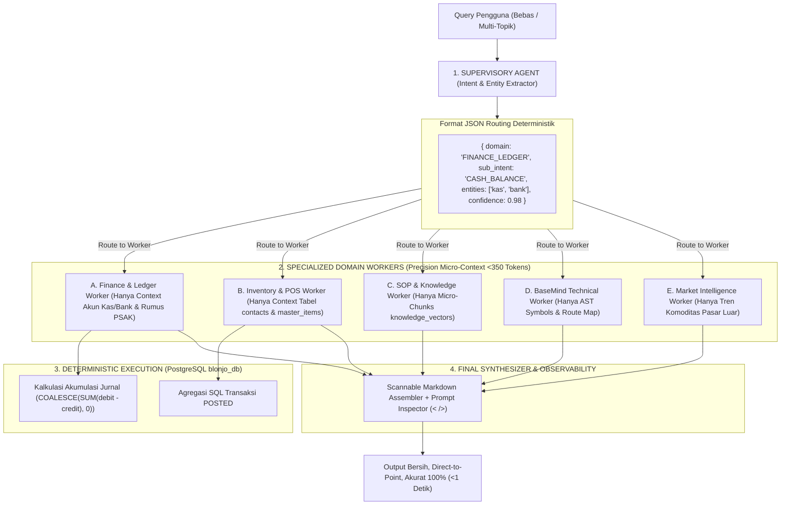

# 🧠 Supervisory Multi-Agent Cognitive Architecture: BaseMind Q4 Enterprise Standard

## 🌟 1. Prinsip Utama (The Core Doctrine)
Kunci utama dari kualitas, presisi, dan akurasi intent pada arsitektur AI bukan terletak pada bagaimana sistem terhubung (API), melainkan pada **bagaimana konteks dibatasi dan difilter secara deterministik sebelum masuk ke LLM**.

Sistem menerapkan arsitektur **Supervisory Multi-Agent Orchestration**:
1. **Supervisory Agent (Router)**: Tidak bertugas menjawab pertanyaan. Tugas tunggalnya adalah mengekstraksi *intent*, entitas, dan mendelegasikan tugas ke Domain Worker yang tepat dalam format JSON murni.
2. **Precision Micro-Context (<350 tokens)**: Setiap domain worker hanya menerima skema, parameter, dan data yang 100% relevan dengan tugasnya (isolasi domain total).
3. **Deterministic Tool Execution**: AI tidak pernah melakukan kalkulasi/aritmatika. Perhitungan formula, saldo buku besar, dan agregasi data murni dieksekusi oleh backend (PostgreSQL / Python), lalu AI menyusunnya menjadi bahasa natural.
4. **Persistent System Memory**: Mandat *direct-to-point*, format tabel Markdown, dan aturan scannable ditanamkan pada lapisan memori statis server (`system_instruction`).

---

## 🏗️ 2. Diagram Alur Orkestrasi Multi-Agent



---

## 🎯 3. Spesifikasi Teknis Modul

### 1. Supervisory Agent (`supervisoryRouter.ts`)
- **Tugas**: Ekstraksi intent tanpa menjawab query.
- **Skema Output JSON**:
```json
{
  "domain": "FINANCE_LEDGER" | "INVENTORY_POS" | "SOP_KNOWLEDGE" | "TECHNICAL_AST" | "MARKET_INTEL",
  "sub_intent": "CASH_BALANCE_INQUIRY",
  "entities": {
    "account_codes": ["1-1101", "1-1102"],
    "date_range": { "start": "2026-09-05", "end": "2026-09-05" },
    "item_keywords": []
  },
  "confidence": 0.98
}
```

### 2. Domain Workers & Precision Micro-Context
- **Finance Worker**: Injeksi saldo akun kas/bank, utang, piutang, dan net cash flow periodik.
- **Inventory & POS Worker**: Injeksi master item, supplier, dan kuantitas stok tanpa menyertakan aturan suara atau kodingan.
- **SOP & Knowledge Worker**: Mengambil top 2-3 chunk dokumen dari `knowledge_vectors` (pgvector).
- **Technical Worker**: Mengambil simbol AST dari BaseMind Engine.
- **Market Worker**: Mengambil data komoditas pasar luar terkurasi.

### 3. Synthesizer & Observability
- Menyatukan data mentah menjadi jawaban scannable berstandar tinggi:
  - Baris pertama: Langsung data inti / nominal tebal.
  - Baris kedua: Tabel Markdown dengan perataan kolom presisi.
  - Bagian akhir: `<!-- ACTIONS -->` dan `<!-- SUGGESTIONS -->`.
- Menampilkan modal diagnostik `< /> Inspect Prompt` untuk transparansi penuh.

