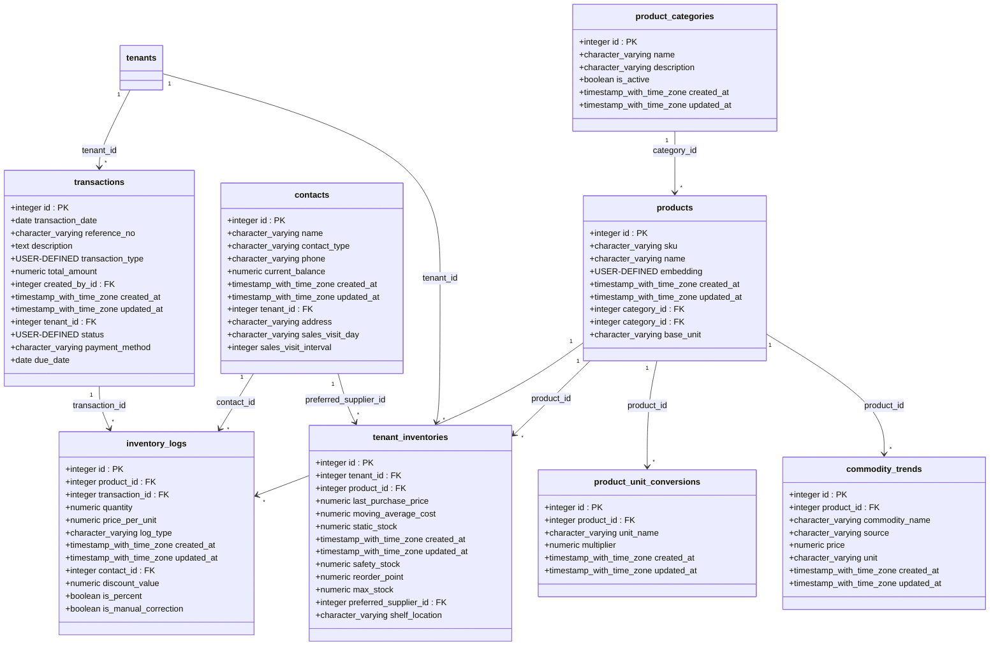
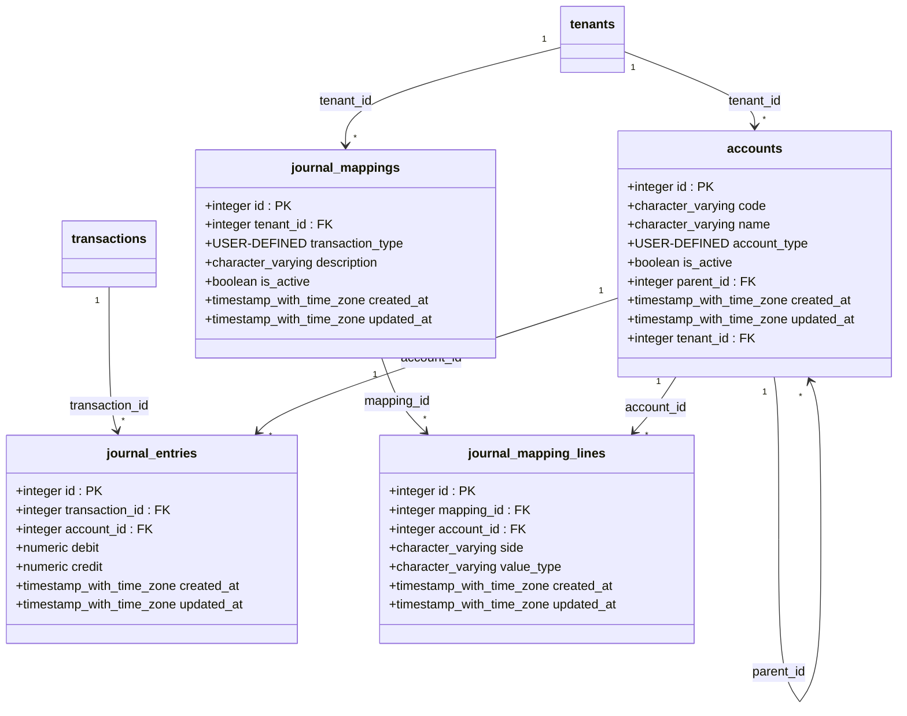
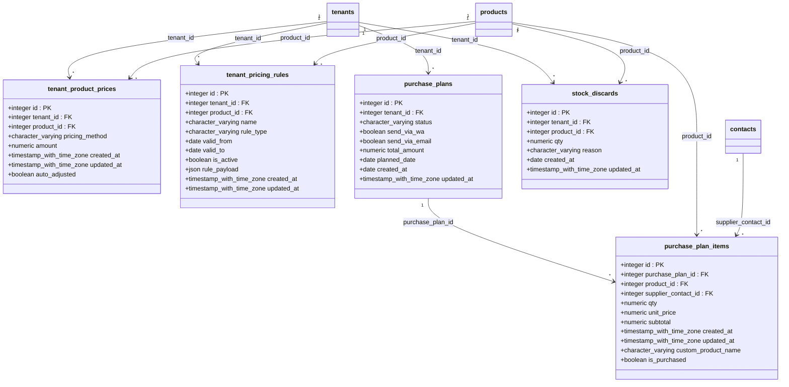
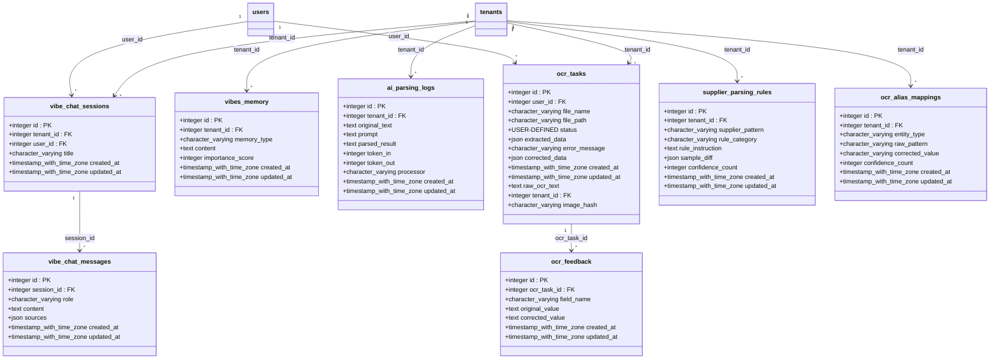
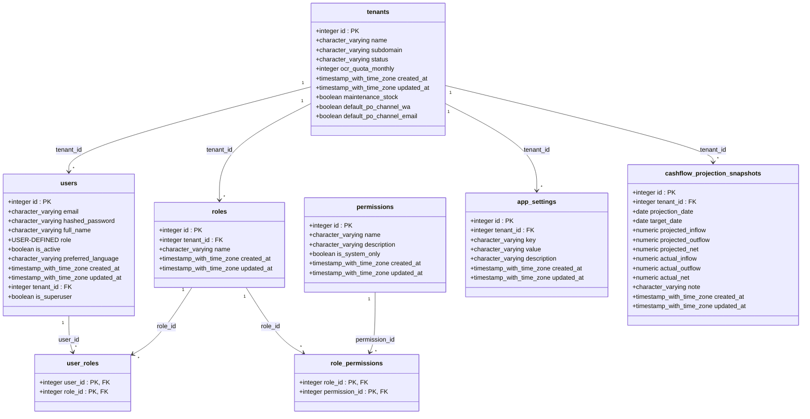

# Blonjo DB - Full Detailed Semantic Relational Ontology (UML Format)

Diagram ini mencakup **seluruh field, tipe data, Primary Key (PK), dan Foreign Key (FK)** menggunakan format UML Class Diagram.

## 1. Modul Transaksi & Inventaris (Inti Bisnis)

---

## 2. Modul Akuntansi & Jurnal Keuangan

---

## 3. Modul Harga & Rencana Kulakan (Purchase Plans)

---

## 4. Modul AI, Vibes Chat & OCR

---

## 5. Modul Autentikasi & Multi-Tenant (Akses Inti)

---

