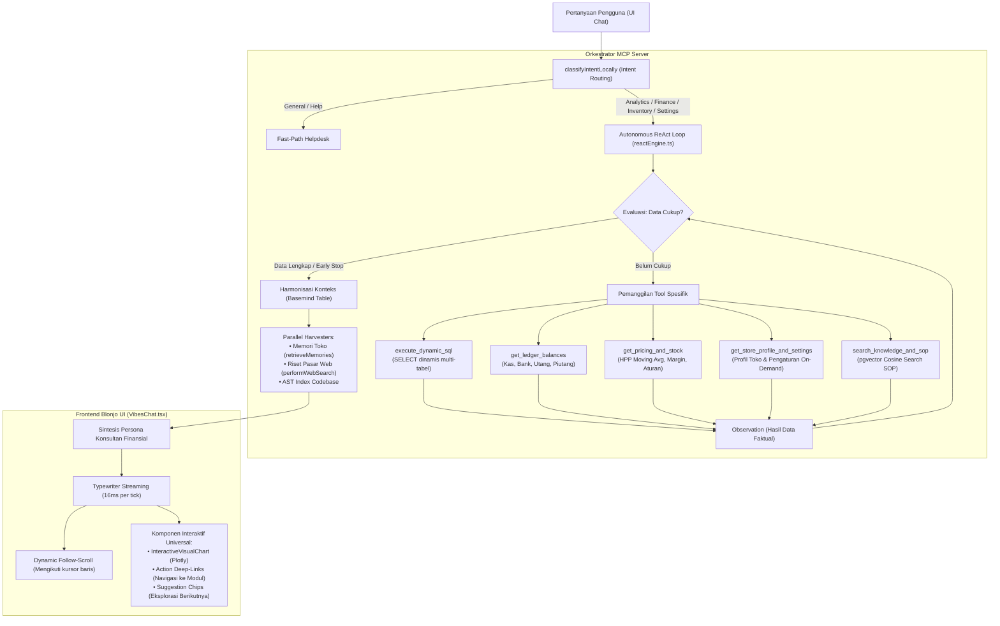
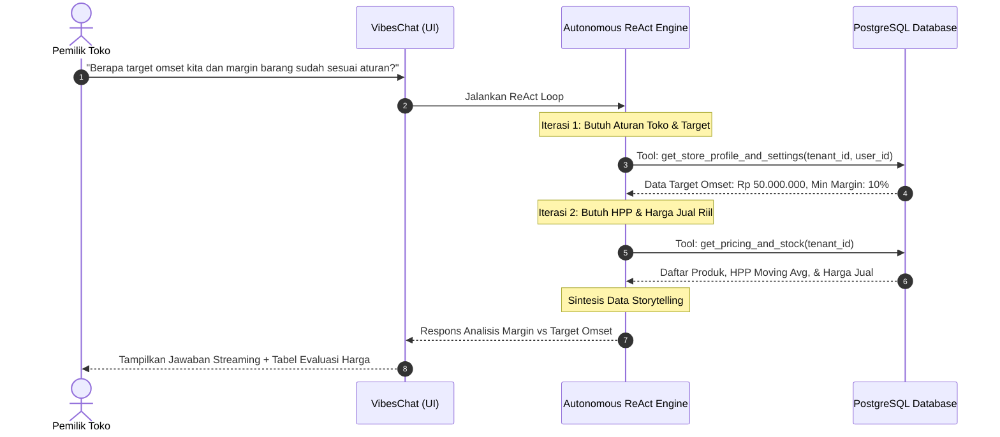

# Laporan Arsitektur: Kolaborasi Tools & Autonomous ReAct di Vibes Chat

> **Status:** Terverifikasi & Aktif di Produksi  
> **Komponen Terkait:** `blonjo` (Frontend React), `mcp-server` (ReAct & Tool Orchestrator), `sajen-api` (PostgreSQL Database)  
> **Tanggal Rilis:** 14 September 2026  

---

## 1. Eksekutif Ringkasan

**Vibes Chat** bukan sekadar asisten percakapan teks generatif umum. Di dalamnya terpasang arsitektur **Autonomous Compound ReAct Engine (Reasoning + Acting)** yang bertindak sebagai *Senior Financial & Retail Consultant*. 

Sistem ini mengeliminasi risiko halusinasi data (*Zero-Hallucination*) dengan memadukan:
1. **Pemeriksaan Skema Database Otomatis (*Schema Pruning*)**: Menghemat hingga 80% kuota token DDL.
2. **Siklus ReAct Berulang (*Thought -> Tool Call -> Observation*)**: Menarik data riil bertingkat hingga fakta terkumpul 100%.
3. **Pemisahan Konfigurasi On-Demand**: Data profil dan aturan toko hanya diambil ketika ditanyakan, mencegah pembengkakan token percakapan rutin.
4. **Visualisasi Interaktif Multi-Layer**: Merender grafik dinamis Plotly, tombol aksi langsung (*deep-links*), dan *suggestion chips* interaktif.
5. **Ergonomi UI Streaming**: Respons diketik kata demi kata (*16ms typewriter stream*) dengan *dynamic follow-scroll* dan *instant bottom view* saat pertama kali dibuka.

---

## 2. Diagram Alur Kolaborasi Tools



---

## 3. Matriks Katalog Tools & Tanggung Jawab

| Nama Tool | Lokasi Sumber Kode | Akses Database / Servis | Tanggung Jawab Teknis |
| :--- | :--- | :--- | :--- |
| **`execute_dynamic_sql`** | `mcp-server/src/tools/dynamicTools.ts` | PostgreSQL (`transactions`, `inventory_logs`, `contacts`, `products`) | Menjalankan kueri `SELECT/WITH` agregat fleksibel. Dilengkapi proteksi regex anti-DML/DDL (`DROP`, `DELETE`, `UPDATE`, `INSERT`). |
| **`get_ledger_balances`** | `mcp-server/src/tools/dynamicTools.ts` | PostgreSQL (`accounts`, `journal_entries`, `transactions`) | Menghitung posisi kas riil, bank, utang usaha supplier (`2-1101`), piutang pelanggan (`1-1201`), dan persediaan standar PSAK. |
| **`get_pricing_and_stock`** | `mcp-server/src/tools/dynamicTools.ts` | PostgreSQL (`products`, `tenant_inventories`, `tenant_pricing_rules`) | Menginspeksi HPP *moving average*, harga jual aktif, dan margin laba produk per tenant. |
| **`get_store_profile_and_settings`** | `mcp-server/src/tools/dynamicTools.ts` | PostgreSQL (`app_settings`, `tenants`, `users`) | Menarik data profil, alamat, target omset, format struk, dan nama toko secara aman terisolasi per `tenant_id` & `user_id`. |
| **`search_knowledge_and_sop`** | `mcp-server/src/tools/dynamicTools.ts` | PostgreSQL `pgvector` (`knowledge_vectors`) | Mengambil SOP dan panduan bisnis berdasarkan kesamaan semantik (*cosine similarity > 0.65*). |
| **`retrieveMemories`** | `mcp-server/src/tools/memoryTool.ts` | PostgreSQL (`store_memories`) | Mengingat kebiasaan pemilik toko, seperti preferensi hari kulakan atau target khusus. |
| **`InteractiveVisualChart`** | `blonjo/src/components/charts/UniversalPlotlyChart.tsx` | Frontend Browser Canvas (Plotly Engine) | Merender grafik interaktif langsung di dalam gelembung percakapan. |

---

## 4. Studi Kasus Nyata: Skenario & Jejak Eksekusi

### Kasus 1: "Tampilkan grafik tren penjualan vs belanja toko periode bulan ini"

#### Tahap 1: Intent Routing
- Pengguna mengirim pesan.
- Fungsi `classifyIntentLocally(userQuery)` mengenali kata kunci: `grafik`, `tren`, `penjualan`, `belanja`.
- Intensi ditetapkan ke `ANALYTICS`.
- Basemind melakukan *selective schema pruning*, hanya melampirkan skema tabel `transactions` dan `contacts` ke dalam prompt perencana ReAct.

#### Tahap 2: Siklus ReAct
- **Thought (Penalaran AI)**:
  > *"Pengguna menginginkan perbandingan omset penjualan dan belanja kulakan harian selama bulan September 2026. Saya membutuhkan agregasi harian transaksi SALE vs PURCHASE."*
- **Action**:
  Tool `execute_dynamic_sql` dipanggil dengan kueri:
  ```sql
  SELECT 
    DATE(transaction_date) as tgl,
    transaction_type,
    SUM(total_amount) as total
  FROM transactions
  WHERE tenant_id = 1 
    AND transaction_date >= '2026-09-01' 
    AND transaction_date <= '2026-09-14'
    AND status = 'POSTED'
  GROUP BY DATE(transaction_date), transaction_type
  ORDER BY tgl ASC;
  ```
- **Observation**:
  PostgreSQL mengembalikan 28 baris data transaksi harian faktual.
- **Smart Early Stop**:
  AI mendeteksi data transaksi sudah lengkap. Loop berhenti pada **Iterasi 1**, menghemat biaya token dan memangkas waktu tunggu pengguna.

#### Tahap 3: Konstruksi Respons & Visualisasi
AI menyusun respon terstruktur yang mencakup:
1. Narasi komparatif (*Data Storytelling*) mengenai stabilitas penjualan harian (Rp 1,2–2,3 juta) dan lonjakan belanja kulakan pada tanggal 4 dan 10 September.
2. Blok grafik Plotly:
   ````markdown
   ```chart:plotly
   {
     "data": [
       { "name": "Penjualan", "x": ["01 Sep", "02 Sep", ...], "y": [1650000, 1700000, ...], "type": "scatter", "mode": "lines+markers" },
       { "name": "Belanja", "x": ["01 Sep", "02 Sep", ...], "y": [450000, 800000, ...], "type": "bar" }
     ],
     "layout": { "title": "Tren Penjualan vs Belanja September 2026" }
   }
   ```
   ````
3. Deep-Links Aksi Modul:
   ```markdown
   <!-- ACTIONS -->
   - [Lihat Rekap Transaksi](/app/transactions)
   - [Buka Rencana Pengadaan](/app/purchasing)
   <!-- /ACTIONS -->
   ```
4. Rekomendasi 3 Pertanyaan Lanjutan:
   ```markdown
   <!-- SUGGESTIONS -->
   - Rincikan item apa saja yang dibeli pada belanja besar tanggal 10 September?
   - Berapa sisa saldo kas dan bank setelah pengeluaran belanja tersebut?
   - Apakah omset penjualan saat ini sudah memenuhi target bulanan toko?
   <!-- /SUGGESTIONS -->
   ```

#### Tahap 4: Rendering di Frontend Blonjo
1. **Follow-Scroll Real-Time**: Teks diketik menggunakan `setInterval` (16ms). Setiap baris teks baru memicu scroll otomatis ke bawah mengikuti kursor kedip `▋`.
2. **Chart Mounting**: Blok `chart:plotly` otomatis diekstrak dan dirender menjadi grafik interaktif oleh Plotly.
3. **Pemisahan Elemen**: Tombol modul dan kartu pertanyaan lanjutan di-*fade-in* tepat setelah animasi teks selesai.

---

### Kasus 2: "Berapa target omset kita dan apakah barang di toko kita sudah sesuai aturan margin?"

Kasus ini memerlukan **Compound ReAct Loop** (memanggil lebih dari 1 tool secara berurutan untuk menghubungkan data profil dan stok):



1. **Iterasi 1**: AI memanggil `get_store_profile_and_settings()`. Mendapatkan target omset toko sebesar Rp 50.000.000/bulan dan batas margin minimal retail 10%.
2. **Iterasi 2**: AI memanggil `get_pricing_and_stock()`. Mendapatkan data HPP dan harga jual aktif produk sembako.
3. **Sintesis**: AI membandingkan data:
   - Menemukan bahwa produk *Gula Pasir 1kg* dijual pada margin 4% (di bawah aturan minimum 10%).
   - Menyajikan saran taktis penyesuaian harga jual agar selaras dengan aturan toko dan mengejar pencapaian target omset Rp 50 juta.

---

## 5. Keamanan & Optimasi Performa

1. **Isolasi Multi-Tenant Mutlak**:
   - Seluruh kueri SQL otomatis disuntikkan klausul `WHERE tenant_id = :tenantId`.
   - Data toko A tidak akan pernah bocor atau terbaca oleh toko B.
2. **Perlindungan SQL Injection & Destruktif**:
   - Sistem hanya mengizinkan sintaks yang diawali dengan `SELECT` atau `WITH`.
   - Modifikasi struktur (`DROP`, `ALTER`, `TRUNCATE`) maupun data (`DELETE`, `UPDATE`, `INSERT`) ditolak secara otomatis di layer aplikasi sebelum menyentuh database.
3. **Efisiensi Token Konteks**:
   - Riwayat percakapan lama disanitasi dari blok tabel markdown dan blok JSON lama (*Multi-Turn Sanitizer*), memangkas beban konteks hingga ~85%.
   - Header profil hanya membawa ~15 token identitas dasar, sedangkan rincian lengkap ditarik secara *on-demand*.
4. **UX Navigasi Responsif**:
   - Saat sesi dibuka: Tampilan seketika berada di posisi pesan terbawah tanpa efek animasi geser (*Instant Bottom View*).
   - Saat streaming: Layar otomatis menggulir dinamis mengikuti kursor ketik (*Dynamic Follow-Scroll*), dengan deteksi cerdas yang otomatis menjeda scroll jika pengguna sedang menggulir ke atas untuk membaca pesan terdahulu.
