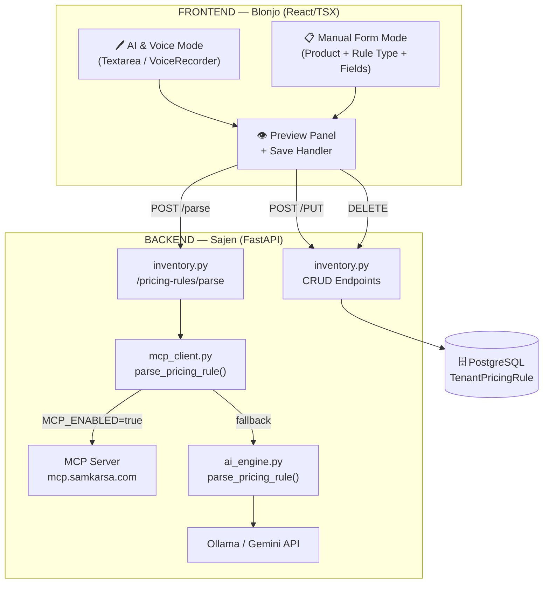
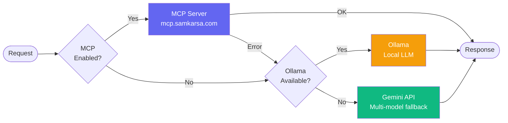
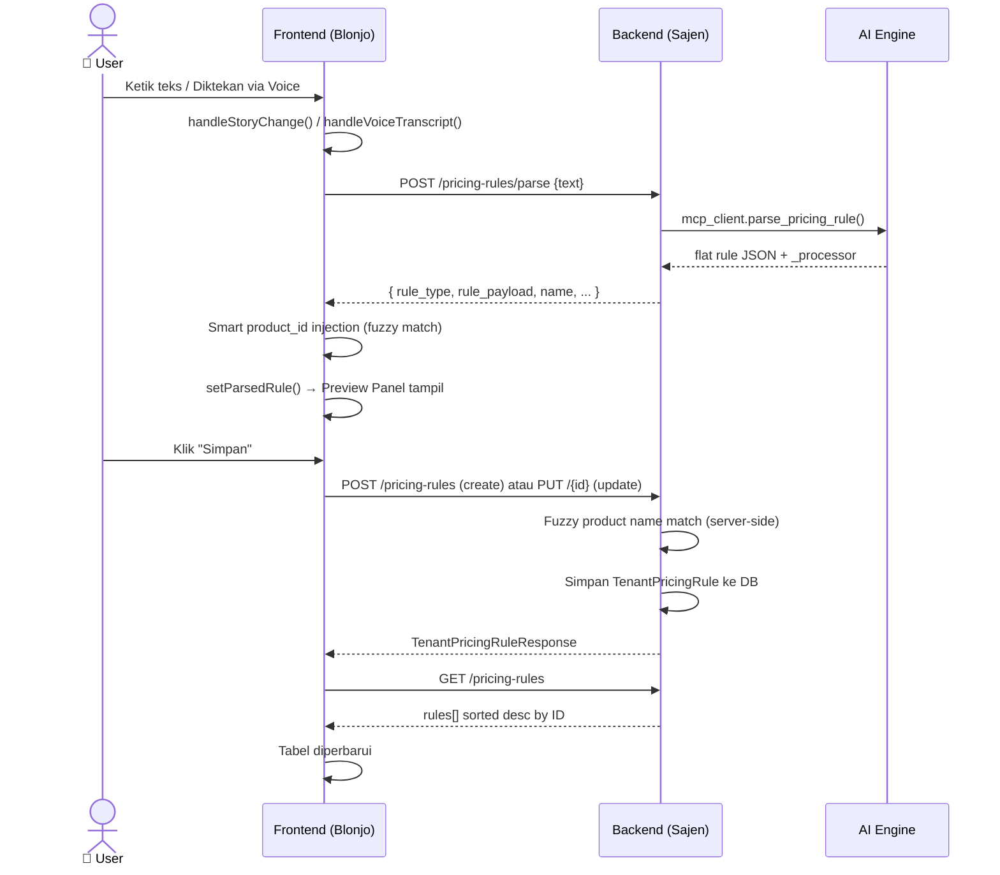
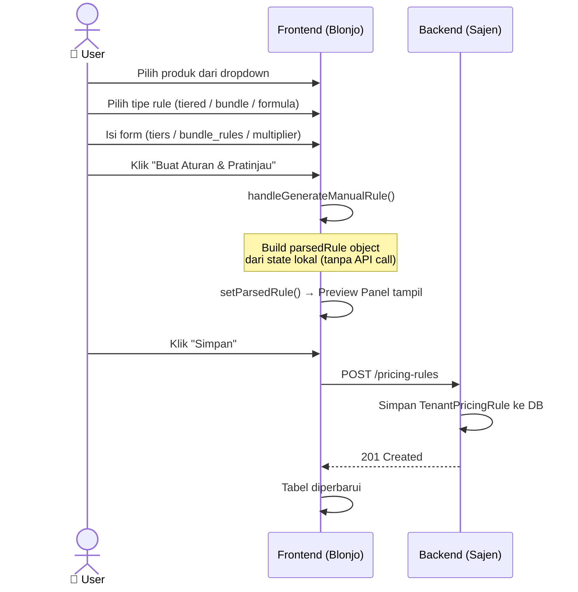
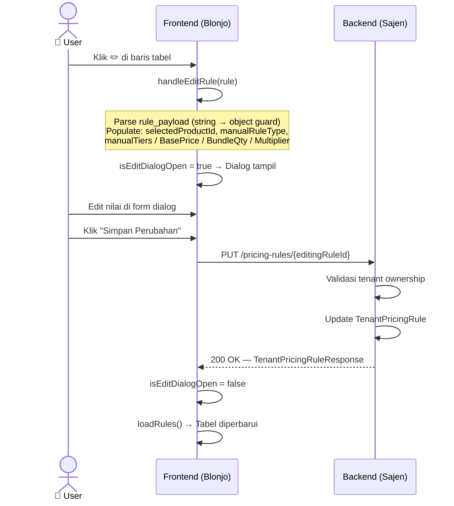

# BLONJO & SAJEN — Pricing Rules Module
**Code Documentation** · `docs/PRICING_RULES.md`

---

| Field | Detail |
|---|---|
| **Module** | Dynamic Pricing Rules |
| **Status** | `STABLE` |
| **Version** | 1.2.0 |
| **Last Updated** | 2026-07-16 |
| **Backend** | `sajen/app/api/v1/inventory.py` · `sajen/app/services/ai_engine.py` · `sajen/app/services/mcp_client.py` |
| **Frontend** | `blonjo/src/pages/master-data/PricingRulePage.tsx` |
| **Related Docs** | `PRICING_RULE_AND_MCP_INTEGRATION.md` · `plan_multi_item_pricing_rule.md` |

---

## Table of Contents

1. [Overview](#1-overview)
2. [Architecture](#2-architecture)
3. [Data Model](#3-data-model)
4. [API Reference — Backend](#4-api-reference--backend)
5. [Component Reference — Frontend](#5-component-reference--frontend)
6. [Data Flow](#6-data-flow)
7. [AI Parsing Engine](#7-ai-parsing-engine)
8. [Error Handling](#8-error-handling)
9. [Security Model](#9-security-model)
10. [Configuration](#10-configuration)
11. [Known Limitations](#11-known-limitations)
12. [Changelog](#12-changelog)

---

## 1. Overview

Modul **Pricing Rules** memungkinkan tenant platform BLONJO/SAJEN mendefinisikan aturan harga dinamis untuk produk mereka. Aturan disimpan di database dan dievaluasi secara real-time oleh `PricingEngine` saat proses checkout di kasir.

### Kapabilitas Utama

| Kapabilitas | Deskripsi |
|---|---|
| **AI-Powered Parsing** | Tenant mengetik aturan harga dalam bahasa natural; AI mengonversinya ke JSON terstruktur |
| **Voice Input** | Diktekan melalui microphone, diparse otomatis |
| **Manual Form** | Input terstruktur via form tanpa AI |
| **4 Tipe Aturan** | `tiered`, `bundle_multiple`, `formula`, `discount` |
| **Fuzzy Product Matching** | Matching nama produk dengan toleransi typo (client-side & server-side) |
| **Multi-Tenant Isolation** | Setiap aturan diisolasi per `tenant_id` |

### Batasan

> ⚠️ Satu input hanya menghasilkan **satu rule** untuk **satu produk**. Fitur multi-item dalam satu input belum tersedia (lihat `plan_multi_item_pricing_rule.md`).

---

## 2. Architecture

### 2.1 System Overview


### 2.2 Component Interaction



### 2.3 Parse Request Priority Chain



---

## 3. Data Model

### 3.1 `TenantPricingRule` (Database Table)

| Column | Type | Nullable | Keterangan |
|---|---|---|---|
| `id` | `Integer` | No | Primary key, auto-increment |
| `tenant_id` | `Integer` | No | FK → Tenant; isolasi multi-tenant |
| `product_id` | `Integer` | Yes | FK → Product; `null` = rule berlaku global |
| `name` | `String` | Yes | Nama deskriptif rule (tampil di UI) |
| `rule_type` | `String` | No | Enum: `tiered`, `bundle_multiple`, `formula`, `discount` |
| `valid_from` | `Date` | No | Tanggal mulai berlaku |
| `valid_to` | `Date` | Yes | Tanggal berakhir; `null` = berlaku selamanya |
| `is_active` | `Boolean` | No | Toggle aktif/nonaktif |
| `rule_payload` | `JSON` | No | Payload spesifik per tipe (lihat §3.2) |

### 3.2 `rule_payload` Schema per `rule_type`

#### `tiered` — Harga Bertingkat
```json
{
  "product_name": "Telur Ayam",
  "tiers": [
    { "qty_threshold": 1.0,  "unit": "kg",  "unit_price": 23000 },
    { "qty_threshold": 0.5,  "unit": "kg",  "unit_price": 11500 },
    { "qty_threshold": 0.25, "unit": "kg",  "unit_price": 6000  }
  ]
}
```
> `qty_threshold` adalah minimum kuantitas untuk harga ini berlaku. Tiers diurutkan descending oleh `PricingEngine`.

#### `bundle_multiple` — Promo Kelipatan
```json
{
  "product_name": "Indomie Goreng",
  "bundle_rules": {
    "base_price":   4500,
    "bundle_qty":   2,
    "bundle_price": 8000
  }
}
```
> Harga `bundle_price` berlaku per kelipatan `bundle_qty`. Di luar kelipatan, pakai `base_price`.

#### `formula` — Markup / Multiplier
```json
{
  "product_name": "Minyak Goreng",
  "multiplier": 1.15
}
```
> Harga jual = HPP × `multiplier`. Berguna saat HPP fluktuatif.

#### `discount` — Diskon Persentase
```json
{
  "product_name": "Susu Kaleng",
  "discount_percent": 10.0
}
```
> Harga jual = harga dasar − (harga dasar × `discount_percent` / 100).

### 3.3 TypeScript Interface (Frontend)

```typescript
// blonjo/src/pages/master-data/PricingRulePage.tsx

interface PricingRule {
  id: number;
  product_id?: number;
  name?: string;
  rule_type: 'discount' | 'volume' | 'bundle' | 'formula'
           | 'tiered' | 'bundle_multiple' | 'general';
  valid_from: string;   // ISO 8601: "YYYY-MM-DD"
  valid_to?: string;
  is_active: boolean;
  rule_payload: {
    product_name?: string;
    apply_to_keyword?: string;
    tiers?: Array<{
      qty_threshold: number;
      unit?: string;
      unit_price: number;
    }>;
    bundle_rules?: {
      bundle_qty:   number;
      bundle_price: number;
      base_price:   number;
    };
    multiplier?: number;
    custom_formula?: string;
  };
}
```

---

## 4. API Reference — Backend

**Base Path:** `/api/v1/inventory`
**Auth:** Bearer Token (semua endpoint memerlukan autentikasi)
**Tenant Isolation:** Semua query otomatis difilter oleh `current_user.tenant_id`

---

### `POST /pricing-rules/parse`

Mengonversi teks bahasa natural menjadi JSON pricing rule menggunakan AI.

**Request Body**
```json
{ "text": "Telur 1 Kg = 23.000, 0.5Kg = 11.500, 0.25kg = 6.000" }
```

**Response `200 OK`**
```json
{
  "name": "Tiered Telur",
  "rule_type": "tiered",
  "valid_from": "2026-07-16",
  "valid_to": null,
  "rule_payload": {
    "product_name": "Telur",
    "tiers": [
      { "qty_threshold": 1.0,  "unit": "kg", "unit_price": 23000 },
      { "qty_threshold": 0.5,  "unit": "kg", "unit_price": 11500 },
      { "qty_threshold": 0.25, "unit": "kg", "unit_price": 6000  }
    ]
  },
  "_processor": "gemini-2.0-flash"
}
```

> `_processor` adalah metadata debug — nama model/engine yang digunakan. Tidak perlu disimpan ke DB.

**Response `400 Bad Request`** — jika `text` kosong

**Implementation Note — Response Flattening:**
```python
# inventory.py
# AI engine mengembalikan wrapper {parsed_data: {...}, processor: "..."}
# Endpoint ini melakukan flatten sebelum return ke klien:
if isinstance(result, dict) and "parsed_data" in result:
    flat = result["parsed_data"]
    flat["_processor"] = result.get("processor", "")
    return flat
return result
```

---

### `GET /pricing-rules`

Mengambil seluruh pricing rule milik tenant.

**Response `200 OK`** — Array `TenantPricingRuleResponse[]`

```json
[
  {
    "id": 42,
    "product_id": 7,
    "name": "Tiered Telur",
    "rule_type": "tiered",
    "valid_from": "2026-07-16",
    "valid_to": null,
    "is_active": true,
    "rule_payload": { "..." : "..." }
  }
]
```

> **Client-side sorting:** Frontend sort by `id` descending — rule terbaru muncul paling atas.

---

### `POST /pricing-rules`

Membuat pricing rule baru.

**Request Body** (`TenantPricingRuleCreate`)
```json
{
  "name": "Tiered Telur",
  "rule_type": "tiered",
  "product_id": 7,
  "valid_from": "2026-07-16",
  "valid_to": null,
  "is_active": true,
  "rule_payload": { "..." : "..." }
}
```

**Fuzzy Product Matching** — Jika `product_id` tidak disertakan, backend mencari produk berdasarkan `rule_payload.product_name`:

```python
def _normalize(s: str) -> str:
    """Hapus semua karakter non-alphanumeric, lowercase."""
    return re.sub(r'[^a-z0-9]', '', s.lower())

# Strategi (score tertinggi menang):
# 1. Exact:     _normalize(product.name) == _normalize(prod_name)
# 2. Substring: salah satu substring dari yang lain; score = len(min string)
```

**Response `201 Created`** — `TenantPricingRuleResponse`

---

### `PUT /pricing-rules/{rule_id}`

Memperbarui pricing rule yang ada.

**Response `200 OK`** — `TenantPricingRuleResponse`
**Response `404 Not Found`** — rule tidak ada atau bukan milik tenant ini

**Side Effect:** Jika `product_id` diisi dan `TenantInventory` belum ada, sistem otomatis membuat `TenantInventory` + `TenantProductPrice`.

---

### `DELETE /pricing-rules/{rule_id}`

Menghapus pricing rule.

**Response `204 No Content`** — berhasil dihapus
**Response `404 Not Found`** — rule tidak ada atau bukan milik tenant ini

---

## 5. Component Reference — Frontend

**File:** `blonjo/src/pages/master-data/PricingRulePage.tsx`

### Props

| Prop | Type | Default | Keterangan |
|---|---|---|---|
| `hideHeader` | `boolean` | `false` | Sembunyikan judul & tombol refresh; dipakai saat embed di halaman lain |

### State Variables

| State | Type | Default | Keterangan |
|---|---|---|---|
| `story` | `string` | `''` | Teks NLP input user (AI mode) |
| `isParsing` | `boolean` | `false` | Loading: sedang parsing |
| `parsedRule` | `any` | `null` | Hasil parse; ditampilkan di Preview Panel |
| `saving` | `boolean` | `false` | Loading: sedang menyimpan |
| `rulesList` | `PricingRule[]` | `[]` | Seluruh rules dari DB; sorted desc by id |
| `loadingRules` | `boolean` | `true` | Loading: fetch rules |
| `inputMode` | `'ai' \| 'manual'` | `'ai'` | Tab aktif input |
| `products` | `any[]` | `[]` | Katalog produk untuk dropdown & matching |
| `selectedProductId` | `string` | `''` | ID produk dipilih user |
| `manualRuleType` | `'tiered' \| 'bundle_multiple' \| 'formula'` | `'tiered'` | Tipe rule di form manual |
| `manualTiers` | `Tier[]` | `[{5,0,'pcs'}]` | Data baris tier |
| `uoms` | `any[]` | `[]` | Daftar satuan unit |
| `manualBasePrice` | `number` | `0` | Harga dasar untuk bundle |
| `manualBundleQty` | `number` | `2` | Qty bundle |
| `manualBundlePrice` | `number` | `0` | Harga bundle |
| `manualMultiplier` | `number` | `1.2` | Faktor pengali (formula) |
| `searchQuery` | `string` | `''` | Filter pencarian tabel rules |
| `currentPage` | `number` | `1` | Halaman aktif pagination |
| `rowsPerPage` | `number` | `10` | Baris per halaman |
| `isEditDialogOpen` | `boolean` | `false` | Kontrol dialog edit |
| `editingRuleId` | `number \| null` | `null` | ID rule yang sedang diedit |
| `showMention` | `boolean` | `false` | Toggle dropdown @ mention autocomplete |

### Methods

#### Data Fetching

| Method | Keterangan |
|---|---|
| `loadRules()` | Fetch semua rules dari API → sort desc by `id` |
| `loadProducts()` | Fetch katalog produk untuk dropdown & matching |
| `loadUoms()` | Fetch unit of measure |

#### AI & Parsing

| Method | Keterangan |
|---|---|
| `performParse(text)` | POST ke `/parse`; inject `product_id` via fuzzy match lokal setelah response |
| `handleParse()` | Wrapper: panggil `performParse(story)` |
| `handleVoiceTranscript(text, isInterim)` | Callback VoiceRecorder; auto-parse jika `!isInterim` |
| `handleStoryChange(e)` | Update story + trigger @ mention autocomplete |
| `handleMentionSelect(name, id)` | Inject produk yang dipilih ke teks story |

#### Manual Form

| Method | Keterangan |
|---|---|
| `handleGenerateManualRule()` | Build `parsedRule` dari form manual tanpa AI |
| `addTier()` | Tambah baris tier baru |
| `removeTier(index)` | Hapus tier (minimum 1 tier tetap ada) |
| `updateTier(index, key, val)` | Update nilai pada tier tertentu |

#### CRUD Operations

| Method | Keterangan |
|---|---|
| `handleSave()` | POST (create) atau PUT (update) berdasarkan ada/tidaknya `parsedRule.id` |
| `handleEditRule(rule)` | Populate state dari rule existing → buka dialog edit |
| `handleSaveEditFromDialog()` | PUT update rule dari dialog edit |
| `handleDelete(id)` | DELETE rule by ID |

#### Rendering

| Method | Return | Keterangan |
|---|---|---|
| `getRuleBadge(type)` | `JSX.Element` | Badge berwarna per tipe rule |
| `renderPayloadSummary(rule)` | `JSX.Element` | Ringkasan payload; handle string JSON dari DB |

#### Computed Values

| Variable | Keterangan |
|---|---|
| `filteredRules` | Filter `rulesList` by `name`, `rule_type`, `product_name` |
| `paginatedRules` | Slice `filteredRules` sesuai `currentPage` & `rowsPerPage` |

---

## 6. Data Flow

### 6.1 Swimlane Overview


---

### 6.2 AI Mode — Parse & Save



---

### 6.3 Manual Form Mode — Generate & Save



---

### 6.4 Edit Existing Rule




## 7. AI Parsing Engine

### 7.1 Priority Chain

```
Request masuk
    │
    ├── [1] MCP Server (jika MCP_ENABLED=true)
    │       Tool: "parse_pricing_rule"
    │       Response: res["content"][0]["text"] → json.loads()
    │
    ├── [2] Ollama Local LLM (jika host tersedia)
    │       temperature: 0.0 (deterministik)
    │       Output: raw_text → _clean_json_output() → json.loads()
    │
    └── [3] Gemini API (fallback terakhir)
            Iterasi GEMINI_MODELS list (multi-model switching)
            Response: raw_output → _clean_json_output() → json.loads()
```

### 7.2 Rule Type Detection

| Pattern Input | Terdeteksi Sebagai | Field Wajib |
|---|---|---|
| "X Kg = Y, Z Kg = W" (harga per satuan bertingkat) | `tiered` | `tiers[]` |
| "beli N = X, beli M = Y kelipatan" | `bundle_multiple` | `bundle_rules{}` |
| "faktor pengali X" / "markup X kali" | `formula` | `multiplier` |
| "diskon X%" / "potongan X%" | `discount` | `discount_percent` |

**Temperature:** `0.0` — output deterministik.
**`valid_from` default:** `datetime.now().strftime("%Y-%m-%d")`

### 7.3 Response Normalization

```python
# ai_engine.call_ai_text() → return wrapper:
{ "parsed_data": { ...rule_json... }, "processor": "gemini-2.0-flash", ... }

# inventory.ai_parse_pricing_rule() → flatten:
if "parsed_data" in result:
    flat = result["parsed_data"]   # { rule_type, rule_payload, name, ... }
    flat["_processor"] = result.get("processor", "")
    return flat
```

---

## 8. Error Handling

### 8.1 Backend

| Kondisi | HTTP Status | Catatan |
|---|---|---|
| `text` kosong di `/parse` | `400 Bad Request` | `detail: "Text is required"` |
| Rule tidak ditemukan | `404 Not Found` | |
| Rule milik tenant lain | `404 Not Found` | Tidak expose `403` (security) |
| MCP Server error | — | Silent fallback ke AI lokal |

### 8.2 Frontend Pattern

```typescript
// Pola konsisten di semua async handler:
try {
  setIsLoading(true);
  const data = await fetchClient('/endpoint', { ... });
  toast.success(t('success_key'));
} catch (err: any) {
  toast.error(t('error_key'), { description: err.message });
} finally {
  setIsLoading(false);  // selalu reset, bahkan jika error
}
```

### 8.3 `rule_payload` String Guard

Data dari DB kadang tersimpan sebagai **string JSON** (bukan object). Guard diterapkan di dua titik:

```typescript
// renderPayloadSummary() — display
let payload = rule.rule_payload;
if (typeof payload === 'string') {
  try { payload = JSON.parse(payload); }
  catch { return <span>Data tidak valid</span>; }
}
if (!payload) return <span>{t('pr_custom_logic')}</span>;

// handleEditRule() — edit dialog
if (typeof payload === 'string') {
  try { payload = JSON.parse(payload); }
  catch { payload = {}; }
}
```

---

## 9. Security Model

### 9.1 Multi-Tenant Isolation

Semua query backend **selalu** menyertakan filter `tenant_id`:

```python
# GET — filter by tenant
session.query(TenantPricingRule)\
  .filter(TenantPricingRule.tenant_id == current_user.tenant_id).all()

# PUT / DELETE — validasi ownership
rule = session.get(TenantPricingRule, rule_id)
if not rule or rule.tenant_id != current_user.tenant_id:
    raise HTTPException(status_code=404)  # bukan 403
```

> **Prinsip:** Resource milik tenant lain dikembalikan sebagai `404` (bukan `403`) untuk mencegah enumerasi ID oleh attacker.

### 9.2 Authentication

Semua endpoint memerlukan `CurrentUser` dependency (Bearer Token). Tidak ada endpoint public.

### 9.3 Input Validation Notes

- `rule_payload` disimpan **as-is** — tidak ada JSON schema validation di backend.
- Validasi struktur dilakukan oleh AI prompt + form frontend.
- Teks NLP tidak di-sanitize secara khusus sebelum dikirim ke LLM (tidak ada SQL injection risk karena tidak dieksekusi sebagai query).

---

## 10. Configuration

| Environment Variable | Keterangan |
|---|---|
| `MCP_ENABLED` | `true`/`false` — aktifkan MCP Server untuk parsing |
| `GOOGLE_API_KEY` | API key Gemini; wajib jika Ollama tidak tersedia |
| `OLLAMA_LLM_MODEL` | Nama model Ollama lokal yang akan digunakan |

**Priority:** MCP → Ollama → Gemini (lihat §7.1)

---

## 11. Known Limitations

| ID | Limitation | Workaround | Roadmap |
|---|---|---|---|
| L-01 | Satu input = satu rule (single product only) | Input satu per satu | `plan_multi_item_pricing_rule.md` |
| L-02 | `rule_payload` tidak ada schema validation di backend | Frontend + AI prompt sebagai gate | Tambah Pydantic validator |
| L-03 | MCP fallback error hanya di-log ke stdout | Monitor log manual | Integrate structured logging / Sentry |
| L-04 | Redis cache 7 hari — input mirip kembalikan result lama | Clear cache manual | TTL-aware cache invalidation |
| L-05 | Sorting rules client-side (by ID) | — | Pertimbangkan server-side `ORDER BY` |

---

## 12. Changelog

| Version | Date | Changes |
|---|---|---|
| **1.2.0** | 2026-07-16 | Fix `renderPayloadSummary` crash saat `rule_payload` berupa string JSON; flatten parse response di backend endpoint; sort rules by ID desc (terbaru di atas); fix placeholder textarea agar tidak miskonsepsi multi-item |
| **1.1.0** | — | Tambah Manual Form mode (input tanpa AI); Edit rule dialog; @ Mention autocomplete produk di textarea |
| **1.0.0** | — | Initial release: AI & Voice parsing, CRUD pricing rules, Preview panel |
