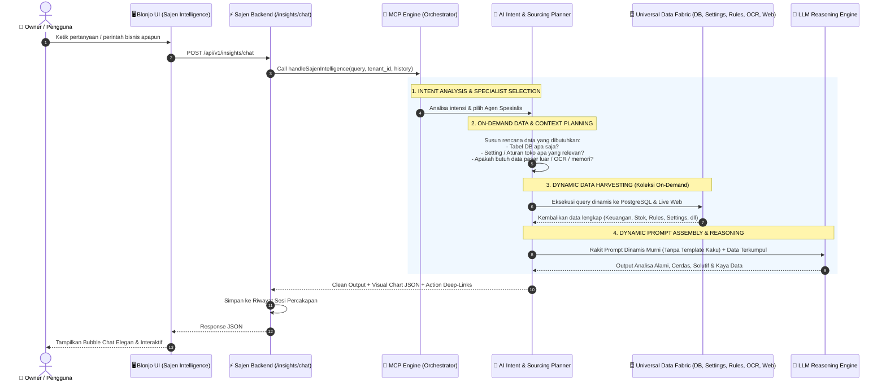
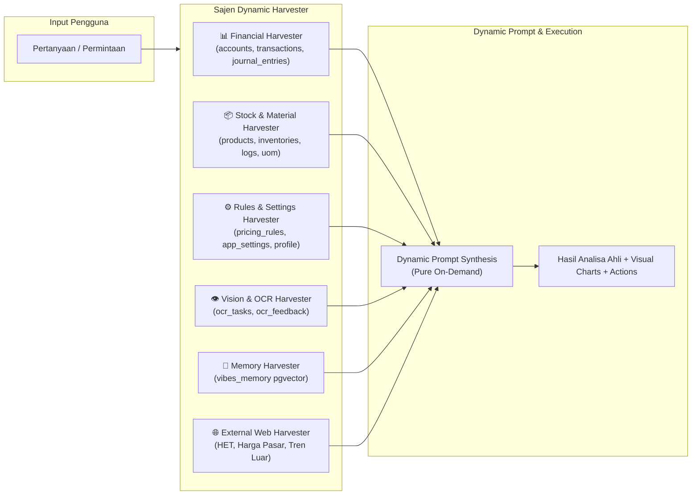
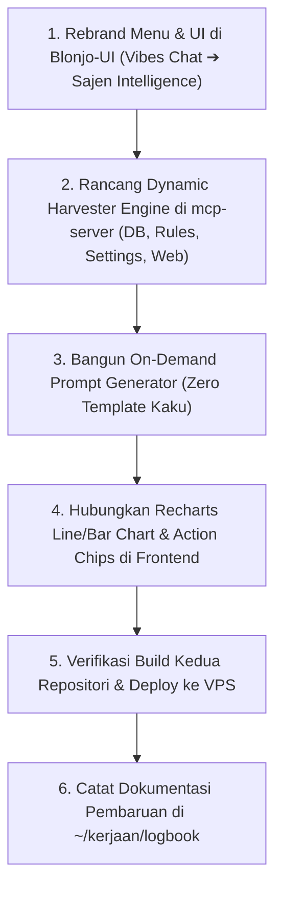

# 🧭 Master Arsitektur & Desain Sistem: SAJEN INTELLIGENCE
**Autonomous Agentic System (Dynamic Intent-Driven Prompting & On-Demand Data Sourcing Engine)** · `docs/SAJEN_INTELLIGENCE_ARCHITECTURE.md`

---

| Dokumen | Detail |
|---|---|
| **Modul** | Sajen Intelligence (Sistem Kecerdasan Otonom Penuh) |
| **Status** | `APPROVED AGENTIC ARCHITECTURE v4.0` |
| **Pola Eksekusi** | **Intent ➔ AI Dynamic Plan & Prompt Generation ➔ On-Demand Data Sourcing (Internal + Settings + Rules + Eksternal) ➔ LLM Reasoning ➔ Actionable Visual Output** |
| **Repositori** | `~/kerjaan/jualan` (Blonjo UI, Sajen Backend, PostgreSQL) & `~/kerjaan/mcp-server` (MCP Autonomous Engine) |
| **Prinsip Dasar** | **Zero-Template Kaku, Pure Intent-Driven Dynamic Execution, Visibility 360° ke Seluruh App & Settings** |

---

## 1. Paradigma Baru: Alur Otonom Murni (Intent-Driven Sourcing Engine)

Dalam arsitektur **Sajen Intelligence v4.0**, sistem **TIDAK** menggunakan query hardcoded maupun template prompt statis. Setiap pesan dari pengguna diperlakukan sebagai **misi dinamis (*dynamic mission*)** di mana AI sendiri yang merancang kebutuhan data, aturan toko, dan prompt-nya secara *on-demand*:



---

## 2. Rincian 5 Tahapan Alur Eksekusi Cerdas

```text
┌─────────────────────────────────────────────────────────────────────────────────────────────────┐
│                    ALUR EKSEKUSI DINAMIS SAJEN INTELLIGENCE (ON-DEMAND)                         │
├─────────────────────────────────────────────────────────────────────────────────────────────────┤
│ 1. INTENT DECOMPOSITION & ROLE DISPATCHING                                                      │
│    Menganalisa apa yang sebenarnya ingin dicapai pengguna: audit laba rugi, simulasi harga,    │
│    strategi bundling, pengecekan nota OCR, optimasi stok, panduan setting, atau pasar luar.    │
├─────────────────────────────────────────────────────────────────────────────────────────────────┤
│ 2. DYNAMIC SOURCING PLAN (Rencana Pengumpulan Data On-Demand)                                   │
│    AI menyusun daftar sumber daya yang wajib dikumpulkan:                                       │
│    • Tabel Transaksi & Jurnal PSAK: transactions, journal_entries, accounts                     │
│    • Tabel Inventori & HPP: products, tenant_inventories, inventory_logs, uom, categories       │
│    • Tabel Aturan & Kebijakan: tenant_pricing_rules, app_settings, user_roles, contacts         │
│    • Tabel AI Vision & Berkas: ocr_tasks, ocr_feedback, commodity_trends                        │
│    • Memori & Konfigurasi Toko: vibes_memory (pgvector), profil toko (store settings)           │
│    • Sumber Daya Eksternal: Live Web Search (HET, harga komoditas pasar, berita ekonomi)       │
├─────────────────────────────────────────────────────────────────────────────────────────────────┤
│ 3. DYNAMIC DATA HARVESTING (Eksekusi Pengambilan Data)                                         │
│    MCP mengeksekusi pengambilan data secara paralel sesuai rencana di atas tanpa batasan        │
│    tanggal, batasan kolom, atau batasan buatan.                                                 │
├─────────────────────────────────────────────────────────────────────────────────────────────────┤
│ 4. ON-DEMAND PROMPT GENERATION (Tanpa Template Kaku)                                           │
│    AI menyusun prompt final khusus untuk kasus ini: menyertakan data aktual yang terkumpul,     │
│    arahan gaya bicara ahli bisnis yang hangat & natural, serta aturan format visual interaktif. │
├─────────────────────────────────────────────────────────────────────────────────────────────────┤
│ 5. LLM REASONING & STRUCTURED ACTIONABLE RESPONSE                                               │
│    LLM menghasilkan jawaban bernalar tinggi: mengaitkan data lintas bidang, menyertakan visual  │
│    grafik Recharts (chart:line/bar/donut), diagram Mermaid, dan tombol aksi langsung (ACTIONS). │
└─────────────────────────────────────────────────────────────────────────────────────────────────┘
```

---

## 3. Matriks Sourcing On-Demand Terpadu



---

## 4. Standar Antarmuka Pengguna & Rendering Visual

Halaman `blonjo/src/pages/insights/VibesChat.tsx` diperbarui menjadi **Sajen Intelligence Hub**:

1. **Header & Status Bar**:
   - Brand: **Sajen Intelligence** (`Compass` icon).
   - Status: `🟢 Dynamic Intelligence Engine Connected (All DB, Settings & Market Ready)`.
2. **Balon Chat Elegan & Scannable**:
   - Tipografi lega, paragraf nyaman dibaca, penekanan poin penting dengan teks tebal (*bold*), dan tabel Markdown rapi.
3. **Komponen Visual Terpadu**:
   - ````chart:line```` ➔ Visualisasi grafik garis interaktif Recharts (Penjualan vs Pembelian, Tren Harian, Proyeksi Kas).
   - ````chart:bar```` ➔ Perbandingan omset per kategori barang atau performa supplier.
   - ````chart:donut```` ➔ Komposisi biaya pengeluaran & porsi keuntungan.
   - ````mermaid```` ➔ Diagram alur proses, relasi entitas, dan mindmap strategi.
4. **Action Chips & Follow-Up Suggestions**:
   - Tombol deep-link ke modul terkait: `[🛒 Rencana Belanja]`, `[🏷️ Aturan Harga]`, `[📊 Jurnal Laba Rugi]`.
   - Chip rekomendasi pertanyaan lanjutan di bagian bawah setiap jawaban.

---

## 5. Rencana Eksekusi Koding Terpadu



---

## 6. Kesimpulan

Dengan arsitektur **Dynamic Intent-Driven Sourcing Engine** ini, **Sajen Intelligence** menjadi partner bisnis otonom sejati yang memahami seluruh data internal, aturan toko, pengaturan sistem, dan kondisi pasar eksternal secara dinamis tanpa batasan buatan.
