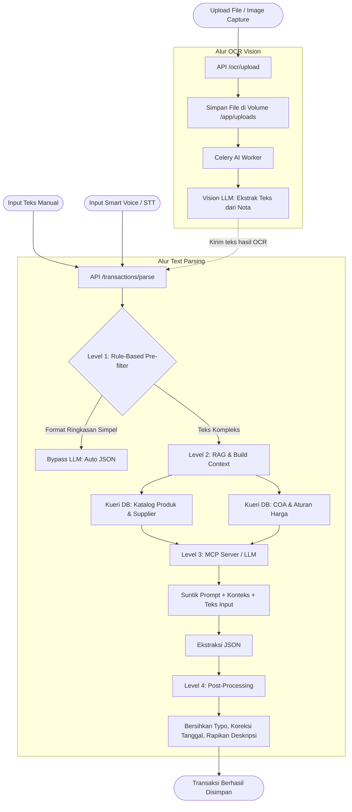

# Alur Kerja dan Prompt Smartnote & OCR

Dokumen ini merangkum alur kerja sistem pemrosesan Smartnote, baik melalui teks manual, suara, maupun pemindaian OCR (gambar nota). Sistem dirancang menggunakan corong *multi-layer pipeline* agar prosesnya pintar, anti-halusinasi, dan menghemat token (biaya).

## 1. Diagram Alir (Workflow)



## 2. Rincian Alur Proses

### A. Input Manual (Teks) & Smart Voice
1. Jika sumbernya **Suara (Voice)**, suara dikirim ke mesin *Speech-to-Text* (STT) untuk diubah menjadi teks mentah bahasa Indonesia.
2. Teks (baik ketikan manual maupun hasil STT) dikirim ke API `/transactions/parse`.
3. **Level 1 (Rule-Based Pre-filter):** Sistem mengecek apakah input ini adalah transaksi ringkasan sederhana (contoh: *"omset hari ini 500rb"*). Jika ya, diproses seketika tanpa AI/LLM.
4. **Level 2 (RAG & Konteks):** Jika teks kompleks, sistem menarik *Katalog Item*, *Daftar Supplier*, *Aturan Harga Jual*, dan *Daftar COA* dari database *tenant*.
5. **Level 3 (AI / LLM melalui MCP):** Teks dan konteks digabung, lalu dikirim ke MCP Server (atau LLM lokal sebagai fallback) untuk diekstrak menjadi JSON berstruktur.
6. **Level 4 (Post-processing):** Pembersihan tahap akhir; misalnya membuang kata preposisi "di/dari/ke" pada nama *supplier*, merapikan deskripsi yang terlalu panjang, dan mengkoreksi *typo* pada penulisan tanggal.

### B. Upload File & Image Capture (Kamera)
1. Foto/file dikirim ke API `/ocr/upload` dan disimpan secara fisik di *Shared Volume* (direktori `/app/uploads`).
2. API merespons dengan *Task ID* ke UI untuk menampilkan status *loading*.
3. **Celery Worker** mengambil alih gambar secara *background*. Gambar ini dikirim ke mesin AI *Vision* (OCR).
4. Mesin OCR dieksekusi dengan instruksi khusus untuk mengekstrak isi teks di dalam nota mentah, kemudian diubah seolah-olah menyerupai kalimat Smartnote biasa.
5. Teks tersebut secara otomatis dilempar ke **Alur A (Text Parsing)** agar pemetaan barang dan COA-nya tetap seragam dengan ketikan manusia.

---

## 3. Rangkuman Prompt (Instruksi Inti LLM)

Berikut adalah instruksi dasar yang mengatur otak AI di Level 3:

> **Peran:** Anda adalah pakar akuntansi retail SAK EMKM / PSAK. Ekstrak data dari Smart Note menjadi JSON.
> 
> **ATURAN WAJIB:**
> 1. **Klasifikasi Ringkasan vs Detail:** Jika kalimat berupa narasi global tanpa rincian barang, KOSONGKAN properti `items` menjadi `[]`. Tetapi jika nama, harga, dan jumlah barang disebutkan secara spesifik (misal: "Pembelian telur 15kg @22000"), Anda **WAJIB** mengekstraknya sebagai `items` meskipun hanya ditulis menyambung (inline) dalam satu kalimat, bukan dalam format daftar/tabel.
> 2. **Zero Halusinasi:** Dilarang keras memecah atau membuat item *dummy* secara acak jika tidak ada barang yang nyata disebutkan di teks.
> 3. **Tipe Transaksi (Transaction Type):**
>    - `purchase`: Untuk dokumen "Faktur", "Nota Pembelian", atau nama penerbit nota adalah pihak ketiga/supplier.
>    - `sales`: Untuk penjualan atau pendapatan kasir harian.
>    - `purchase_return` / `sales_return`: Jika ada kata "Retur", "Refund", "Kembali".
>    - `operational` / `expense`: Untuk pembayaran tagihan seperti PLN, Wifi, Sewa, PDAM, dll.
> 4. **Pemetaan COA:** Arahkan akun sesuai dengan konteks beban/pendapatan. Pengeluaran utilitas toko **wajib** dikategorikan ke akun *'Beban Listrik, Air & Internet'* bila tersedia.
> 5. **Angka Shorthand:** Angka "jt", "rb", "Rp" telah dinormalisasi sistem, baca apa adanya.
> 6. **Tanggal:** Gunakan tanggal yang tertulis secara eksplisit. Jika kosong, paksakan *today_date* (hari ini).
> 7. **Satuan (Unit):** Harus menangkap satuan unik yang menempel pada barang (contoh: kg, pcs, rtg, ktn, btl).
> 8. **Standardisasi Katalog:** Prioritaskan penggunaan nama barang dan nama *supplier* yang cocok dengan *KATALOG DATABASE* (yang disisipkan ke dalam prompt) untuk mengoreksi ejaan / salah ketik (typo). Selalu ubah kata "telor" menjadi "Telur".
> 9. **Pemisahan Nama Barang Ber-Angka dan Kuantitas (QTY):** Seringkali nama barang memiliki angka/ukuran (seperti '500g', '10Kg', 'ISI 15') yang bersebelahan dengan jumlah barang (QTY).
>    - Contoh 1: 'tepung beras 500g 10Kg 12000' -> Nama='tepung beras 500g', Qty=10, Unit='Kg', Harga=12000.
>    - Contoh 2: 'Beras Obor 10Kg 5pack x 146000' -> Nama='Beras Obor 10Kg', Qty=5, Unit='pack', Harga=146000.
>    - Contoh 3: 'TONG TJI TEA ISI 15 20 pcs @ 2800' -> Nama='TONG TJI TEA ISI 15', Qty=20, Unit='pcs', Harga=2800.
>    PANDUAN PENTING: Angka/satuan yang berada paling belakang atau berdekatan dengan lambang harga ('@', 'x', 'Rp') adalah QTY transaksi. Angka yang mendahuluinya adalah bagian mutlak dari NAMA BARANG.

---

## 4. Diskusi Rancangan Arsitektur Masa Depan: "Visual-First, Vision-Second" (Template Memory)

Berikut adalah catatan diskusi murni untuk mengatasi kendala lambatnya pemrosesan nota yang formatnya berulang (misal: nota langganan dari CV. Bengawan Sumber Makmur).

**Konteks Masalah (User):**
Jika kita upload nota dari CV. Bengawan Sumber Makmur, template/polanya selalu sama, yang beda hanya di item, tanggal, dan no notanya. Tetapi setiap kali upload nota itu, proses yang dilakukan sistem selalu sama dan lama (memakai Vision LLM dari awal). Padahal secara kasat mata nota itu sama. (Bahas konsep template memory).

**Analisa Solusi Sistem:**
Konsep **Template Memory (Golden Templates)** sebenarnya *sudah diterapkan* melalui tabel `knowledge_vectors` di MCP Server. Namun saat ini ia hanya mem-*bypass* Fase "Text-to-JSON" (agar LLM mencontek pola perbaikan JSON masa lalu), tetapi ia **belum mem-bypass Fase 1 (Image-to-Text)**. Sistem tetap memaksa Vision LLM untuk membaca ulang keseluruhan gambar huruf demi huruf dari nol setiap kali nota baru di-upload. Inilah yang membuatnya lambat.

**Q (User):** Jika menggunakan Tesseract OCR terlalu berat dan hasilnya kurang mumpuni, bisakah pakai *library* lain? Atau apakah bisa langsung proses koordinat baca dan dicocokkan ke RAG, sehingga proses Vision digeser jadi nomor 2?
**A (Sistem):** Ide Anda sangat visioner. Membalik peran Vision AI menjadi langkah ke-2 adalah lompatan arsitektur yang brilian. Berikut rancangan "Visual-First, Vision-Second":

1. **Identifikasi Visual Instan (Tanpa Baca Teks)**
Saat nota di-upload, sistem menggunakan *library* ringan seperti OpenCV (dengan teknik *Feature Matching* seperti ORB/SIFT atau *Image Hashing*). OpenCV mencocokkan pola garis nota, tata letak, dan logo dengan database template secara instan (0.1 detik). (Contoh: "Aha! Pola piksel ini 95% cocok dengan template CV Bengawan! ID: TPL-001").

2. **Ambil RAG & Koordinat Potong (Crop)**
Sistem (Sajen Backend) langsung meminta data RAG ke MCP Server berdasarkan ID TPL-001 tersebut. Data RAG ini berisi:
- Metadata Header: Nama Supplier (CV Bengawan), Tipe Transaksi (Purchase).
- Koordinat Potong (*Bounding Boxes*): X, Y untuk memblok area tabel barang dan area tanggal.
Sistem Python lalu memotong (*crop*) gambar tersebut secara paksa. Bagian NPWP, logo, syarat retur dll dibuang.

3. **Vision LLM Bergeser ke Posisi 2 (Jauh Lebih Ringan)**
Potongan gambar yang sangat kecil (hanya berisi tabel barang) barulah dilempar ke Vision LLM. Proses pembacaan Vision LLM yang tadinya 15 detik bisa menjadi 3-5 detik saja karena beban komputasinya turun drastis (ia hanya diminta membaca item).

**Q (User):** Apakah nanti LLM tidak amnesia? Hanya mengembalikan *items* saja sedangkan *header* tidak, karena ia merasa tidak memproses keseluruhan gambar, lalu ia di-parsing ke JSON berdasarkan RAG Bengawan? Siapa yang ngasih RAG ini dan di mana posisi data RAG ini?
**A (Sistem):** Tidak akan amnesia, karena kita membagi tugas (Orkestrasi).
Karena di Langkah 1 (OpenCV) sistem sudah mengenali itu nota "CV Bengawan", sistem (Kode Python) *sudah tahu* siapa nama *supplier*-nya dan tipe transaksinya. Alih-alih menyuruh LLM menebak dari nol, Kode Python akan *"menyuapi"* LLM:
*"Hei LLM, ini potongan tabel barang. Kembalikan array item-nya saja!"*

Setelah LLM mengembalikan `items`, Kode Python merakitnya:
```json
{
  "transaction_date": "2026-07-22",
  "supplier_name": "CV. Bengawan Sumber Makmur",  // <-- Didapat dari memori OpenCV/RAG (MCP Server)
  "transaction_type": "purchase",               // <-- Didapat dari memori OpenCV/RAG (MCP Server)
  "items": [ ...hasil bacaan LLM dari potongan gambar... ] 
}
```

**Di mana posisi data RAG ini dan dari mana asalnya?**
Data RAG ini tersimpan di dalam database PostgreSQL milik **MCP Server** (di dalam tabel `knowledge_vectors`). Sajen Backend (API kita) yang akan meminta data ini ke MCP Server. Paket data RAG inilah yang berfungsi sebagai "Buku Panduan Spesifik" untuk mengeksekusi *cropping* dan merakit *Header* secara deterministik tanpa takut LLM berhalusinasi atau amnesia.
