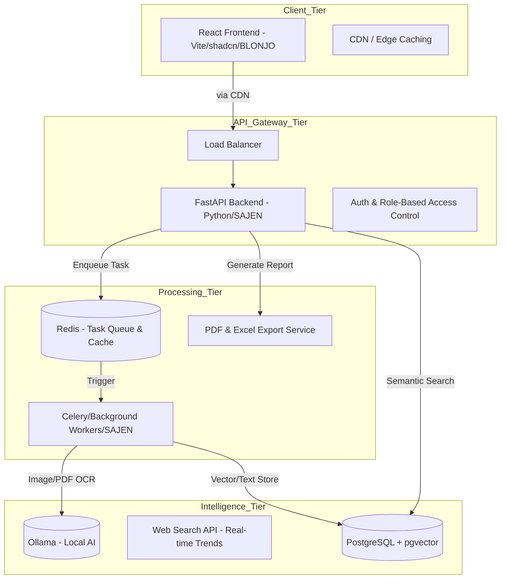

# System Architecture Analysis: BLONJO & SAJEN Application

**Version:** 1.3 (Global Scale Edition)  
**Persona:** Senior Software Architect  
**Tech Stack:** React (Vite, shadcn, Tailwind) [**BLONJO**], Python (FastAPI) [**SAJEN**], PostgreSQL (+ pgvector), Redis, Ollama AI, Bizeto (WhatsApp).

---

## 1. High-Level Architecture & Intelligence

The system follows a distributed architecture designed for high scalability, asynchronous task processing, and **Vector Search** capabilities for intelligent data retrieval.

### Component Diagram

---

## 2. Security, Access Control & Infrastructure (High Security Docker)

### A. Strong User Management (RBAC)
- **Role-Based Access Control (RBAC)**: Strict permission boundaries.
    - **Owner/Admin**: Full access to financials, AI settings, user management, and system config.
    - **Manager**: Access to operational reports, inventory adjustments, and purchase approvals.
    - **Cashier/Staff**: Restricted to point-of-sale (sales input), manual receipt upload, and basic customer lookup.
- **Authentication**: Stateless JWT (JSON Web Tokens) with short expiry and HTTP-only refresh tokens.

### B. Docker Best Practices
1.  **Non-Root Execution**: All containers (API, Worker, DB) run as non-privileged users to prevent container escape.
2.  **Minimal Base Images**: Use `python:3.11-slim` or `alpine`.
3.  **Network Isolation**: Only the API container is exposed. DB and Redis stay in a private internal network.
4.  **No GDrive**: All storage is strictly local (Docker Volumes) or internal PostgreSQL ensuring full data sovereignty.
5.  **Environment Secrets**: Credentials managed via encrypted `.env` files or Docker Secrets.

---

## 3. UI/UX Standards & Internationalization (Global Quality)

To ensure a "Live", "Modern", and **World-Class** feel:

### A. Theme & Aesthetics
- **Design System**: Strict adherence to **shadcn/ui** and **Radix UI** primitives for accessible, unstyled-to-styled components (diimplementasikan di **BLONJO**).
- **Theme Switcher**: Built-in toggle for **Dark / Light mode**. CSS variables control the entire color palette to ensure seamless transitions without page reloads.
- **Micro-interactions**: Skeletons for loading states, robust toast notifications, and optimistic UI updates for snappy feedback.

### B. Internationalization (i18n) & Localization
- **Dual Language (ID/EN)**: The system supports seamless switching between Bahasa Indonesia and English using `react-i18next`. 
- **Professional Narrative**: All copywriting, tooltips, and error messages must use a highly professional, consistent, and clear tone (e.g., menggunakan "Authentication Failed" daripada "Wrong Password", atau "Unggah Nota Pembelian" daripada "Masukin struk").
- **Timezone & Currency**: Data is always stored in **UTC** in the database. Frontend handles local timezone conversion and dynamic currency formatting (IDR, USD).

---

## 4. Specialized Integrations & Reporting

### A. WhatsApp AI (via Bizeto Automate Response)
1.  **Order Management**: Parses intent, checks stock, and drafts orders.
2.  **Business FAQ**: Uses RAG + Vector Search to answer queries based on a knowledge base.
3.  **Real-time Pricing**: Fetches current product prices upon request.
4.  **Language Detection**: AI detects if the user chats in ID or EN and responds in the matching language professionally.

### B. Intelligent Search (Vector & Text)
- **Text Search**: Full-text indexing for products and customers.
- **Vector Search**: `pgvector` for semantic search (e.g., "alat masak" returns "panci").

### C. Advanced Reporting & Export Engine
- Standard accounting reports (Balance Sheet, Income Statement, Cash Flow per **PSAK UMKM**).
- **Export Capabilities**:
    - **PDF**: Pixel-perfect, printable documents generated via backend (e.g., ReportLab/WeasyPrint) complete with company branding.
    - **Excel**: Raw data exports (via `pandas` or `openpyxl`) for custom pivot-table analysis by accountants.

---

## 5. Development Mandates
- **No Axios**: Use native `fetch` with robust error handling wrappers.
- **PostgreSQL**: Must include the `pgvector` extension.
- **Ollama**: Hosted locally to process embeddings.
- **Code Quality**: Strict ESLint/Prettier on Frontend (**BLONJO**); Ruff/MyPy on Python Backend (**SAJEN**).
