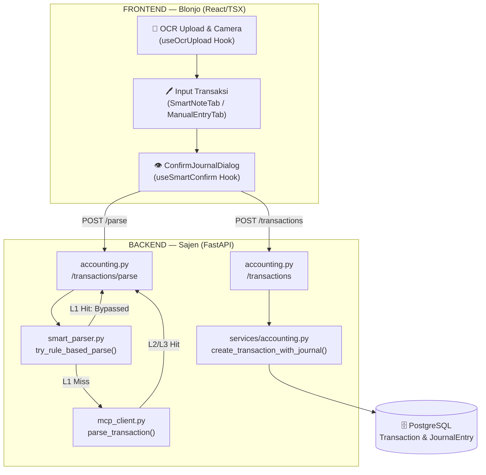
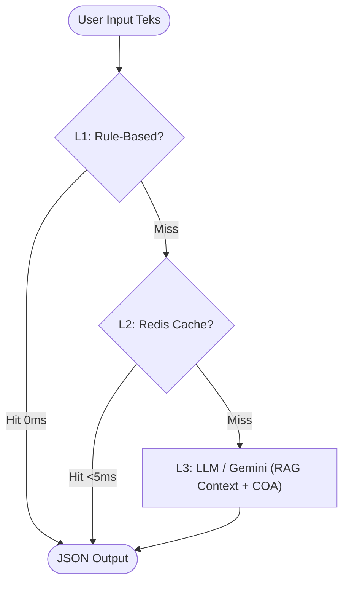
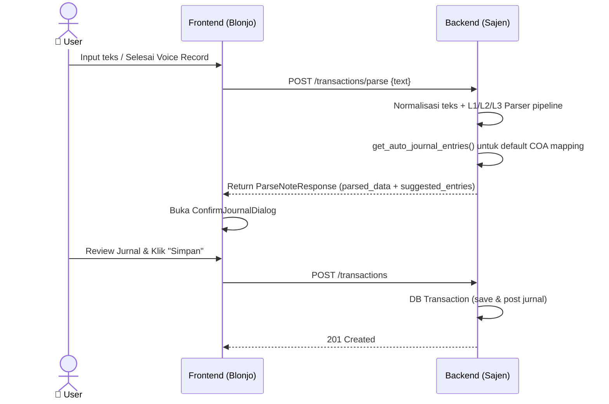
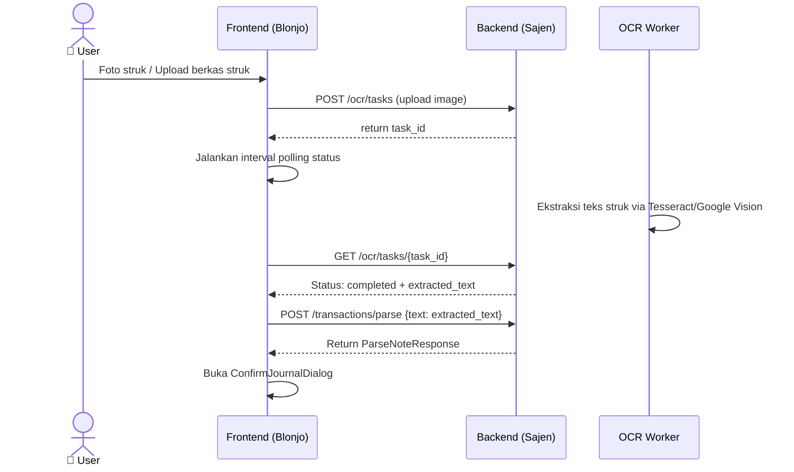

# BLONJO & SAJEN — Transaction Module
**Code Documentation** · `docs/TRANSACTION_MODULE.md`

---

| Field | Detail |
|---|---|
| **Module** | Transaction & Smart Journal Entry |
| **Status** | `STABLE` |
| **Version** | 2.0.0 |
| **Last Updated** | 2026-07-16 |
| **Backend** | `sajen/app/api/v1/accounting.py` · `sajen/app/services/accounting.py` · `sajen/app/services/smart_parser.py` · `sajen/app/services/pricing_engine.py` |
| **Frontend** | `blonjo/src/pages/Transactions.tsx` · `blonjo/src/pages/transaction/hooks/useSmartConfirm.ts` · `blonjo/src/pages/transaction/SmartNoteTab.tsx` |
| **Related Docs** | `SMART_PARSER_RULES.md` · `Mapping Jurnal Otomatis PSAK.md` |

---

## Table of Contents

1. [Overview](#1-overview)
2. [Architecture](#2-architecture)
3. [Data Model](#3-data-model)
4. [API Reference — Backend](#4-api-reference--backend)
5. [Component Reference — Frontend](#5-component-reference--frontend)
6. [Data Flow](#6-data-flow)
7. [Smart Parser Pipeline](#7-smart-parser-pipeline)
8. [Error Handling](#8-error-handling)
9. [Security Model](#9-security-model)
10. [Configuration](#10-configuration)
11. [Changelog](#11-changelog)

---

## 1. Overview

Modul **Transaction** adalah inti akuntansi keuangan POS multi-tenant di BLONJO & SAJEN. Fitur ini dirancang untuk mendata segala bentuk pemasukan, pengeluaran, transfer non-tunai, opname kas, serta modal secara otomatis.

### Fitur Utama

- **Smart Note (NLP / AI)**: User menulis atau mendiktekan transaksi dalam bahasa bebas (misal: `"belanja telur 10 kg di Unilever = 230rb"`), sistem otomatis mengekstrak item barang, nama supplier/customer, dan membuat draf entri jurnal debit-kredit seimbang.
- **Double-Entry Journal (Double-Entry Ledger)**: Setiap transaksi diposting ke Buku Besar dengan menjurnal minimal dua akun (Debit & Kredit) yang seimbang.
- **OCR Scan Integration**: Foto struk di-upload ke backend, diekstrak via OCR, dan diparse otomatis menjadi draf entri transaksi.
- **PKP & PPN Normalization**: Otomatis mendeteksi pembebasan pajak atau penghitungan PPN Masukan/Keluaran berdasarkan setelan PKP merchant dan basis data vector.

---

## 2. Architecture

### 2.1 System Overview



### 2.2 Parser Pipeline (3-Level Optimasi)



### 2.3 RAG (Retrieval-Augmented Generation) & Smart Context Classifier

Sebelum memanggil AI Engine, backend Sajen melakukan klasifikasi input untuk merakit konteks minimal (*Targeted RAG*) guna menekan pemborosan token hingga 80%:

1. **Transaction Classification**:
   Input dievaluasi menggunakan `classify_transaction(text)` melalui **2-Level Classification (L1 Regex & Keywords + L2 Local Vector Cosine Similarity)** menjadi salah satu dari tipe berikut:
   - `KAS_GLOBAL`: Untuk pencatatan beban non-ritel (sewa, gaji), setoran modal, selisih kas, dsb. **Pricing Rules otomatis di-skip**.
   - `PRODUCT_PURCHASE`: Untuk pembelian/restock barang dari supplier (kulakan). **Pricing Rules otomatis di-skip** karena harga beli didefinisikan oleh supplier di invoice/struk, bukan oleh pricing rule internal kita.
   - `PRODUCT_SALES`: Untuk penjualan produk ke pelanggan. Memerlukan penyesuaian aturan harga jual (**Pricing Rules diikutkan**).
   - `UNKNOWN`: Fallback jika tipe tidak dapat dipastikan secara terstruktur.

   #### Mekanisme Klasifikasi L2 (Vector Cosine Similarity):
   Jika klasifikasi cepat (L1) bernilai ambigu, sistem menggunakan model embedding lokal (`multilingual-e5-small` via ONNX Runtime di `onnx_embed.py`) untuk menghitung *Cosine Similarity* terhadap **Vektor Jangkar (Anchor Vectors)** yang mewakili setiap kategori di memori.
   
   - **Vektor Jangkar (Statis di Memori)**: Merupakan baseline kalimat acuan (misal: `"belanja persediaan stok dari supplier"`, `"jual produk ritel eceran"`) yang didefinisikan langsung dalam kode (`smart_parser.py`) dan dievaluasi sekali (*lazy-load*) ke memori saat startup. Sifatnya **konstan** dan murni untuk pemetaan arah intensi bahasa.
   - **Penyimpanan Transaksi Riil**: Transaksi yang berhasil diparse oleh AI dan dikonfirmasi oleh pengguna tetap **disimpan secara utuh di database utama (PostgreSQL)** sebagai jurnal akuntansi keuangan riil.

   #### Penyimpanan Data Vektor RAG Dinamis (Buku Koreksi):
   - **Tidak Semua Input Masuk RAG**: Input transaksi yang berhasil di-parse LLM dengan sukses tanpa modifikasi/koreksi **tidak dimasukkan ke RAG** guna menghindari *bloating* (penimbunan data redundan) dan menjaga efisiensi RAM/CPU pencarian vektor.
   - **Ingest RAG Hanya Saat Koreksi**: Ketika pengguna mengoreksi hasil parsing jurnal yang keliru di UI, data koreksi tersebut (`raw_ocr_text` + `expected_output` JSON) akan **di-ingest secara dinamis ke database vektor RAG PostgreSQL (ekstensi `pgvector`)** di latar belakang. Ini bertindak sebagai "buku catatan perbaikan" sehingga jika di masa depan ada inputan mirip, AI dapat merujuk ke perbaikan tersebut sebagai *guardrail*.

2. **Context Tailoring**:
   - **Pricing Rules**: Dicari dan difilter berbasis pencocokan nama produk dari database tenant, lalu disusun sebagai string berstruktur: `--- ATURAN HARGA JUAL (PRICING RULES) --- \n - Aturan...`.
   - **Targeted COA (Chart of Accounts)**:
     - `KAS_GLOBAL` → Menyertakan maksimal 20 akun kas utama (kode `1-1xxx`).
     - `PRODUCT_SALES` → Menyertakan maksimal 25 akun kas + penjualan produk.
     - `UNKNOWN` → Menyertakan maksimal 35 akun umum (fallback ke seluruh daftar akun aktif milik tenant).

### 2.4 MCP Server Integration (`mcp_client.py`)

Koneksi ke **MCP Server (`mcp.samkarsa.com`)** terpusat di class `MCPClient` melalui HTTP POST JSON ke endpoint `/tools/{tool_name}`:

- **Protokol Request**:
  Jika `MCP_ENABLED=true`, backend memanggil tool `parse_transaction` dengan mengirim payload:
  ```json
  {
    "text": "belanja telur 10 kg di Unilever = 230rb",
    "context": {
      "pricing_rules": "--- ATURAN HARGA JUAL (PRICING RULES) ---\n- Tiered Telur: ...",
      "coa": "--- DAFTAR AKUN (COA) ---\n1101 - Kas Utama\n...",
      "today_date": "YYYY-MM-DD"
    }
  }
  ```
  *(Catatan: Key bernilai `None` otomatis dihapus sebelum payload dikirim).*

- **Protokol Response**:
  Output MCP memiliki struktur terstandar:
  ```json
  {
    "content": [
      {
        "type": "text",
        "text": "{\n  \"transaction_type\": \"purchase\",\n  \"total_amount\": 230000,\n  ...\n}"
      }
    ]
  }
  ```
  Text di-extract dari `res["content"][0]["text"]`, di-parse kembali menggunakan `json.loads()`, lalu dibungkus ke dalam uniform payload:
  ```json
  {
    "parsed_data": { ... },
    "processor": "mcp_server",
    "token_in": 0,
    "token_out": 0
  }
  ```

- **Failover / Fallback**:
  Jika server MCP bermasalah (timeout, bad gateway `502`, dll), block `try/catch` menangkap exception secara aman:
  1. Melakukan fallback internal ke `ai_engine.py` lokal (Ollama / Gemini).
  2. Membangun prompt minimal lewat `build_minimal_prompt(text, today_date, coa_str)`.
  3. Memanggil model fallback lokal dengan `temperature=0.0`.
  4. Mengembalikan struktur uniform payload dengan metadata `processor` model fallback aktual.

---


## 3. Data Model

### 3.1 DB Model: `Transaction` (Database Table)

| Column | Type | Nullable | Keterangan |
|---|---|---|---|
| `id` | `Integer` | No | PK, Auto-increment |
| `tenant_id` | `Integer` | No | FK → Tenant (Isolasi data) |
| `transaction_date` | `Date` | No | Tanggal transaksi |
| `description` | `String` | No | Catatan / deskripsi transaksi |
| `transaction_type` | `String` | No | Enum: `purchase`, `income`, `operational`, `capital`, `sales`, `expense`, `non_cash_out`, `non_cash_in` |
| `total_amount` | `Decimal` | No | Nominal total transaksi |
| `payment_method` | `String` | Yes | Cash, Bank Transfer, QRIS, etc. |
| `status` | `String` | No | `draft` atau `posted` |

### 3.2 DB Model: `JournalEntry` (Buku Jurnal)

Setiap `Transaction` memiliki relasi `hasMany` ke `JournalEntry` (minimal 2 baris seimbang).

| Column | Type | Nullable | Keterangan |
|---|---|---|---|
| `id` | `Integer` | No | PK, Auto-increment |
| `transaction_id` | `Integer` | No | FK → Transaction |
| `account_id` | `Integer` | No | FK → Account (COA) |
| `debit` | `Decimal` | No | Nilai Debit (0 jika Kredit) |
| `credit` | `Decimal` | No | Nilai Kredit (0 jika Debit) |

---

## 4. API Reference — Backend

**Base Path:** `/api/v1`

---

### `POST /transactions/parse`

Menerjemahkan teks bebas menjadi detail transaksi dan draf jurnal.

**Request Body** (`ParseNoteRequest`)
```json
{
  "text": "belanja telur 10 kg di Unilever = 230rb"
}
```

**Response `200 OK`** (`ParseNoteResponse`)
```json
{
  "parsed_data": {
    "transaction_type": "purchase",
    "total_amount": 230000,
    "description": "Pembelian di Unilever pada 2026-07-16 (telur)",
    "transaction_date": "2026-07-16",
    "contact_name": "Unilever",
    "items": [
      { "name": "telur", "qty": 10, "unit": "kg", "unit_price": 23000, "total": 230000 }
    ]
  },
  "suggested_entries": [
    { "account_id": 15, "debit": 230000, "credit": 0 },
    { "account_id": 2, "debit": 0, "credit": 230000 }
  ],
  "processor": "rule_based"
}
```

---

### `POST /transactions`

Menyimpan transaksi ke database dan memposting jurnal.

**Request Body** (`TransactionCreate`)
```json
{
  "transaction_date": "2026-07-16",
  "description": "Pembelian di Unilever pada 2026-07-16 (telur)",
  "transaction_type": "purchase",
  "total_amount": 230000,
  "status": "posted",
  "entries": [
    { "account_id": 15, "debit": 230000, "credit": 0 },
    { "account_id": 2, "debit": 0, "credit": 230000 }
  ],
  "items": [
    { "name": "telur", "qty": 10, "unit_price": 23000, "total": 230000, "contact_name": "Unilever" }
  ]
}
```

**Response `201 Created`** — `TransactionResponse`

---

## 5. Component Reference — Frontend

### `Transactions.tsx` (Orchestrator)
- Mengoordinasi layout halaman dan state `inputMode` (`smart` / `manual`).
- Menginisialisasi 5 custom hooks utama:
  1. `useAccounts`: Load Chart of Accounts (COA).
  2. `useSmartNote`: Mengelola state teks parser (`noteText`, `parsedResult`).
  3. `useOcrUpload`: Menangani upload berkas & polling hasil OCR.
  4. `useSmartConfirm`: Logika kalkulasi draf jurnal & pop-up modal.
  5. `useManualEntry`: Menangani form jurnal manual seimbang.

### `ConfirmJournalDialog.tsx`
- Dialog pop-up sebelum transaksi disimpan ke DB.
- Menampilkan draf Debit/Kredit yang bisa diedit kembali oleh user jika ada akun COA yang kurang tepat.

---

## 6. Data Flow

### 6.1 Smart Note Flow (AI & Voice Input)



### 6.2 OCR & Photo Upload Flow



---

## 7. Smart Parser Pipeline

Sistem mendeteksi kategori berdasarkan kata kunci berikut:

| Tipe | Keyword Match | Debit Default | Kredit Default |
|---|---|---|---|
| **purchase** | belanja, beli, pembelian | Persediaan Barang Dagang | Kas / Bank |
| **income** | jualan, hasil penjualan, omzet | Kas / Bank | Pendapatan Penjualan |
| **operational**| bensin, wifi, listrik, gaji | Beban Operasional | Kas / Bank |
| **capital** | setor modal, tambah modal | Kas / Bank | Modal Saham / Pemilik |

---

## 8. Error Handling

### 8.1 Balancing Verification
Sebelum mengirim data ke `/transactions`, client-side hook (`useSmartConfirm.ts`) memvalidasi keseimbangan Debit dan Kredit:
```typescript
const totalD = entries.reduce((s, e) => s + Number(e.debit  || 0), 0);
const totalC = entries.reduce((s, e) => s + Number(e.credit || 0), 0);
if (totalD !== totalC || totalD <= 0) {
  toast.error('Gagal', { description: 'Total Debit dan Kredit harus seimbang!' });
  return;
}
```

### 8.2 Fallback Parsing
Jika L3 LLM parser gagal memproses input (misal network error atau API Limit), backend API secara aman mengaktifkan `local_backend_fallback` menggunakan regex & pencarian angka nominal terbesar agar sistem tidak crash.

---

## 9. Security Model

- **Tenant Isolation**: Setiap transaksi dan jurnal wajib difilter dengan query `tenant_id == current_user.tenant_id`.
- **Role-Based Access Control**: Endpoint `POST /transactions` dilindungi dependensi `Depends(check_role([UserRole.ADMIN, UserRole.MANAGER]))`. Kasir standar hanya bisa membuat draf.

---

## 10. Configuration

| Env Variable | Default | Keterangan |
|---|---|---|
| `REDIS_URL` | — | Digunakan untuk L2 Cache Smart Parser |
| `OCR_ENGINE` | `tesseract` | Pilihan engine ekstraksi gambar struk |

---

## 11. Changelog

| Version | Date | Changes |
|---|---|---|
| **2.1.0** | 2026-08-22 | Perbaikan rekonsiliasi total transaksi saat parsing: otomatis menghitung ulang `total_amount` berdasarkan hasil penjumlahan per item jika terjadi ketidakcocokan nominal dengan teks nota/struk. |
| **2.0.0** | 2026-07-16 | Pemisahan component layout dengan logical hooks; integrasi OCR polling feedback correction; optimasi parser 3 level (L1/L2/L3) |
| **1.0.0** | — | Rilis dasar POS transaksi input manual & smart note parser sederhana |
