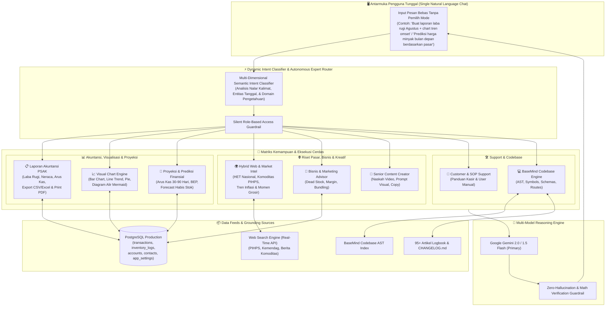
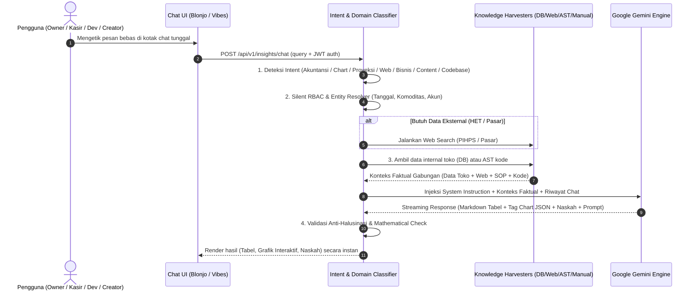
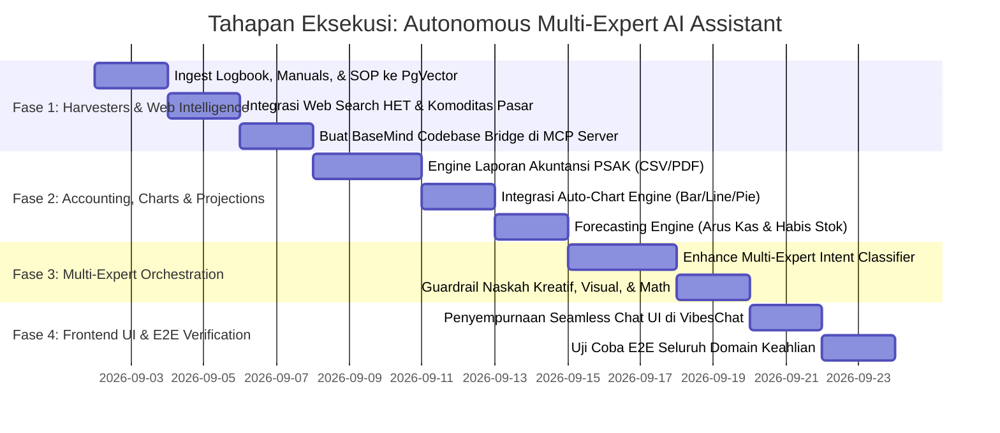

# 🏛️ Cetak Biru Arsitektur: Unified Autonomous AI Multi-Expert Intelligence
### *(Integrasi Zero-Touch: BaseMind, Gemini, PostgreSQL, Laporan Akuntansi, Visual Charts, Proyeksi & Web Market Intelligence)*

Dokumen ini mendefinisikan arsitektur teknis komprehensif untuk membangun **Unified Autonomous AI Multi-Expert Assistant** yang bekerja **100% otomatis berbasis intens kalimat pengguna (Zero-Touch / No Manual Persona Switcher)**. Asisten ini menggabungkan:
1. **Laporan Akuntansi Standar PSAK EMKM** (Laba Rugi, Neraca, Arus Kas, Trial Balance).
2. **Interactive Chart & Visualization Engine** (Bar, Line, Pie, Mermaid Flowcharts).
3. **Financial & Operational Projections** (Proyeksi Arus Kas, BEP, Kebutuhan Modal Kerja).
4. **Hybrid External Web & Market Intelligence** (Integrasi HET, Indeks Harga Komoditas, & Tren Pasar Online).
5. **Bisnis & Marketing Advisor** (Analisis Dead Stock, Strategi Bundling, Optimasi Margin).
6. **Senior Content Creator** (Naskah Video Hook Kuat, Prompt Visual Detail, Copywriting).
7. **Customer & SOP Support** (Panduan Operasional Kasir & POS).
8. **Technical & Codebase Intelligence (BaseMind Engine)** (AST Symbols, Schemas, Routes, Changelog).

---

## 1. Peta Arsitektur Ekosistem Terpadu (Unified Architecture Map)



---

## 2. Rincian Fitur Utama & Format Output

### A. 📋 Laporan Akuntansi Standar PSAK EMKM
* **Jenis Laporan**:
  * **Laporan Laba Rugi (*Profit & Loss*)**: Pendapatan, HPP faktual, Biaya Operasional terperinci (Listrik, BBM, Sewa, Gaji), Laba Bersih.
  * **Neraca (*Balance Sheet*)**: Aset Lancar (Kas, Bank, Piutang, Persediaan Barang), Aset Tetap, Kewajiban (Utang Usaha/Pemasok, Titipan Dana Pelanggan), Ekuitas (Modal Pemilik, Prive, Laba Ditahan).
  * **Laporan Arus Kas (*Cash Flow*)**: Arus Kas Operasi, Investasi, dan Pendanaan.
  * **Neraca Saldo (*Trial Balance*)**: Saldo Debit-Kredit seluruh akun COA dalam kondisi seimbang (*Balanced*).
* **Format Output**: Tabel Markdown presisi yang dilengkapi tombol instan **Download CSV/Excel** dan **Cetak Laporan / PDF** (menggunakan fungsi bawaan `VibesChat.tsx`).

### B. 📈 Interactive Chart & Diagram Engine
Ketika pengguna meminta visualisasi, AI secara otomatis menyertakan tag JSON chart di dalam responnya:
* ````chart:bar` : Perbandingan omset per kategori, ranking produk terlaris, pengeluaran terbesar.
* ````chart:line` : Tren pergerakan omset harian, mingguan, atau bulanan.
* ````chart:pie` : Komposisi biaya operasional atau pangsa komoditas.
* ````mermaid` : Diagram alir alur kerja sistem, pohon akun COA, atau relasi rantai pasok (*Supply Chain*).

### C. 🔮 Financial & Operational Forecasting (Proyeksi & Prediksi)
* **Proyeksi Arus Kas (*Cash Flow Runway*)**: Menghitung estimasi saldo kas 30, 60, hingga 90 hari ke depan berdasarkan rata-rata *burn rate* beban operasional dan pola penerimaan omset harian.
* **Prediksi Titik Habis Stok (*Stock Depletion Forecast*)**: Mengestimasi tanggal habis barang berdasarkan kecepatan penjualan (*velocity*) dan merekomendasikan tanggal kulakan kembali sebelum kehabisan (*Stockout Prevention*).
* **Evaluasi Dead Stock & Modal Mandek**: Mengidentifikasi produk yang tidak bergerak dalam 30–60 hari beserta nilai modal yang tertahan.

### D. 🌍 Hybrid External Web & Market Intelligence (Data Internal + Eksternal)
* **Integrasi Data Internal + Eksternal**:
  * Membandingkan harga beli kulakan toko dengan **HET (Harga Eceran Tertinggi)** resmi pemerintah dan harga pasar induk PIHPS.
  * Menganalisis momen terbaik untuk belanja grosir stok komoditas (misal: tren harga beras, minyak, cabai, atau bawang menjelang hari raya / cuaca panen).
* **Mekanisme**: Memanggil `webSearchService.ts` secara otomatis ketika pertanyaan melibatkan tren pasar, harga nasional, komoditas, atau berita regulasi terbaru.

---

## 3. Matriks Keahlian Terpadu (Autonomous Multi-Expert Matrix)

| Domain Keahlian | Pemicu Alami (Intent Triggers) | Karakteristik Jawaban | Sumber Data |
| :--- | :--- | :--- | :--- |
| **📊 Akuntansi & Laporan** | *"Tampilkan laporan laba rugi bulan lalu"*<br>*"Buat neraca saldo dan posisi kas"* | Tabel keuangan formal PSAK, debit-kredit seimbang, exportable ke CSV/PDF. | `transactions`, `journal_entries`, `accounts` |
| **📈 Visualisasi Grafik** | *"Buat grafik tren omset 3 bulan terakhir"*<br>*"Visualisasikan porsi pengeluaran operasional"* | Render grafik interaktif (Bar/Line/Pie) dan diagram Mermaid langsung di UI. | Agregasi SQL PostgreSQL |
| **🔮 Proyeksi & Prediksi** | *"Berapa perkiraan kas 1 bulan ke depan?"*<br>*"Kapan stok beras panen diperkirakan habis?"* | Proyeksi matematis realistis, prediksi tanggal kulakan, analisis runway modal. | `inventory_logs`, `predictiveEngine.ts` |
| **🌍 Riset Pasar Eksternal** | *"Bandingkan harga beli minyak kita dengan HET nasional"*<br>*"Prediksi harga beras bulan depan di pasaran"* | Sintesis data internal toko + data web real-time (PIHPS, Kemendag, berita komoditas). | Internal DB + `webSearchService.ts` |
| **💼 Bisnis & Marketing** | *"Barang apa yang modalnya mandek?"*<br>*"Ide paket promo sembako akhir pekan"* | Rekomendasi bisnis berbasis data, strategi bundling, promosi bernilai jual tinggi. | `products`, `app_settings` |
| **🎨 Content Creator** | *"Buat naskah video TikTok promo minyak"*<br>*"Tulis prompt gambar poster sembako"* | Naskah video (Hook 3s, Storytelling, CTA), prompt visual detail, copywriting persuasif. | Format Markdown siap pakai |
| **📘 SOP & Support** | *"Bagaimana cara retur penjualan kasir?"*<br>*"Alur scan OCR nota tulisan tangan"* | Panduan SOP kasir langkah demi langkah yang ramah dan solutif. | `USER_MANUAL.md` |
| **💻 Codebase (BaseMind)** | *"Fungsi mana yang memvalidasi duplikasi nota?"*<br>*"Jelaskan rute API di vibe.py"* | Cuplikan kode sumber presisi, penelusuran AST, rute REST API, riwayat changelog. | BaseMind AST, `CHANGELOG.md` |

---

## 4. Alur Kerja Permintaan Otomatis (Autonomous Request Lifecycle)



---

## 5. Rencana Tahapan Eksekusi (Roadmap)



### Modul yang Akan Dibangun / Diintegrasikan:
1. **`mcp-server/src/tools/vibeCopilot.ts`**: Menyatukan seluruh pilar (Akuntansi, Chart, Proyeksi, Web Search, Bisnis, Content, SOP, Codebase) dalam satu orkestrator terpadu.
2. **`mcp-server/src/services/webSearchService.ts`**: Menarik data HET nasional, pergerakan komoditas pangan, dan tren pasar eksternal secara dinamis.
3. **`mcp-server/src/tools/predictiveEngine.ts`**: Menghitung proyeksi arus kas, tren omset, dan perkiraan titik habis persediaan barang.
4. **`mcp-server/src/tools/codebaseEngine.ts`**: Menghubungkan MCP Server dengan `basemind` tools untuk inspeksi kodingan.
5. **`blonjo/src/pages/insights/VibesChat.tsx`**: Antarmuka interaktif yang me-render tabel akuntansi, tombol ekspor CSV/PDF, grafik chart (Bar/Line/Pie), naskah video, dan diagram Mermaid secara instan.
