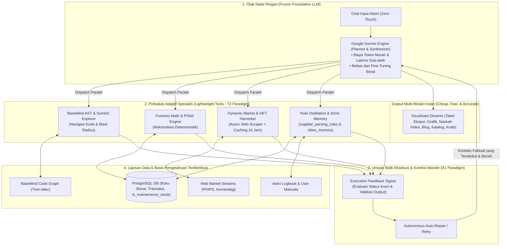
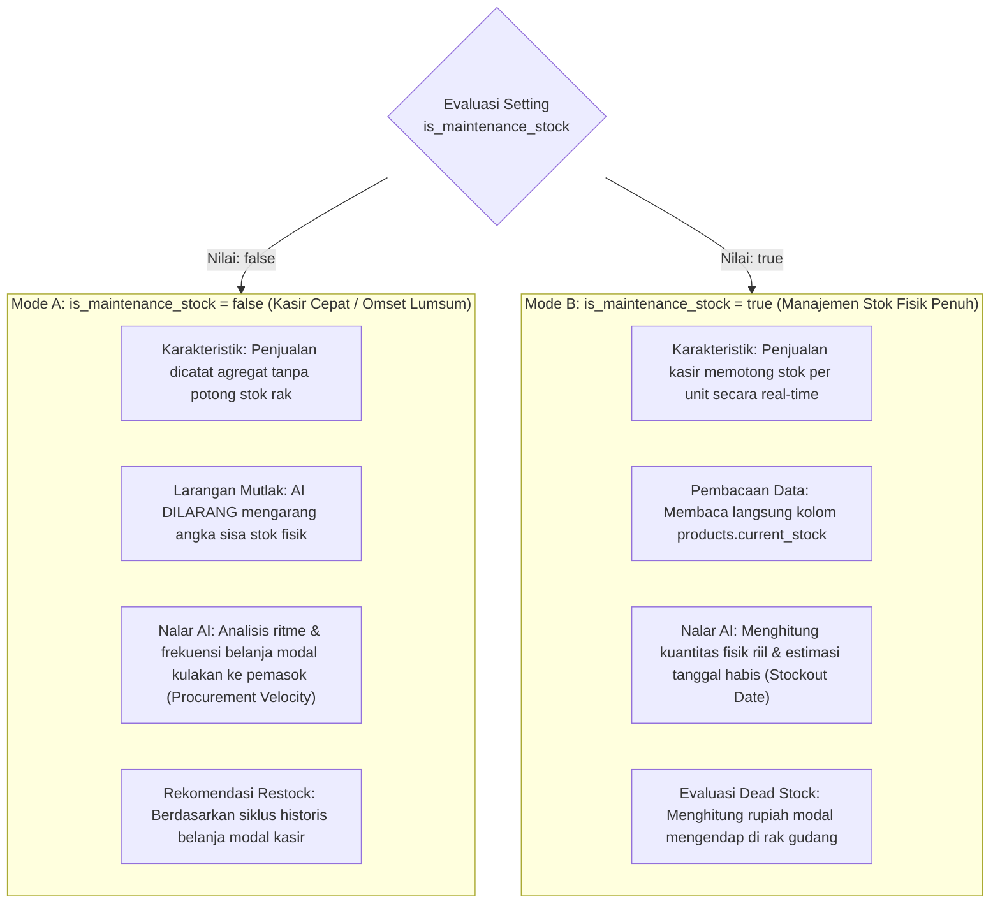
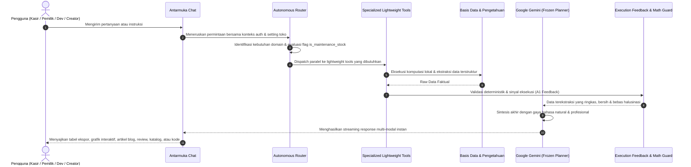

# 🏛️ Cetak Biru Sistem: Dynamic Autonomous Intelligence Platform
### *Engine Nalar Adaptif: Agentic AI Adaptation (Cheap, Lightweight & Efficient), Presisi Tinggi, Respons Cepat, Fluid Multi-Agent Synthesis, Metodologi Marketing Konversi & Penyelarasan is_maintenance_stock*

Dokumen ini mendefinisikan arsitektur sistem kecerdasan buatan otonom (**Dynamic Autonomous Intelligence Platform**). Sistem ini mengadopsi metodologi **Agentic AI Adaptation: Building Intelligent Systems that are Cheap, Lightweight, and Efficient** (Zetrosoft, Bijak Techno), di mana kecerdasan sistem ditingkatkan secara radikal melalui **optimalisasi perkakas spesialis adaptif (*Specialized Lightweight Tools*)** di bawah kendali *Frozen Foundation Model* (Google Gemini), menghasilkan sistem yang berkecepatan tinggi, hemat biaya token, presisi mutlak, dan bebas halusinasi.

---

## 1. Paradigma Utama: Agentic AI Adaptation Architecture

> [!IMPORTANT]
> **"Training & Optimizing Tools Beats Training Agents"**  
> Sistem memisahkan secara tegas antara *General Planner/Reasoner* (Google Gemini yang dibiarkan *frozen*) dengan *Specialized Appendages/Tools* (Tool komputasi lokal berkinerja tinggi).
> 1. **Data & Token Efficiency**: Pemrosesan kalkulasi, penelusuran AST, dan agregasi data dituntaskan di tingkat tool lokal, mengurangi konsumsi token LLM hingga 70–80%.
> 2. **Execution Feedback Loop (A1 Paradigm)**: Agen melakukan *self-correction* otomatis berdasarkan sinyal balik eksekusi tool sebelum menghasilkan jawaban akhir.
> 3. **Supervised Tool Adaptation (T2 Paradigm)**: Perkakas spesialis diperkaya secara berkala melalui pembelajaran umpan balik (*Continuous Rule Distillation* pada `supplier_parsing_rules` & `vibes_memory`).
> 4. **Constraint-Based Integrity**: Validasi deterministik untuk standar akuntansi PSAK EMKM dan aturan operasional `is_maintenance_stock`.

---

## 2. Penyelarasan Nalar Bisnis Fitur `is_maintenance_stock`

Sistem secara dinamis membaca konfigurasi `is_maintenance_stock` pada tabel `app_settings` untuk menentukan metode pembacaan data dan logika nalar AI:

---

## 3. Kapabilitas 6 Gugus Agen Spesialis Terpadu

### 📊 1. Finansial & Forensik Akuntansi *(WrenAI & Forensic Math Tool)*
* **Kapabilitas**: Otomasi Laba Rugi, Neraca, Arus Kas, dan Neraca Saldo PSAK EMKM. Menyesuaikan perhitungan HPP sesuai model toko (perpetual jika `is_maintenance_stock = true` atau pembelian periodik jika `false`). Menghasilkan visualisasi grafik interaktif (`chart:bar`, `chart:line`, `chart:pie`) dan ekspor instan CSV/PDF.

### 🌐 2. Intelijen Pasar & Arbitrase Pasokan *(OpenBB & Market Harvester Tool)*
* **Kapabilitas**: Memadukan riwayat harga faktur kulakan toko dengan data pasar komoditas nasional (PIHPS) dan HET resmi Kemendag secara real-time melalui web scraping async dengan caching cerdas untuk mendeteksi disparitas harga dan memberikan rekomendasi waktu belanja grosir terbaik.

### 💼 3. Strategi Operasional & Manajemen Ritel *(Retail Optimization Tool)*
* **Kapabilitas**: Menganalisis perputaran modal (*turnover rate*). Mengubah barang lambat gerak menjadi penarik traffic (*loss-leader*) dan memproyeksikan ketahanan kas (*cash runway*) 30–90 hari ke depan.

### 🎯 4. Pertumbuhan Bisnis & Psikologi Marketing Konversi *(AIDA, PAS & Anchoring Engine)*
* **Kapabilitas**:
  1. **Framework PAS & AIDA Terapan**: Merancang penawaran produk yang menonjolkan keuntungan fungsional dan emosional pembeli tanpa buzzword klise.
  2. **Smart Bundling & Price Anchoring**: Memaketkan barang kebutuhan pokok ber-margin tipis bersama produk pelengkap ber-margin tebal.
  3. **Program Tabungan & Arisan Ritel**: Merancang skema arisan paket sembako hari raya yang memicu loyalitas komunitas sekitar toko.

### 🎨 5. Studio Konten Kreatif & Penerbitan Omnichannel *(Creative Studio Tool)*
* **Kapabilitas Utama**:
  1. **Naskah Video Pendek (Reels/TikTok/Shorts)**: Struktur hook 0–3 detik pembuka (*pattern interrupt*), narasi empati, dan CTA persuasif.
  2. **Prompt Visual Sinematik**: Parameter detail (*lighting, lens, mood, camera settings*) untuk poster promosi toko.
  3. **Artikel Blog Edukatif & Berita Toko**: Artikel ramah SEO berbasis Markdown (tips penyimpanan sembako, panduan belanja hemat, komparasi bahan pangan).
  4. **Ulasan Produk Mendalam (*Product Review & Comparison*)**: Review objektif dan persuasif kelebihan/karakteristik produk.
  5. **Penyusunan Lembar Katalog Produk (*Digital Price Catalog*)**: Format katalog daftar harga produk mingguan/bulanan yang rapi, terstruktur dalam tabel, dan siap dibagikan ke WhatsApp pelanggan atau dicetak.

### 💻 6. BaseMind Codebase Archaeologist *(Code-Graph-RAG & AST Tool)*
* **Kapabilitas**: Penjelajahan pohon sintaksis AST Tree-sitter, pemetaan simbol, analisis dampak perubahan fungsi (*Blast Radius*), inspeksi skema basis data PostgreSQL, dan penelusuran riwayat keputusan rilis dari 95+ artikel logbook.

---

## 4. Alur Siklus Permintaan Adaptif (Sequence Diagram)

