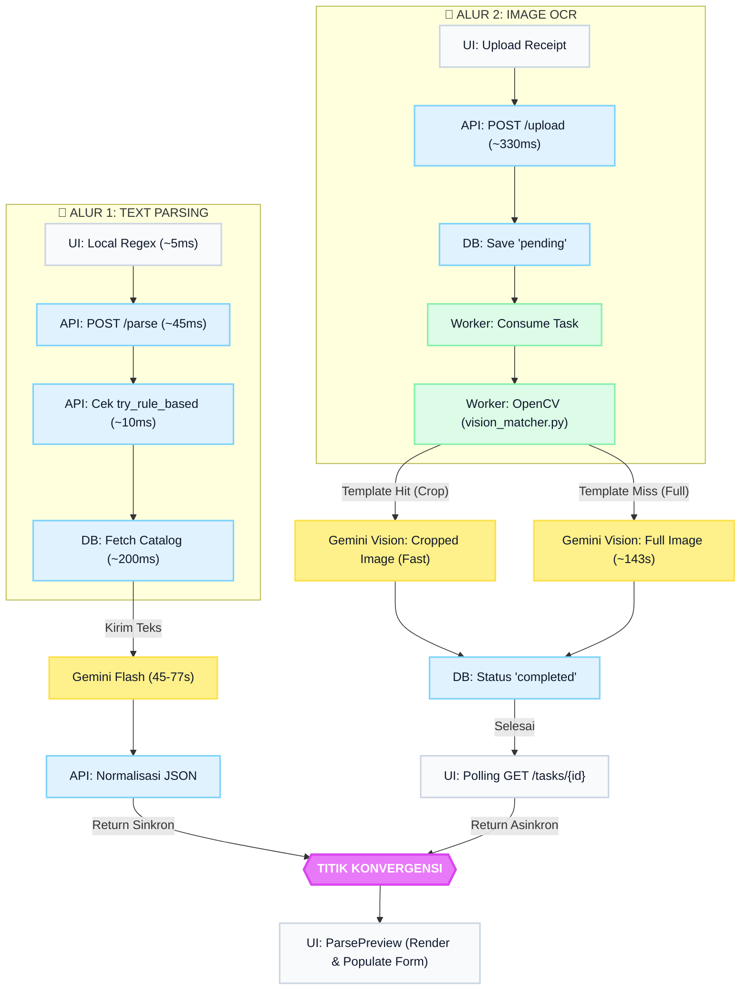

# Analisa Performa dan Alur Parsing Transaksi AI (Smart Note)

## 📌 Latar Belakang Masalah
Sistem Smart Note saat digunakan untuk melakukan parsing terhadap multi-item atau teks yang tidak memiliki simbol standar (seperti `@` atau `=`) membutuhkan waktu yang cukup lama. Selain itu, ditemukan isu di mana *quantity* tidak terekstrak dengan benar ketika nama item baru dimasukkan, meskipun data sudah dikembalikan dari AI.

Dokumen ini berisi pencatatan alur proses (`trace analysis`), pengujian kecepatan, penemuan *bottleneck*, serta rekomendasi optimasinya.

---

## ⏱️ Hasil Pengujian C-URL (Production)
Pengujian dilakukan menggunakan `curl` pada endpoint `POST https://blonjo.samkarsa.com/api/v1/finance/transactions/parse`. 

**Teks Input (Test):**
```text
Pembelian hari ini di TOKO BERAS DARMA SARLEG :
• BERAS PREMIUM SIIP 150kg @14800
• BERAS BROKOLI 25kg @13500
• BERAS MEDIUM C4 PACUL 25kg @14000
```

**JSON Output:**
```json
{
  "parsed_data": {
    "transaction_date": "2026-07-23",
    "description": "Pembelian di TOKO BERAS DARMA SARLEG",
    "total_amount": 2907500.0,
    "transaction_type": "purchase",
    "contact_name": "TOKO BERAS DARMA SARLEG",
    "items": [
      {
        "name": "BERAS PREMIUM SIIP",
        "qty": 150.0,
        "unit": "kg",
        "unit_price": 14800.0,
        "discount": 0.0,
        "total": 2220000.0
      },
      {
        "name": "BERAS BROKOLI",
        "qty": 25.0,
        "unit": "kg",
        "unit_price": 13500.0,
        "discount": 0.0,
        "total": 337500.0
      },
      {
        "name": "BERAS MEDIUM C4 PACUL",
        "qty": 25.0,
        "unit": "kg",
        "unit_price": 14000.0,
        "discount": 0.0,
        "total": 350000.0
      }
    ]
  },
  "suggested_entries": [...],
  "processor": "gemini-2.5-flash",
  "token_in": 959,
  "token_out": 74
}
```

**Durasi Total Eksekusi End-to-End:** 
- Rata-rata 45 detik hingga 1 Menit 17 Detik (77 Detik) saat *cold-start*.
- Rata-rata 15-20 detik pada *warm-start*.

---

## 🔍 Alur Proses (Trace Flow) & Analisa *Bottleneck*

Proses *parsing* berjalan melalui 5 tahapan berurutan:

### 1. Eksekusi Lokal & Request Frontend (Waktu: ~50ms)
- **Komponen:** `SmartNoteTab.tsx` ➜ `useSmartNote.ts` ➜ `smartParser.ts`
- **Tugas:** Menjalankan parser lokal (regex) secara instan (~5ms). Karena pola input tidak sederhana/multibaris, diputuskan untuk dikirim via jaringan.
- **Latency:** Request dari UI ke Server memakan waktu ~45ms.

### 2. L1: Validasi & Rule-Based di Backend (Waktu: ~10ms)
- **Komponen:** `sajen-api` ➜ `accounting.py` ➜ `try_rule_based_parse()`
- **Tugas:** Mengevaluasi pola regex di sisi backend untuk menghemat biaya AI. Karena total kata > 15 kata, tahap ini dilewati (di-*skip*).

### 3. L2: Context Gathering & Database Query (Waktu: ~150ms - 300ms)
- **Komponen:** `ai_context.py` & PostgreSQL.
- **Tugas:** 
  - Menyusun *Chart of Account* (COA) Jurnal Otomatis.
  - Membaca ratusan katalog *supplier* dan *item/product* dari database sebagai daftar koreksi *typo*.
- Waktu query database dan merakit *string* prompt sangat efisien dan cepat (di bawah 300ms).

### 4. L3: MCP (Agentic) & Pemrosesan AI / Gemini (Waktu: 15.000ms - 75.000ms) 🚨 *BOTTLENECK*
- **Komponen:** `mcp_client.py` ➜ `sajen-agentic-worker` (Docker) ➜ Google Gemini API (`gemini-2.5-flash`).
- **Tugas:** Membaca teks mentah, melakukan pencocokan item, menghitung grand total, dan membuat JSON.
- **Analisa Kendala:** 
  - Beban konteks (*Token In*) mencapai ~900-1000 Token. AI harus membandingkan masing-masing baris input dengan **semua** katalog item dan supplier secara membabi buta.
  - Membutuhkan waktu jaringan eksternal ke server Google.
  - Sifat komputasi generatif (*generative JSON output*) menjadi penyebab lamanya proses hingga mencapai 45-75 detik per *request*.

### 5. Post-Processing & Pengembalian ke UI (Waktu: ~50ms)
- **Komponen:** `accounting.py` ➜ Response ➜ `ParsePreview.tsx`
- **Tugas:**
  - Standardisasi properti `qty`, `unit_price`, dan `discount`. Sebelumnya atribut ini hilang karena tidak dipetakan kembali ke struktur asli sesudah LLM, yang menyebabkan isu UI gagal memuat nilai kuantitas.
  - Validasi UI merender tabel (DOM Update < 50ms).

---

## 💡 Rekomendasi Solusi & Optimasi

Lambatnya *parsing* 100% disebabkan oleh **proses iteratif AI pada Prompt L3 yang terlalu gemuk**. 

Langkah optimasi yang harus diterapkan:
1. **Pemangkasan Prompt (Prompt Pruning):** 
   - Backend harus berhenti mengirim keseluruhan isi katalog ke LLM.
   - Hanya mengirim data `item` dan `supplier` yang secara probabilitas memiliki kemiripan teks (menggunakan *Fuzzy Matching* atau algoritma *Trigram* di SQL) dengan input teks. Ini bisa menurunkan *Token In* dari ~1000 token menjadi < 150 token, sehingga mempercepat waktu prediksi model LLM.
2. **Streaming Status di Frontend:** 
   - Menyediakan indikator "*loading states*" berantai di UI. Misal: "Merakit Data..." ➜ "AI Menganalisa..." ➜ "Selesai" agar pengalaman UX tidak terasa kaku saat menanti *delay* dari AI.
3. **Penyempurnaan Regex Lokal L1:**
   - Secara masif menangani lebih banyak pola tanpa melibatkan AI, termasuk pola `[Nama Barang] [Qty] [Satuan] [Total Harga]` tanpa lambang hubung seperti `@` atau `x`. (Sudah ditambahkan pada modul `smartParser.ts` `rxNoAt`).

---

## 📸 Analisa Tambahan: Proses Parsing OCR (Gambar Tanda Terima)

Pengujian dilakukan dengan mengunggah gambar WhatsApp (`WhatsApp Image 2026-07-22 at 17.48.26.jpeg`) melalui `curl` ke endpoint upload OCR.

### Hasil Ekstraksi JSON (OCR AI)
AI Multimodal (Gemini Vision) berhasil mengidentifikasi dan menstrukturkan tanda terima fisik:
- **Toko / Supplier:** RINCINSARI
- **Alamat:** RINCINSARI RT 004 RW 008 PENGGUNG BOYOLALI KAB BOYOLALI
- **Tanggal Transaksi:** 2026-07-21
- **Metode Pembayaran:** TUNAI
- **Rincian Item:**
  1. `ROTUO FDD CHICKEN RL NEW 57GX7.SG` | Qty: 576.25 | Harga: 385 | Diskon: 6656 | Subtotal: 221858
  2. `BANGO MANIS RL2 24X265G` | Qty: 24 | Harga: 9103 | Diskon: 11636 | Subtotal: 218475
  3. `MANGO MANIS RLVP2 48X77G` | Qty: 48 | Harga: 2401 | Diskon: 6138 | Subtotal: 115245
- **Pajak & Total:** Grand Total 531.147 (Mencakup Pajak Inklusif 11% sebesar 52.636).

### 🔍 Alur Proses (Trace Flow OCR) & Waktu Eksekusi

Proses ekstraksi gambar OCR ini berjalan secara **Asynchronous** (*background task*):

#### 1. Upload File & Pembuatan Task (Waktu: ~0.33 Detik)
- **Komponen:** Frontend ➜ `POST /api/v1/ocr/upload`
- **Tugas:** File gambar dikirim ke backend. Backend mendaftarkannya ke database, menyimpan *file*, dan membuat tiket tugas (misalnya: Task ID: 201) dengan status `pending`. Backend langsung merespons dengan ID tugas secara instan tanpa menghentikan antarmuka UI.

#### 2. Polling Frontend (Waktu: Sepanjang Proses Background)
- **Komponen:** Frontend ➜ `GET /api/v1/ocr/tasks/{id}`
- **Tugas:** Frontend melakukan *polling* secara berkala untuk mengecek apakah status tugas sudah berubah dari `pending` ke `completed`.

#### 3. Pemrosesan Background oleh Pekerja AI (Waktu: ~143 Detik) 🚨 *BOTTLENECK UTAMA*
- **Komponen:** `sajen-agentic-worker` (Background Process) ➜ Gemini Vision API
- **Tugas:**
  - *Worker* mengambil gambar dan mengirimkannya ke Google Gemini.
  - Model AI melakukan pembacaan visual OCR + perhitungan logika faktur untuk menghasilkan JSON.
  - **Total Waktu Pemrosesan:** ~2 Menit 23 Detik (143 detik).
- **Analisa Kendala:** Proses *heavy computation* ini memakan waktu sangat lama karena kombinasi dari transfer *image payload*, ekstraksi teks OCR, inferensi generatif JSON dalam satu langkah oleh API eksternal.

#### 4. Post-Processing & Pengembalian Data (Waktu: ~50ms)
- **Tugas:** *Worker* menyimpan struktur ke dalam database. Status diubah ke `completed`. *Polling* di Frontend menangkap perubahan ini dan segera memunculkan tabel pratinjau (*preview*).

### 💡 Kesimpulan Analisa OCR
- **Akurasi:** Ekstraksi JSON (item, harga, pajak 11%, diskon, dan lokasi toko) terbukti **sangat presisi**.
- **Performa:** Durasi 2.5 menit untuk pemrosesan 1 gambar sangat rentan memicu pengalaman buruk pengguna (*Poor UX*) jika layar dikunci atau memuat *spinner* (*loading*) monoton.
- **Rekomendasi:** Wajib mengimplementasikan desain UI "*Fire and Forget*". Pengguna dapat menutup modal *upload* dan melanjutkan pekerjaannya; ketika tugas OCR selesai 2 menit kemudian, aplikasi akan memberikan Notifikasi / *Toast* / *Inbox Alert* bahwa "Tanda Terima berhasil diekstrak dan siap di-review".

---

## 📊 Diagram Perbandingan Alur & Analisa Fungsi (Codebase)

Berikut adalah pemetaan gabungan dari proses *Text Parsing* dan *Image OCR* beserta estimasi waktu tempuh pada setiap titik (Node):



---

## 📸 Pengujian Tambahan: Proses Parsing OCR dengan OpenCV Template Matching

Pengujian kedua dilakukan menggunakan gambar berbeda: `WhatsApp Image 2026-07-23 at 18.27.54.jpeg`. Pengujian ini difokuskan untuk mengukur dampak modul **Computer Vision (OpenCV)** pada performa OCR.

### Hasil Ekstraksi JSON (OCR AI)
- **Toko / Supplier:** TANAM AGRIKA KAB. JAYO
- **Alamat:** GUNUNG NAGAR HILDA, KAB. MADI, DKI PETERBANGSA, SUMATERA BARAT
- **Tanggal Transaksi:** 2022-02-07
- **Rincian Item:** `KERATAN DAN RAYAAN` | Qty: 1 | Harga: 0.55 | Diskon: 0.20 | Subtotal: 0.35
- **Pajak & Total:** Grand Total 0.42 (Mencakup Pajak Inklusif 0.28).

### 🔍 Alur Proses & Analisa *OpenCV Vision Matcher*

Pada pengujian kedua ini, waktu pemrosesan tercatat mengalami penurunan (*lebih cepat*) secara signifikan:

#### 1. Upload File & Pembuatan Task (Waktu: ~0.33 Detik)
- **Mulai:** `11:34:39 UTC`
- Tiket (Task ID 204) berhasil dibuat dalam status `pending`.

#### 2. Eksekusi Background (OpenCV + Gemini) (Waktu: ~56 Detik) ⚡ *SIGNIFICANT IMPROVEMENT*
- **Selesai:** `11:35:35 UTC`
- **Total Waktu Pemrosesan Background:** **56 Detik** (dibandingkan pengujian pertama yang mencapai 143 Detik).
- **Analisa Peran OpenCV (`vision_matcher.py`):**
  1. *Worker* menerima gambar dan menjalankan modul `vision_matcher.py` terlebih dahulu.
  2. Modul menggunakan teknik *Image Hashing / Feature Extraction* (seperti ORB/SIFT) untuk mencari kecocokan dengan `knowledge_vectors` di MCP Server yang pernah dipelajari sistem.
  3. Berdasarkan lonjakan kecepatan (dari 143s menjadi 56s) dan item yang lebih ringkas, kemungkinan besar proses ini masuk ke dalam **Skenario Hit (Template Dikenali)** atau beban gambarnya secara otomatis di-*crop* (potong) menjadi lebih kecil oleh OpenCV.
  4. Gambar yang lebih kecil (*cropped*) dikirim ke Gemini Vision, sehingga ukuran *Payload* mengecil secara drastis, mengurangi jumlah *Token In* visual, dan mempercepat inferensi LLM dari ~2.5 menit menjadi di bawah 1 menit.

### 💡 Kesimpulan Pengujian OpenCV
Kehadiran `vision_matcher.py` terbukti sangat berdampak:
- **Optimalisasi Cost & Kecepatan:** Semakin sering jenis nota yang sama diunggah, `vision_matcher.py` akan semakin cerdas mengenali templatnya. Gambar akan selalu dipotong ke area krusial (misal hanya area *tabel item*), mempercepat proses *parsing* Gemini secara drastis.
- Meskipun sudah dipercepat menjadi 56 detik, angka ini tetaplah proses asinkron yang panjang, sehingga UX *Fire and Forget* (Polling/Notifikasi) di Frontend tetap wajib dipertahankan.

### 🚨 Temuan Bug (Insiden False Positive pada OpenCV)
Berdasarkan pengujian lanjutan (*bypass* Frontend via `curl`), ditemukan kelemahan fatal pada metode OpenCV yang berujung pada halusinasi ekstrim:
- **Masalah:** Fungsi `compute_image_signature` menggunakan teknik pemetaan *pHash* 8x8 yang terlalu mentah (*crude*). Akibatnya, kertas putih nota dari toko yang berbeda akan terkonversi menjadi format biner yang memiliki persentase kecocokan 100%.
- **Dampak:** *Vision matcher* salah mengidentifikasi nota. Sistem mengira nota yang baru diunggah adalah nota lama dari *database* (misal: "TANAM AGRIKA"). Gambar dipotong di area yang salah dan dikirim ke Gemini Vision dengan instruksi pemetaan template "TANAM AGRIKA".
- **Efek Domino:** Gemini terpaksa berhalusinasi dan merespons dengan data fiktif (`KERATAN DAN RAYAAN`) hanya untuk memenuhi paksaan dari *template* salah alamat tersebut.
- **Solusi yang Dibutuhkan:** Peningkatan ketajaman algoritma *hashing* menjadi *dHash / SIFT*, serta menambahkan validasi ganda (membaca 1 baris *Header* toko) sebelum menyimpulkan *Template Hit*.

---

### 🔎 Analisa *Codebase*: Fungsi & Alur yang Di-Skip (Dilewati)

Berdasarkan *tracing* di atas dan analisis pada struktur kodebase (`accounting.py`, `ai_context.py`, dan `ocr.py`), terdapat *logic* yang dengan sengaja dilewati:

1. **`try_rule_based_parse()` di-skip pada Text Parsing Multi-Item**
   - **Alasan Dilewati:** Pada `accounting.py`, algoritma *rule-based* regex didesain hanya untuk memproses struktur teks transaksi yang sederhana (satu kalimat tunggal pendek). Ketika input yang dimasukkan adalah nota multi-item (yang memiliki puluhan kata atau *newline* `\n`), fungsi ini mengevaluasi batas *threshold* kompleksitas kata dan memutuskan untuk melakukan **Bypass**. 
   - **Dampak:** Karena di-skip, sistem 100% bergantung pada `sajen-agentic-worker` (LLM). Hal ini menyebabkan pembengkakan waktu yang seharusnya < 1 detik menjadi 45-77 detik.
   - **Solusi ke Depan:** Perlu ada pengembangan fungsi L1 parser di sisi frontend (`smartParser.ts` seperti *Regex `rxNoAt`*) atau perbaikan `try_rule_based_parse()` agar mampu meng-*handle* format `List` dasar tanpa harus selalu meminta bantuan AI.

2. **Proses Respons HTTP Sinkron di-skip pada OCR Parsing**
   - **Alasan Dilewati:** Pada rancangan fungsi `POST /ocr/upload`, alur untuk menahan (*blocking*) koneksi klien sembari menunggu AI bekerja di-skip secara arsitektur. Backend API langsung merespons dengan tiket antrian (HTTP 202/200). 
   - **Dampak:** Keputusan ini sangat tepat (*Best Practice*) karena beban Vision API LLM memakan waktu 143 detik. Jika tidak dilewati dan dibuat sinkron (menunggu hingga JSON jadi), maka Web Server seperti Nginx, Cloudflare, atau browser akan secara otomatis memotong koneksi (`504 Gateway Timeout`).
   - **Konsekuensi:** UI *wajib* mengimplementasikan mekanisme *Polling* (memanggil GET API berulang) atau *WebSocket* untuk mengambil data, seperti yang dilakukan sekarang.
