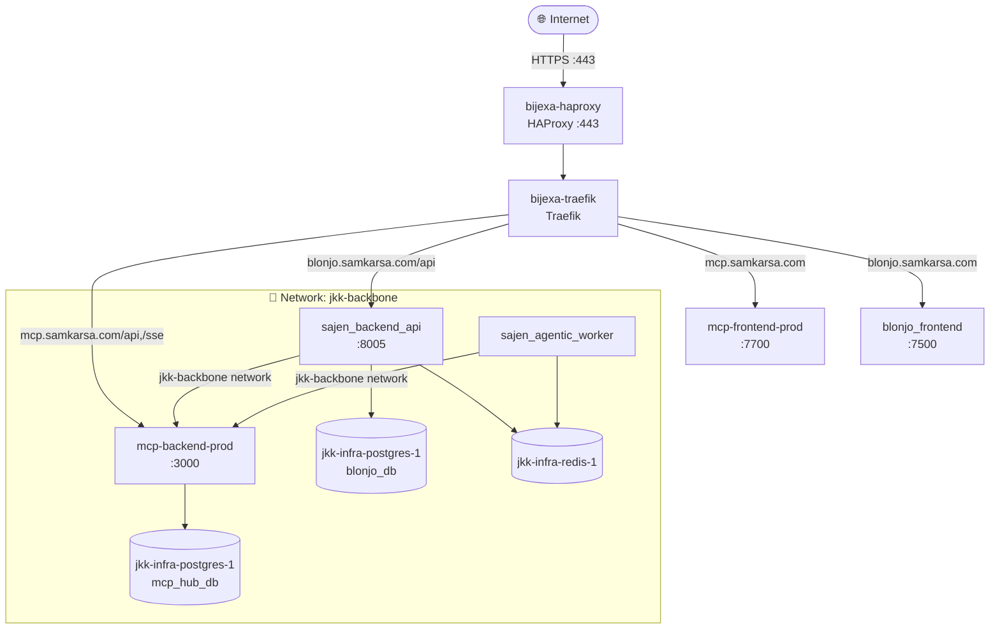

# 🔌 Analisa MCP Server — Proyek BLONJO & SAJEN

## Ringkasan Eksekutif

Proyek **BLONJO** (frontend React) + **SAJEN** (backend FastAPI) mengintegrasikan **MCP Server** sebagai lapisan AI/LLM terpusat yang bisa diaktifkan/dinonaktifkan via environment variable. Saat ini MCP hanya digunakan di sisi **backend (SAJEN)**.

MCP Server berjalan di **VPS yang sama** sebagai proyek terpisah (`mcp-server`) dan dapat diakses publik melalui `https://mcp.samkarsa.com`.

---

## 🗂️ Arsitektur MCP dalam Proyek (VPS Production)



---

## 📁 File Utama MCP

| File | Lokasi | Peran |
|------|--------|-------|
| `mcp_client.py` | `sajen/app/services/` | **Abstraksi utama** — wrapper semua call ke MCP Server |
| `config.py` | `sajen/app/core/` | Konfigurasi `MCP_ENABLED`, `MCP_SERVER_URL`, `MCP_API_KEY` |
| `.env.production` | Root | MCP **aktif** di production (`MCP_ENABLED=true`) |
| `.env.example` | Root | MCP **tidak ada** — default development tanpa MCP |

---

## ⚙️ Konfigurasi MCP

```python
# sajen/app/core/config.py
MCP_ENABLED: bool = False                          # Default: MATI di dev
MCP_SERVER_URL: str = "http://mcp-backend-prod:3000"  # Container Docker
MCP_API_KEY: str = ""                             # Bearer token auth
```

```bash
# .env.production (PRODUCTION - MCP AKTIF)
MCP_ENABLED=true
MCP_SERVER_URL=http://mcp-backend-prod:3000
MCP_API_KEY=sk-sajen-internal-xxx
```

> [!IMPORTANT]
> MCP Server **hanya aktif di environment Production**. Saat development lokal, semua request fallback ke AI lokal (Ollama/Gemini) secara otomatis tanpa breaking change.

---

## 🛠️ Tools MCP yang Digunakan

### 1. `parse_transaction` — Parse Teks Transaksi

| Aspek | Detail |
|-------|--------|
| **File** | `sajen/app/api/v1/accounting.py` (baris 144–155) |
| **Dipanggil dari** | Endpoint `POST /api/v1/transactions/parse` |
| **Input ke MCP** | `{ text, context: { pricing_rules, coa, today_date } }` |
| **Output dari MCP** | `{ content: [{ type: "text", text: "JSON..." }] }` |
| **Fallback** | `ai_engine.call_ai_text()` → Ollama/Gemini lokal |

**Alur kerja:**
```
User ketik nota → L1: Rule-based (0ms) → MISS?
  → L2/L3: MCP parse_transaction (jika MCP_ENABLED)
      → MCP gagal? → Fallback lokal (Ollama/Gemini)
```

**Context yang dikirim ke MCP:**
- **`pricing_rules`** — aturan harga jual tenant (format JSON)
- **`coa`** — Chart of Accounts (daftar akun)
- **`today_date`** — tanggal hari ini

---

### 2. `parse_pricing_rule` — Parse Aturan Harga NLP

| Aspek | Detail |
|-------|--------|
| **File** | `sajen/app/api/v1/inventory.py` (baris 386–399) |
| **Dipanggil dari** | Endpoint `POST /api/v1/pricing-rules/parse` |
| **Input ke MCP** | `{ text: "teks natural language aturan harga" }` |
| **Output dari MCP** | JSON rule terstruktur |
| **Fallback** | `ai_engine.parse_pricing_rule()` lokal |

**Contoh use case:** User mengetik _"Harga mie ayam 15rb, kalau beli 5 porsi diskon 10%"_ → MCP mengkonversi ke JSON rule terstruktur.

---

### 3. `ocr_receipt` — OCR Nota/Struk

| Aspek | Detail |
|-------|--------|
| **File** | `sajen/app/workers/ocr_worker.py` (baris 156–163) |
| **Dipanggil dari** | **Celery Worker** (background task, bukan API langsung) |
| **Input ke MCP** | `{ file_b64: base64(image), mime_type: "image/jpeg" }` |
| **Output dari MCP** | `{ raw_text: "..." }` |
| **Fallback 1** | Gemini Vision API (jika `GOOGLE_API_KEY` ada) |
| **Fallback 2** | Tesseract OCR (offline, lokal) |

**Alur prioritas OCR:**
```
Upload Gambar (.jpg/.png/.jpeg)
  → MCP_ENABLED? → mcp_client.ocr_receipt() ← PRIORITAS 1
  → GOOGLE_API_KEY? → Gemini Vision           ← PRIORITAS 2
  → Default → Tesseract OCR                   ← PRIORITAS 3 (offline)
```

---

## 📊 Peta Penggunaan MCP per Modul

| Modul | File | Tool MCP | Endpoint/Trigger |
|-------|------|----------|-----------------|
| **Accounting** | `api/v1/accounting.py` | `parse_transaction` | `POST /transactions/parse` |
| **Inventory** | `api/v1/inventory.py` | `parse_pricing_rule` | `POST /pricing-rules/parse` |
| **OCR Worker** | `workers/ocr_worker.py` | `ocr_receipt` | Celery background task |

---

## 🔄 Mekanisme Fallback

```python
# Pattern yang sama digunakan di ketiga tempat:
if settings.MCP_ENABLED:
    try:
        res = await self.call_tool("nama_tool", { ...args... })
        return parse_result(res)
    except Exception as e:
        print(f"[MCPClient] gagal, fallback ke AI lokal. Error: {e}")

# Fallback lokal — selalu ada sebagai safety net
return local_ai_function(...)
```

> [!NOTE]
> Arsitektur ini **zero breaking change** — jika MCP server mati atau tidak tersedia, sistem otomatis turun ke AI lokal tanpa error ke user.

---

## 🌐 Komunikasi dengan MCP Server

```python
# sajen/app/services/mcp_client.py - method call_tool()
async with httpx.AsyncClient(timeout=30.0) as client:
    resp = await client.post(
        f"{self.base_url}/tools/{tool_name}",  # HTTP POST JSON
        json=arguments,
        headers={"Authorization": f"Bearer {MCP_API_KEY}"}
    )
```

**Format URL (internal Docker):** `http://mcp-backend-prod:3000/tools/{tool_name}`
- `/tools/parse_transaction`
- `/tools/parse_pricing_rule`
- `/tools/ocr_receipt`

**Format URL (publik):** `https://mcp.samkarsa.com/api/tools/{tool_name}`
_(via Traefik → PathPrefix `/api`)_

**Format response MCP standard:**
```json
{
  "content": [
    { "type": "text", "text": "{...JSON output...}" }
  ]
}
```

---

## 🏗️ Status Development vs Production

| Aspek | Development | Production |
|-------|-------------|------------|
| `MCP_ENABLED` | `false` | `true` |
| AI Engine | Ollama local + Gemini | MCP Server |
| MCP URL (internal) | N/A | `http://mcp-backend-prod:3000` |
| MCP URL (publik) | N/A | `https://mcp.samkarsa.com` |
| Network | `sajen_net` (bridge lokal) | `jkk-backbone` (shared VPS) |
| Auth MCP | N/A | Bearer token `sk-sajen-internal-xxx` |
| AI Models (MCP) | — | Gemini 2.5 Flash, gemini-3-flash-preview, qwen2.5:3b |
| Database MCP | — | `mcp_hub_db` di jkk-infra-postgres-1 |

---

## 🖥️ Infrastruktur VPS Aktual

```
[VPS] Container yang berjalan (docker ps):
├── bijexa-haproxy        → :80, :443 (reverse proxy utama)
├── bijexa-traefik        → routing rules
├── mcp-backend-prod      → :3000 | project: mcp-server | network: jkk-backbone + bijexa-network
├── mcp-frontend-prod     → :7700 | UI frontend MCP
├── sajen_backend_api     → :8005 | network: jkk-backbone + bijexa-network  
├── sajen_agentic_worker  → Celery | network: jkk-backbone
├── blonjo_frontend       → :7500 | network: bijexa-network
├── jkk-infra-postgres-1  → :55432 | DB shared (blonjo_db + mcp_hub_db)
└── jkk-infra-redis-1     → :6379  | Cache shared

[Network: jkk-backbone] — container yang saling terhubung:
  sajen_backend_api ↔ mcp-backend-prod ✅  (koneksi langsung via container name)
  sajen_agentic_worker ↔ mcp-backend-prod ✅
  semua ↔ jkk-infra-postgres-1 & jkk-infra-redis-1

[Traefik Routing]:
  mcp.samkarsa.com         → mcp-frontend-prod
  mcp.samkarsa.com/api     → mcp-backend-prod :3000
  mcp.samkarsa.com/sse     → mcp-backend-prod :3000
  blonjo.samkarsa.com      → blonjo_frontend
  blonjo.samkarsa.com/api  → sajen_backend_api :8005
```

> **Lokasi project MCP Server di VPS:** `/root/mcp-server/docker-compose.prod.yml`

---

## 📌 Kesimpulan

1. **MCP Server sudah berjalan di production** sebagai container `mcp-backend-prod` (project terpisah di `/root/mcp-server/`).
2. **Koneksi Sajen → MCP** menggunakan Docker internal network `jkk-backbone` via URL `http://mcp-backend-prod:3000` (bukan expose publik).
3. **Akses publik** tersedia di `https://mcp.samkarsa.com/api` melalui Traefik — untuk keperluan testing/management.
4. **MCP memiliki database sendiri** (`mcp_hub_db`) terpisah dari `blonjo_db`, keduanya di server PostgreSQL yang sama.
5. **AI Models di MCP:** Gemini 2.5 Flash, gemini-3-flash-preview, Ollama (qwen2.5:3b) sebagai fallback lokal.
6. **Pattern defensive fallback** di kode Sajen memastikan sistem tetap berjalan meski MCP mati.
