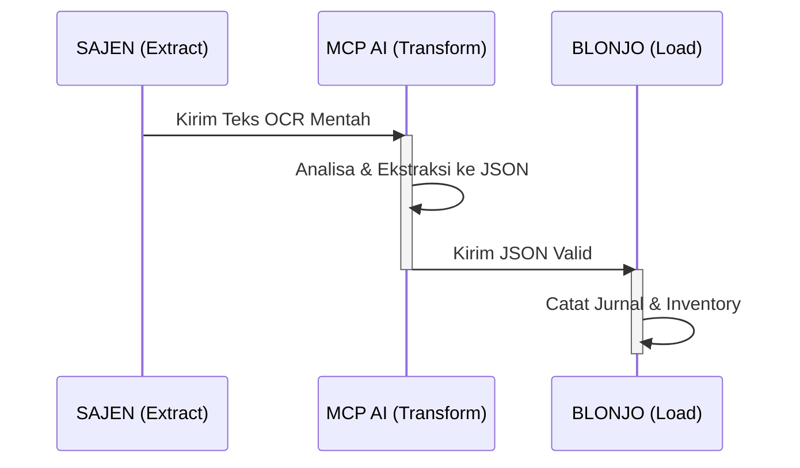
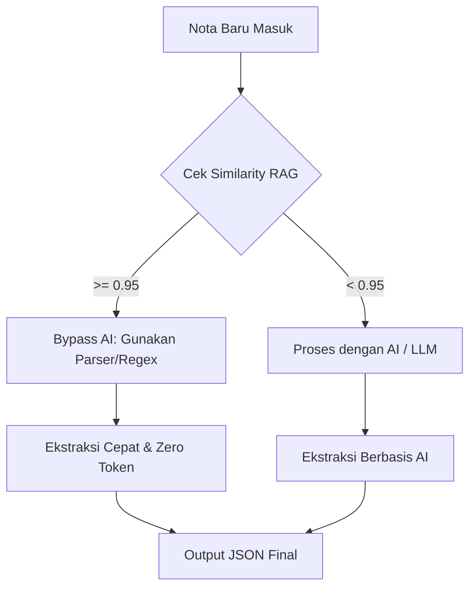
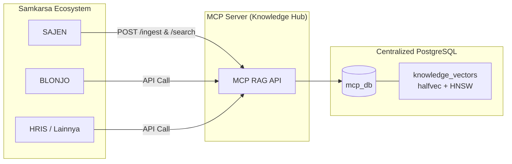
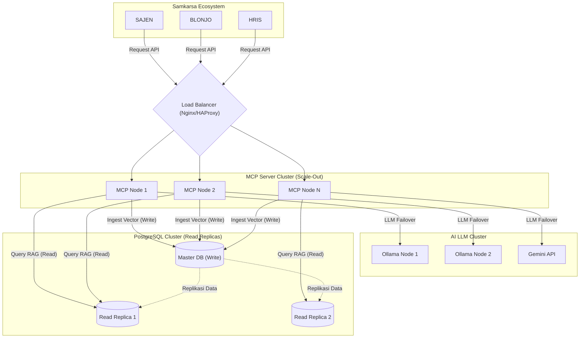

# Blueprint Arsitektur Sentralisasi RAG & Optimasi Ekstraksi Nota (Samkarsa Ecosystem)

Dokumen ini berisi rangkuman komprehensif dari analisa, temuan *codebase*, dan rancangan arsitektur untuk sistem ekstraksi nota pada ekosistem Samkarsa (SAJEN -> MCP -> BLONJO).

---

## 1. Latar Belakang & Analisa Masalah Awal (Garbage In, Garbage Out)

Pada awalnya, sistem ekstraksi nota mengalami beberapa kendala akurasi dan efisiensi:
1. **Kehilangan Data Akuntansi Krusial**: Hasil ekstraksi kehilangan nilai PPN, salah membaca tanggal, mengosongkan nama *supplier*, dan tidak mengartikan metode pembayaran (contoh: teks "Jatuh Tempo 13/jul/26" di nota fisik tidak terkonversi menjadi Hutang/Kredit).
2. **Kelemahan Skema Target**: Skema JSON lama tidak memiliki kolom untuk `tax_amount`, `payment_method`, dan `due_date`, sehingga LLM tidak punya tempat untuk menaruh data tersebut meskipun berhasil dibaca.
3. **Pemborosan Token (Redundansi)**: Teks input (Prompt) mengirimkan tabel Markdown DAN *raw* JSON secara bersamaan. Hal ini memboroskan Token In dan membuat konteks AI menjadi bias/lambat.

---

## 2. Solusi 1: Pembaruan Arsitektur Prompt & Skema JSON

Untuk mengatasi masalah di atas, alur diubah menjadi lebih spesifik dan hemat token. Teks input yang diberikan ke LLM cukup **Raw OCR Text** saja.

### Prompt Ekstraksi AI yang Dioptimalkan
```text
Anda adalah AI Akuntan Profesional. Ekstrak teks nota/faktur berikut ke dalam format JSON yang valid.

Aturan Ekstraksi:
1. "transaction_date": Gunakan tanggal transaksi nota (Format: YYYY-MM-DD).
2. "due_date": Jika ada keterangan "Jatuh Tempo", masukkan tanggalnya. Jika tidak, samakan dengan transaction_date.
3. "payment_method": Jika ada "Jatuh Tempo" atau "Termin", isi dengan "credit". Jika tidak ada, isi "cash".
4. "tax_amount": Cari nilai PPN atau Pajak. Jika tidak tertulis, isi 0.
5. "total_amount": Adalah Total Akhir setelah potongan dan ditambah PPN. Harus balance dengan Total Bayar.
6. HANYA keluarkan objek JSON, tanpa teks markdown lainnya.
```

### Skema JSON Target (Standardisasi BLONJO)
```json
{
  "reference_no": "Nomor faktur/nota",
  "contact_name": "Nama entitas/supplier (contoh: PT INDOMARCO ADI PRIMA)",
  "transaction_date": "YYYY-MM-DD",
  "due_date": "YYYY-MM-DD",
  "description": "Pembelian dari [Nama Supplier]",
  "payment_method": "cash|credit",
  "transaction_type": "purchase",
  "subtotal": 0.0,
  "discount": 0.0,
  "tax_amount": 0.0,
  "total_amount": 0.0,
  "items": [
    {
      "name": "string",
      "qty": 0,
      "unit": "string",
      "unit_price": 0.0,
      "total": 0.0
    }
  ]
}
```
**Dampak Optimasi Token**: Mengurangi Token In hingga 60% dan meningkatkan latensi pemrosesan batch.

---

## 3. Solusi 2: Alur Sistem (ETL) & Unbiased Ground Truth RAG

Secara arsitektur, peran dibagi menjadi tiga modul terpisah (Separation of Concerns):
1. **SAJEN (Extract)**: Bertugas murni untuk Data Ingestion & OCR. Hanya menghasilkan Teks Mentah.
2. **MCP AI (Transform)**: Bertindak sebagai *Middleware* cerdas yang mengekstrak logika bisnis dan merapikan ke JSON.
3. **BLONJO (Load)**: Menerima JSON valid untuk pencatatan Jurnal/Inventory ERP.



### Arsitektur RAG yang Tidak Bias (Unbiased Ground Truth Database)
Sebelumnya ada asumsi untuk hanya menyimpan hasil "koreksi manual" ke dalam RAG. Ini adalah bias karena AI hanya akan belajar dari kesalahannya. Pendekatan yang benar adalah membangun **Ground Truth Database**:

- Setiap format/pola nota baru yang diproses akan direkam sebagai "Standar Emas" (Ground Truth), yang berisi pasangan `[Teks Raw OCR]` + `[JSON Final]`.
- Ini berlaku **terlepas dari** apakah hasil akhir tersebut didapat karena AI langsung benar pada percobaan pertama, atau karena telah dikoreksi oleh manusia. Keduanya adalah data pembelajaran yang valid untuk RAG.

---

## 4. Solusi 3: Bypassing AI (Zero-Token Processing)

GOAL jangka panjang dari RAG ini adalah **berhenti menggunakan AI jika tidak diperlukan**. 



1. Saat SAJEN mengirimkan teks nota ke MCP, MCP akan mengecek Vector Database (RAG).
2. Jika *Similarity Score* (Kemiripan Vektor) sangat tinggi (misal: `>= 0.95`), artinya sistem sangat mengenali format nota supplier tersebut (contoh: format baku Indomarco).
3. **Sistem akan mem-bypass LLM**. Formatting dan ekstraksi data tidak menggunakan AI, melainkan menggunakan kode parser reguler/Regex berbasis pola *Ground Truth* yang sudah tersimpan. 
4. AI murni hanya memproses konten atau item jika diperlukan (content-level processing).
5. **Dampak:** *Zero-token cost* untuk formatting, dan latensi sistem berubah dari hitungan detik menjadi milidetik.

---

## 5. Analisa Codebase Saat Ini (HNSW & Halfvec)

Berdasarkan inspeksi langsung ke dalam repositori `sajen` dan `mcp-server`:
- Di **SAJEN** (`app/services/ai_engine.py`, `migrations/...`): RAG sudah tertanam dalam. Terdapat migrasi PostgreSQL yang luar biasa efisien: **`halfvec(3072)` dan indeks tipe `HNSW`**. Keputusan teknis ini (*Enterprise-Grade*) berhasil menghemat RAM dan *Storage* hingga 50% serta mempercepat *similarity search* secara masif.
- Di **MCP Server** (`src/services/vectorService.ts`, `src/tools/ragAssembler.ts`): Arsitektur RAG juga sudah mulai diterapkan dengan query `pgvector` (`1 - (embedding <=> $1::vector)`) dan penggabungan *System Prompt*.

**Masalah Redundansi**: Saat ini ekosistem Samkarsa berbagi *cluster* PostgreSQL yang sama (hanya beda nama *database*). Menyimpan tipe data raksasa seperti vektor di `sajen_db` dan juga di `mcp_db` akan memicu pembengkakan *storage* yang sia-sia (Redundansi).

---

## 6. Arsitektur Sentralisasi (Knowledge-as-a-Service)

Sebagai solusi final, seluruh ekosistem RAG akan ditarik dan dipusatkan ke **MCP Server** agar bisa bertindak sebagai *Pusat Pengetahuan Semi-Publik* bagi aplikasi lintas ekosistem (Sajen, Blonjo, HRIS, dll). 

### Alasan Arsitektural: Mengapa RAG Dipusatkan di MCP?
| Faktor | Keuntungan Dipusatkan di MCP | Risiko Jika Tetap di SAJEN |
| :--- | :--- | :--- |
| **Akses Lintas Aplikasi** | Aplikasi apa pun di ekosistem Samkarsa cukup memanggil API MCP untuk mendapatkan konteks RAG. | Aplikasi lain terpaksa harus berinteraksi dengan SAJEN, menciptakan *Dependency Hell*. |
| **Konsistensi Embedding** | MCP menjadi satu-satunya *engine* vektor. Dimensi dijamin seragam. | Risiko ketidakcocokan dimensi model antar aplikasi saat data digabungkan. |
| **Manajemen Otorisasi** | MCP mudah mengatur Otorisasi (RBAC) membedakan data *Global* dan *Tenant*. | Sulit mengatur *Role-Based Access Control* jika data menyebar. |
| **Efisiensi Infrastruktur** | Beban pencarian vektor difokuskan di server AI (MCP). | SAJEN yang awalnya hanya OCR akan terbebani komputasi berat. |



### Desain "The Single Source of Truth" di MCP Database:
Semua data vektor akan berpusat di tabel **`knowledge_vectors`** (di DB MCP), dengan skema yang mengadopsi ketangguhan dari SAJEN:
- `id`: UUID.
- `app_context`: Menandakan asal aplikasi klien (contoh: `sajen_ocr`, `blonjo_rules`).
- `tenant_id`: Sistem otorisasi akses (Null untuk *Global Rule*, berisi ID untuk aturan *Tenant* spesifik).
- `content`: Teks *Ground Truth*.
- `embedding`: **`halfvec(3072)`** yang diindeks dengan **`HNSW`**.

### Langkah Refactoring (Eksekusi Pembersihan):
1. **Setup MCP DB**: Memperbarui tabel `knowledge_vectors` di MCP agar menggunakan `halfvec` dan `HNSW`.
2. **Migrasi Data (ETL)**: Memindahkan isi tabel `ai_learning_templates` dari SAJEN ke MCP, dilabeli dengan `app_context = 'sajen_ocr'`.
3. **Drop Table di SAJEN**: Menghapus tabel vektor di *database* SAJEN dan membuang modul `get_embedding()` lokalnya untuk menghemat *storage* 100%.
4. **Integrasi API**: Mengubah SAJEN menjadi *Stateless Client* murni yang hanya melakukan HTTP POST ke `mcp.samkarsa.com/api/v1/rag/ingest` dan `/search`.

---

## 7. Kesiapan Skalabilitas (Scale-Up & Scale-Out)

Arsitektur sentralisasi ini secara *native* mendukung skalabilitas ekstrem untuk *future-proofing* ekosistem Samkarsa:



1. **Kesiapan Scale-Out (Horizontal Scaling) MCP Server**
   MCP Server beroperasi secara **Stateless** (Tidak menyimpan data permanen di memori lokalnya). Seluruh "ingatan" AI (RAG) disimpan terpusat di `mcp_db` (PostgreSQL) dan *Cache* (Redis). Kapanpun diperlukan, kita bisa menjalankan banyak *instance* MCP di belakang *Load Balancer* (Nginx/HAProxy) yang akan membagi trafik secara merata tanpa isu inkonsistensi data.

2. **Kesiapan Scale-Up & Database Replication (Database Level)**
   Proses RAG adalah operasi yang sangat **Read-Heavy**. Optimasi `halfvec` memotong kebutuhan RAM hingga 50%, memungkinkan satu server menampung 2x lipat lebih banyak data sebelum *Scale-Up* RAM diperlukan. Jika satu server utama mulai kewalahan melayani kueri pencarian dari banyak MCP Server, kita dapat menerapkan arsitektur **Read Replicas** (Master-Slave), di mana MCP diarahkan untuk mencari data ke server replika.

3. **LLM Load Balancing**
   Trafik pemanggilan AI Model (jika sistem gagal *bypass*) juga mendukung distribusi. Model AI Lokal (Ollama) dapat di- *Load Balance* secara *Round-Robin* ke beberapa *node* GPU, sedangkan *Cloud API* (Gemini) dapat di- *scale* dengan menaikkan limit kuota *Tier* API.

Arsitektur ini menghilangkan redundansi data, memaksimalkan efisiensi AI, dan mempersiapkan ekosistem Samkarsa menuju otomasi penuh dengan performa tertinggi yang kebal terhadap *bottleneck* pertumbuhan.
