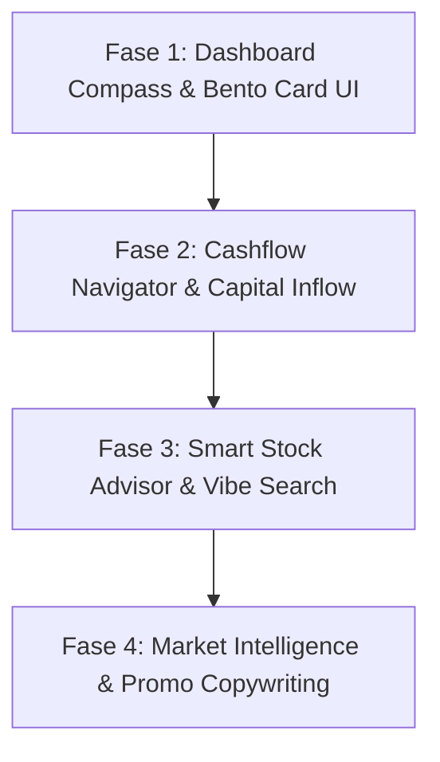

# Rencana Kerja (Plan): Implementasi Business Compass

Dokumen ini berisi rencana pembangunan modul **Business Compass** secara efisien dan hemat token dengan membagi pekerjaan menjadi 4 fase terpisah.

## Peta Kerja (4 Fase)

---

## Detail Pekerjaan per Fase

### 📍 Fase 1: Dashboard Compass & Bento Card UI
* **Backend (`sajen`)**: 
  * Siapkan API endpoint untuk summary data Dashboard Compass (Bento Card 1, 2, 3, dan 4).
* **Frontend (`blonjo`)**:
  * Tambahkan routing baru untuk `/reports/business-compass` (Dashboard Compass).
  * Desain Layout Bento Grid Glassmorphism modern dengan border neon tipis.
  * Buat base UI untuk Bento Card 1 (Kas), Bento Card 2 (Laba/Margin), Bento Card 3 (Status Stok), Bento Card 4 (Market Info).

### 📍 Fase 2: Cashflow Navigator
* **Backend (`sajen`)**:
  * Hubungkan data runut proyeksi kas harian dari H-4 ke H+30 yang sudah teroptimasi.
  * Tambahkan deteksi transaksi modal pemilik (**Capital Inflow**) berdasarkan CoA kelas `3-XXXX` (Ekuitas).
* **Frontend (`blonjo`)**:
  * Render tabel runut proyeksi kas harian.
  * Tampilkan indikator persentase akurasi proyeksi historis (subscript %) dan badge penambahan modal (Capital In).

### 📍 Fase 3: Smart Stock Advisor
* **Backend (`sajen`)**:
  * Sesuaikan parameter respon pencarian Vibe Search/Omnibar agar membaca flag `is_maintenance_stock` dari tenant aktif.
* **Frontend (`blonjo`)**:
  * Integrasikan Vibe Omnibar di menu Smart Stock Advisor.
  * Terapkan logika tampilan:
    * Jika `maintenance_stock = True` -> Tampilkan sisa stok fisik & harga terkontrol.
    * Jika `maintenance_stock = False` -> Hanya tampilkan harga jual (sembunyikan stok dengan efek transisi transparan/fade-out).

### 📍 Fase 4: Market Intelligence
* **Backend (`sajen` / MCP)**:
  * Buat endpoint/integrasi untuk fetch data berita makro komoditas (misal: harga pangan/retail).
  * Integrasikan AI untuk generate copywriting promosi tenant (Susu Steril, Minyak Goreng Curah, dll) berdasarkan harga jual di DB.
* **Frontend (`blonjo`)**:
  * Render rekomendasi penyesuaian harga jual dengan **Confidence Badge** hijau emerald (`Confidence: XX%`).
  * Sediakan UI salin promosi (copy-to-clipboard) untuk WhatsApp/Instagram/Facebook.

---

## 🛠️ Strategi Eksekusi
Kita akan menjalankan pekerjaan ini **fase demi fase**. Setelah satu fase disetujui dan dideploy, kita baru melangkah ke fase berikutnya. Hal ini menjamin pengerjaan yang terfokus, minim bug, dan irit kuota token.
