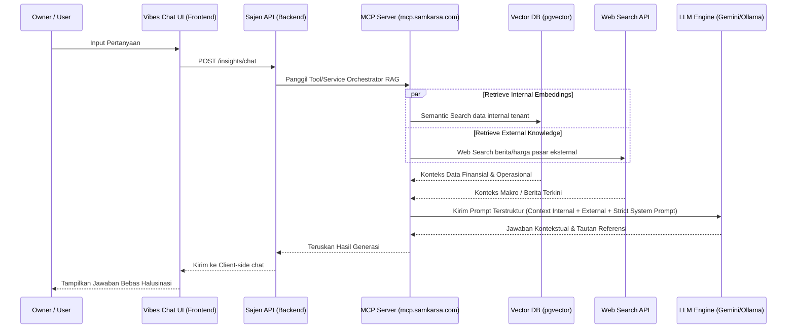

# Dokumen Analisis & Rancangan Arsitektur: Redesain "Business Insights"
**Peran**: Senior Software Architect
**Status**: DRAFT - Membutuhkan Review & Konfirmasi

Rancangan ini mendefinisikan ulang modul **Business Insights** (menggantikan rancangan Business Compass sebelumnya) dari visualisasi bento pasif menjadi sebuah instrumen navigasi bisnis aktif berbasis AI Generatif (*Agentic & Retrieval-Augmented Generation*). Modul ini dipecah menjadi 3 sub-menu utama yang berada di bawah rumpun **Business Insights** dengan arsitektur RAG yang tersentralisasi di **MCP Server (mcp.samkarsa.com)**.

---

## 1. Arsitektur Menu & Navigasi Baru

Di tingkat antarmuka (frontend `blonjo`), menu "Business Compass" akan dihapus sepenuhnya. Sebagai gantinya, sidebar menu akan menggunakan rumpun utama **Business Insights** yang memiliki struktur sub-menu mandiri:

```
[Sidebar Navigation]
└── 📈 Business Insights (Menu Utama)
    ├── 💬 Vibes Chat            <-- Main Landing & AI Interface (NotebookLM-style)
    ├── 📊 Analitik Visual        <-- Pusat Visualisasi Grafik Keuangan & Tren
    └── 🌐 Market Intelligence    <-- Taktik Harga & Auto-Copywriting Promosi
```

---

## 2. Struktur Detil Menu & Spesifikasi Teknis

### 💬 Sub-Menu 1: Vibes Chat (NotebookLM-like Interface)

Halaman ini didesain menyerupai workspace NotebookLM, di mana data aplikasi milik tenant diolah menjadi "sumber dokumen virtual" yang siap ditanyakan secara interaktif.

#### A. Tampilan Landing State (Sebelum Chat Dimulai)
Saat pertama kali masuk, layar tidak kosong melainkan menampilkan **Matriks Ringkasan Instan (Dashboard Widgets)**:

1.  **Summary Keuangan (Real-Time)**:
    *   **Saldo Kas & Bank saat ini**: Agregasi saldo akun kas & bank riil.
    *   **Inflow vs Outflow**: Perbandingan performa (Kemarin vs Bulan Berjalan).
2.  **Statistik Produk Terpopuler**:
    *   **Top Purchasing**: Produk paling banyak dibeli dari supplier (Volume & Total Value) pada bulan ini dan sepanjang tahun berjalan.
3.  **Prediksi Harga & Depletion (1 Bulan ke Depan)**:
    *   Logika visualisasi adaptif berdasarkan flag `maintenance_stock`:
        *   **`maintenance_stock = True`**: Prediksi tren harga & titik kritis kehabisan stok untuk **5 produk terlaris (top-selling)**.
        *   **`maintenance_stock = False`**: Prediksi tren harga untuk **5 produk yang paling sering dibeli dari supplier (top-purchased)**.
4.  **Kliping Berita Ekonomi (Macro & Micro)**:
    *   Summary ringkas berita makro/mikro ekonomi (misal: inflasi sembako, kebijakan impor, harga komoditas global) yang diterjemahkan secara dinamis ke bahasa pilihan user (ID/EN) lengkap dengan link sumber beritanya.

#### B. Mekanisme Chat RAG Tersentralisasi (MCP mcp.samkarsa.com)
Ketika user mulai mengetik di kolom chat (misal: *"Bagaimana kondisi kas saya kalau saya beli minyak goreng 10 karton besok?"*), alur query diarahkan langsung ke MCP Server sebagai koordinator data RAG:



*   **Pencegahan Halusinasi**: Sistem menyematkan instruksi sistem yang melarang model berasumsi tentang angka saldo, stok, atau nilai nominal di luar data SQL/pgvector yang dilampirkan. Jika data tidak ada, model wajib menjawab *"Saya tidak menemukan data tersebut di pembukuan Anda"*.

---

### 📊 Sub-Menu 2: Analitik Visual

Halaman khusus untuk menyajikan grafik performa multi-dimensi secara interaktif dan komprehensif.

*   **Grafik Likuiditas Kas**: Diagram area bertumpuk (*stacked area chart*) yang memperlihatkan laju akumulasi kas masuk vs keluar harian serta proyeksi pergerakan saldo kas.
*   **Analisis Tren Margin & Laba**: Visualisasi pergerakan Gross Profit Margin (%) bulanan berdampingan dengan pergerakan HPP (COGS) rata-rata bergerak (*Moving Average*).
*   **Stok & Depletion Rate**: Grafik batang horizontal yang menampilkan sisa hari estimasi stok habis untuk tiap komoditas utama (berdasarkan laju penjualan rata-rata).

---

### 🌐 Sub-Menu 3: Market Intelligence

Pusat taktis luar-dalam untuk membimbing pengambilan keputusan harga jual dan promosi.

*   **Komparasi Harga Pasar**: Menyandingkan harga beli internal tenant vs harga rata-rata pasar eksternal (diperoleh lewat integrasi search engine).
*   **Auto-Copywriting Promosi**: AI secara otomatis menyusun materi promosi berdasarkan inventaris yang stoknya melimpah atau produk dengan harga diskon khusus. Template yang disediakan:
    *   *Instagram/Facebook Copy*: Copywriting visual estetik dengan hook tinggi.
    *   *WhatsApp Broadcast*: Format pesan pendek personal ramah pelanggan ritel/grosir.
    *   *Rancangan Ide Visual*: Deskripsi prompt gambar/desain untuk diproduksi (misal: Canva/AI Image Generator).

---

## 3. Rencana Tahapan Kerja (Plan)

```
[Fase 1: Database & API Backend] ➔ [Fase 2: UI Vibes Chat & Widgets] ➔ [Fase 3: Visual Analytics & Market Intel]
```

### 📅 Fase 1: Pembuatan Service & Endpoint Backend (`sajen`)
*   Membuat API `/api/v1/insights/dashboard-widgets` yang merangkum saldo kas, top purchase/sales, status `maintenance_stock`, dan kompilasi berita makro.
*   Membuat router baru `/api/v1/insights/chat` untuk memproses interaksi RAG (menerima input user, memanggil Vector DB internal, dan melakukan Web Search).

### 📅 Fase 2: Implementasi Halaman "Vibes Chat" (`blonjo`)
*   Merancang layout chat ala NotebookLM: panel kiri berisi ringkasan dokumen/widget statistik, panel kanan berisi ruang chat interaktif.
*   Menghubungkan input suara (*Voice Input*) dan teks di ruang chat.

### 📅 Fase 3: Pembuatan Halaman "Analitik Visual" & "Market Intelligence" (`blonjo`)
*   Membuat visualisasi grafik menggunakan library chart (misal: Recharts/Chart.js).
*   Mengaktifkan integrasi generator promosi dengan fitur satu-klik salin (*copy-to-clipboard*).

---
*Silakan tinjau arsitektur di atas. Jika Anda menyetujui arah rancangan ini, silakan konfirmasi agar kita dapat memetakan langkah pengerjaan teknis berikutnya.*
