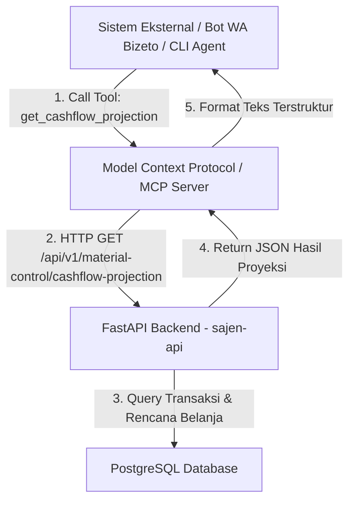

# Dokumentasi Teknis: Pola Perhitungan Proyeksi Arus Kas (Cashflow Projection)
Dokumen ini menjelaskan pola perhitungan, rumus, dan metode proyeksi arus kas 30 hari ke depan untuk platform POS Blonjo & Sajen.

---

## 1. Arsitektur & Interoperabilitas (REST API vs MCP)

Secara arsitektural, modul proyeksi kas menggunakan **Pendekatan Hybrid**:

*   **Pusat Logika (FastAPI Backend)**: Logika kalkulasi diletakkan di `sajen-api` (file [material_control.py](file:///Users/user/kerjaan/jualan/sajen/app/services/material_control.py)) untuk menjamin performa query database riil yang optimal dan isolasi data multi-tenant yang aman.
*   **Akses Eksternal**:
    *   **REST API**: `/api/v1/material-control/cashflow-projection` (HTTP GET dengan otentikasi JWT).
    *   **MCP Server (Samkarsa)**: Diekspos sebagai tool `get_cashflow_projection` sehingga dapat dipanggil secara langsung oleh AI Agent, WhatsApp asisten, atau skrip eksternal.

---

## 2. Pola Perhitungan Arus Kas Masuk (Predictive Cash Inflow)

Arus kas masuk tidak lagi menggunakan nilai statis atau data tiruan (*mock*), melainkan dihitung berdasarkan **perilaku transaksi riil** dengan tiga lapis analisis:

### A. Pembobotan Tren Temporal (AI-Inspired Recency Weighting)
Sistem memisahkan riwayat transaksi penjualan (`sales`) 90 hari terakhir menjadi dua kluster waktu untuk menangkap perubahan tren bisnis:
1.  **Kluster Utama (30 hari terakhir)**: Menangkap performa bisnis terkini. Rata-rata harian diberi bobot **60%** ($w_1 = 0.60$).
2.  **Kluster Baseline (60 hari sebelumnya)**: Menangkap pola musiman jangka panjang. Rata-rata harian diberi bobot **40%** ($w_2 = 0.40$).

$$\text{Baseline Sales} = (\text{Rata-rata } 30\text{ Hari Terakhir} \times 0.60) + (\text{Rata-rata } 60\text{ Hari Sebelumnya} \times 0.40)$$

*Jika salah satu kluster kosong, sistem otomatis melakukan fallback menggunakan data kluster yang tersedia. Jika tidak ada riwayat penjualan sama sekali, digunakan default aman sebesar Rp 500.000,00 per hari.*

### B. Faktor Multiplier Harian (Day-of-Week Seasonal Multiplier)
Untuk memetakan frekuensi dan kepadatan penjualan pada hari-hari tertentu (misalnya toko cenderung ramai di hari Sabtu/Minggu), sistem menghitung rata-rata penjualan berdasarkan hari spesifik (Senin s.d. Minggu) selama 90 hari ke belakang:

1.  Hitung rata-rata penjualan untuk masing-masing hari:
    $$\bar{S}_{\text{hari}} = \frac{\sum \text{Penjualan hari tersebut}}{\text{Jumlah hari tersebut dengan transaksi}}$$
2.  Normalisasikan terhadap rata-rata mingguan keseluruhan untuk mendapatkan nilai pengali (*multiplier*):
    $$\text{Multiplier}_{\text{hari}} = \frac{\bar{S}_{\text{hari}}}{\text{Rata-rata Mingguan Overall}}$$

Saat memproyeksikan hari target di masa depan, sistem mendeteksi hari dari tanggal tersebut dan mengalikan baseline dengan multiplier hari yang bersangkutan:
$$\text{Inflow Projected} = \text{Baseline Sales} \times \text{Multiplier}_{\text{hari}}$$

---

## 3. Pola Perhitungan Arus Kas Keluar (Projected Outflow)

Arus kas keluar diproyeksikan menggunakan dua mode operasional yang ditentukan oleh status `maintenance_stock` pada entitas tenant:

### A. Mode Kuantitas Stok (`maintenance_stock = True`)
Digunakan jika toko melakukan pencatatan kuantitas stok fisik secara aktif di dalam sistem:
1.  **Pengurangan Stok Terprediksi**: Saldo stok simulasi untuk setiap produk dikurangi setiap hari sebesar $\text{Velocity}_{\text{harian}}$ (diambil dari rata-rata kuantitas penjualan historis 90 hari terakhir).
2.  **Pemicu Pembelian (Reorder Point)**: Jika stok simulasi menyentuh atau berada di bawah `reorder_point`, sistem memproyeksikan restok belanja otomatis pada hari tersebut.
3.  **Nominal Pengeluaran**: 
    $$\text{Outflow} = (\text{max\_stock} - \text{stok simulasi saat reorder}) \times \text{harga beli terakhir}$$
4.  **Dampak Simulasi**: Stok simulasi kembali di-reset ke tingkat `max_stock`.

### B. Mode Frekuensi Transaksi (`maintenance_stock = False`)
Digunakan jika toko tidak mencatat kuantitas barang secara detail (hanya pencatatan keuangan). Proyeksi dibangun dari **pola transaksi pembelian historis** dengan pendekatan tiga lapis:

**B1 — Analisis Interval per Supplier**
Sistem menghitung rata-rata selang hari ($\Delta t$) antar transaksi pembelian ke masing-masing supplier dari riwayat 90 hari terakhir. Proyeksi belanja dijadwalkan periodik setiap kelipatan $\Delta t$ dihitung dari tanggal pembelian terakhir.

$$\Delta t_{\text{supplier}} = \frac{\sum (\text{tanggal}_{i+1} - \text{tanggal}_{i})}{\text{jumlah interval}}$$

**B2 — Analisis Keranjang Belanja (Co-Purchase Basket)**
Melacak item/kelompok barang yang biasa dibeli dari masing-masing supplier dalam satu sesi belanja. Nominal proyeksi adalah rata-rata historis total belanja per kunjungan ke supplier tersebut.

**B3 — Deteksi Multi-Supplier Co-Purchase**
AI menganalisis apakah ada **beberapa supplier yang secara konsisten dikunjungi pada hari yang sama atau dalam selang waktu sangat pendek** (≤ 1 hari). Jika terdeteksi pola kelompok supplier tersebut:
- Mereka dikategorikan sebagai satu **"Klaster Belanja"** (misal: Klaster Pasar Pagi = Supplier A + Supplier B + Supplier C).
- Interval proyeksi dihitung berdasarkan siklus kelompok, bukan masing-masing supplier secara terpisah.
- Pada hari proyeksi klaster, total outflow adalah gabungan rata-rata nominal belanja semua supplier dalam klaster tersebut.

> **Contoh**: Selama 90 hari, setiap hari Senin & Kamis selalu ada pembelian ke Supplier Beras (Pak Hasan), Supplier Minyak (Ibu Sari), dan Supplier Gula (Toko Makmur) dalam 1 hari yang sama → sistem mendeteksi klaster ini dan memproyeksikan pengeluaran gabungan ketiga supplier setiap Senin dan Kamis ke depannya.

### C. Jatuh Tempo Pembayaran (Payment Due Date Outflow)
Berlaku untuk **Mode A maupun Mode B** — sistem selalu membaca tagihan yang belum dibayar (hutang dagang / hutang jangka pendek) dari akun kewajiban (`liabilities`) di jurnal akuntansi. Jika terdapat transaksi pembelian kredit yang memiliki tanggal jatuh tempo (`due_date`) dalam rentang 30 hari ke depan, nominalnya dijadwalkan sebagai arus kas keluar pada tanggal tersebut.

*   **Sumber data**: Transaksi bertipe `purchase` / `payable` dengan status belum lunas dan `due_date` terdefinisi.
*   **Label outflow**: `"Jatuh Tempo: [nama supplier] - [nomor transaksi]"`.
*   **Prioritas**: Outflow jatuh tempo bersifat **komitmen keras** (*hard commitment*) — nilainya pasti dan ditampilkan terpisah dari proyeksi restok otomatis.

### D. Rencana Belanja Manual (Purchase Plan - planned_date)
Pengguna dapat membuat rencana pengeluaran belanja manual secara tertulis (baik dengan narasi AI maupun input manual) dan menentukan tanggal rencana eksekusi belanja (`planned_date`) secara spesifik:
*   **Pemilihan Tanggal Lokal**: Tanggal direncanakan menggunakan input kalender tanggal lokal (format `YYYY-MM-DD` timezone browser pengguna) untuk menghindari ketidaksesuaian akibat konversi offset timezone UTC server.
*   **Siklus Status, Dampak Cashflow, dan Penghapusan**:
    - **Status DRAFT**: Rencana belanja yang baru disimpan masuk sebagai DRAFT. Nilai total anggaran draf rencana belanja ini otomatis dijadwalkan sebagai proyeksi arus kas keluar (Outflow) pada hari `planned_date` tersebut. Draf rencana belanja ini **dapat dihapus (Delete)** oleh pengguna jika dibatalkan, yang mana akan menghapus data tersebut dari database dan mengeluarkan nilainya dari daftar proyeksi cashflow.
    - **Status APPROVED**: Setelah disetujui (Approved) oleh administrator, rencana belanja diproses menjadi transaksi pembelian riil, memicu notifikasi PO ke supplier, dan memposting jurnal akuntansi double-entry penyesuaian kas. Nilainya berpindah dari proyeksi outflow menjadi outflow aktual pada hari tersebut. Rencana yang sudah disetujui tidak dapat dihapus secara langsung untuk menjaga integritas jurnal akuntansi.

---

*Semua proyeksi pengeluaran otomatis (Mode A, B, dan C) digabungkan dengan proposal rencana belanja manual (`PurchasePlan` draft) yang telah dibuat oleh pengguna pada hari yang sama.*

---

## 4. Pola Pembulatan Finansial (Rounding Rule)

Untuk memudahkan analisis tingkat tinggi dan mencegah angka pecahan desimal yang mengganggu pembacaan:
*   Setiap nominal yang dihitung (saldo awal, kas masuk, rencana belanja keluar, dan saldo akhir) dibulatkan ke **ratusan rupiah terdekat** menggunakan pembulatan matematika standar:

$$\text{Nilai Bulat} = \text{round}\left(\frac{\text{Nilai Asli}}{100}\right) \times 100$$

*   Seluruh pecahan desimal (koma) dihilangkan.

---

## 5. Tracker Akurasi AI (Forecasting Accuracy Evaluation)

Untuk mengukur seberapa akurat prediksi yang dihasilkan oleh kecerdasan buatan, sistem dilengkapi dengan **Accuracy Tracking Engine**:

### A. Mekanisme Penyimpanan Snapshot
1. Setiap kali endpoint `/cashflow-projection` dipanggil, sistem secara otomatis mengambil snapshot proyeksi 30 hari ke depan dan menyimpannya di tabel database `cashflow_projection_snapshots`.
2. Jika proyeksi di-generate ulang pada hari yang sama, data proyeksi (`projected_inflow`, `projected_outflow`, `projected_net`) akan di-update (*upsert*), namun data aktual yang sudah terisi di hari-hari sebelumnya tetap dipertahankan.

### B. Pengisian Aktual Real-Time & Lazy (General Ledger Tracking)
Saat pengguna mengakses menu **Monitor Akurasi** (endpoint GET `/cashflow-projection/accuracy`):
1. Sistem menarik seluruh snapshot dari data masa lalu hingga hari ini (`target_date` <= `today`).
2. Data aktual arus kas dihitung secara mutlak melalui **mutasi riil Buku Besar (`JournalEntry`)** pada akun **Kas & Bank** (kode `1-1000` s.d `1-1102`):
   - **Aktual Arus Masuk (Inflow)**: Total akumulasi mutasi **DEBIT** pada akun Kas & Bank untuk transaksi berstatus `POSTED`. Ini mencakup semua bentuk cash masuk (penjualan, modal, piutang masuk, pendapatan lain, dsb).
   - **Aktual Arus Keluar (Outflow)**: Total akumulasi mutasi **KREDIT** pada akun Kas & Bank untuk transaksi berstatus `POSTED`. Ini mencakup semua bentuk cash keluar (pembelian supplier, biaya operasional, bayar hutang, beban lain, dsb).
3. Nilai aktual ini langsung disimpan kembali ke dalam snapshot (`actual_inflow`, `actual_outflow`, `actual_net`) untuk menjaga visualisasi tetap ter-update secara real-time.

### C. Rumus Perhitungan Akurasi
Akurasi dihitung secara persentase (%) untuk masing-masing arus masuk dan keluar menggunakan deviasi absolut terhadap nilai proyeksi:

$$\text{Akurasi (\%)} = \max\left(0.0,\ 100.0 - \left| \frac{\text{Aktual} - \text{Proyeksi}}{\text{Proyeksi}} \right| \times 100\right)$$

*Jika nilai proyeksi bernilai 0 dan aktual juga 0, akurasi dinilai 100%. Jika proyeksi 0 tetapi aktual ada, akurasi dinilai 0%.*

### D. Pemisahan Logika Visual (Dashboard) vs Logika Teoritis (Snapshot)
Sistem memisahkan jalur kalkulasi untuk menjaga validitas data akurasi sekaligus menyajikan dashboard real-time yang logis bagi pengguna:

1.  **Jalur Proyeksi Teoritis (Database Snapshot)**:
    *   Sistem menghitung arus kas masuk (AI) dan keluar (ROP/Supplier/due dates) secara **murni berbasis teori/prediksi** tanpa mencampuradukkan data transaksi riil hari ini.
    *   Hasil estimasi teoritis murni inilah yang disimpan ke database `cashflow_projection_snapshots` untuk melacak akurasi perkiraan AI.

2.  **Jalur Visual (Dashboard Frontend)**:
    *   Khusus untuk hari pertama (`day 0` / hari ini), proyeksi inflow diganti dengan **seluruh cash masuk riil hari ini (mutasi Debit Kas & Bank)** (`actual_inflow_today`), dan outflow diganti dengan **seluruh cash keluar riil hari ini (mutasi Kredit Kas & Bank)** (`actual_outflow_today`) + rencana draft + jatuh tempo hari ini.
    *   Saldo awal hari ini (`starting_cash`) dikunci konsisten dari saldo akhir kemarin menggunakan rumus:
        $$\text{Starting Cash Today} = \text{Kas Detik Ini} - \text{Inflow Aktual Hari Ini} + \text{Outflow Aktual Hari Ini}$$
        Hal ini mencegah saldo awal melompat naik-turun jika pengguna menginput data transaksi baru di hari yang sama.
    *   Untuk hari ke-1 s.d. 29 ke depan, proyeksi AI dilanjutkan secara kumulatif dari saldo akhir kas riil hari ini.

---

## 6. Cara Melakukan Pengujian & Pemanggilan API

### A. Endpoint Proyeksi Kas (REST API)
*   **URL**: `GET http://<vps-ip>:8005/api/v1/material-control/cashflow-projection`
*   **Header**: `Authorization: Bearer <token_jwt>`

### B. Endpoint Akurasi Proyeksi (REST API)
*   **URL**: `GET http://<vps-ip>:8005/api/v1/material-control/cashflow-projection/accuracy?days=30`
*   **Header**: `Authorization: Bearer <token_jwt>`

### C. Integrasi MCP Tool
Apabila diakses dari asisten AI luar (seperti Bizeto WhatsApp):
*   **Tool Name**: `get_cashflow_projection`
*   **Parameters**: *None* (mendeteksi tenant secara otomatis berdasarkan konteks auth user yang terhubung).

