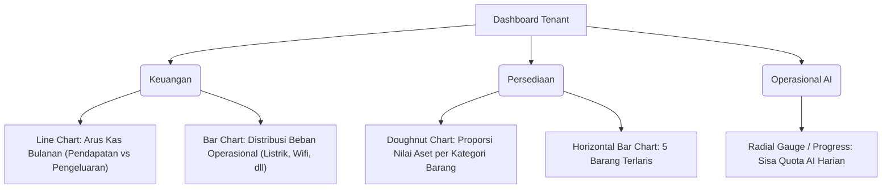

# Rancangan Pembaruan Dashboard Statistik Tenant (Blonjo & Sajen)

Dashboard ini dirancang khusus dari sudut pandang **Pemilik Bisnis (Tenant)** untuk mengelola operasional harian toko, arus kas, persediaan barang, serta memantau efisiensi penggunaan kuota AI OCR secara terpusat.

---

## 1. Arsitektur Data & Metrik Utama (KPI)

Berdasarkan fitur dan skema database yang ada di codebase (`accounting`, `inventory`, `ocr`, `log`), berikut adalah metrik utama yang akan dikelompokkan ke dalam 3 fokus area:

| Area Fokus | Metrik Utama | Deskripsi | Sumber Data Database |
| :--- | :--- | :--- | :--- |
| **Keuangan & Arus Kas** | 1. **Pendapatan Bersih** | Total Omzet Penjualan dikurangi Beban Operasional | `transactions.total_amount` (`sales` vs `expense`/`operational`) |
| | 2. **Saldo Kas & Bank** | Posisi kas fisik dan saldo rekening bank saat ini | `journal_entries` terikat ke Akun COA header `1-1101` (Kas) & `1-1102` (Bank) |
| | 3. **Hutang Jatuh Tempo** | Tagihan supplier yang mendekati tanggal jatuh tempo | `transactions` bertipe `purchase` yang memiliki `due_date` dan status `draft` |
| **Persediaan (Inventory)**| 4. **Nilai Aset Persediaan**| Total nilai rupiah stok barang dagang yang ada di gudang | Akumulasi `inventory_logs` (stok sisa) dikalikan harga beli terakhir |
| | 5. **Barang Terlaris (Top 5)** | Lima barang dengan volume penjualan tertinggi | `inventory_logs` bertipe `out` yang terhubung ke `product` |
| | 6. **Alert Stok Menipis** | Daftar barang yang jumlah stoknya di bawah batas minimal | `inventory_logs` (akumulasi kuantitas masuk - keluar) |
| **Efisiensi AI** | 7. **Sisa Quota AI Harian** | Jumlah token/panggilan AI OCR yang tersisa hari ini | `ai_model_quotas` (mengukur model Gemini Flash/Vision) |
| | 8. **Akurasi OCR & Manual** | Rasio tugas OCR yang berhasil tanpa koreksi manual | `ocr_tasks.status` (`completed` vs `corrected`) |

---

## 2. Rencana Visualisasi & Grafik (Chart.js)

Guna memaksimalkan estetika premium dan keterbacaan data, berikut grafik yang akan diimplementasikan:



### Detail Spesifikasi Grafik:
1. **Arus Kas Bulanan (Line Chart - Smooth Curved, Gridless Y-Axis)**
   - **X-Axis**: 12 bulan terakhir atau 30 hari terakhir.
   - **Y-Axis**: Nominal Rupiah.
   - **Dataset 1**: Tren Penjualan (Warna Hijau Gradien Emerald, Fill transparan).
   - **Dataset 2**: Tren Pengeluaran & Pembelian (Warna Merah Rose, Border-only).
2. **Kategori Beban Terbesar (Doughnut Chart - Sleek Donut)**
   - Memetakan pengeluaran operasional berdasarkan akun COA beban (beban gaji, BBM, listrik, dll).
   - Warna bertema *neon pastel* dengan legend di sebelah kanan.
3. **Persediaan & Penjualan (Horizontal Bar Chart)**
   - Menampilkan 5 produk teratas yang paling cepat berputar (*fast-moving items*).
   - Menggunakan warna gradasi dari `primary` ungu ke violet.

---

## 3. Desain Antarmuka (Wireframe & Layout Bento Grid)

Dashboard akan menggunakan tata letak **Bento Grid** responsif dengan estetika gelap/kaca (*glassmorphism*) yang menyatu dengan UI Blonjo saat ini.

```
+----------------------------------------------------------------------------------+
|  [Header] Halo, Tenant! | Ringkasan Toko Anda Hari Ini        [Pilih Range Tanggal]  |
+----------------------------------------------------------------------------------+
| [ Bento Card 1: Finansial ]       | [ Bento Card 2: Persediaan ] | [ Bento 3: AI ]   |
| Kas & Bank: Rp 12.450.000         | Total Produk: 120 SKU        | Kuota: 85% Aman   |
| Omzet (Bulan Ini): Rp 45.000.000  | Stok Menipis: 4 Barang       | Sukses OCR: 98%   |
+----------------------------------------------------------------------------------+
| [ Grafik Utama: Arus Kas ]                                | [ Alert Tagihan ]     |
|                                                           | Jatuh tempo besok:    |
| (Line Chart Tren Pendapatan vs Pengeluaran 30 Hari)       | - CV. Hidup Jaya      |
|                                                           |   Rp 1.117.000 (H-1)  |
+----------------------------------------------------------------------------------+
| [ Kiri: Barang Terlaris ]         | [ Kanan: Komposisi Beban ]                   |
| 1. TAP ROSE 500GR (45 Box)        | Doughnut Chart akun pengeluaran operasional  |
| 2. GULA TK (32 Pcs)               | (Listrik, BBM, Konsumsi, dll)                |
+----------------------------------------------------------------------------------+
```

---

## 4. Rencana Implementasi Teknis (Plan of Action)

### Fase 1: Pengembangan API Backend (`sajen-api`)
1. Memperluas `/dashboard/summary` di `sajen/app/api/v1/accounting.py` atau memecahnya ke `/dashboard/inventory` dan `/dashboard/financials` agar data tidak membebani satu kali pemanggilan.
2. Membuat query agregasi PostgreSQL menggunakan SQLAlchemy:
   - Agregasi pengeluaran per kategori COA beban.
   - Agregasi kuantitas barang keluar dari `inventory_logs` (top products).
   - Hitung nilai aset persediaan (`sum(quantity * price_per_unit)`).

### Fase 2: Implementasi Frontend UI (`blonjo-ui`)
1. Membuat komponen visual donat dan bar menggunakan `react-chartjs-2`.
2. Menyusun layout bento grid baru di `blonjo/src/pages/Dashboard.tsx` dengan menggunakan Tailwind CSS modern (grid system).
3. Menambahkan *progress bar* interaktif untuk kuota harian AI.

---

> [!IMPORTANT]
> **Keputusan Arsitektur yang Dibutuhkan:**
> 1. Apakah kita ingin menampilkan nilai HPP (Harga Pokok Penjualan) secara langsung di dashboard utama, atau cukup laba kotor (*Revenue* vs *Direct Expenses*) saja?
> 2. Apakah *Alert Stok Menipis* harus memiliki batas minimal (*threshold*) global (misal: `< 10` untuk semua barang), atau kita perlu menambahkan field `min_stock` di tabel database `Product` terlebih dahulu?
