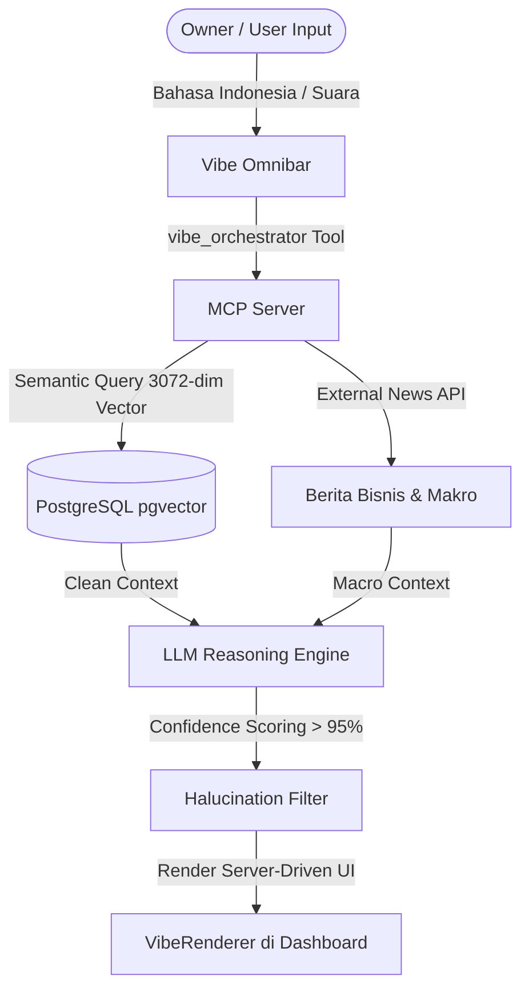

# Analisis & Rancangan Data Insight Terpadu: Vibe Orchestrator, Stock Control, & Dashboard Analytics

## 1. Analisis Sistem Kontrol Stok Terintegrasi (Stock Control Rules)
Dalam arsitektur *Material Control* dan database `TenantInventory`, parameter yang paling krusial untuk menjamin presisi data dan menghindari keputusan salah arah adalah flag `maintenance_stock` pada table `tenants` (yang direpresentasikan dengan properti `is_maintenance_stock=true` di sisi aplikasi).

### Perbandingan Karakteristik Logika Kontrol Stok

| Aturan / Flag | `maintenance_stock = TRUE` (Controlled) | `maintenance_stock = FALSE` (Uncontrolled / POS-only) |
| :--- | :--- | :--- |
| **Metode Pencatatan** | Stok dikelola secara aktif dengan parameter *material control* (`static_stock`, `safety_stock`, `reorder_point`, `max_stock`). | Stok diabaikan secara operasional, transaksi POS langsung lolos tanpa validasi *out-of-stock* keras. |
| **Pemicu Auto-Replenishment** | Apabila stok riil berjalan turun di bawah `reorder_point`, sistem secara otomatis memicu generator proposal belanja (`PurchasePlan`) dengan status `DRAFT`. | Tidak ada pemicu otomatis berdasarkan kuantitas fisik. Pembelian dilakukan secara ad-hoc atau manual. |
| **Valuasi HPP / COGS** | Menggunakan metode **Moving Average Cost** yang terupdate dari `inventory_logs` (tipe `in` dari pembelian / penyesuaian). | Menggunakan taksiran statis atau harga beli terakhir yang tertera tanpa kalkulasi dinamis. |
| **Akurasi Proyeksi** | Tinggi (di atas 95%) karena data keluar-masuk barang tercatat dengan detail di `inventory_logs`. | Rendah (karena fluktuasi stok tidak terdata secara tertib, hanya mengandalkan estimasi AI murni). |

### Rekomendasi Audit & Implementasi:
Untuk menjaga tingkat konfidensi data di atas 95%, sistem Vibe Search / Vibe Orchestrator **wajib** melakukan pengecekan flag `maintenance_stock` dari tenant aktif sebelum menyajikan data inventaris/stok. Jika `maintenance_stock = false`, sistem harus memberikan alert peringatan:
> **[WARNING]** Data stok untuk produk ini tidak dikontrol secara aktif oleh sistem (maintenance_stock = false). Angka stok yang ditampilkan mungkin tidak merepresentasikan kondisi riil di lapangan.

---

## 2. Struktur Data Insight & Analisis Margin
Untuk menyajikan data analitik yang mendalam kepada owner, model data insight ini merangkum 3 dimensi utama: **History Daily In/Out**, **Tambahan Modal (Capital Inflow)**, dan **Estimasi Margin (Profitability)**.

### A. Formula & Perhitungan Keuangan
1. **Gross Profit (Laba Kotor)**:
   $$\text{Gross Profit} = \text{Actual Inflow (Sales)} - \text{COGS (HPP)}$$
   *COGS dihitung secara real-time dari `inventory_logs` bernilai log_type `out` dikalikan dengan `moving_average_cost` pada `TenantInventory` saat transaksi tercatat.*

2. **Gross Profit Margin (%)**:
   $$\text{Margin \%} = \left( \frac{\text{Gross Profit}}{\text{Actual Inflow}} \right) \times 100$$

3. **Capital Injection (Tambahan Modal)**:
   Transaksi yang didebet ke Kas/Bank tetapi dikreditkan ke Akun Modal Owner (CoA kelas `3-XXXX` Ekuitas), bukan dari Pendapatan Penjualan (CoA kelas `4-XXXX` Pendapatan). Ini harus dipisahkan agar tidak merusak perhitungan margin operasional.

---

## 3. Desain Dashboard Analytics & Vibe Search (NotebookLM-like Precision)
Sistem **Vibe Search** didesain menggunakan arsitektur **RAG (Retrieval-Augmented Generation)** terintegrasi dengan **MCP Server (mcp.samkarsa.com)** dan database PostgreSQL `pgvector`.



### Komponen Dashboard Analytics untuk Owner:
1. **Bento Card 1: Posisi Kas & Likuiditas (Inflow vs Outflow)**
   - Grafik Line Chart: Aktual kas masuk vs keluar harian + proyeksi kas 7 hari ke depan.
   - Deteksi otomatis penambahan modal (Capital Injection).
2. **Bento Card 2: Laba & Margin Estimasi**
   - Nilai penjualan bersih, estimasi COGS, dan persentase gross margin.
   - Dilengkapi alert jika margin turun di bawah 15% (menggunakan `TenantPricingRule` jika ada discount).
3. **Bento Card 3: Status Stok & Auto-Replenishment**
   - List produk dengan stok di bawah `reorder_point` (khusus produk dengan `maintenance_stock = true`).
   - Tombol cepat untuk menyetujui `PurchasePlan` yang di-generate otomatis oleh AI.
4. **Bento Card 4: Executive Business Intelligence & External Insights**
   - Menampilkan ringkasan berita eksternal dari industri retail/grosir (misal: fluktuasi harga komoditas) yang dicari via search-web secara real-time.
   - **Usulan Peningkatan**: AI memberikan rekomendasi harga jual berdasarkan berita makro dan margin terkini.

---

## 3. Fitur Utama: "Business Compass" (Navigasi Bisnis Tenant)

Fitur ini diganti namanya menjadi **"Business Compass"** sebagai instrumen navigasi bisnis yang komprehensif bagi Tenant. Fitur ini tidak berdiri sebagai satu halaman tunggal, melainkan terbagi menjadi **4 Sub-Menu Utama**:

1.  **Dashboard Compass (Main Hub)**:
    *   Ringkasan visual kesehatan keuangan dan operasional harian tenant (bento grid).
    *   Menampilkan integrasi Vibe Search/Omnibar di bagian atas untuk interaksi natural cepat.
2.  **Cashflow Navigator**:
    *   Tabel runut proyeksi kas harian dari H-4 hingga H+30.
    *   Visualisasi akurasi proyeksi historis (subscript %) dan deteksi penambahan modal (Capital In).
3.  **Smart Stock Advisor**:
    *   Membaca parameter kontrol stok berdasarkan input pencarian di Vibe Search.
    *   **Aturan Stok & Harga**:
        *   Jika produk memiliki `maintenance_stock = True`, sistem menampilkan **Sisa Stok Fisik** dan **Harga Jual Terkontrol**.
        *   Jika produk memiliki `maintenance_stock = False`, sistem hanya menampilkan **Harga Jual** saja (stok diabaikan / tidak dikontrol).
4.  **Market Intelligence (External Insight)**:
    *   Rekomendasi penyesuaian harga jual berdasarkan tren makro eksternal (menggunakan `search-web` real-time).
    *   Confidence score (> 95%) untuk validasi sebelum tenant mengambil keputusan perubahan harga.

---

## 4. Rancangan Visual UI/UX "Business Compass"

Desain menggunakan tema **Glassmorphism modern** (semi-transparan dengan border pendar neon tipis) untuk menjamin estetika premium.

### A. Wireframe Layout Menu & Sub-Menu
```
+-----------------------------------------------------------------------------------------------+
|  [Sidebar Navigation]              [Business Compass] > [Smart Stock Advisor]                  |
|  - Dashboard Compass               -----------------------------------------                  |
|  - Cashflow Navigator              [Vibe Omnibar] Cari produk... ("Indomie Goreng")           |
|  - Smart Stock Advisor             -----------------------------------------                  |
|  - Market Intelligence             [HASIL PENCARIAN VIBE]                                     |
|                                    +-------------------------------------------------------+  |
|                                    | INDOMIE GORENG KELAPA (SKU-00892)                     |  |
|                                    | Status Kontrol: AKTIF (maintenance_stock = True)      |  |
|                                    | -> Stok Gudang: 142 Pcs                               |  |
|                                    | -> Harga Terkontrol: Rp 3.100 (HPP MA: Rp 2.450)       |  |
|                                    +-------------------------------------------------------+  |
|                                    | MINYAK GORENG CURAH (SKU-00912)                       |  |
|                                    | Status Kontrol: NON-AKTIF (maintenance_stock = False)  |  |
|                                    | -> Harga Jual: Rp 14.500                              |  |
|                                    +-------------------------------------------------------+  |
+-----------------------------------------------------------------------------------------------+
```

### B. Micro-interactions & State (Aesthetic Spells)
*   **Vibe Search Dynamic Cards**: Kartu hasil pencarian Vibe Omnibar berubah secara real-time. Jika input user mendeteksi barang non-kontrol, kolom kuantitas stok akan disembunyikan secara visual dengan transisi transparan (*fade-out*), menyisakan tag harga saja.
*   **Confidence Badge**: Di pojok kanan atas kartu insight prediksi terdapat indikator berpendar hijau emerald `Confidence: 98.2%` sebagai jaminan anti-halusinasi data.

---

## 5. Template Bahan Kreatif Pemasaran untuk Produk Tenant

Bahan kreatif pemasaran ini dirancang khusus untuk **membantu tenant mempromosikan barang dagangan mereka sendiri** ke pelanggan akhir (bukan untuk mempromosikan software Blonjo):

### Template 1: Copywriting Promo Produk Sosmed (Instagram/Facebook)
*   **Input Vibe**: Tenant ingin menjual stok produk yang sedang melimpah (misal: Susu Steril).
*   **Template**:
    > 🥛 **PROMO SPESIAL HARI INI: IMUNITAS TERJAGA, DOMPET AMAN!** 🥛
    > 
    > Dapatkan **[Nama Produk Tenant]** segar hari ini dengan harga terbaik hanya **[Harga Jual Terkontrol]**! Cocok banget buat stok kebutuhan keluarga di rumah agar tetap fit setiap hari.
    > 
    > 📍 Kunjungi toko kami sekarang di **[Alamat Tenant]** atau hubungi WA kami di **[Nomor WA Tenant]** untuk layanan pesan antar instan. Stok terbatas!

### Template 2: Naskah Broadcast WhatsApp Pelanggan (FMCG Grosir)
*   **Input Vibe**: Tenant grosir ingin broadcast promo harga minyak goreng curah murah ke jaringan warung retail langganannya.
*   **Template**:
    > *Halo Mitra Setia [Nama Toko Tenant]!* 👋
    > 
    > Info update harga bahan pokok hari ini dari gudang kami:
    > - **[Nama Produk 1]**: Cuma **[Harga Jual 1]**
    > - **[Nama Produk 2]**: Cuma **[Harga Jual 2]**
    > 
    > Amankan pasokan warung Anda sebelum harga pasar naik lagi. Kami siap kirim langsung ke lokasi Anda hari ini gratis ongkir untuk pemesanan minimal 5 karton.
    > 
    > Chat kami sekarang untuk Keep Stok ya! 📞

### Template 3: Ide Konten & Visual Gambar Pemasaran (Promosi Produk Toko)
*   **Konsep**: Banner promosi diskon musiman untuk toko fisik/online tenant.
*   **Rancangan Visual**:
    *   **Latar Belakang**: Kombinasi warna cerah segar (kuning jeruk/hijau daun) yang merangsang daya beli pelanggan.
    *   **Komposisi**: Foto produk utama di bagian tengah, dilengkapi label harga besar yang kontras (*bold red*) bertuliskan *"Rp [Harga Jual]"*, serta teks benefit instan untuk pembeli (misal: *"Hemat Rp 2.000!"*).
    *   **Penerapan di Dashboard**: AI di menu *Market Intelligence* secara otomatis men-generate teks copywriting promosi ini berdasarkan harga jual terkini di database agar tenant bisa langsung *copy-paste* ke media sosial mereka.
