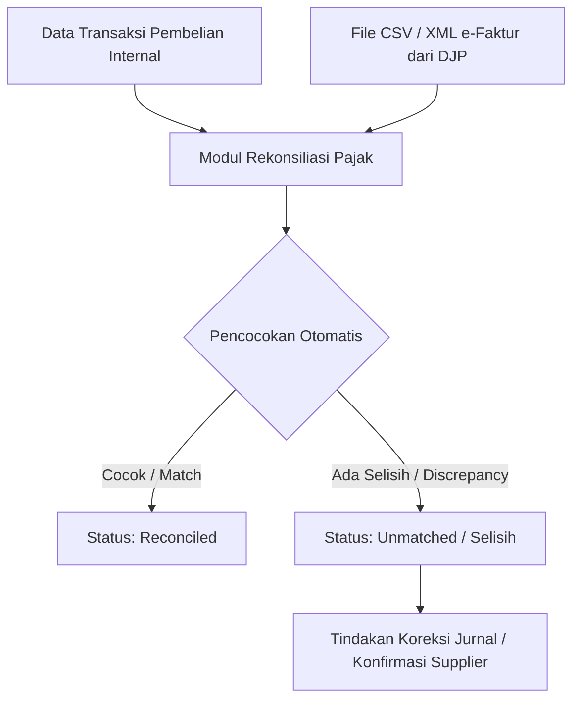

# Rancangan Fitur: Rekonsiliasi e-Faktur, Pelaporan SPT PPN 1111 & Modul Tampilan Auditor (Auditor View)

Dokumen ini merancang modul **Rekonsiliasi Pajak & Kepatuhan Audit (Compliance)** untuk tenant PKP (Pengusaha Kena Pajak) maupun Non-PKP guna mempermudah pencocokan data transaksi dengan Direktorat Jenderal Pajak (DJP / Coretax System) serta menyediakan penelusuran (audit trail) 1-to-1 bagi auditor keuangan.

---

## 1. Alur Kerja (Workflow) Rekonsiliasi e-Faktur

Mekanisme rekonsiliasi didesain dengan membandingkan data pembelian/penjualan internal dengan data **Faktur Pajak (.csv / XML)** yang diunduh dari Portal DJP (atau e-Faktur web/desktop client).



### Kriteria Pencocokan Otomatis (Auto-Matching Rules)
Pencocokan dilakukan menggunakan kunci utama:
1. **Nomor Seri Faktur Pajak (NSFP)**: Harus tertera di kolom referensi/keterangan transaksi.
2. **Nilai PPN / DPP (Dasar Pengenaan Pajak)**: Deviasi toleransi pembulatan maksimal Rp 100.
3. **NPWP/NIK Supplier**: Identitas supplier di database master harus cocok dengan penerbit faktur pajak.

---

## 2. Fitur Utama Halaman Rekonsiliasi Pajak (Frontend)

Halaman ini diletakkan di bawah menu **Master Data / Laporan Keuangan**.

### A. Dashboard Ringkasan PPN
*   **Total PPN Keluaran**: Akumulasi pajak dari transaksi penjualan (`SALES`).
*   **Total PPN Masukan**: Akumulasi pajak dari transaksi pembelian (`PURCHASE`).
*   **Kompensasi Kelebihan Bulan Lalu**: Nilai lebih bayar dari SPT Masa PPN masa pajak sebelumnya.
*   **Status Estimasi**: Menampilkan estimasi `Kurang Bayar` (wajib disetor ke negara) atau `Lebih Bayar` (bisa dikompensasi/restitusi) untuk bulan berjalan.

### B. Upload e-Faktur DJP
*   Kontainer *drag-and-drop* file untuk mengunggah CSV e-Faktur Masukan/Keluaran dari portal DJP.
*   Sistem mem-parsing baris faktur pajak ke dalam tabel memori sementara untuk dibandingkan dengan buku besar PPN Masukan/Keluaran.

### C. Tabel Pencocokan & Status Selisih
Tabel interaktif dengan status:
*   🟢 **Matched**: Transaksi internal dan e-Faktur DJP cocok 100%.
*   🟡 **Pending DJP**: Transaksi pembelian ada di sistem internal, tetapi faktur pajak belum terbit di portal e-Faktur (DJP). *Indikasi supplier belum melaporkan faktur pajak.*
*   🔴 **Unrecorded**: Faktur pajak ada di DJP, tetapi belum tercatat di sistem akuntansi internal. *Indikasi ada pembelian barang/jasa yang belum di-input ke jurnal.*

---

## 3. Ekspor Data e-Faktur untuk SPT Masa PPN 1111

Untuk memudahkan pelaporan pajak di akhir bulan, sistem menyediakan tombol **Ekspor CSV format e-Faktur DJP** yang siap di-import langsung ke aplikasi e-Faktur DJP (desktop/web):

1.  **Format Pembelian (Lawan Transaksi - FM)**:
    Menghasilkan file CSV dengan kolom sesuai skema DJP (Kode Transaksi, FG Pengganti, Nomor Faktur, Masa Pajak, Tahun Pajak, NPWP Lawan Transaksi, DPP, PPN, dll).
2.  **Format Penjualan (Faktur Pajak Keluaran - FK)**:
    Untuk transaksi penjualan ritel/grosir kepada PKP lain yang membutuhkan Faktur Pajak terpisah.

---

## 4. Modul Tampilan Auditor (Auditor View & Audit Trail 1-to-1)

Untuk menjamin kepatuhan audit laporan keuangan (SPAP / ISAE 3402), detail transaksi pembelian/penjualan dilengkapi dengan **Tampilan Audit (Auditor View)**. 

Modul ini menyandingkan data **Dokumen Sumber (Nota Fisik)** dengan **Pencatatan Akuntansi Persediaan (HPP)** secara transparan untuk mencegah kerancuan nilai.

### Ilustrasi Antarmuka Detail Transaksi (Auditor View)

```
┌────────────────────────────────────────────────────────────────────────┐
│ DETAIL TRANSAKSI #TX-20260706-001                                      │
├────────────────────────────────────┬───────────────────────────────────┤
│ [TAB 1: TAMPILAN USER]             │ [TAB 2: TAMPILAN AUDIT (ACTIVE)]  │
├────────────────────────────────────┴───────────────────────────────────┤
│                                                                        │
│  SISI A: BUKTI FISIK (NOTA ASLI)      SISI B: PENCATATAN SISTEM (HPP)  │
│  ───────────────────────────────      ───────────────────────────────  │
│  1. ABC Mungbean : 10 x Rp 1.544      1. HPP Masuk ABC Mungbean:       │
│     Total: Rp 15.440                     10 x Rp 1.690 = Rp 16.900     │
│  2. ABC Terasi   : 6  x Rp 6.427      2. HPP Masuk ABC Terasi:         │
│     Total: Rp 38.562                     6  x Rp 7.002 = Rp 42.010     │
│  ───────────────────────────────      ───────────────────────────────  │
│  DPP (Base)      : Rp 54.002          Total Persediaan : Rp 58.910     │
│  PPN (11% Global): Rp  4.908          Jurnal Debet     : Rp 58.910     │
│  TOTAL BAYAR     : Rp 58.910          Jurnal Kredit    : Rp 58.910     │
│                                                                        │
│  ────────────────────────────────────────────────────────────────────  │
│  ℹ️ FORMULA REKONSILIASI AUDIT TRAIL:                                 │
│     HPP = Harga Nota + Proporsi PPN (Rasio Pengali: 1,0908855)         │
│     Pembulatan: Round Up ke Puluhan Terdekat (Selisih Rp 110           │
│     dialokasikan ke item terakhir 'ABC Terasi' agar total pas).        │
│                                                                        │
└────────────────────────────────────────────────────────────────────────┘
```

### Kunci Keamanan Audit (Traceability Key):
1.  **Akurasi Faktur**: Auditor melihat data di Sisi A **100% identik** dengan lembaran nota fisik (Rp 1.544). Tidak ada selisih dokumen yang memicu temuan audit.
2.  **Validitas Valuasi**: Auditor melihat Sisi B **100% konsisten** dengan Buku Besar Keuangan (Persediaan Rp 58.910) dan Kartu Stok Persediaan (HPP Rp 1.690 / Rp 7.002).
3.  **Transparansi Alokasi**: Sistem menyajikan rumus konversi (faktor pengali rasio dan aturan pembulatan puluhan terdekat) secara logis sehingga tidak ada "angka gaib" (magic numbers).

---

## 5. Keuntungan Bisnis & Kepatuhan Audit (Compliance)
*   **100% Lolos Audit Keuangan**: Mempermudah auditor independen (KAP) memverifikasi nilai persediaan tanpa meragukan validitas nota pembelian fisik.
*   **Kepatuhan Coretax DJP**: Memastikan seluruh pelaporan PPN bulanan (SPT Masa PPN 1111) terintegrasi rapi dengan sistem e-Faktur nasional.
*   **Efisiensi Arus Kas (Cashflow)**: Membantu memburu supplier yang lambat menerbitkan faktur pajak masukan agar PPN Masukan bisa dikreditkan secara maksimal.
*   **Menghemat Waktu Administrasi**: Rekonsiliasi e-Faktur dan audit penyusutan stok yang biasa memakan waktu berhari-hari dapat diselesaikan dalam hitungan menit secara otomatis.
