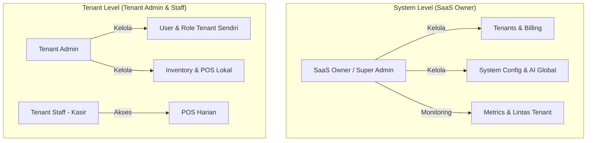
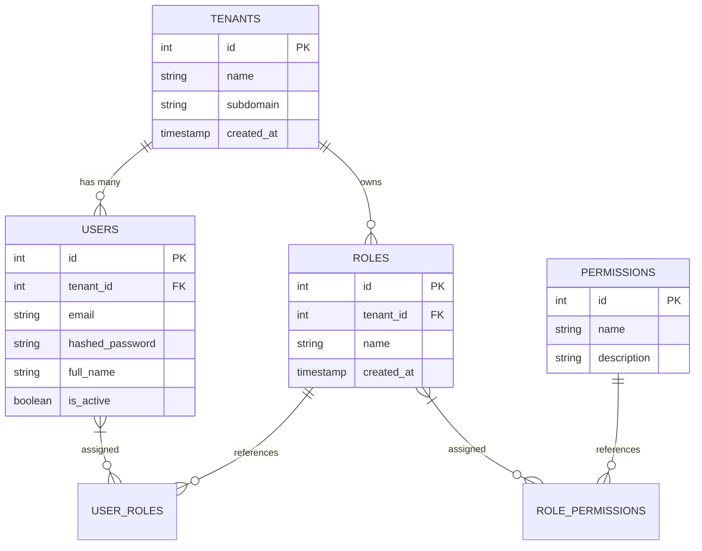
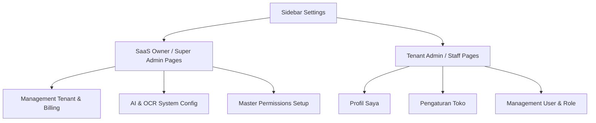

# Rancangan Arsitektur: Menu Settings & Sistem Multi-Tenant Dynamic RBAC (Blonjo & Sajen)

Dokumen ini menyajikan analisis mendalam dan rancangan teknis tingkat tinggi (high-level design) yang diperbarui untuk mendukung **Menu Settings**, **Sistem RBAC Dinamis Multi-Tenant**, serta peran khusus **SaaS Owner (System Super Admin)** untuk mengelola seluruh platform secara global.

---

## 1. Analisis Arsitektur Multi-Tenant: Implementasi Subdomain

Untuk memisahkan akses antar penyewa (tenant) secara elegan, platform ini mengadopsi pendekatan arsitektur **Subdomain** (misal: `kopisenja.blonjo.com`).

### A. Perbandingan Arsitektur: Subdomain vs Subpath

| Aspek Analisis | Arsitektur Subdomain (`tenant.blonjo.com`) | Arsitektur Subpath (`blonjo.com/tenant`) |
| :--- | :--- | :--- |
| **Branding & UX** | **Sangat Premium & Profesional**. Tenant memiliki identitas URL mandiri yang elegan. | Kurang profesional, terasa menumpang pada platform induk. |
| **Isolasi Cookie & Sesi** | **Sangat Aman**. Cookie login dan session storage diisolasi ketat per subdomain untuk mencegah kebocoran login silang. | **Rentan**. Cookie dibagikan pada domain yang sama kecuali dikonfigurasi sangat rumit. |
| **Kebijakan CORS** | Sangat mudah menerapkan aturan CORS dan Content Security Policy (CSP) khusus per tenant. | Sulit memisahkan aturan CORS jika ada integrasi eksternal (payment gateway/logistik) per tenant. |
| **Skalabilitas** | Sangat mudah membagi beban (routing) ke server berbeda untuk tenant berskala besar di masa mendatang. | Sulit dilakukan karena semua traffic masuk lewat jalur URL path yang sama. |

### B. Tantangan & Solusi Infrastruktur
1. **Wildcard DNS**: Wajib mengaktifkan record `*.blonjo.com` di DNS manager agar pendaftaran tenant baru dapat langsung aktif secara instan.
2. **Wildcard SSL**: Menggunakan Let's Encrypt Wildcard SSL Certificate agar komunikasi data ke seluruh subdomain otomatis terenkripsi HTTPS secara gratis dan aman.
3. **Dynamic CORS**: Middleware backend FastAPI (`sajen`) dikonfigurasi dengan pencocokan regex origin dinamis untuk mendukung sub-domain baru secara otomatis.

### C. Strategi Pengujian Lokal (Local Development) & Terowongan Bijexa (`bijexa.samkarsa.com`)
Untuk memfasilitasi pengujian multi-tenant langsung dari internet tanpa perlu deployment ke server production, kita menggunakan **Bijexa Tunnel**:
- **Skenario Wildcard Tunnel**: Jika Bijexa Tunnel mendukung wildcard DNS (`*.bijexa.samkarsa.com`), kita memetakan domain dinamis langsung ke port frontend lokal (`localhost:7500`) dan backend API (`localhost:8005`).
- **Skenario Local Host Mapping**: Jika tunnel bersifat single-domain, simulasi subdomain dilakukan secara lokal menggunakan pemetaan berkas `/etc/hosts` (misal: `127.0.0.1 kopisenja.blonjo.local`), sementara Bijexa Tunnel digunakan khusus untuk mengekspos endpoint API backend keluar.

---

## 2. Arsitektur Otorisasi Dua Tingkat (System-Level vs Tenant-Level)

Untuk mengamankan platform SaaS Blonjo & Sajen, kita membagi sistem otorisasi menjadi dua tingkatan utama:



### A. System-Level (SaaS Owner / Super Admin)
- **Definisi**: Akun internal milik Anda (owner SaaS) yang mengontrol jalannya seluruh sistem aplikasi.
- **Karakteristik**: Kolom `tenant_id` bernilai `NULL` (atau terikat ke tenant ID khusus sistem, misalnya `tenant_id = 1` sebagai "SaaS Operator") dan memiliki flag `is_superuser = True` di tabel `users`.
- **Hak Akses**:
  - **Manajemen Tenant**: Membuat tenant baru, membekukan tenant (jika belum bayar tagihan/langganan), melihat kuota pemakaian OCR per tenant.
  - **Manajemen AI & OCR Global**: Mengubah host URL Ollama global, mengatur model LLM dasar yang digunakan oleh seluruh tenant.
  - **Master Permissions**: Membuat atau memperbarui daftar *Permissions* sistem yang nantinya dapat dipilih oleh Admin masing-masing tenant.
  - **Global Monitoring**: Melihat audit log keamanan lintas tenant and memonitor antrean tugas asinkron (Celery/Redis).

### B. Tenant-Level (Tenant Admin & Staff)
- **Definisi**: Pengguna dari perusahaan/toko klien yang mendaftar di SaaS Anda.
- **Karakteristik**: Kolom `tenant_id` **wajib memiliki nilai valid** yang mewakili perusahaan mereka. Flag `is_superuser` bernilai `False`.
- **Hak Akses**: Terisolasi ketat di dalam lingkup `tenant_id` mereka sendiri. Mereka sama sekali tidak dapat melihat, mengubah, atau meretas data milik tenant lain (*Tenant Data Isolation*).
- **Tenant Admin** dapat membuat kustom Role (misal: "Supervisor POS") untuk tenant-nya sendiri menggunakan sekumpulan permissions sistem yang telah disediakan oleh SaaS Owner.

### Diagram Entity Relationship (ERD) Multi-Tenant Dynamic RBAC



---

## 3. Struktur Sidebar & Peta Halaman Pengaturan (Sitemap UI)

Sidebar akan secara dinamis menyembunyikan atau menampilkan menu berdasarkan jenis akun pengguna (SaaS Owner vs Tenant Admin/Staff).



### Penjelasan Halaman Khusus SaaS Owner

1. **Management Tenant (`/admin/tenants`)**
   - **Tujuan**: Dashboard konsol utama untuk owner SaaS.
   - **Fitur**: Daftar semua tenant terdaftar, status berlangganan (Aktif/Nonaktif), tanggal jatuh tempo, statistik jumlah transaksi, dan batas penggunaan kuota OCR bulanan.
   
2. **AI & OCR System Config (`/admin/ai-ocr`)**
   - **Tujuan**: Konfigurasi mesin AI Ollama secara global di tingkat server.
   - **Fitur**: Mengatur alamat IP server Ollama, memilih model default (misal: `qwen2.5:3b`), dan melakukan pengujian koneksi jaringan model AI secara terpusat.

3. **Management User (`/settings/users`)**
   - **Tujuan**: *Dynamic RBAC Configuration* dan Manajemen Akun.
   - **Bagi SaaS Owner**: Bisa melihat daftar user lintas tenant untuk keperluan *debugging* atau bantuan teknis.
   - **Bagi Tenant Admin**: Mengelola user lokal dan membuat kustom Role untuk tenant mereka sendiri.

---

## 4. Skema Basis Data yang Diperbarui (System Super Admin Support)

Berikut adalah modifikasi tabel basis data PostgreSQL untuk mendukung peran **SaaS Owner** dengan kolom `is_superuser`.

```sql
-- 1. Tabel Tenant / Perusahaan
CREATE TABLE tenants (
    id SERIAL PRIMARY KEY,
    name VARCHAR(100) NOT NULL,
    subdomain VARCHAR(50) UNIQUE,
    status VARCHAR(20) DEFAULT 'active', -- 'active', 'suspended', 'trial'
    ocr_quota_monthly INTEGER DEFAULT 1000, -- Batas pemrosesan struk per bulan
    created_at TIMESTAMP DEFAULT CURRENT_TIMESTAMP
);

-- 2. Modifikasi Tabel User untuk Super Admin dan Tenant Relation
CREATE TABLE users (
    id SERIAL PRIMARY KEY,
    tenant_id INTEGER REFERENCES tenants(id) ON DELETE RESTRICT, -- NULL jika System Super Admin (SaaS Owner)
    email VARCHAR(100) UNIQUE NOT NULL,
    hashed_password VARCHAR(255) NOT NULL,
    full_name VARCHAR(100) NOT NULL,
    is_active BOOLEAN DEFAULT TRUE,
    is_superuser BOOLEAN DEFAULT FALSE, -- TRUE untuk SaaS Owner (System-level access)
    preferred_language VARCHAR(2) DEFAULT 'ID',
    created_at TIMESTAMP DEFAULT CURRENT_TIMESTAMP
);

-- 3. Tabel Master Permission (Dibuat oleh SaaS Owner)
CREATE TABLE permissions (
    id SERIAL PRIMARY KEY,
    name VARCHAR(100) UNIQUE NOT NULL, -- e.g., 'create:product', 'view:financial_report'
    description VARCHAR(255) NOT NULL,
    is_system_only BOOLEAN DEFAULT FALSE -- TRUE jika permission ini hanya boleh dipegang oleh SaaS Owner
);
```

---

## 5. Implementasi Backend: REST API & Proteksi SaaS Owner (FastAPI)

Di bagian backend FastAPI (`sajen`), kita menerapkan proteksi bertingkat menggunakan Dependency Injection.

### A. Mendefinisikan Pengecekan SaaS Owner (`sajen/app/api/deps.py`)

```python
from fastapi import Depends, HTTPException, status
from sqlalchemy.orm import Session
from app.api.deps import get_db, get_current_active_user
from app.models.user import User

# 1. Pengecekan SaaS Owner (System Super Admin)
def require_saas_owner(
    current_user: User = Depends(get_current_active_user)
) -> User:
    if not current_user.is_superuser:
        raise HTTPException(
            status_code=status.HTTP_403_FORBIDDEN,
            detail="Akses Ditolak! Endpoint ini khusus untuk Owner SaaS (System Administrator)."
        )
    return current_user

# 2. Pengecekan Tenant Admin / Izin Dinamis (dengan proteksi cross-tenant query)
class PermissionChecker:
    def __init__(self, required_permission: str):
        self.required_permission = required_permission

    def __call__(
        self, 
        current_user: User = Depends(get_current_active_user),
        db: Session = Depends(get_db)
    ) -> User:
        # SaaS Owner otomatis memiliki semua akses (bypass check)
        if current_user.is_superuser:
            return current_user

        # Kueri pencarian izin dinamis dalam tenant_id yang sama
        has_permission = db.query(User).filter(
            User.id == current_user.id,
            User.tenant_id == current_user.tenant_id
        ).join(User.roles).join(Role.permissions).filter(
            Permission.name == self.required_permission
        ).first()

        if not has_permission:
            raise HTTPException(
                status_code=status.HTTP_403_FORBIDDEN,
                detail=f"Anda tidak memiliki izin '{self.required_permission}' di tenant ini!"
            )
        return current_user
```

### B. Endpoint Khusus SaaS Owner untuk Mengontrol Tenant (`sajen/app/api/v1/admin.py`)

```python
from fastapi import APIRouter, Depends, HTTPException
from sqlalchemy.orm import Session
from app.api.deps import get_db, require_saas_owner
from app.models.user import User
from app.models.tenant import Tenant
from app.schemas.tenant import TenantCreate, TenantResponse

router = APIRouter()

# Menambah Tenant baru secara global (Hanya bisa dilakukan oleh SaaS Owner)
@router.post("/tenants", response_model=TenantResponse)
def register_new_tenant(
    payload: TenantCreate,
    db: Session = Depends(get_db),
    current_user: User = Depends(require_saas_owner)
):
    # Logika pendaftaran tenant baru oleh SaaS Owner
    new_tenant = Tenant(
        name=payload.name,
        subdomain=payload.subdomain,
        ocr_quota_monthly=payload.ocr_quota_monthly
    )
    db.add(new_tenant)
    db.commit()
    db.refresh(new_tenant)
    return new_tenant

# Membekukan/Menghentikan Layanan Tenant
@router.put("/tenants/{tenant_id}/suspend")
def suspend_tenant(
    tenant_id: int,
    db: Session = Depends(get_db),
    current_user: User = Depends(require_saas_owner)
):
    tenant = db.query(Tenant).filter(Tenant.id == tenant_id).first()
    if not tenant:
        raise HTTPException(status_code=404, detail="Tenant tidak ditemukan!")
    tenant.status = "suspended"
    db.commit()
    return {"message": f"Tenant {tenant.name} berhasil dibekukan sementara."}
```

---

## 6. Implementasi Frontend: Antarmuka Khusus SaaS Owner (Bun / Vite)

Di frontend `blonjo-ui`, jika pengguna memiliki payload token JWT dengan klaim `is_superuser: true`, sistem navigasi akan memunculkan menu khusus **"SaaS Admin Panel"** pada sidebar yang berisi kendali global.

### A. Logika Render Menu Global
```typescript
// Saringan menu di blonjo/src/components/Sidebar.tsx
const sidebarMenu = [
  // 1. Menu Khusus SaaS Owner (Hanya muncul jika is_superuser = true)
  {
    title: "SaaS Admin Panel",
    path: "/admin",
    icon: "shield",
    requiresSuperuser: true,
    submenu: [
      { title: "Manage Tenants", path: "/admin/tenants", icon: "briefcase" },
      { title: "Global AI Config", path: "/admin/ai-ocr", icon: "cpu" },
      { title: "Global Metrics", path: "/admin/metrics", icon: "activity" }
    ]
  },
  // 2. Menu Tenant-Level (Muncul untuk Admin/Staff Tenant)
  {
    title: "POS Kasir",
    path: "/pos",
    icon: "shopping-cart",
    requiresSuperuser: false
  },
  {
    title: "Management User",
    path: "/settings/users",
    icon: "users",
    requiresSuperuser: false,
    requiredPermission: "manage:users"
  }
];
```

---

## 7. Model Keamanan Lintas Tenant (Cross-Tenant Query Prevention)

Untuk menjamin bahwa data tidak akan bocor ke tenant lain, kita menerapkan prinsip **Row-Level Security (RLS) Simulation** di tingkat pemrograman backend. Setiap kueri pencarian data (misalnya data inventaris atau akuntansi) dari pengguna non-superuser **wajib** menyertakan filter `tenant_id`.

```python
# Contoh kueri aman untuk mendapatkan daftar produk milik tenant bersangkutan
def get_products_by_tenant(db: Session, current_user: User):
    # Selalu paksa filter tenant_id dari user yang sedang login!
    return db.query(Product).filter(Product.tenant_id == current_user.tenant_id).all()
```
Dengan skema ini, celah keamanan IDOR (Insecure Direct Object Reference) berhasil dicegah secara penuh di tingkat database logis.
