# Arsitektur Hybrid OCR: Integrasi Sajen Worker & MCP Server

Dokumen ini menjelaskan arsitektur pemrosesan dokumen (OCR) pada ekosistem Bizeto/Samkarsa, yang menggunakan pendekatan **Hybrid Delegation** antara *backend* Sajen dan MCP Server.

## 1. Alur Kerja Pemrosesan Dokumen (Workflow)

Saat pengguna mengunggah gambar struk atau faktur dari *frontend* (Blonjo), alur kerjanya adalah sebagai berikut:

1. **Upload & Task Creation (API Sajen)**
   *Endpoint* API di Sajen (`app/api/v1/ocr.py`) menerima *file* gambar dan membuat `OCRTask` di *database*. Agar tidak memblokir antarmuka pengguna, tugas ini didelegasikan ke *background worker* (Celery).
2. **Tahap 1: Ekstraksi Teks Mentah / Vision (MCP Server)**
   * Sajen Worker (`ocr_worker.py`) memeriksa apakah `MCP_ENABLED` aktif. Jika ya, Sajen bertindak sebagai orkestrator dan meminta tolong ke **MCP Server** via protokol *REST Bridge*.
   * Tugas MCP Server **HANYA SATU**: bertindak sebagai "Mata". Menggunakan LLM Multimodal/Vision (seperti Gemini Flash atau Llava lokal), MCP mengekstrak seluruh teks mentah secara detail tanpa menyimpulkan apapun (*No abstraction*).
   * MCP Server mengembalikan *Raw Text* kembali ke Sajen Worker.
3. **Tahap 2: Strukturisasi & RAG (Sajen Worker)**
   * Sajen Worker menerima teks mentah tersebut.
   * Worker memanggil layanan RAG (Retrieval-Augmented Generation) untuk mencari *Golden Templates* (riwayat koreksi nota milik *tenant* tersebut).
   * Berbekal teks mentah dan konteks RAG, Sajen Worker memanggil LLM berbasis Teks (seperti `qwen2.5-coder` dengan *temperature* 0.0) untuk menata teks mentah menjadi **JSON Akuntansi Terstruktur** yang presisi.
4. **Tahap 3: Penyimpanan Data**
   Sajen Worker menyimpan JSON akhir ke dalam *database* dan memperbarui status tugas menjadi `COMPLETED`.

## 2. Keunggulan Arsitektur (*Strengths*)

Pemisahan tugas (*Decoupling*) ini merupakan *best practice* dengan keuntungan:

* **Optimalisasi Sumber Daya (Cost & Compute Efficiency)**
  Model *Vision* sangat memakan komputasi dan kuota. Dengan memusatkannya di MCP Server, kita bisa menerapkan sistem *Auto-Fallback* (Gemini -> Ollama Llava) di satu tempat. Sementara itu, *backend* Sajen menggunakan model teks yang ringan, cepat, dan spesifik untuk pengodean JSON.
* **Injeksi Konteks Bisnis (RAG / Few-Shot Learning)**
  Jika MCP yang merakit JSON, MCP tidak akan tahu referensi atau "gaya akuntansi" tiap pengguna (*tenant*). Dengan mendelegasikan perakitan JSON kembali ke Sajen, RAG dapat menyisipkan riwayat transaksi pengguna ke dalam *prompt*, sehingga akurasi format data jauh lebih tinggi.
* **Separation of Concerns (SoC)**
  MCP Server murni sebagai "Mata". Sajen Worker murni sebagai "Otak Akuntansi". Jika di masa depan *engine* OCR di MCP diganti (misalnya ke AWS Textract), logika bisnis pembukuan di Sajen tidak perlu dirombak sama sekali.

## 3. Strategi Mitigasi (Trade-offs)

* **Beban Jaringan:** Mengirim gambar Base64 via HTTP Bridge bisa terkena limit. (Telah dimitigasi dengan memperbesar limit muatan Express.js di MCP Server hingga 50MB).
* **Halusinasi Prompt Vision:** LLM Vision terkadang menyimpulkan data terlalu jauh jika disuruh membuat JSON. (Telah dimitigasi dengan mengubah *prompt* MCP Server menjadi *"Ekstrak seluruh teks dari nota ini secara mentah"*).
* **Ketergantungan Kuota Eksternal:** API Gemini memiliki limit harian. (Telah dimitigasi dengan sistem rotasi model di `aiProviderService.ts` dan *fallback* ke Ollama lokal).

---

## 4. Diagram Alur Lengkap (End-to-End)

> Alur dari pengguna upload foto nota sampai transaksi masuk ke database.

```mermaid
flowchart TD
    A([👤 User Upload Foto Nota]) --> B

    subgraph BROWSER["🌐 Browser — Blonjo Frontend"]
        B[Pre-flight ping HuggingFace\nmax 5 detik] -->|✅ Bisa dijangkau| C
        B -->|❌ Timeout / Gagal| H

        C[Load model ONNX TrOCR\ndari IndexedDB cache] --> D
        D[OCR Lokal\nmax 20 detik] --> E{Skor > 60%\n& teks > 15 char?}

        E -->|✅ Ya| F[🖥️ Badge: LOKAL\nKirim TEKS ke backend\nuntuk parsing]
        E -->|❌ Tidak| G[Skor rendah\natau timeout]

        G --> H[Upload FILE GAMBAR\nke AI Vision Server]
    end

    F --> P
    H --> I

    subgraph SAJEN_API["⚙️ Sajen Backend — FastAPI"]
        I[POST /ocr/upload\nSimpan file, buat OCRTask\ndi database] --> J[Kirim task_id\nke Celery Queue]
        J --> K[Polling /ocr/tasks/id\nsetiap 2 detik dari browser]
    end

    subgraph WORKER["🔧 Celery Worker — ocr_worker.py"]
        J --> L

        subgraph READ["Tahap 1 — Baca Gambar"]
            L{MCP enabled?} -->|Ya| L1[MCP OCR Server\nGemini Vision via Bridge]
            L -->|Tidak, ada API Key| L2[Gemini Vision API\nbaca teks mentah]
            L -->|Tidak, offline| L3[Tesseract lokal\nfallback]
        end

        L1 & L2 & L3 --> M[Sanitize raw teks\nhapus kalimat AI babble]
        M --> N[Simpan raw_ocr_text\nke DB]

        subgraph STRUCT["Tahap 2 — Strukturisasi JSON"]
            N --> O[RAG: Ambil contoh transaksi\nmirip dari riwayat DB]
            O --> Q

            subgraph AI_PIPE["AI Pipeline — dengan Auto-Fallback"]
                Q{Ollama Lokal\nonline?} -->|Ya, timeout 15s| Q1[qwen2.5 / model lokal\ntemperature 0.0]
                Q -->|Offline / gagal| R

                Q1 -->|JSON valid ✅| S[Hasil JSON]
                Q1 -->|JSON invalid| R

                subgraph GEMINI["Gemini Iterative Fallback"]
                    R[gemini-2.5-flash\nresponse_mime_type: JSON] --> R1{Parse\nberhasil?}
                    R1 -->|✅| S
                    R1 -->|❌| R2[Self-Correction:\nKirim error kembali ke model]
                    R2 --> R3{Koreksi\nberhasil?}
                    R3 -->|✅| S
                    R3 -->|❌| R4[gemini-2.0-flash]
                    R4 --> R5{Parse?}
                    R5 -->|✅| S
                    R5 -->|❌| R6[gemini-2.0-flash-lite]
                    R6 --> R7{Parse?}
                    R7 -->|✅| S
                    R7 -->|❌| R8[gemini-2.5-pro]
                    R8 --> R9{Parse?}
                    R9 -->|✅| S
                    R9 -->|❌| ERR([❌ Semua model gagal\ntask.status = FAILED])
                end
            end
        end

        subgraph CLASSIFY["Tahap 3 — Deteksi Tipe Transaksi"]
            S --> T{Rule-based keywords\nfaktur / nota / belanja\nkulakan / invoice?}
            T -->|Match| U[🛒 purchase\n📦 sales\n💸 expense]
            T -->|Ambigu| V[LLM classify\ntemperature 0.2]
            V --> U
        end

        U --> W[Simpan extracted_data\ntask.status = COMPLETED\nke database]
    end

    subgraph RESULT["🌐 Browser — Kembali ke User"]
        K -->|Status COMPLETED| P[Susun teks dari\nextracted_data JSON]
        W -.->|polling detect| K
        P --> X[Isi Smart Note textarea]
        X --> Y[Smart Parser analisa\ntipe & items]
        Y --> Z[Tampilkan ParsePreview\ndengan badge sumber]
        Z --> AA{User review\n& konfirmasi}
        AA -->|✅ Simpan| AB([💾 Transaksi masuk DB\nJurnal otomatis dibuat])
        AA -->|✏️ Edit| Z
    end

    style BROWSER fill:#1e3a5f,stroke:#3b82f6,color:#e2e8f0
    style SAJEN_API fill:#1a3a2a,stroke:#22c55e,color:#e2e8f0
    style WORKER fill:#3a1a1a,stroke:#ef4444,color:#e2e8f0
    style RESULT fill:#1e3a5f,stroke:#3b82f6,color:#e2e8f0
    style AI_PIPE fill:#2d1b4e,stroke:#a855f7,color:#e2e8f0
    style GEMINI fill:#1a2d3a,stroke:#06b6d4,color:#e2e8f0
    style READ fill:#2a2a1a,stroke:#eab308,color:#e2e8f0
    style STRUCT fill:#1a2a2a,stroke:#10b981,color:#e2e8f0
    style CLASSIFY fill:#2a1a2a,stroke:#ec4899,color:#e2e8f0
```

### Legenda Badge UI

| Badge | Sumber | Kondisi |
|---|---|---|
| 🖥️ **Lokal** | ONNX TrOCR di browser | Skor OCR > 60%, teks > 15 karakter |
| 🤖 **AI** | Gemini Vision + LLM di server | Semua kasus fallback dari lokal |
| ✏️ **Corrected** | Gemini setelah self-correction | JSON gagal parse → diperbaiki model |

