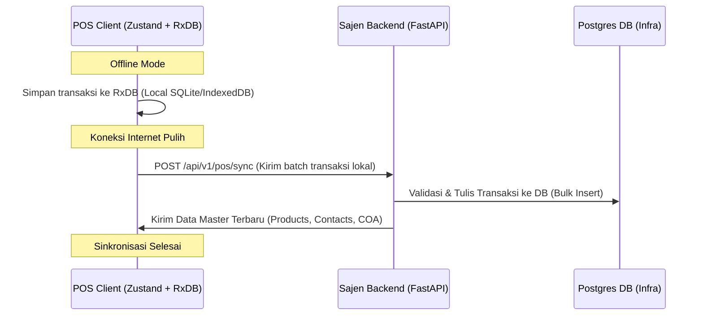

# Analisis Arsitektur & Rekomendasi Fitur: Material Control & Integrasi POS

Analisis ini menyajikan evaluasi mendalam terhadap dokumen rancangan [material_control_architecture.md](file:///Users/user/kerjaan/jualan/docs/material_control_architecture.md) dan [pos_architecture.md](file:///Users/user/kerjaan/jualan/docs/pos_architecture.md), diselaraskan dengan struktur kode riil di backend **SAJEN** (FastAPI) dan frontend **BLONJO** (React). 

---

## 1. Analisis Kebutuhan Riil & Tantangan di Lapangan

Untuk memastikan sistem dapat diadaptasi oleh berbagai tenant secara dinamis, arsitektur harus menjawab karakteristik operasional dari masing-masing vertikal bisnis:

### A. Vertikal F&B (Warung, Kafe, Restoran)
*   **Tantangan Riil**: Bahan baku basah (seperti susu, telur, daging) memiliki masa kedaluwarsa cepat. Pengurangan stok tidak terjadi per item penjualan secara langsung, melainkan melalui **resep / BOM (Bill of Materials)**.
*   **Rekomendasi Arsitektur**:
    *   **BOM (Recipe Linkage)**: POS harus mendukung pengurangan otomatis bahan baku saat menu terjual. Misal, penjualan *1 Cangkir Kopi Susu* mengurangi *15g Biji Kopi* dan *100ml Susu UHT* di tabel `inventory_logs`.
    *   **Waste/Spoilage Tracking**: Kerugian bahan baku yang basi wajib terintegrasi dengan jurnal penyesuaian PSAK UMKM (akun beban penyusutan/kerusakan persediaan).

### B. Vertikal Retail / Minimarket
*   **Tantangan Riil**: Volume SKU yang sangat tinggi (ribuan item). Kasir membutuhkan proses pemindaian barcode yang instan dan kalkulasi *Safety Stock* otomatis agar tidak terjadi *out-of-stock* pada barang fast-moving.
*   **Rekomendasi Arsitektur**:
    *   **Auto-ROP Matrix**: Otomatisasi kalkulasi *Reorder Point* tanpa membebani server (penjadwalan background job harian via Celery/APScheduler di backend).
    *   **Supplier Price Comparison Matrix**: Menghubungkan catalog supplier langsung dengan histori harga beli terakhir (*last purchase price*) dari masing-masing supplier.

### C. Vertikal Bengkel & Jasa Service
*   **Tantangan Riil**: Transaksi menggabungkan barang fisik (*sparepart*) dengan jasa (*non-stock item* seperti Jasa Pasang). Setiap pengerjaan servis membutuhkan pelacakan aset pelanggan (Nomor Polisi / Serial Number alat) dan pencatatan komisi untuk staf/mekanik yang mengerjakan.
*   **Rekomendasi Arsitektur**:
    *   **Staff Commission Engine**: Pembagian persentase atau nominal komisi per item jasa langsung dicatat saat finalisasi transaksi di POS dan diposting ke jurnal akuntansi sebagai Hutang Komisi Karyawan.
    *   **Warranty Tracker**: Validasi masa garansi berdasarkan aset pelanggan saat mereka melakukan klaim servis kembali.

---

## 2. Peta Keselarasan Arsitektur & Database

Berikut adalah tabel matriks penyelarasan skema database baru dengan tabel eksisting untuk mengisolasi data tenant secara ketat:

| Fitur Baru | Tabel Target Baru / Ekstensi | Hubungan dengan Tabel Eksisting | Kolom Isolasi Wajib |
| :--- | :--- | :--- | :--- |
| **Profil Tenant & ROP** | `tenant_inventory_extensions` | `tenant_inventories(id)` | `tenant_id` |
| **Rencana Belanja** | `purchase_plans` & `purchase_plan_items` | `products(id)`, `contacts(id)` | `tenant_id` |
| **Kerusakan Barang** | `stock_discards` | `products(id)` | `tenant_id` |
| **Aset Pelanggan** | `tenant_customer_assets` | `contacts(id)` (Customer) | `tenant_id` |
| **Komisi Staf** | `tenant_staff_commissions` | `contacts(id)` (Staff), `transaction_items` | `tenant_id` |

---

## 3. Strategi Integrasi POS Standalone (Offline-First)

Untuk mendukung POS berjalan stabil di area dengan internet buruk (Local-First), arsitektur integrasi dirancang menggunakan pola sinkronisasi dua arah (*Two-Way Sync*):

### Logika Resolusi Konflik:
1.  **Unique Code Generator**: Transaksi POS lokal menggunakan prefix ID unik berbasis timestamp + Client ID (misal: `TX-POS1-20260704-001`) untuk menghindari bentrokan kunci utama (*primary key collision*) saat sinkronisasi bulk ke Postgres.
2.  **HPP (Moving Average) Recalculation**: Saat transaksi pembelian tersinkronisasi, backend Sajen secara sekuensial menghitung ulang HPP barang bersangkutan di database pusat untuk menjaga akurasi laporan keuangan.

---

## 4. Desain API Modular (FastAPI - Sajen)

Berikut adalah contoh rancangan endpoint RESTful baru yang perlu ditambahkan di backend Sajen:

### A. Endpoint Rencana Belencana (Purchase Planning)
*   `GET /api/v1/material-control/recommendations`
    *   *Fungsi*: Menghasilkan rekomendasi rencana belanja otomatis berdasarkan setelan `maintenance_stock` dan tingkat ROP terkini.
*   `POST /api/v1/material-control/purchase-plans`
    *   *Fungsi*: Membuat draf Rencana Belanja baru (status: `DRAF`).
*   `POST /api/v1/material-control/purchase-plans/{id}/approve`
    *   *Fungsi*: Memfinalisasi rencana belanja, mengirimkan PO via WhatsApp (opsional), dan memosting draf jurnal akuntansi pembelian tempo.

### B. Endpoint Budgeting & Cash Flow
*   `GET /api/v1/material-control/cashflow-projection?days=30`
    *   *Fungsi*: Menghitung proyeksi saldo kas harian h-7 s/d h+21 terintegrasi dengan data penjualan historis dan hutang jatuh tempo.

### C. Endpoint Aset & Komisi (Bengkel Vertikal)
*   `GET /api/v1/pos/assets/{identifier}`
    *   *Fungsi*: Mencari riwayat servis alat/kendaraan berdasarkan Nomor Polisi atau Serial Number.
*   `POST /api/v1/pos/commissions/calculate`
    *   *Fungsi*: Menghitung akumulasi komisi staf/mekanik per periode tertentu.

---

## 5. Rencana Langkah Aksi Implementasi (Roadmap)

### 📌 Tahap 1: Migrasi Skema Database (Alembic)
*   Menjalankan migrasi database di PostgreSQL untuk membuat tabel ekstensi, rencana belanja, waste tracking, komisi mekanik, dan pelacakan aset pelanggan.

### 📌 Tahap 2: Implementasi Bisnis Logika di Backend (Sajen)
*   Membangun fungsi *Auto-Replenishment Engine* di `services/inventory.py`.
*   Membangun fungsi kalkulasi proyeksi arus kas di `services/accounting.py`.
*   Mengekspos endpoint API baru di folder `/api/v1/`.

### 📌 Tahap 3: Pembuatan UI Dashboard & Form di Frontend (Blonjo)
*   Membuat halaman Dashboard Material Control (`/material-control/dashboard`).
*   Membuat Form Editor Rencana Belanja beserta Matriks Komparasi Supplier (`/material-control/purchase-plan/new`).
*   Membuat Halaman Proyeksi Kas Harian (`/material-control/budgeting`).

### 📌 Tahap 4: Jembatan Koneksi POS Standalone
*   Membuat modul endpoint khusus `/api/v1/pos/sync` untuk menerima data kiriman offline dari aplikasi kasir standalone.
