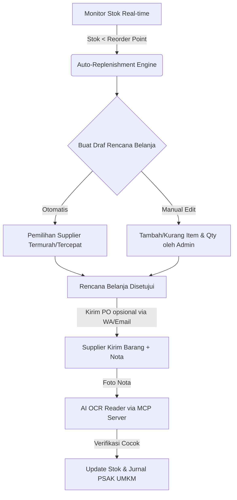

# Dokumen Arsitektur & Rancangan Fitur: Material Control (Blonjo & Sajen)

Dokumen ini menyajikan rancangan arsitektur dan analisis penyelarasan fitur **Material Control** & **Inventory** untuk ekosistem **BLONJO** (Frontend React) & **SAJEN** (Backend FastAPI). Rancangan ini disesuaikan dengan level aplikasi saat ini (Sovereign, Local-First, PSAK UMKM, AI-Powered) serta dirancang secara generik untuk mendukung berbagai jenis usaha (Retail, F&B, dan Bengkel Jasa Service/Sparepart) dengan isolasi data tenant yang sangat ketat.

Untuk rancangan sistem kasir mandiri, silakan lihat dokumen terpisah:
👉 **[Dokumen Arsitektur Standalone POS Modern](file:///Users/user/kerjaan/jualan/docs/pos_architecture.md)**

---

## 1. Penyelarasan (Alignment) Fitur Material Control dengan Ekosistem Blonjo & Sajen

Fitur Material Control tidak berdiri sendiri, melainkan terintegrasi erat dengan pilar-pilar utama aplikasi yang sudah ada:

| Fitur Blonjo/Sajen | Bentuk Integrasi & Penyelarasan dengan Material Control |
| :--- | :--- |
| **PSAK UMKM Accounting** | Pembelian material otomatis menghasilkan draf Jurnal Umum (Debit: Persediaan Bahan Baku/Barang Dagangan, Kredit: Kas/Utang Usaha). Metode penilaian persediaan menggunakan **Moving Average** sesuai standar PSAK & tabel `tenant_inventories`. |
| **AI OCR Receipt (MCP Server)** | Saat barang datang dari supplier beserta nota fisik, pengguna cukup memotret nota. SAJEN mengirim data ke external MCP Server di **`https://mcp.samkarsa.com`** untuk mengekstrak item, quantity, dan harga beli, lalu mencocokkannya dengan Rencana Belanja (Purchase Order) untuk mendeteksi selisih. |
| **pgvector Semantic Search** | Mempermudah pencarian item material saat pembuatan rencana belanja manual dan memetakan nama item di nota supplier (yang sering kali berbeda format) ke database material internal secara semantik via MCP Server. |
| **WhatsApp Assistant (Bizeto)** | Mengirimkan notifikasi ke owner/purchasing ketika stok berada di bawah *Reorder Point (ROP)*, atau menerima instruksi persetujuan rencana belanja langsung via chat WhatsApp. |

---

## 2. Karakteristik Jenis Usaha Pengguna Blonjo
Aplikasi Blonjo dirancang sebagai platform multi-tenant yang mendukung berbagai kategori jenis usaha secara generik:
1.  **F&B (Kafe/Restoran/Warung):** Mengelola bahan baku basah/kering dengan masa kedaluwarsa cepat.
2.  **Retail/Minimarket:** Mengelola barang jadi dengan variasi SKU yang tinggi dan pelacakan *Safety Stock*.
3.  **Bengkel Jasa Service & Sparepart:** Mengelola sparepart fisik (*Stock Item*) yang butuh pelacakan stok minimum, bahan habis pakai (*Consumables*) seperti cairan pembersih, dan jasa servis perbaikan (*Non-Stock Item*).

Sistem Material Control ini dirancang modular agar dapat mengakomodasi ketiga vertikal bisnis tersebut secara bersamaan.

---

## 3. Arsitektur Alur Fitur Material Control



---

## 4. Spesifikasi Rancangan Fitur Utama

### A. Auto-Replenishment Engine (Rencana Belanja Otomatis)
Sistem secara otomatis menghitung kapan dan berapa banyak barang yang harus dibeli berdasarkan setelan **Maintenance Stock** di menu *Store Profile* (Tenant Settings):

*   **Maintenance Stock = Checked (Aktif):** Perhitungan ROP dilakukan secara presisi menggunakan formula *Safety Stock* dan *Lead Time* untuk ketepatan stok yang tinggi:
    
    $$\text{Safety Stock} = (\text{Max Daily Sales} \times \text{Max Lead Time}) - (\text{Average Daily Sales} \times \text{Average Lead Time})$$
    
    $$\text{Reorder Point (ROP)} = (\text{Average Daily Sales} \times \text{Lead Time}) + \text{Safety Stock}$$

*   **Maintenance Stock = Unchecked (Default/Nonaktif):** Perhitungan ROP menggunakan estimasi berbasis data riwayat pembelian sebelumnya (*History-Based Estimation*). Rumus ROP menyederhanakan estimasi berdasarkan tren rata-rata frekuensi belanja dan kuantitas transaksi pembelian historis tanpa memperhitungkan variabel fluktuasi *Safety Stock*.

### B. Supplier Price Comparison Matrix
Saat draf belanja terbentuk, sistem menyajikan matriks perbandingan supplier untuk item-item tersebut:

| Item | Supplier A | Supplier B | Supplier C | Supplier Terpilih (Rekomendasi) |
| :--- | :--- | :--- | :--- | :--- |
| **Biji Kopi Arabika 1kg** | **Rp 120.000** *(Termurah)* | Rp 125.000 | Rp 130.000 | Supplier A (Hemat Rp 5.000/kg) |
| **Susu UHT 1L** | Rp 18.500 | **Rp 17.500** *(Termurah)* | Rp 19.000 | Supplier B (Hemat Rp 1.000/L) |

*   **Fitur Penyesuaian Manual:** Admin dapat melakukan *override* (mengganti supplier secara manual jika ada kendala pengiriman, serta menambah/mengurangi quantity dan item sebelum draf difinalisasi).
*   **Kirim PO Opsional (Setting-Driven):** Pengiriman PO digital via WhatsApp atau Email bersifat opsional. Secara default, fitur ini *unchecked* (tidak tercentang). Jika pengguna mencentang opsi tersebut secara manual sebelum finalisasi, barulah sistem mengeksekusi pengiriman dokumen PO ke supplier.

### C. Budgeting & Cash Flow Projection Engine
Modul ini menggabungkan pencatatan keuangan internal PSAK UMKM dengan rencana belanja material untuk memastikan kelayakan likuiditas (*liquidity feasibility*) sebelum pesanan dikirimkan ke supplier.

1.  **Saldo Kas Riil (Current Liquid Cash):** Sistem mengambil saldo kas aktual saat ini dari Chart of Accounts (COA) kas/bank aktif yang terhubung dalam sistem pembukuan PSAK UMKM Blonjo.
2.  **Proyeksi Pendapatan Harian (Daily Revenue Estimation):** AI pada MCP Server menganalisis riwayat transaksi penjualan harian (Daily Sales History) selama 3 bulan terakhir untuk memprediksi tren arus kas masuk harian selama 30 hari ke depan (mendeteksi pola musiman, hari ramai akhir pekan, dll.).
3.  **Proyeksi Pengeluaran Rencana Belanja (Scheduled Outflow):** Menggabungkan total biaya dari semua Rencana Belanja (Purchase Plans) aktif yang dijadwalkan dalam 30 hari ke depan.
4.  **Rumus Proyeksi Saldo Kas Harian ($CS_t$):**
    
    $$CS_t = CS_{t-1} + E_t - P_t$$
    
    Dimana:
    *   $CS_t$ = Estimasi Saldo Kas pada hari ke-$t$
    *   $CS_{t-1}$ = Saldo Kas pada hari sebelumnya
    *   $E_t$ = Estimasi Pendapatan Penjualan pada hari ke-$t$ (Hasil prediksi AI)
    *   $P_t$ = Rencana Belanja / Pengeluaran Terjadwal pada hari ke-$t$
5.  **Peringatan Dini Likuiditas (Liquidity Alert):** Jika pada proyeksi hari ke-$t$ nilai $CS_t$ berada di bawah batas aman saldo minimum (*Safety Cash Limit*), sistem akan menampilkan notifikasi peringatan: *"Kas tidak mencukupi untuk rencana belanja pada tanggal X. Estimasi kekurangan dana sebesar Y."*


## 5. Dashboard Material Control & Supplier Comparison UI

Layout halaman manajemen stok menggunakan kisi bento (*Bento Grid Layout*) dengan gaya visual modern. Seluruh pengaturan konfigurasi toko (seperti *Maintenance Stock* dan *Kirim PO Otomatis*) telah dipindahkan dari dashboard ini ke halaman **Store Profile (`/settings/store`)**.

```text
+------------------------------------------------------------------------------------+
|  [Kembali] Dashboard Material Control                                               |
+------------------------------------------------------------------------------------+
| [Bento 1: Status ROP (Bahan Baku Kritis & Alert Reorder Point)]                     |
| > Ada 3 Item yang berada di bawah ambang batas minimum.                            |
| > [Item: Susu UHT 1L] - Stok Saat Ini: 5L (ROP: 10L)                               |
| > [Item: Biji Kopi 1kg] - Stok Saat Ini: 2kg (ROP: 5kg)                            |
+------------------------------------------------------------------------------------+
| [Bento 2: Matriks Perbandingan Harga Supplier (Glassmorphism Card)]                 |
|                                                                                    |
| Produk: Biji Kopi Arabika 1kg                                                      |
| +--------------------------------------------------------------------------------+ |
| | Supplier      | Harga       | Lead Time | Term        | Aksi                   | |
| |---------------+-------------+-----------+-------------+------------------------| |
| | Supplier A    | Rp 120.000  | 2 Hari    | COD         | [Pilih (Rekomendasi)]  | |
| | Supplier B    | Rp 125.000  | 1 Hari    | Net 30      | [Pilih Manual]         | |
| +--------------------------------------------------------------------------------+ |
+------------------------------------------------------------------------------------+
```

#### Detail Estetika UI & Lokasi Pengaturan:
*   **Store Settings (Halaman Terpisah):** Checkbox untuk mengaktifkan **Maintenance Stock** (penentuan perhitungan ROP berdasarkan *Safety Stock* atau data historis) dan **Kirim PO Otomatis via WA/Email** dikonfigurasi melalui halaman **Store Profile (`../settings/store`)**.
*   **Supplier Highlight Card:** Baris supplier termurah otomatis diberikan warna latar belakang hijau mint transparan (*emerald glow*) dengan teks tebal untuk menarik fokus kasir/owner.

---

### B. Menu Rencana Belanja (Purchase Planning View)

Menu ini digunakan oleh pengelola toko untuk memantau semua rencana belanja yang diusulkan oleh sistem (Auto-Replenishment) serta membuat atau mengedit rencana belanja secara manual.

#### 1. Tampilan Daftar Rencana Belanja (Purchase Plan List View)
Tampilan ini menyajikan semua rencana belanja beserta statusnya. Pengguna dapat menjadwalkan kapan rencana belanja tersebut dieksekusi.

```text
+----------------------------------------------------------------------------------------------------+
|  Dashboard Material Control > Rencana Belanja                                       [+ Buat Baru]  |
+----------------------------------------------------------------------------------------------------+
| Cari: [ Cari rencana...  ] | Status: [ Semua v ] | Periode: [ Bulan Ini v ]                         |
+----------------------------------------------------------------------------------------------------+
| ID Rencana | Tgl Direncanakan | Estimasi Total | Supplier Terlibat  | Status      | Aksi           |
|------------+------------------+----------------+--------------------+-------------+----------------|
| PP-00104   | 05 Juli 2026     | Rp  2.340.000  | Supplier A, B      | DRAF        | [Edit] [Hapus] |
| PP-00103   | 02 Juli 2026     | Rp  1.850.000  | Supplier B         | APPROVED    | [Lihat PO]     |
| PP-00102   | 28 Juni 2026     | Rp  5.120.000  | Supplier A, C      | COMPLETED   | [Lihat Jurnal] |
+----------------------------------------------------------------------------------------------------+
```

#### 2. Form Pembuatan/Editor Rencana Belanja (Purchase Plan Detail & Editor View)
Di halaman ini, pengguna dapat melihat detail barang yang diusulkan sistem, mengubah tanggal pengiriman, mengganti supplier/harga beli, dan memodifikasi jumlah (qty):

```text
+----------------------------------------------------------------------------------------------------+
|  Rencana Belanja: PP-00104                                                         Status: [DRAF]  |
+----------------------------------------------------------------------------------------------------+
| Tanggal Rencana Belanja: [ 05 Juli 2026 ] (Kapan barang dipesan ke supplier)                       |
+----------------------------------------------------------------------------------------------------+
| DAFTAR ITEM BELANJA                                                                                |
|                                                                                                    |
| +------------------------------------------------------------------------------------------------+ |
| | No | Nama Barang  | Supplier Pilihan     | Qty       | Harga Beli   | Subtotal    | Aksi       | |
| |----+--------------+----------------------+-----------+--------------+-------------+------------| |
| | 1  | Biji Kopi    | [ Supplier A (IDR) v]| [ - 5 + ] | Rp  120.000  | Rp  600.000 | [Override] | |
| | 2  | Susu UHT 1L  | [ Supplier B (IDR) v]| [- 12 + ] | Rp   17.500  | Rp  210.000 | [Override] | |
| | 3  | Oli MPX2 1L  | [ Supplier A (IDR) v]| [ - 8 + ] | Rp   65.000  | Rp  520.000 | [Override] | |
| +------------------------------------------------------------------------------------------------+ |
|                                                                     [+ Tambah Item Manual]         |
+----------------------------------------------------------------------------------------------------+
| RINGKASAN RENCANA BELANJA                                                                          |
|                                                                                                    |
| Pilihan Kirim: [x] Kirim PO via WhatsApp otomatis (Menggunakan MCP AI)                             |
|                [ ] Kirim PO via Email otomatis                                                     |
|                                                                                                    |
|                                                     Estimasi Total Belanja: Rp 1.330.000           |
|                                                                                                    |
|                                                           [ Simpan Draf ]   [ Finalisasi & Kirim ] |
+----------------------------------------------------------------------------------------------------+
```

#### Detail Fungsionalitas & Elemen Interaksi:
1.  **Date Picker:** Tanggal Rencana Belanja (*Tgl Direncanakan*) menentukan kapan PO akan dikirimkan secara otomatis atau kapan kasir berencana membeli barang tersebut secara fisik.
2.  **Supplier Override Dropdown:** Di setiap baris item, dropdown secara dinamis menampilkan perbandingan supplier terdaftar untuk barang tersebut (menampilkan harga dan estimasi lead time). Jika supplier default diubah, harga beli dan subtotal otomatis terhitung ulang.
3.  **Override Button:** Tombol khusus untuk memanggil matriks komparasi harga supplier secara visual (membuka popup Bento 2 matriks perbandingan supplier) agar admin dapat membandingkan harga beli secara detail sebelum melakukan override.
4.  **Tambah Item Manual:** Tombol interaktif untuk menyisipkan item baru (berupa barang jadi atau bahan penunjang) yang tidak masuk dalam daftar kritis ROP tetapi ingin dibeli bersamaan untuk menghemat ongkos kirim.

---

### C. Menu Budgeting & Proyeksi Kas (Budgeting & Cash Flow View)

Halaman ini berdiri sendiri (terpisah dari dashboard utama) dan menyajikan analisis arus kas (*cash flow*) dalam rentang **30 Hari Ke Depan (1 minggu historis s/d 3 minggu ke depan)** untuk menyelaraskan likuiditas saldo kas dengan tanggal rencana belanja serta **Hutang Jatuh Tempo (Accounts Payable)** yang wajib dibayarkan agar terhindar dari *over-purchasing* dan gagal bayar.

```text
+----------------------------------------------------------------------------------------------------+
|  Dashboard Material Control > Budgeting & Proyeksi Kas (30 Hari)                                   |
+----------------------------------------------------------------------------------------------------+
| Saldo Kas Riil (Saat Ini): Rp 12.000.000 | Batas Kas Aman: Rp 2.000.000 | Total Rencana (30H): Rp 8.500.000|
+----------------------------------------------------------------------------------------------------+
| FILTER WAKTU: [ 1 Minggu Lalu s/d 3 Minggu Depan v ]                                               |
+----------------------------------------------------------------------------------------------------+
| Tanggal          | Est. Kas Awal  | Rencana Belanja & Hutang (-)  | Est. Penjualan (+) | Est. Kas Akhir | Status |
|------------------+----------------+-------------------------------+--------------------+----------------+--------|
| 24 Juni 2026     | Rp  9.500.000  | Rp  1.500.000 (PO Belanja)    | Rp    500.000 (Hi) | Rp  8.500.000  | AMAN   |
| 01 Juli (HariIni)| Rp 11.500.000  | Rp    500.000 (Hutang Lunas)  | Rp  1.000.000 (Hi) | Rp 12.000.000  | AMAN   |
| 02 Juli 2026     | Rp 12.000.000  | Rp  1.850.000 (P1 Belanja)    | Rp    600.000 (Hi) | Rp 10.750.000  | AMAN   |
| 05 Juli 2026     | Rp 10.750.000  | Rp  2.650.000 (P2 Belanja)    | Rp    600.000 (Hi) | Rp  8.700.000  | AMAN   |
| 10 Juli 2026     | Rp  8.700.000  | Rp  2.500.000 (Hutang Jatuh)  | Rp    650.000 (Hi) | Rp  6.850.000  | AMAN   |
| 12 Juli 2026     | Rp  6.850.000  | Rp  5.500.000 (P3 Belanja)    | Rp    650.000 (Hi) | Rp  2.000.000  | AMAN   |
| 18 Juli 2026     | Rp  2.000.000  | Rp  6.000.000 (P4 Belanja)    | Rp    580.000 (Hi) | Rp -3.420.000  | WARNING|
| 20 Juli 2026     | Rp -3.420.000  | Rp  3.000.000 (Hutang Jatuh)  | Rp    580.000 (Hi) | Rp -5.840.000  | WARNING|
+----------------------------------------------------------------------------------------------------+
| Aksi Cepat Likuiditas pada baris WARNING: [ Geser Tgl Belanja P4 ]  [ Kurangi Qty P4 ]              |
+----------------------------------------------------------------------------------------------------+
```

#### Detail Fitur & Logika Alur Halaman Budgeting:
1.  **Rentang Tanggal Linier (30 Hari):** Tampilan menyajikan daftar baris tanggal secara urut linier (dimulai dari histori 1 minggu ke belakang/hari ini hingga proyeksi 3 minggu ke depan). Hanya tanggal yang memiliki transaksi riil, rencana belanja (*Purchase Plans*), atau hutang usaha jatuh tempo (*Accounts Payable*) yang ditampilkan pada tabel untuk menjaga efisiensi ruang layar.

2.  **Integrasi Hutang Usaha (AP Jatuh Tempo):** Sistem secara otomatis membaca tanggal jatuh tempo (*due date*) dari daftar transaksi invoice pembelian kredit di buku pembantu hutang (pembukuan PSAK UMKM). Hutang yang jatuh tempo pada tanggal terkait langsung diakumulasikan sebagai pengurang kas keluar (*outflow*).
3.  **Proyeksi Kas Masuk (Est. Penjualan):** Dihitung per hari/minggu secara otomatis menggunakan AI model pada MCP Server berdasarkan data historis penjualan (*Moving Average* penjualan harian dikalikan faktor hari libur/ramai).
4.  **Rumus Proyeksi Saldo Kas Harian Terintegrasi ($CS_t$):**
    
    $$CS_t = CS_{t-1} + E_t - P_t - AP_t$$
    
    Dimana:
    *   $CS_t$ = Estimasi Saldo Kas pada hari ke-$t$
    *   $CS_{t-1}$ = Saldo Kas pada hari sebelumnya
    *   $E_t$ = Estimasi Pendapatan Penjualan pada hari ke-$t$ (Hasil prediksi AI)
    *   $P_t$ = Rencana Belanja / Pengeluaran Terjadwal pada hari ke-$t$
    *   $AP_t$ = Hutang Usaha (Accounts Payable) yang jatuh tempo pada hari ke-$t$
5.  **Status Peringatan (Liquidity Warning/Over-Budget):**
    *   **AMAN:** Estimasi Kas Akhir berada di atas batas kas aman (*Safety Cash Limit*).
    *   **WARNING (Over-Budget):** Estimasi Kas Akhir turun mendekati atau di bawah batas kas aman karena rencana belanja kumulatif ditambah kewajiban hutang yang jatuh tempo terlalu besar dibanding proyeksi pendapatan.
6.  **Aksi Cepat Likuiditas (Distraction Actions):** Pengguna dapat langsung mengeklik tombol aksi untuk menyelesaikan peringatan (menggeser tanggal PO rencana belanja atau mengurangi quantity, demi memprioritaskan pelunasan kewajiban hutang supplier terlebih dahulu).


---

## 6. Rancangan Skema Database (SAJEN - PostgreSQL)

Untuk menghindari tumpang tindih (*overlapping*), skema ini dirancang sebagai ekstensi/perluasan dari tabel `products`, `contacts` (yang menyatukan data Customer/Supplier), `uoms`, dan `tenant_inventories` yang sudah aktif di container database `jkk-infra-postgres-1` di server VPS, serta mengimplementasikan **Isolasi Tenant** secara ketat:

```sql
-- 1. Skema Group Tenant & Store Profile (Pondasi Group Tenant Fase Berikutnya)
CREATE TABLE tenant_groups (
    id SERIAL PRIMARY KEY,
    name VARCHAR(100) NOT NULL,
    description TEXT,
    created_at TIMESTAMP WITH TIME ZONE DEFAULT CURRENT_TIMESTAMP
);

ALTER TABLE tenants 
ADD COLUMN IF NOT EXISTS tenant_group_id INT REFERENCES tenant_groups(id) ON DELETE SET NULL,
ADD COLUMN IF NOT EXISTS maintenance_stock BOOLEAN DEFAULT FALSE,
ADD COLUMN IF NOT EXISTS default_po_channel_wa BOOLEAN DEFAULT FALSE;

-- 2. Parameter Inventory per Item (Memperluas tenant_inventories dengan isolasi tenant)
CREATE TABLE tenant_inventory_extensions (
    id SERIAL PRIMARY KEY,
    tenant_id INT NOT NULL, -- Kolom isolasi wajib
    tenant_inventory_id INT REFERENCES tenant_inventories(id) ON DELETE CASCADE,
    safety_stock NUMERIC(15, 2) DEFAULT 0,
    reorder_point NUMERIC(15, 2) DEFAULT 0,
    max_stock NUMERIC(15, 2) DEFAULT 0,
    preferred_supplier_id INT REFERENCES contacts(id) ON DELETE SET NULL,
    shelf_location VARCHAR(50),
    updated_at TIMESTAMP WITH TIME ZONE DEFAULT CURRENT_TIMESTAMP,
    CONSTRAINT uq_tenant_inv_ext UNIQUE (tenant_id, tenant_inventory_id)
);

-- 3. Rencana Belanja (Purchase Plans) dengan isolasi tenant
CREATE TABLE purchase_plans (
    id SERIAL PRIMARY KEY,
    tenant_id INT NOT NULL, -- Kolom isolasi wajib
    status VARCHAR(50) DEFAULT 'DRAFT', -- DRAFT, APPROVED, ORDERED, COMPLETED
    send_via_wa BOOLEAN DEFAULT FALSE,
    send_via_email BOOLEAN DEFAULT FALSE,
    total_amount NUMERIC(15, 2) DEFAULT 0,
    created_by INT,
    created_at TIMESTAMP WITH TIME ZONE DEFAULT CURRENT_TIMESTAMP
);

CREATE TABLE purchase_plan_items (
    id SERIAL PRIMARY KEY,
    purchase_plan_id INT REFERENCES purchase_plans(id) ON DELETE CASCADE,
    product_id INT REFERENCES products(id),
    supplier_contact_id INT REFERENCES contacts(id),
    qty NUMERIC(15, 2) NOT NULL,
    unit_price NUMERIC(15, 2) NOT NULL,
    subtotal NUMERIC(15, 2) NOT NULL
);

-- 4. Tabel Pencatatan Waste/Spoilage (Sangat krusial untuk F&B dan Sparepart Rusak)
CREATE TABLE stock_discards (
    id SERIAL PRIMARY KEY,
    tenant_id INT NOT NULL, -- Kolom isolasi wajib
    product_id INT REFERENCES products(id) ON DELETE CASCADE,
    qty NUMERIC(15, 2) NOT NULL,
    reason VARCHAR(255) NOT NULL, -- EXPIRED, DAMAGED, SPOILED
    accounted_at TIMESTAMP WITH TIME ZONE DEFAULT CURRENT_TIMESTAMP
);

-- 5. Modul Pelacakan Aset Pelanggan & Garansi Servis (Opsional Vertikal Bisnis)
CREATE TABLE tenant_customer_assets (
    id SERIAL PRIMARY KEY,
    tenant_id INT NOT NULL, -- Kolom isolasi wajib
    asset_identifier VARCHAR(50) NOT NULL, -- Misal: Pelat Nomor Kendaraan, SN Alat Elektronik
    model_name VARCHAR(100) NOT NULL,      -- Tipe barang/aset
    owner_contact_id INT REFERENCES contacts(id) ON DELETE SET NULL,
    created_at TIMESTAMP WITH TIME ZONE DEFAULT CURRENT_TIMESTAMP,
    CONSTRAINT uq_tenant_asset UNIQUE (tenant_id, asset_identifier)
);

-- 6. Detail Transaksi Aset Pelanggan
CREATE TABLE transaction_asset_details (
    id SERIAL PRIMARY KEY,
    transaction_id INT NOT NULL, -- Link ke tabel transactions bawaan Blonjo
    asset_id INT REFERENCES tenant_customer_assets(id),
    warranty_until DATE,         -- Tanggal masa garansi habis
    created_at TIMESTAMP WITH TIME ZONE DEFAULT CURRENT_TIMESTAMP
);

-- 7. Tabel Pembagian Komisi Staf/Mekanik/Pramuniaga
CREATE TABLE tenant_staff_commissions (
    id SERIAL PRIMARY KEY,
    tenant_id INT NOT NULL, -- Kolom isolasi wajib
    transaction_item_id INT NOT NULL, -- Relasi ke item detail transaksi penjualan
    staff_contact_id INT REFERENCES contacts(id) ON DELETE SET NULL,
    commission_amount NUMERIC(15, 2) DEFAULT 0,
    created_at TIMESTAMP WITH TIME ZONE DEFAULT CURRENT_TIMESTAMP
);
```

---

## 7. Fitur Pengelolaan Stok & Fitur Advance Fase Ini

Agar material benar-benar terkontrol sempurna, fitur-fitur pengelolaan persediaan berikut diintegrasikan langsung pada fase ini:

1.  **Stock Opname Berkala (Physical Counting):** Fitur rekonsiliasi stok fisik vs sistem dengan pencatatan selisih otomatis ke jurnal penyesuaian PSAK.
2.  **Manajemen Batch & Expiry Date:** Pelacakan tanggal kedaluwarsa bahan baku (F&B) atau masa penyimpanan produk ban/oli (Bengkel) dengan sistem peringatan dini (Early Warning System).
3.  **Konversi Satuan (Unit of Measure - UoM Conversion):** Kemampuan mengonversi satuan pembelian (misal: Sak/Karton) ke satuan pemakaian/penjualan eceran (misal: Gram/Botol/Pcs) menggunakan tabel `product_unit_conversions`.
4.  **Rekonsiliasi Stok Rusak (Waste/Spoilage Tracking):** Kerugian akibat barang rusak atau kedaluwarsa dicatat langsung ke akun biaya kerusakan barang pada pembukuan PSAK UMKM melalui tabel `stock_discards`.

### 🚀 Fitur Lanjutan yang Lebih Advance (Fase Sekarang):
*   **Part/Product Substitution:** Rekomendasi produk alternatif kompatibel berbasis AI (via MCP Server) jika produk yang dicari kosong (misal: Kampas rem motor Beat merk A kosong, sistem merekomendasikan kampas rem motor Vario merk B).
*   **Staff/Resource Commission Tracker:** POS mencatat staf/mekanik/waiter yang melayani jasa/produk tertentu untuk perhitungan komisi otomatis yang terhubung ke pembukuan.

---

## 8. Rencana Aksi (Action Plan) Implementasi

Untuk melangkah ke tahap implementasi kode, langkah-langkah berikut direkomendasikan:
1.  **Fase 1 (Analisis & Desain):** Review rancangan database dan alur sistem ini (Sedang berlangsung).
2.  **Fase 2 (Backend - Sajen):** Implementasi model database database migration (Alembic) di `jkk-infra-postgres-1`, API endpoints untuk Rencana Belanja (Purchase Plans), Stock Discards, dan Tenant Assets.
3.  **Fase 3 (Frontend - Blonjo):** Pembuatan halaman Dashboard Material Control, UI Pembanding Harga Supplier, dan form kustomisasi Rencana Belanja (Manual Edit).
4.  **Fase 4 (AI Integration):** Penghubungan OCR Receipt Reader dan Product Substitution dengan external MCP Server di `https://mcp.samkarsa.com`.
