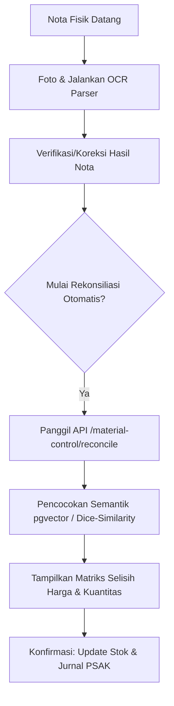

# Rancangan Desain Fase 4: Integrasi AI & Asisten MCP Server

Dokumen ini merinci arsitektur teknis dan implementasi untuk **Fase 4 (Integrasi AI)** dalam modul **Material Control**, menyelaraskan asisten AI OCR Matcher dan Rekomendasi Substitusi Produk.

---

## 4.1 Penyelarasan AI OCR Matcher (Auto-Reconciliation)

### A. Alur Kerja Rekonsiliasi Nota vs Rencana Belanja (PO)
Saat nota fisik dipotret dan diproses melalui OCR pipeline (`/api/v1/ocr.py`), sistem menghasilkan data transaksi terstruktur. Setelah proses koreksi selesai di `/tasks/{task_id}/correct`, pengguna dapat memicu auto-reconciliation dengan Rencana Belanja aktif (`PurchasePlan` berstatus `APPROVED`).



### B. Spesifikasi API Endpoint
Membuat endpoint baru pada backend Sajen:
*   **Endpoint**: `POST /api/v1/material-control/purchase-plans/{plan_id}/reconcile`
*   **Payload**:
    ```json
    {
      "ocr_task_id": 123
    }
    ```
*   **Response**:
    ```json
    {
      "plan_id": 10,
      "status": "DISCREPANCY_FOUND", // or 'MATCHED'
      "discrepancies": [
        {
          "product_id": 5,
          "product_name": "Beras Pandan Wangi",
          "planned_qty": 10.0,
          "received_qty": 9.0, // Selisih 1.0 kg
          "planned_price": 15000.0,
          "received_price": 15500.0, // Selisih Rp 500
          "type": "PRICE_QTY_MISMATCH"
        }
      ]
    }
    ```

### C. Logika Pencocokan Semantik
Jika nama barang di nota supplier berbeda dengan nama barang di sistem database master (`products`), sistem akan menggunakan:
1.  **pgvector Semantic Search**: Menghitung jarak kosinus (*cosine distance*) antara embedding nama produk nota dengan nama produk database master (lewat model `text-embedding-3-small` 3072 dimensi).
2.  **Dice Similarity (Fallback)**: Menggunakan koefisien Jaccard/Dice jika model embedding gagal merespons.

---

## 4.2 AI Product/Part Substitution Recommendation (Rekomendasi Barang Pengganti)

Saat menyusun rencana belanja (`PurchasePlanForm.tsx`), jika supplier utama menyatakan bahwa produk yang dicari sedang kosong, asisten AI dapat merekomendasikan produk substitusi yang setara.

### A. Parameter Pencarian Substitusi
Sistem menentukan barang pengganti berdasarkan kriteria:
1.  **Kesamaan Kategori**: Produk harus berada dalam `product_categories` yang sama.
2.  **Kemiripan Semantik**: Deskripsi atau nama produk memiliki tingkat kemiripan tinggi berdasarkan pencarian vektor pgvector (threshold cosine distance < 0.25).
3.  **Ketersediaan Supplier Alternatif**: Mencari supplier lain (`preferred_supplier_id`) yang memiliki stok barang pengganti tersebut berdasarkan transaksi historis.

### B. Spesifikasi API Endpoint
*   **Endpoint**: `GET /api/v1/material-control/products/{product_id}/substitutions`
*   **Response**:
    ```json
    [
      {
        "substitute_product_id": 12,
        "name": "Beras Setra Ramos 5kg",
        "sku": "BRS-005",
        "similarity_score": 0.89,
        "last_purchase_price": 72000.0,
        "supplier_name": "CV Berkah Sembako"
      }
    ]
    ```

### C. Desain UI/UX Frontend
Sediakan tombol ikon *"Sparkles"* atau *"Cari Pengganti"* di samping nama barang pada tabel rencana belanja. Ketika diklik, tombol ini akan memunculkan dialog pencari barang pengganti berbasis rekomendasi AI.
Pengguna dapat mengklik *"Ganti"* untuk secara langsung menukar item yang kosong dengan produk rekomendasi pengganti di draf rencana belanja.
