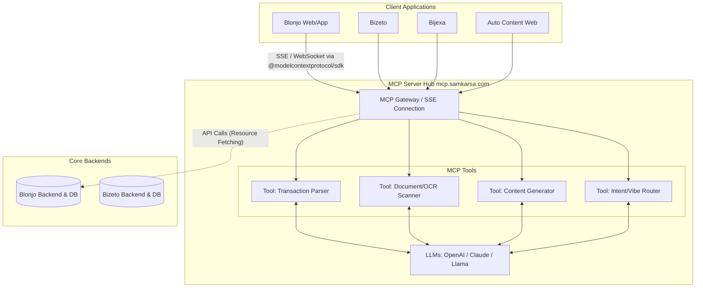

# Rancangan Arsitektur Integrasi Blonjo & MCP Server (mcp.samkarsa.com)

Pendekatan ini akan mengubah arsitektur aplikasi Anda dari **desentralisasi AI** (di mana setiap aplikasi mengelola *logic* NLP/LLM-nya sendiri) menjadi **AI terpusat (Centralized AI Gateway)** menggunakan standar protokol **MCP (Model Context Protocol)**.

## 1. Konsep Utama: MCP sebagai "Otak Utama" (Centralized AI Hub)
MCP Server (`mcp.samkarsa.com`) akan bertindak sebagai *hub* tunggal yang mengekspos berbagai **Tools** dan **Prompts** berbasis AI. Aplikasi *client* seperti Blonjo, Bizeto, Bijexa, dan Auto Content hanya bertugas sebagai **Antarmuka (UI)** yang mengirim konteks dan menerima hasil yang sudah diproses oleh MCP.

## 2. Pemetaan Fungsionalitas AI Blonjo ke MCP

Saat ini Blonjo memiliki beberapa fitur yang sangat bergantung pada kecerdasan pemrosesan data, yang akan dipindahkan ke MCP:

| Fungsionalitas Blonjo Saat Ini | Implementasi Saat Ini | Rancangan Baru via MCP Server |
| :--- | :--- | :--- |
| **Smart Note Parsing** | *Hardcoded Regex/Heuristics* di `src/lib/smartParser.ts` | Blonjo memanggil *Tool* `parse_transaction` di MCP. MCP menggunakan LLM untuk mengembalikan JSON terstruktur. |
| **Receipt OCR & Extraction** | Backend terpisah (`/ocr/tasks`) | Blonjo memanggil *Tool* `extract_receipt` di MCP. MCP mengatur koneksi ke Vision Model. |
| **Vibe Orchestrator / Omnibar** | *Logic* lokal di *frontend* | Blonjo membuka sesi percakapan dengan *Agent* MCP untuk *intent recognition* (misal: "tampilkan laporan rugi laba"). |
| **Voice Command** | Pengenalan suara lokal/dasar | MCP menyediakan *Tool* atau koneksi Realtime (SSE) untuk menerjemahkan transkrip suara menjadi aksi sistem. |

## 3. Arsitektur & Alur Data

## 4. Rencana Implementasi Teknis di Blonjo (Tahap Demi Tahap)

Jika rancangan ini disetujui, kita akan mengeksekusi integrasinya dengan langkah-langkah berikut:

**Fase 1: Setup & Koneksi MCP Client**
1. Menginstal `@modelcontextprotocol/sdk` di Blonjo.
2. Membuat *Service Singleton* (misal: `src/api/mcpClient.ts`) yang mengatur koneksi **SSE (Server-Sent Events)** ke `https://mcp.samkarsa.com/sse`.
3. Menambahkan injeksi *Auth Token* (JWT pengguna Blonjo) agar MCP Server tahu *tenant/user* siapa yang sedang me-request.

**Fase 2: Migrasi Smart Note (NLP) & OCR**
1. Menghapus *logic regex* yang rumit di `smartParser.ts`.
2. Mengganti dengan pemanggilan fungsi *Tool* MCP (`callTool('parse_transaction', { text: "beli pulsa 50rb" })`).
3. Menangani *response* terstandar dari MCP untuk di-render di antarmuka konfirmasi jurnal Blonjo.

**Fase 3: Optimasi Vibe Orchestrator (Omnibar)**
1. Mengintegrasikan UI Omnibar di Blonjo dengan *Agentic Loop* dari MCP.
2. Memungkinkan pengguna mengetik permintaan kompleks (contoh: "Buatkan katalog harga untuk distributor area Jatim"), di mana MCP akan merespons dengan komponen UI yang *rendered dynamically* (Server-Driven UI).

## 5. Keuntungan Arsitektur Ini
1. **Single Point of Update:** Jika Anda ingin mengganti model AI (misal dari GPT-4 ke Claude 3.5), Anda hanya perlu mengubahnya di MCP Server. Semua aplikasi (Blonjo, Bizeto, dll) otomatis menikmati pembaruannya tanpa perlu *deploy* ulang.
2. **Keringanan Klien:** Aplikasi React akan menjadi sangat ringan karena tidak perlu memuat *library* pemrosesan teks, NLP, atau *logic* AI kompleks.
3. **Ekosistem Bersama:** Tools yang dibangun untuk Blonjo (misalnya membaca mutasi bank) nantinya bisa dengan mudah di-*reuse* oleh Bizeto atau aplikasi lain tanpa menulis ulang kodenya.
