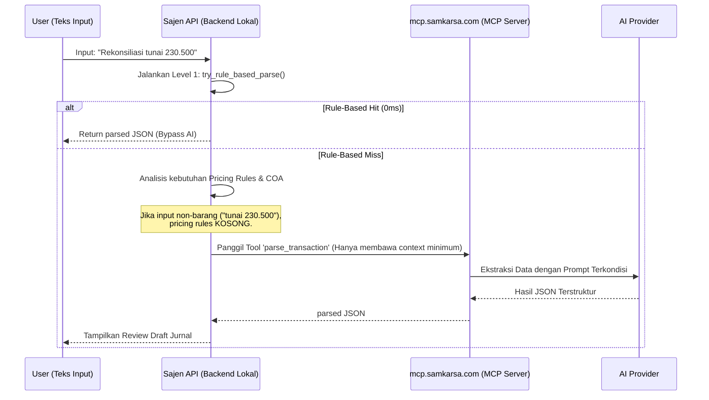
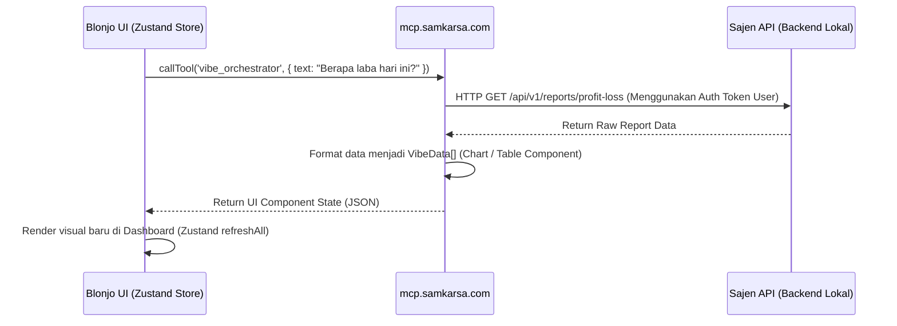
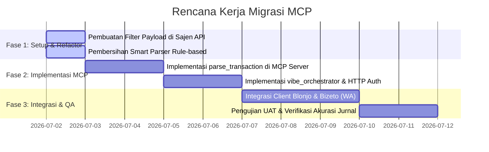

# Analisis Lanjut & Rancangan Optimalisasi MCP Server (mcp.samkarsa.com)
*(Status: Dokumen Kerja Arsitektur - Sajen & Blonjo)*

## 1. Executive Summary & Ringkasan Temuan

Berdasarkan analisis terhadap dokumen arsitektur dan repositori kode (`sajen` dan `blonjo`), kami mengidentifikasi beberapa inefisiensi krusial pada integrasi AI saat ini:
1. **Inefisiensi Payload (Kasus Smart Note):** Sistem mengirimkan seluruh aturan harga jual (*Pricing Rules*) statis ke dalam prompt LLM, meskipun input transaksi bersifat global/kas (non-barang) yang tidak membutuhkannya. Hal ini menyia-nyiakan token input (sekitar 140+ token per request) dan meningkatkan latensi.
2. **Ketergantungan AI di Backend Lokal:** Fungsionalitas AI transaksional seperti *Vibe Orchestrator* (Omnibar) dan *Vision OCR* saat ini masih diproses langsung di backend Sajen API. Ini menambah beban komputasi server lokal dan mempersulit pemeliharaan model AI lintas platform (Blonjo, Bizeto, Bijexa, Auto Content).

Rancangan ini menawarkan solusi berupa optimalisasi pembagian peran menggunakan **Model Context Protocol (MCP)** terpusat di `mcp.samkarsa.com` untuk meningkatkan kualitas parsing, efisiensi token, kecepatan respon, dan keamanan data tanpa merusak fitur inti (*core features*) yang sedang berjalan.

---

## 2. Peta Pembagian Tanggung Jawab (Responsibility Mapping)

Untuk mencapai performa terbaik, kita menerapkan pemisahan tugas yang tegas antara apa yang diproses di **Backend Lokal (`sajen` API)**, **Client UI (`blonjo`)**, dan **MCP Server (`mcp.samkarsa.com`)**:

| Proses / Fitur | Lokasi Eksekusi Terbaik | Rationale & Batasan |
| :--- | :--- | :--- |
| **Rule-Based Pre-Filter (Regex)** | **Backend Lokal (`sajen`)** | Sangat cepat (0ms), tidak membutuhkan AI. Menangani input instan tanpa latensi jaringan. |
| **Parsing Transaksi Kompleks (NLP)** | **MCP Server** | Logika ekstraksi teks bebas dibungkus sebagai Tool MCP. Model AI dapat diubah di satu tempat secara terpusat. |
| **WhatsApp Stock Check (Bizeto)** | **MCP Server + API Publik** | Bizeto (pusat) memanggil tool MCP untuk mengambil data real-time dari API publik merchant secara aman menggunakan token/nomor WA. |
| **Vibe Orchestrator (Omnibar)** | **MCP Server** | Menerjemahkan bahasa natural menjadi komponen visual (Server-Driven UI) dengan cara berinteraksi langsung ke API internal Sajen. |
| **Receipt OCR & Vision Extraction** | **MCP Server** | Menggunakan multimodal/vision model di cloud server untuk pemrosesan citra berukuran besar tanpa membebani memori VPS lokal. |
| **Penyimpanan Jurnal & Stok (Core)** | **Backend Lokal (`sajen`)** | Aturan bisnis, validasi database, double-entry ledger, dan perhitungan HPP tetap berjalan di backend lokal demi keamanan. |

---

## 3. Desain Arsitektur & Alur Integrasi Teroptimasi

### A. Alur Data Parsing Transaksi (Smart Note)
Optimalisasi dilakukan dengan **Dynamic Context Filter** di backend lokal sebelum melempar request ke MCP Server:



### B. Arsitektur Vibe Orchestrator Terpusat
Untuk mendukung Server-Driven UI di Omnibar, MCP Server bertindak sebagai orchestrator yang berhak meminta data ke Sajen API:



---

## 4. Rancangan Perubahan Kode Tanpa Merusak Core (Zero-Breaking Policy)

### A. Perubahan di `sajen` API (Backend)
Sesuai dengan `app/api/v1/accounting.py` and `app/services/smart_parser.py`, perubahan difokuskan pada pembersihan payload sebelum dikirim ke AI:

```python
# Modifikasi pada app/api/v1/accounting.py
# Menyesuaikan logika check kebutuhan pricing rules sebelum menyusun prompt

def needs_pricing_rules(text: str) -> bool:
    # Hanya inject pricing rules jika mendeteksi nama produk terdaftar atau unit barang
    low_text = text.lower()
    product_keywords = ["kg", "pcs", "btl", "ctn", "pack", "@", "beli", "belanja", "jual"]
    return any(kw in low_text for kw in product_keywords)
```

Di dalam fungsi `parse_transaction_note`:
```python
# LAMA: Selalu menginject pricing rules/COA
# BARU:
coa_section = ""
if needs_coa_in_prompt(normalized_text):
    # Ambil COA
    ...

pricing_section = ""
if needs_pricing_rules(normalized_text):
    # Ambil pricing rules dari DB untuk di-inject
    ...
```

### B. Perubahan di MCP Server (`mcp-server/src/index.ts`)
Tambahkan tool baru untuk melayani parsing dan orchestrator tanpa mengganggu database lokal secara langsung:

1. **Tool `parse_transaction`**:
   Menerima teks transaksi dan konteks minimal, mengembalikan struktur transaksi bersih.
2. **Tool `vibe_orchestrator`**:
   Menerima input dari omnibar, melakukan deteksi *intent*, mengambil data ke Sajen API lewat HTTP, dan menyusun antarmuka JSON.

---

## 5. Rencana Migrasi (Migration Roadmap)



---

## 6. Manfaat Terukur (Expected Value metrics)
* **Efisiensi Token:** Mengurangi ukuran prompt transaksi kas/global sebesar **~70% (dari 140+ token menjadi ~40 token)**.
* **Kecepatan Respon:** Pengurangan latensi AI hingga **200ms - 400ms** per request karena prompt yang dikirim jauh lebih kecil.
* **Kemudahan Pemeliharaan:** Update instruksi UI atau model LLM (Gemini/Claude) cukup dilakukan di server `mcp.samkarsa.com` tanpa perlu melakukan deploy ulang container `sajen` dan `blonjo` milik tenant.
