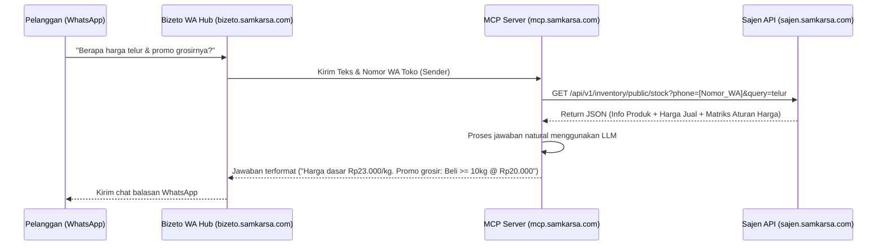

# Rancangan Integrasi Terpusat MCP & WhatsApp Bizeto (Cek Stok & Harga)

Dokumen ini merancang integrasi sistem asisten WhatsApp (Bizeto) dengan Sajen API (Backend) melalui perantara kecerdasan buatan terpusat di MCP Server (`mcp.samkarsa.com`).

---

## 1. Arsitektur Komunikasi Sistem

WhatsApp Bizeto di-host pada platform `bizeto.samkarsa.com` dan menggunakan `mcp.samkarsa.com` sebagai otak AI Gateway untuk memproses pesan pelanggan secara natural. Untuk mendapatkan informasi stok fisik dan matriks harga dinamis dari UMKM (tenant), MCP Server akan menembak Sajen API secara langsung.



---

## 2. Spesifikasi Endpoint Baru di Sajen API

### Endpoint: Cek Stok & Matriks Harga Publik
Digunakan oleh MCP Server untuk mencari produk dan aturan harganya berdasarkan nomor WhatsApp toko.

*   **URL**: `/api/v1/inventory/public/stock`
*   **Method**: `GET`
*   **Query Parameters**:
    *   `phone` (string, wajib): Nomor WhatsApp toko terdaftar (e.g. `628123456789`).
    *   `query` (string, wajib): Nama produk yang dicari (e.g. `telur`).
*   **Format Respons (JSON)**:
    ```json
    [
      {
        "id": 12,
        "name": "Telur Ayam Negeri",
        "sku": "TLR-001",
        "base_unit": "kg",
        "sell_price": 23000.0,
        "stock": 45.5,
        "pricing_matrix": [
          {
            "rule_type": "tiered",
            "name": "Diskon Grosir Telur",
            "tiers": [
              {
                "qty_threshold": 10.0,
                "unit_price": 20000.0
              }
            ]
          }
        ]
      }
    ]
    ```

---

## 3. Struktur Database (Pemetaan Relasi)
1.  **AppSetting**: Digunakan untuk mencari `tenant_id` berdasarkan key `store_phone` yang memiliki value sama dengan parameter `phone`.
2.  **TenantInventory**: Mengambil nilai stok fisik (`static_stock` atau HPP).
3.  **TenantProductPrice**: Mengambil harga dasar produk (`amount`).
4.  **TenantPricingRule**: Mengambil seluruh aturan harga dinamis (`rule_payload`) yang aktif untuk produk bersangkutan.

---

## 4. Keuntungan Desain Terpusat
-   **Kerahasiaan Data**: Bizeto & MCP tidak menyimpan database UMKM secara langsung; data ditarik secara real-time (on-demand) dari Sajen API.
-   **Konsistensi Informasi**: Harga yang dijawab ke pelanggan di WhatsApp dijamin 100% sama dengan harga yang tertera pada aplikasi kasir (Blonjo).
