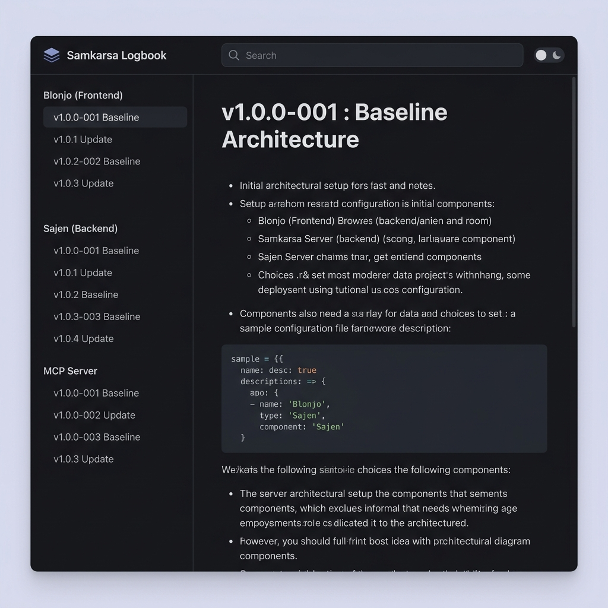

# Mockup UI/UX Astro Starlight (Logbook)

Berikut adalah visualisasi dari rancangan *Logbook Samkarsa* jika kita membangunnya menggunakan framework **Astro Starlight** (sebuah *template* spesialis dokumentasi yang sangat mirip dengan GitBook/GitLab Wiki).

### Sorotan Fitur Visual:
1. **Sidebar Navigasi (Kiri):** Memiliki pengelompokan otomatis berdasarkan *Project* (Blonjo, Sajen, MCP Server) lengkap dengan *versioning log*.
2. **Konten Utama (Tengah):** *Rendering* Markdown yang bersih, modern, dan sangat nyaman dibaca.
3. **Navigasi Atas:** Dilengkapi *Search Bar* (pencarian penuh di seluruh versi) dan *Dark/Light mode toggle*.
