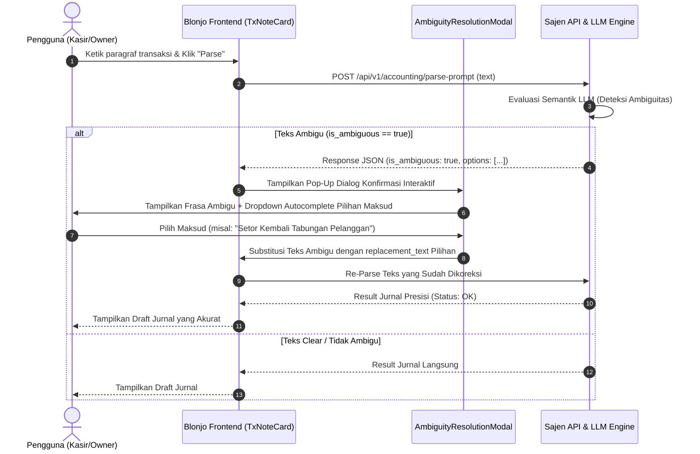

# [DRAFT - BELUM DIEKSEKUSI] Plan: Sistem Deteksi Ambigu & Dialog Konfirmasi Semantik AI

> **STATUS DOKUMEN:** 📌 **DRAFT / SIMPAN DULU (BELUM DIEKSEKUSI)**  
> **TANGGAL RANCANGAN:** 19 Agustus 2026  
> **INISIATOR:** User & Antigravity AI  

---

## 1. Latar Belakang & Tujuan Arsitektur

### 1.1 Masalah
Input bahasa natural dari pengguna (terutama dalam bentuk paragraf panjang) terkadang mengandung frasa yang memiliki lebih dari satu penafsiran akuntansi secara semantik (ambigu). 

**Contoh Kasus Real:**  
Input: *"Pengembalian uang tabungan Siti Londry 400rb"*
- **Penafsiran A (Customer Deposit)**: Siti Londry mengembalikan/menyetorkan kembali uang tabungan yang kemarin ditariknya. *(Debit Kas, Kredit Simpanan Pelanggan)*.
- **Penafsiran B (Sales Return)**: Toko mengembalikan uang ke Siti Londry atas retur barang/penjualan. *(Debit Retur Penjualan, Kredit Kas)*.

Jika AI memaksakan *best-guess* tanpa konfirmasi, ada risiko jurnal tercatat pada akun yang salah (misal: masuk ke Pendapatan Alih-alih Titipan Pelanggan).

### 1.2 Tujuan
Membangun **Sistem Interaktif AI Dua-Arah (Ambiguity Detection & Interactive Clarification Dialog)** saat tombol **Parse** diklik di UI Blonjo. Jika AI mendeteksi ambiguitas semantik:
1. AI tidak memaksakan parsing, melainkan mengembalikan daftar pilihan maksud transaksi.
2. UI menampilkan modal/pop-up interaktif berbasis **dropdown autocomplete**.
3. Pengguna memilih opsi yang sesuai, dan kalimat ambigu otomatis digantikan oleh kalimat standar pilihan sebelum re-parse dieksekusi.

---

## 2. Alur Arsitektur Sistem (Workflow)



---

## 3. Rincian Komponen Teknikal

### 3.1 Response Format AI Parser (`sajen`)
Tambahkan skema Pydantic ambiguitas pada response JSON parser:
```json
{
  "is_ambiguous": true,
  "ambiguous_phrase": "Pengembalian uang tabungan Siti Londry 400rb",
  "ambiguity_reason": "Frasa dapat diartikan sebagai retur penjualan/pendapatan ATAU pengembalian setoran tabungan pelanggan.",
  "options": [
    {
      "label": "Pengembalian Setoran Tabungan Pelanggan (Kas Bertambah, Utang Tabungan Bertambah)",
      "replacement_text": "Setor kembali tabungan pelanggan Siti Londry 400rb",
      "transaction_type": "customer_deposit"
    },
    {
      "label": "Retur Penjualan / Pengembalian Uang ke Pelanggan (Kas Berkurang, Retur Jual Bertambah)",
      "replacement_text": "Retur penjualan dari Siti Londry 400rb",
      "transaction_type": "sales_return"
    }
  ]
}
```

### 3.2 Frontend Modal Component (`blonjo`)
1. Komponen Baru: `blonjo/src/components/AmbiguityResolutionModal.tsx`
2. Fitur UI:
   - Header peringatan: `"AI Mendeteksi Maksud Transaksi yang Ambigu"`.
   - Highlight frasa/kalimat ambigu yang ditulis pengguna.
   - Dropdown Autocomplete (`Select / Combobox`) berisi daftar opsi penafsiran.
   - Live Preview: Menunjukkan kalimat baru yang akan menggantikan kalimat lama.
   - Button `"Terapkan Opsi & Lanjutkan"`.

---

## 4. Matriks Uji Ambivalensi (Verification Scenarios)

| No | Teks Input User | Potensi Ambiguitas | Opsi Konfirmasi yang Ditawarkan AI |
| :--- | :--- | :--- | :--- |
| **1** | *"Pengembalian uang tabungan Siti Londry 400rb"* | Retur Jual vs Setoran Tabungan | **A.** Setor kembali tabungan pelanggan <br>**B.** Retur penjualan dari pelanggan |
| **2** | *"Setor uang 5 juta dari Pak Boss"* | Modal Pemilik vs Utang Piutang | **A.** Setoran Modal Pemilik (`capital`) <br>**B.** Pinjaman / Utang Pihak Ketiga |
| **3** | *"Tarik tunai 1 juta"* | Prive / Ambil Modal vs Penarikan Tabungan | **A.** Penarikan Modal Pemilik / Prive (`capital_withdrawal`) <br>**B.** Penarikan Tabungan Pelanggan (`customer_withdrawal`) |

---

## 5. Catatan Status Pengerjaan

- [ ] Status saat ini: **Rancangan Disimpan (Draft Only)**
- [ ] Menunggu instruksi eksekusi lanjutan dari Pengguna.
- [ ] Kode backend (`smart_parser.py`) dan frontend (`TxNoteCard.tsx`) **belum disentuh / belum diubah**.
