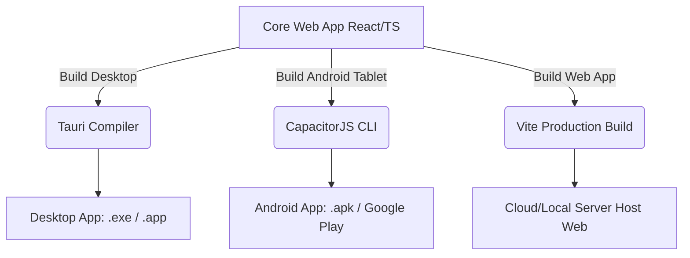
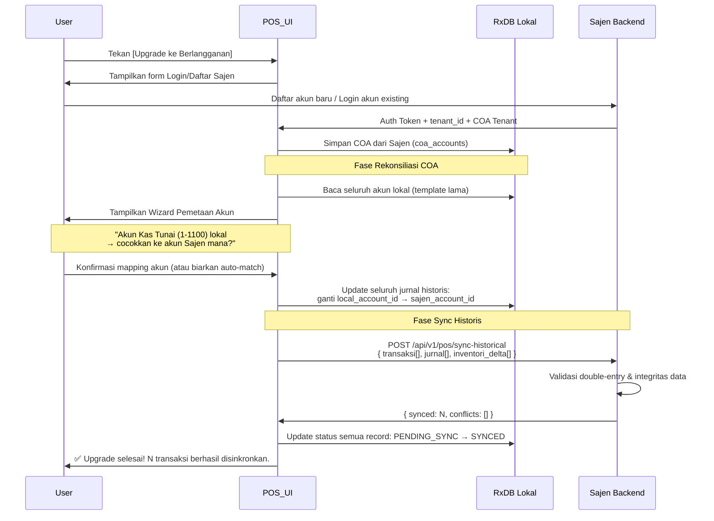
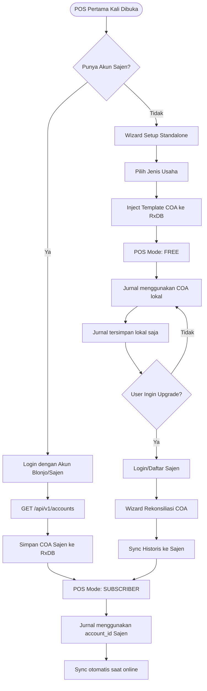

# Dokumen Arsitektur & Rancangan Fitur: Standalone POS Modern (Multi-Platform App)

Dokumen ini mendeskripsikan arsitektur, pilihan tech stack, dan rancangan UI/UX untuk aplikasi **Point of Sales (POS) Modern** yang dibangun secara terpisah (standalone) dari modul utama Blonjo. Pendekatan ini memungkinkan POS berjalan dengan sangat ringan, stabil secara offline-first, dan dideploy ke berbagai perangkat (Desktop PC kasir, Android Tablet mekanik/waiter, maupun Web) menggunakan satu basis kode (*single codebase*).

---

## 1. Rekomendasi Tech Stack

Untuk mencapai aplikasi POS yang ringan, berkinerja tinggi, ramah pengguna (*user friendly*), dan mudah dideploy ke berbagai platform, berikut adalah saran arsitektur teknologi:

| Lapisan (Layer) | Teknologi Rekomendasi | Alasan & Kelebihan |
| :--- | :--- | :--- |
| **Frontend Framework** | **React + Vite + TypeScript** | Sangat cepat (Vite HMR instan), modular, memiliki ekosistem library kaya untuk integrasi hardware (printer, scanner). |
| **State & Local Storage** | **Zustand + RxDB / SQLite** | POS harus *Offline-First*. RxDB (atau SQLite via WASM) mengizinkan penyimpanan transaksi lokal saat koneksi internet terputus, dan melakukan sinkronisasi otomatis ke FastAPI Backend (SAJEN) ketika online kembali. |
| **Desktop Wrapper** | **Tauri (Rust-based)** | Jauh lebih ringan dibanding Electron. Ukuran installer sangat kecil (~10MB) dan penggunaan RAM sangat hemat ( < 50MB) karena menggunakan WebView bawaan sistem operasi. |
| **Mobile/Tablet Wrapper** | **CapacitorJS** | Membungkus codebase web React yang sama langsung menjadi aplikasi Android Native (.apk) untuk tablet kasir atau mekanik dengan performa tinggi. |
| **UI Library** | **shadcn/ui + Tailwind CSS** | Antarmuka bersih, modular, ramah pengguna, serta mudah disesuaikan untuk mendukung Dark/Light Mode. |

---

## 2. Arsitektur Multi-Platform Deployment

Dengan arsitektur ini, tim pengembang hanya memelihara **satu codebase React**:



---

## 3. Fitur Input POS Modern (Lain dari yang Lain)

POS ini dirancang dengan fleksibilitas input yang luas. Semua hasil input otomatis diterjemahkan menjadi draf belanja yang **dapat dikoreksi/diedit secara manual** (ditambah, dikurangi, atau dihapus item/kuantitasnya) oleh kasir sebelum disimpan dan dicetak.

### A. Alur Perekaman Suara Tanpa Sentuh (Hands-Free Wake Word)
Kasir tidak perlu menyentuh layar untuk memulai perekaman suara:
1.  **Continuous Listening (Lokal):** Aplikasi frontend (browser/tablet) menggunakan pustaka Web Speech API lokal yang berjalan secara hemat daya di latar belakang untuk mendengarkan kata kunci aktivasi (contoh wake word: *"Halo Blonjo"* atau *"OK Blonjo"*).
2.  **Pemicu Suara (Voice Trigger):** Begitu wake word terdeteksi di sisi klien:
    *   Sistem memainkan nada pemicu singkat (*audio beep*) dan menampilkan indikator visual mikrofon menyala (berwarna hijau/merah berkedip).
    *   Aplikasi mulai merekam suara perintah kasir (misal: *"Ganti oli MPX2 satu botol, plat AD 1234 XY"*).
3.  **Silence Detection (Pendeteksi Keheningan):** Jika kasir berhenti berbicara selama lebih dari 1.5 detik, sistem secara otomatis menghentikan perekaman.
4.  **Ekstraksi MCP AI:** Rekaman suara dikirim ke external MCP Server di **`https://mcp.samkarsa.com`** untuk dikonversi menjadi teks, diekstraksi entitasnya (produk, qty, pelat nomor, nama staf/mekanik), dan langsung dimasukkan ke draf belanja POS.

### B. Metode Input Lainnya
*   **Legacy Input (Barcode Scanner):** Tetap dipertahankan sebagai alat pemindai fisik produk secara instan.
*   **Smart Input (Teks Bebas / Unstructured Text):** Kolom pencarian pintar di mana kasir dapat mengetik secara acak (misal: *"Beat plat AD 9999 XX pasang ban luar FDR 1 pcs"*). AI pada MCP Server akan mengekstrak data tersebut menjadi entitas pesanan.
*   **OCR Vision Kamera Device (Fase 1):** Kasir mengarahkan produk ke kamera device (HP/Tablet/Webcam). Kamera menangkap gambar produk secara real-time, mengirimkannya ke MCP Server untuk dianalisis, lalu otomatis memasukkan item tersebut ke daftar keranjang belanja.
*   **OCR Vision Smart Table (Fase 2):** Barang-barang belanjaan diletakkan sekaligus di atas meja kasir khusus yang dipasangi kamera di atasnya (*overhead camera*). Kamera memindai seluruh barang secara bersamaan, mendeteksi jumlah serta varian produk, dan menyusun nota belanja secara otomatis.

---

## 4. Rancangan Antarmuka UI/UX (Aesthetics & Component Layout)

Layout dirancang dengan pembagian tiga panel utama (*Three-Column Dashboard Layout*):

```text
+----------------------------------------------------------------------------------------------------+
|  [Logo] BLONJO POS      | Status AI: [ONLINE] | Mic: [HALO BLONJO (Ready)]  | Kamera Vision: [AKTIF] |
+-------------------------+-------------------------------------------+------------------------------+
| PANEL 1: AI & INPUTS    | PANEL 2: KERANJANG BELANJA (DRAF NOTA)    | PANEL 3: RINGKASAN & BAYAR   |
|                         |                                           |                              |
| +---------------------+ | [Aset/Plat]: [ AD 1234 XY ] [Ubah]        | Pelanggan: Umum / [Budi]     |
| | SMART INPUT TEXT    | | Staf/Mekanik: [Mekanik Agus v]           |                              |
| | [ beat ganti oli..] | |                                           | Subtotal : Rp 175.000        |
| +---------------------+ | +---------------------------------------+ | Diskon   : Rp       0        |
|                         | | No | Item         | Qty   | Subtotal  | | Total    : Rp 175.000        |
| +---------------------+ | |----+--------------+-------+-----------| |                              |
| | WAKE WORD STATE     | | 1  | Oli MPX2 1L  | [ - 1 + ] Rp  65.000 | | +--------------------------+ |
| | (()) Merekam...     | | 2  | Jasa Servis  | [ - 1 + ] Rp  50.000 | | |    PROSES BAYAR (F12)     | |
| +---------------------+ | | 3  | Ban Luar FDR | [ - 1 + ] Rp  60.000 | | +--------------------------+ |
|                         | +---------------------------------------+ |                              |
| +---------------------+ |                                           | Opsi Print:                  |
| | VISION CAMERA FEED  | | *Kasir dapat mengubah qty/item di atas*   | [x] Thermal 58mm             |
| | [ Live Preview ]    | |                                           | [ ] Thermal 80mm             |
| +---------------------+ |                                           |                              |
+----------------------------------------------------------------------------------------------------+
```

#### Detail Mikro-Interaksi:
*   **AI Voice Indicator Bar:** Indikator berdenyut (*pulse animation*) berwarna biru safir saat standby, dan berubah menjadi merah delima dengan visualisasi gelombang suara (*waveform*) interaktif saat merekam perintah suara kasir.
*   **Vision Preview Overlay:** Tampilan umpan kamera melayang (*floating preview*) dengan sudut membulat (*rounded corners*) dan bayangan halus untuk visualisasi pembacaan OCR produk secara visual.
*   **Draf Nota Fleksibel:** Desain baris tabel keranjang yang intuitif, di mana kasir dapat melakukan distraksi (pengeditan manual) seperti tombol `+` atau `-` untuk kuantitas, serta ikon hapus merah ketika baris di-hover.

---

## 5. Output Cetak Nota (Nota Thermal Printer)

Sistem POS ini mendukung cetak struk dinamis menggunakan printer kasir thermal. Seluruh data header nota (nama toko, alamat, telepon) diambil secara otomatis dari profil **Tenant** yang terdaftar di Sajen. Data pelanggan ditampilkan jika transaksi dikaitkan dengan pelanggan terdaftar. Kasir dapat memilih ukuran kertas sebelum mencetak.

---

### 5.1 Nota 58mm — Format Ringkas (Default)
> **Lebar kertas:** 58mm | **Karakter per baris:** ~32 karakter | **Digunakan untuk:** Transaksi retail umum, kasir cepat, warung, kafe.

```
================================
      NAMA TOKO / TENANT
  Jl. Alamat Toko No. 1, Kota
     Telp: 0812-3456-7890
================================
NOTA  : TRX-202607-00042
Tgl   : 01 Jul 2026  12:30 WIB
Kasir : Agus
--------------------------------
Pelanggan : Budi Santoso
Member    : MEMBER SILVER
--------------------------------
Oli MPX2 1L
  1 x Rp  65.000      Rp 65.000
Jasa Ganti Oli
  1 x Rp  50.000      Rp 50.000
Ban Luar FDR 70/90
  1 x Rp  60.000      Rp 60.000
--------------------------------
Subtotal          Rp  175.000
Diskon Member 10%  Rp  -17.500
                  -----------
TOTAL             Rp  157.500
================================
Bayar (Cash)      Rp  200.000
Kembali            Rp   42.500
================================
  Terima kasih sudah berkunjung!
     Sampai jumpa lagi :)
================================
      [== QR CODE QRIS ==]
   Scan untuk bukti digital
================================
   Powered by BLONJO POS
================================
```

**Elemen Data Nota 58mm:**

| Elemen | Sumber Data |
| :--- | :--- |
| Nama Toko, Alamat, Telp | Profil Tenant (`tenants` table) |
| Nomor Nota (TRX-...) | Auto-generate, format `TRX-YYYYMM-XXXXX` (reset tiap bulan) |
| Tanggal & Jam | Timestamp server saat transaksi difinalisasi |
| Nama Kasir | Profil staf yang login ke POS |
| Nama Pelanggan & Status Member | Tabel `contacts` (jika dipilih saat transaksi) |
| Item, Qty, Harga | RxDB Lokal (master: tabel `products` di Sajen) |
| Diskon | Nominal atau persentase per transaksi / per item |
| Total & Kembalian | Dihitung otomatis |
| QR Code QRIS | Dynamic QRIS payload sesuai total transaksi |

---

### 5.2 Nota 80mm — Format Komprehensif
> **Lebar kertas:** 80mm | **Karakter per baris:** ~48 karakter | **Digunakan untuk:** Bengkel servis, F&B dengan info mekanik/waiter, transaksi bergaransi.

```
================================================
             BENGKEL MAJU JAYA
      Jl. Raya Soekarno-Hatta No. 88
         Malang, Jawa Timur 65141
         Telp: 0812-3456-7890
      Instagram: @bengkelmajujaya
================================================
NOTA        : TRX-202607-00042
Tanggal     : 01 Juli 2026, 12:30 WIB
Kasir       : Agus Setiawan
Mekanik     : Budi Hartono
------------------------------------------------
INFORMASI PELANGGAN
Nama        : Budi Santoso
No. HP      : 0813-9876-5432
Status      : Member Silver
Kendaraan   : Honda Beat 2022
No. Polisi  : AD 1234 XY
Km Masuk    : 12.500 km
------------------------------------------------
DETAIL TRANSAKSI
------------------------------------------------
No  Nama Item              Qty  Subtotal
--  ---------------------  ---  ----------
1   Oli MPX2 1L              1  Rp  65.000
2   Jasa Ganti Oli           1  Rp  50.000
3   Ban Luar FDR 70/90-17    1  Rp  60.000
------------------------------------------------
                  Subtotal :     Rp 175.000
    Diskon Member 10% (-) :     Rp  17.500
                           :  -----------
                   TOTAL   :     Rp 157.500
================================================
Metode Bayar  : CASH
Jumlah Bayar  : Rp  200.000
Kembalian     : Rp   42.500
================================================
INFORMASI GARANSI & SERVICE
Garansi Servis   : 7 hari / 500 km
Garansi Parts    : 30 hari
Est. Service Bdk : 01 Agustus 2026
                   (Estimasi: km 13.000)
------------------------------------------------
Catatan Mekanik:
Rantai mulai kendor, disarankan
ganti pada kunjungan berikutnya.
================================================
     Terima kasih atas kepercayaan
          Anda kepada kami!
         Sampai jumpa lagi :)
================================================
     [=========  QR CODE QRIS  =========]
       Scan untuk konfirmasi & bukti
              pembayaran digital
================================================
          Powered by BLONJO POS
================================================
```

**Elemen Tambahan Nota 80mm (vs 58mm):**

| Elemen Tambahan | Sumber Data |
| :--- | :--- |
| Nama Mekanik / Waiter / Staf | Tabel `contacts` staf yang dipilih di POS |
| No. HP Pelanggan | Tabel `contacts` pelanggan |
| Data Aset (Kendaraan, No. Polisi, Km) | Tabel `tenant_customer_assets` |
| Garansi Servis & Parts | Konfigurasi per kategori jasa di Sajen |
| Estimasi Service Berikutnya | Dihitung otomatis: Km masuk + interval km standar |
| Catatan Mekanik (Free Text) | Input kasir/mekanik saat finalisasi transaksi |

---

### 5.3 Aturan Tampilan Diskon

Diskon dapat diterapkan pada dua level dan keduanya ditampilkan secara transparan di nota:

| Tipe Diskon | Tampilan di Nota 58mm | Tampilan di Nota 80mm |
| :--- | :--- | :--- |
| **Diskon per Item** | Harga coret di baris item | Kolom diskon per baris item |
| **Diskon Transaksi (%)** | `Diskon Member 10% Rp -17.500` | `Diskon Member 10% (-): Rp 17.500` |
| **Diskon Nominal (Rp)** | `Diskon Khusus Rp -20.000` | `Diskon Khusus (-): Rp 20.000` |
| **Tanpa Diskon** | Baris diskon tidak ditampilkan | Baris diskon tidak ditampilkan |

---

## 6. Strategi Offline-First & AI Graceful Degradation

### Klarifikasi Konsep "Offline-First"
Frasa *offline-first* pada arsitektur ini memiliki definisi yang spesifik: **jalur transaksi inti (*Core Transactional Path*)** harus selalu berjalan tanpa membutuhkan koneksi internet. Fitur AI berbasis MCP Server adalah **fitur peningkat (*enhancement*)**, bukan dependensi kritis. Sistem dirancang dalam dua level operasi:

| Level | Kondisi | Fitur yang Aktif |
| :--- | :--- | :--- |
| **Level 1 — Core (100% Offline)** | Tanpa internet | Barcode scanner, input manual keyboard, lookup item dari RxDB lokal, kalkulasi total, checkout, cetak thermal printer |
| **Level 2 — Enhanced (Online)** | Terhubung ke `mcp.samkarsa.com` | Voice AI, OCR kamera, Smart Text Extraction, sinkronisasi catalog & transaksi ke Sajen Backend |

### Klasifikasi Fitur per Ketergantungan Koneksi

| Fitur Input | Tanpa Internet | Dengan Internet | Keterangan |
| :--- | :---: | :---: | :--- |
| Barcode Scanner (Legacy) | ✅ | ✅ | 100% lokal |
| Input Manual (Keyboard) | ✅ | ✅ | 100% lokal |
| Simpan Transaksi Lokal | ✅ | ✅ | Disimpan di RxDB/SQLite |
| Cetak Thermal Printer | ✅ | ✅ | 100% lokal |
| Wake Word Detection | ✅ | ✅ | Berjalan lokal via Web Speech API |
| Voice Transcription + Ekstraksi AI | ❌ | ✅ | Membutuhkan MCP Server |
| Smart Text Extraction (AI) | ❌ | ✅ | Membutuhkan MCP Server |
| OCR Kamera Real-time | ❌ | ✅ | Membutuhkan MCP Server |
| Sinkronisasi Catalog & Transaksi | ⏳ | ✅ | Di-queue, diproses saat online |

### Mekanisme Degradasi (Behavior saat Offline)
1.  **Status Indicator Header:** Header aplikasi menampilkan status koneksi AI secara real-time.
    *   🔵 `AI: ONLINE` → Semua fitur Level 1 & 2 aktif.
    *   🔴 `AI: OFFLINE` → Hanya fitur Level 1 (Core) aktif.
2.  **Disable Otomatis Fitur AI:** Tombol Voice, OCR Kamera, dan Smart Text AI secara otomatis berubah menjadi *disabled* (abu-abu tidak dapat diklik) dengan tooltip: *"Fitur AI tidak tersedia. Gunakan barcode scanner atau input manual."*
3.  **Sync Queue (Antrian Sinkronisasi):** Semua transaksi yang diselesaikan dalam kondisi offline disimpan di RxDB lokal dengan status `PENDING_SYNC`. Sebuah background service secara otomatis mengirimkan antrian ini ke Sajen Backend begitu koneksi internet terdeteksi kembali.

---

## 7. Manajemen Item & Catalog Produk POS

### 7.1 Strategi: Hybrid — Catalog Sync + Quick Add Terkontrol

Manajemen item POS menggunakan pendekatan **hybrid** yang menyeimbangkan kemudahan *onboarding* dengan integritas data keuangan. Fitur AI Voice/Smart Text **tidak** bertugas menciptakan item baru secara otomatis — ia hanya bertugas **mencocokkan** (*fuzzy match*) ucapan/teks kasir ke item yang sudah terdaftar di RxDB lokal. Penciptaan item baru selalu melalui alur yang terkontrol.

### 7.2 Alur Pembuatan & Penamaan Item (Khusus Free Tier)

Untuk memberikan kelancaran transaksi bagi pengguna Free Tier yang tidak memiliki dashboard web Sajen, sistem menyediakan dua metode pembuatan item:

1. **Quick Add Instan (Langsung di Layar POS)**:
   * **Pemicu**: Kasir mengetik nama barang baru di kolom pencarian atau memindai barcode baru yang tidak terdaftar di RxDB lokal.
   * **Mekanisme**: Sistem menampilkan modal kecil **Quick Add** secara melayang (*overlay*) tanpa menutup keranjang belanja aktif.
   * **Input Kasir**: Kasir cukup mengisi **Nama Item** dan **Harga Jual**. Begitu dikonfirmasi, item otomatis mendapatkan UUID lokal baru, langsung masuk ke keranjang transaksi aktif, dan disimpan ke RxDB sehingga bisa dicari di transaksi berikutnya.
2. **Menu Produk Terpisah (Settings POS)**:
   * **Mekanisme**: Tab menu lokal "Manajemen Produk" disediakan di dalam POS untuk kebutuhan input massal, edit harga, atau hapus item di luar proses kasir.

#### Diagram Alur Manajemen Item & Penamaan

```
┌─────────────────────────────────────────────────────────────────┐
│                    FASE ONBOARDING (Sekali)                     │
│                                                                 │
│  Skenario A — Pengguna Blonjo (Existing):                      │
│  Login → POS otomatis download catalog produk dari Sajen       │
│  (filter sesuai tenant_id) → Simpan ke RxDB Lokal             │
│                                                                 │
│  Skenario B — Pengguna Baru (Standalone / Free Tier):          │
│  Install → Wizard: Pilih Jenis Usaha (F&B / Retail / Bengkel)   │
│  → Sistem sediakan Template Catalog Starter sesuai vertikal    │
│  → Simpan langsung ke RxDB Lokal dengan UUID standar           │
└─────────────────────────────────────────────────────────────────┘
                              ↓
┌─────────────────────────────────────────────────────────────────┐
│                   OPERASI HARIAN (Offline-First)                │
│                                                               │
│  Kasir input (Barcode / Voice / Smart Text / OCR)              │
│              ↓                          ↓                       │
│      Item DITEMUKAN              Item TIDAK DITEMUKAN           │
│      di RxDB Lokal               di RxDB Lokal                  │
│      → Langsung masuk            → Modal "Quick Add" di POS     │
│        keranjang                   (Input Nama + Harga Jual)    │
│                                  → Auto-generate UUID lokal     │
│                                  → Simpan permanen di RxDB      │
│                                  → Status: PENDING_SYNC         │
└─────────────────────────────────────────────────────────────────┘
                              ↓
┌─────────────────────────────────────────────────────────────────┐
│               BACKGROUND SYNC (Saat Online Kembali)            │
│                                                               │
│  Skenario Subscriber:                                           │
│  Delta-Sync Catalog: Perubahan harga, item baru, item hapus    │
│  dari Sajen → RxDB Lokal (satu arah: Sajen → POS Lokal)       │
│                                                               │
│  Skenario Upgrade dari Free Tier:                              │
│  Kirim seluruh item PENDING_SYNC (dari Quick Add lokal)        │
│  ke Sajen dengan UUID yang sama agar tidak merusak             │
│  referensi data transaksi historis.                            │
└─────────────────────────────────────────────────────────────────┘
```

### 7.3 Detail Mekanisme

1. **Catalog Sync Awal (Onboarding)**: Dieksekusi sekali saat pertama kali pengguna login atau setup aplikasi. Membutuhkan koneksi internet. Setelah selesai, POS sudah bisa beroperasi sepenuhnya secara offline.
2. **AI sebagai Matcher, Bukan Creator**: Saat Voice atau Smart Text Input aktif, MCP Server mengekstrak entitas (nama produk, qty, harga). Nama produk yang diekstraksi kemudian di-*fuzzy match* ke daftar item di RxDB lokal. Jika tidak ada kecocokan yang cukup kuat (confidence score rendah), kasir ditampilkan daftar pilihan terdekat atau opsi "Quick Add Manual".
3. **Pemberian UUID & Konsistensi Data (Kunci Bebas Pening saat Upgrade)**:
   * Setiap produk yang dibuat via Quick Add pada mode Free Tier langsung diberi **UUID standar RFC 4122** di RxDB lokal (misal: `8f3b9e4a-...`).
   * Transaksi historis dan Log Jurnal yang dicatat selama menggunakan Free Tier akan merujuk pada UUID produk tersebut.
   * Saat user melakukan upgrade ke tier berbayar, POS akan mengirimkan seluruh katalog produk buatan lokal ini ke Sajen. Sajen akan mengimpor produk tersebut menggunakan UUID yang sama. Hasilnya, tidak ada link transaksi yang rusak dan migrasi berjalan instan tanpa perlu memetakan ulang (*re-mapping*) produk pada struk-struk lama.
4. **Template Catalog Starter (Vertikal Bisnis)**:
   * 🍵 **F&B**: Minuman (Kopi, Teh, Jus), Makanan Ringan, Paket Bundling.
   * 🛒 **Retail**: Sembako, Minuman Kemasan, Rokok (kategori umum sebagai placeholder).
   * 🔧 **Bengkel**: Jasa Servis (Ganti Oli, Tune Up, Balancing), Sparepart Umum (Oli, Filter, Ban).
5. **Prioritas Harga Jual**: Harga jual item di POS **selalu mengacu pada data di Sajen** (master harga). Kasir tidak dapat mengubah harga jual item yang sudah ada dari tampilan POS secara langsung — perubahan harga harus dilakukan oleh owner dari dashboard Blonjo/Sajen (atau menu Settings Manajemen Produk khusus pada Tier Free) agar tidak terjadi manipulasi.

---

## 8. Alur Finalisasi Transaksi, Pembayaran & Jurnal Otomatis

### 8.1 Alur Checkout (Finalisasi Transaksi)

Setelah kasir selesai menyusun keranjang belanja, proses checkout berjalan dalam urutan berikut:

```
┌─────────────────────────────────────────────────────────────────────┐
│                     ALUR CHECKOUT POS                               │
│                                                                     │
│  1. Kasir tekan [PROSES BAYAR (F12)]                                │
│     ↓                                                               │
│  2. Modal Pembayaran muncul:                                        │
│     - Tampilkan TOTAL yang harus dibayar                            │
│     - Pilih Metode Bayar: [CASH] [QRIS] [TRANSFER]                  │
│     - Jika CASH: input nominal uang diterima → hitung kembalian      │
│     - Jika QRIS: generate QR dinamis → tunggu konfirmasi            │
│     ↓                                                               │
│  3. Konfirmasi Bayar → sistem memproses:                            │
│     a. Simpan transaksi ke RxDB Lokal (status: COMPLETED)           │
│     b. Generate nomor nota: TRX-YYYYMMDD-XXXXX (auto-increment)     │
│     c. Generate 2 Jurnal Akuntansi (lihat 8.3)                      │
│     d. Kurangi stok item di RxDB Lokal (lihat 8.4)                  │
│     e. Cetak nota thermal (sesuai ukuran yang dipilih)              │
│     f. Queue sinkronisasi ke Sajen Backend (jika online)            │
│     ↓                                                               │
│  4. Layar kembali ke tampilan POS kosong (siap transaksi baru)      │
└─────────────────────────────────────────────────────────────────────┘
```

---

### 8.2 Metode Pembayaran yang Didukung

| Metode | Offline | Online | Keterangan |
| :--- | :---: | :---: | :--- |
| **Cash** | ✅ | ✅ | Input nominal diterima → hitung kembalian otomatis |
| **QRIS Statis** | ✅ | ✅ | QR tetap ditampilkan dari gambar lokal — pelanggan input nominal sendiri |
| **QRIS Dinamis** | ❌ | ✅ | Generate QR per transaksi via Midtrans — konfirmasi otomatis |
| **Transfer Bank** | ⏳ | ✅ | Konfirmasi manual oleh kasir, bukti upload opsional |
| **Split Payment** | ⏳ | ✅ | Fase 2: bayar sebagian cash + sebagian QRIS |

#### QRIS Statis — Midtrans & Bank Mandiri

POS mendukung dua sumber QRIS Statis yang dapat dikonfigurasi per tenant:

| Provider | Cara Kerja | Kebutuhan Internet | Keterangan |
| :--- | :--- | :---: | :--- |
| **Midtrans QRIS Statis** | Owner upload gambar QR statis dari dashboard Midtrans → disimpan lokal di POS | ❌ (offline ready) | Konfirmasi pembayaran manual oleh kasir. Settlement otomatis masuk ke rekening Midtrans merchant. |
| **Bank Mandiri QRIS Statis** | Owner upload gambar QR statis dari aplikasi Livin' by Mandiri / EDC Mandiri → disimpan lokal | ❌ (offline ready) | Konfirmasi pembayaran manual oleh kasir. Settlement langsung ke rekening Mandiri merchant. |

**Alur Transaksi QRIS Statis:**
```
1. Kasir pilih [QRIS STATIS]
2. POS tampilkan gambar QR (dari storage lokal) + nominal transaksi di layar
3. Pelanggan scan QR dengan apps e-wallet / m-banking → input nominal sendiri
4. Pelanggan tunjukkan bukti bayar (screenshot / notif)
5. Kasir verifikasi manual → tekan [KONFIRMASI BAYAR]
6. Transaksi selesai, nota dicetak
```

> ⚠️ **Risiko QRIS Statis:** Nominal tidak ter-generate otomatis di QR, sehingga bergantung pada kejujuran pelanggan dan ketelitian kasir saat memverifikasi bukti bayar. Direkomendasikan menggunakan **QRIS Dinamis** (Midtrans) jika koneksi tersedia untuk konfirmasi otomatis.

> **Catatan:** QRIS Dinamis (Midtrans) membutuhkan koneksi internet untuk generate QR per transaksi dan menerima webhook konfirmasi pembayaran. Jika offline, sistem otomatis menawarkan QRIS Statis atau Cash.

---

### 8.3 Jurnal Otomatis PSAK UMKM (per Transaksi)

Setiap transaksi yang berhasil diselesaikan secara otomatis menghasilkan **minimal 2 jurnal terpisah** dengan nomor berurutan. Jurnal ini disimpan di RxDB Lokal dan disinkronkan ke modul akuntansi Sajen saat online.

#### Metode Pencatatan: Perpetual Inventory

Sistem menggunakan metode **Perpetual (Real-Time)**, bukan Periodik. Artinya setiap transaksi penjualan **langsung mencatat pengurangan stok dan HPP** pada saat itu juga — tidak menunggu akhir periode.

| Aspek | Periodik | **Perpetual (Dipilih)** |
| :--- | :--- | :--- |
| Pencatatan HPP | Akhir periode (opname) | ✅ Real-time per transaksi |
| Akurasi stok | Bergantung stock opname | ✅ Selalu up-to-date |
| Cocok untuk | Usaha kecil tanpa sistem | ✅ POS berbasis sistem digital |
| Kelebihan | Sederhana | Laporan laba-rugi akurat kapan saja |

#### Format Penomoran Jurnal

```
JRN-YYYYMM-XXXXX
     │       └── Nomor urut per bulan (reset tiap awal bulan)
     └────────── Tahun & Bulan transaksi

Contoh: JRN-202607-00085  →  Jurnal ke-85 bulan Juli 2026
```

#### Contoh: Transaksi Rp 175.000 — Diskon Member 10% — Bayar Cash

**Jurnal #1 — Jurnal Penjualan** *(Akun Pendapatan & Kas)*
```
Nomor  : JRN-202607-00085
Tanggal: 01 Juli 2026
Ref    : TRX-202607-00042
Memo   : Penjualan POS — Budi Santoso — Mekanik Agus

DEBIT  : Kas (1-1100)                    Rp  157.500
DEBIT  : Beban Diskon Penjualan (5-2000) Rp   17.500
CREDIT : Pendapatan Penjualan (4-1000)   Rp  175.000
                                         ──────────────
Saldo                                        BALANCE ✅
```

**Jurnal #2 — Jurnal HPP** *(Perpetual — dicatat real-time saat penjualan)*
```
Nomor  : JRN-202607-00086
Tanggal: 01 Juli 2026
Ref    : TRX-202607-00042
Memo   : HPP Perpetual atas Penjualan POS — TRX-202607-00042

DEBIT  : Harga Pokok Penjualan / HPP (5-1000)  Rp  125.000
CREDIT : Persediaan / Stok Barang (1-3000)      Rp  125.000
                                                ──────────────
Saldo                                               BALANCE ✅
```

> **Catatan:** Nilai HPP (Rp 125.000) dihitung dari **harga pokok (modal)** item yang tersimpan di master produk Sajen, bukan dari harga jual. Metode perpetual memastikan akun Persediaan selalu mencerminkan nilai stok aktual tanpa perlu stock opname periodik.

#### Tabel Ringkasan Jurnal per Skenario

| Skenario Transaksi | Jumlah Jurnal | Jurnal yang Dibuat |
| :--- | :---: | :--- |
| Penjualan barang stok (normal) | **2** | Jurnal Penjualan + Jurnal HPP Perpetual |
| Penjualan jasa murni (tanpa stok) | **1** | Jurnal Penjualan saja (tidak ada HPP) |
| Penjualan campuran (barang + jasa) | **2** | Jurnal Penjualan + Jurnal HPP (hanya untuk item barang) |
| Penjualan dengan diskon | **2** | Jurnal Penjualan (diskon masuk sebagai baris DEBIT) + Jurnal HPP |
| Bayar QRIS Statis | **2** | Sama, akun DEBIT: Kas QRIS Statis (1-1210) — konfirmasi manual |
| Bayar QRIS Dinamis (Midtrans) | **2** | Sama, akun DEBIT: Kas QRIS Midtrans (1-1220) — konfirmasi otomatis |

#### Chart of Accounts (COA) Default POS

| Kode | Nama Akun | Tipe | Keterangan |
| :--- | :--- | :--- | :--- |
| 1-1100 | Kas Tunai | Aset Lancar | Pembayaran cash |
| 1-1210 | Kas QRIS Statis — Mandiri | Aset Lancar | QRIS statis Bank Mandiri |
| 1-1220 | Kas QRIS Statis — Midtrans | Aset Lancar | QRIS statis Midtrans (settlement ke rek. Midtrans) |
| 1-1230 | Kas QRIS Dinamis — Midtrans | Aset Lancar | QRIS dinamis Midtrans (konfirmasi otomatis via webhook) |
| 1-1300 | Kas Transfer Bank | Aset Lancar | Transfer manual (konfirmasi kasir) |
| 1-3000 | Persediaan / Stok Barang | Aset Lancar | Dikurangi real-time (metode Perpetual) |
| 4-1000 | Pendapatan Penjualan | Pendapatan | |
| 5-1000 | Harga Pokok Penjualan (HPP) | Beban | Dicatat per transaksi (Perpetual) |
| 5-2000 | Beban Diskon Penjualan | Beban | |

---

### 8.4 Pengurangan Stok Otomatis — Metode Perpetual & Aturan Free Tier

Menggunakan **metode perpetual**: stok dikurangi **secara atomik bersamaan** dengan pencatatan Jurnal HPP, tepat saat transaksi difinalisasi — bukan saat item masuk keranjang, bukan saat akhir bulan.

```
Contoh Transaksi TRX-202607-00042:
  - Oli MPX2 1L       × 1  → Stok RxDB: 15 pcs → 14 pcs  | HPP: Rp 55.000
  - Ban Luar FDR      × 1  → Stok RxDB: 8 pcs  → 7 pcs   | HPP: Rp 45.000
  - Jasa Ganti Oli    × 1  → Tidak ada stok (tipe: Jasa)  | HPP: Rp 25.000 (biaya tenaga)
                                                    Total HPP: Rp 125.000
```

> **HPP Jasa:** Untuk item bertipe Jasa, HPP dapat diisi sebagai **biaya tenaga/overhead per satuan** di master produk Sajen. Jika dikosongkan (0), Jurnal HPP tidak digenerate untuk item tersebut.

**Aturan Pengurangan Stok Perpetual:**

| Kondisi / Tier | Perilaku Sistem |
| :--- | :--- |
| **Tier Subscriber** (Stok Aktif) | Mengikuti aturan validasi stok: Kurangi stok lokal (RxDB) + catat Jurnal HPP real-time. Jika stok kurang dari qty penjualan, tampilkan warning/konfirmasi override kasir. |
| **Tier Free** (Tanpa Maintenance Stok) | **Bypass validasi stok total**. Tidak ada pengecekan stok minim/habis saat transaksi dan tidak ada angka stok tersimpan yang dikurangi. Kasir bisa menjual item kapan saja tanpa terhambat status stok. |
| **Laporan Penjualan (Free Tier)** | Sistem tetap mencatat kuantitas terjual dari log transaksi. Pengguna Free Tier tetap bisa mendapatkan laporan agregat **"Jumlah/Kuantitas Per Item yang Terjual"** dalam periode tertentu untuk analisis performa produk. |
| Item tipe "Jasa" tanpa HPP | Tidak ada pengurangan stok, Jurnal HPP tidak digenerate. |
| Offline (tidak sync) | Stok lokal berkurang perpetual (Subscriber), antrian delta-sync ke Sajen saat online. |

---

### 8.5 Format Penomoran Transaksi & Jurnal

Semua nomor direset tiap awal bulan (bukan harian) untuk kemudahan rekonsiliasi bulanan:

| Dokumen | Format | Contoh | Reset |
| :--- | :--- | :--- | :--- |
| **Nomor Transaksi** | `TRX-YYYYMM-XXXXX` | `TRX-202607-00042` | Tiap awal bulan |
| **Nomor Jurnal** | `JRN-YYYYMM-XXXXX` | `JRN-202607-00085` | Tiap awal bulan (lanjut dari jurnal terakhir bulan ini) |

> **Catatan:** Nomor jurnal **tidak reset ulang dari 00001** setiap kali POS baru digunakan — ia melanjutkan urutan terakhir yang disinkronkan dari Sajen. Jika offline, nomor sementara digenerate lokal dan akan direkonsiliasi (renumber) oleh Sajen saat sync.

---

### 8.6 Diagram Alur Lengkap (Transaksi → Jurnal → Stok → Sync)

<pre class="mermaid">
sequenceDiagram
    participant Kasir
    participant POS_UI
    participant RxDB as RxDB Lokal
    participant Midtrans
    participant Sajen as Sajen Backend

    Kasir->>POS_UI: Tekan [PROSES BAYAR]
    POS_UI->>Kasir: Tampilkan Modal Pembayaran

    alt QRIS Statis (Offline OK)
        Kasir->>POS_UI: Pilih QRIS Statis (Mandiri / Midtrans)
        POS_UI->>Kasir: Tampilkan gambar QR lokal + nominal
        Kasir->>POS_UI: Verifikasi manual → [KONFIRMASI BAYAR]
    else QRIS Dinamis Midtrans (Online)
        Kasir->>POS_UI: Pilih QRIS Dinamis
        POS_UI->>Midtrans: Request generate QR (nominal transaksi)
        Midtrans->>POS_UI: QR Code dinamis
        POS_UI->>Kasir: Tampilkan QR dinamis
        Midtrans->>Sajen: Webhook konfirmasi pembayaran
        Sajen->>POS_UI: Status: PAID
    else Cash
        Kasir->>POS_UI: Input nominal uang → hitung kembalian
    end

    POS_UI->>RxDB: Simpan Transaksi COMPLETED (TRX-202607-XXXXX)
    POS_UI->>RxDB: Jurnal Penjualan (JRN-202607-XXXXX) — Perpetual
    POS_UI->>RxDB: Jurnal HPP (JRN-202607-XXXXX+1) — Perpetual
    POS_UI->>RxDB: Kurangi Stok per Item (Real-time)
    POS_UI->>Kasir: Cetak Nota Thermal (58mm / 80mm)
    POS_UI->>RxDB: Set PENDING_SYNC

    alt Koneksi Internet Tersedia
        RxDB->>Sajen: Sync Transaksi + Jurnal + Delta Stok
        Sajen->>RxDB: Konfirmasi Sync (status: SYNCED) + renumber jurnal jika perlu
    else Offline
        RxDB->>RxDB: Tetap PENDING_SYNC (di-retry saat online)
    end

    POS_UI->>Kasir: Layar reset → Siap Transaksi Baru
</pre>

---

## 9. Manajemen COA (Chart of Accounts) & Tier Pengguna

### 9.1 Dua Tier Pengguna POS

POS beroperasi dalam dua mode yang ditentukan saat pertama kali login atau setup:

| Aspek | **Tier Free (POS-Only / Standalone)** | **Tier Berlangganan (Blonjo + Sajen)** |
| :--- | :--- | :--- |
| **Aktivasi** | Install → Wizard Setup → Langsung jalan (tanpa akun Sajen) | Login dengan akun Blonjo/Sajen yang aktif |
| **COA Source** | Template COA Lokal (per jenis usaha) — tersimpan di RxDB | Diambil dari Sajen via API (`GET /api/v1/accounts`) |
| **Sinkronisasi Jurnal** | ❌ Tidak sync — tersimpan lokal di RxDB | ✅ Sync ke modul Akuntansi Sajen |
| **Voice AI & OCR** | ❌ Tidak tersedia | ✅ Tersedia via `mcp.samkarsa.com` |
| **Multi-Device** | ❌ Single device | ✅ Multi-device / multi-kasir |
| **Laporan Keuangan** | ✅ Basic (lokal, ekspor PDF/Excel) | ✅ Advanced (Dashboard Blonjo real-time) |
| **Upgrade ke Berlangganan** | ✅ Bisa upgrade — data historis tetap terbawa (sync) | — |

---

### 9.2 Mekanisme COA — Tier Berlangganan (Satu Arah: Sajen → POS)

Seluruh struktur akun **mengikuti kode akun yang sudah ada di Sajen** milik tenant tersebut. POS **tidak** membuat atau mengubah akun — ia hanya membaca dan menggunakannya.

```
┌───────────────────────────────────────────────────────────────┐
│                   ONBOARDING SUBSCRIBER                        │
│                                                               │
│  POS Login → Auth Token Sajen valid (JWT + tenant_id)         │
│       ↓                                                       │
│  GET /api/v1/accounts?tenant_id=xxx                           │
│  Sajen kembalikan seluruh daftar COA milik tenant             │
│       ↓                                                       │
│  Simpan ke RxDB lokal (tabel: coa_accounts)                   │
│  { id, code, name, account_type, is_active }                  │
│       ↓                                                       │
│  POS siap beroperasi (Offline-First)                          │
└───────────────────────────────────────────────────────────────┘
                            ↓
┌───────────────────────────────────────────────────────────────┐
│                  OPERASI HARIAN (Offline-First)                │
│                                                               │
│  Setiap transaksi selesai → POS generate jurnal               │
│  menggunakan account_id dari RxDB lokal                       │
│  (bukan hardcode kode — mengacu ke ID akun Sajen)             │
│       ↓                                                       │
│  Jurnal & transaksi disimpan di RxDB (PENDING_SYNC)           │
└───────────────────────────────────────────────────────────────┘
                            ↓
┌───────────────────────────────────────────────────────────────┐
│               BACKGROUND SYNC (Saat Online)                    │
│                                                               │
│  Transaksi + Jurnal dikirim ke Sajen                          │
│  Sajen validasi account_id → simpan ke Buku Besar             │
│  Status RxDB diperbarui: PENDING_SYNC → SYNCED                │
│                                                               │
│  Delta COA Sync (satu arah):                                  │
│  Jika ada akun baru/diubah di Sajen → POS update RxDB lokal  │
│  POS tidak dapat mendorong perubahan COA ke Sajen             │
└───────────────────────────────────────────────────────────────┘
```

**Aturan Mapping Akun Kritis (Subscriber):**

| Peran Akun | Cara Pemetaan |
| :--- | :--- |
| Kas Tunai | Diambil dari akun Sajen dengan `account_type = 'cash'` dan tag `pos_cash_default` |
| Kas QRIS Statis | Diambil dari akun dengan tag `pos_qris_static` |
| Kas QRIS Dinamis | Diambil dari akun dengan tag `pos_qris_dynamic` |
| Pendapatan Penjualan | Diambil dari akun dengan tag `pos_revenue_default` |
| HPP | Diambil dari akun dengan tag `pos_cogs_default` |
| Persediaan | Diambil dari akun dengan tag `pos_inventory_default` |
| Beban Diskon | Diambil dari akun dengan tag `pos_discount_expense` |

> **Catatan:** Tag `pos_*` dikonfigurasi oleh owner di dashboard Sajen satu kali saat onboarding. Jika tag belum dikonfigurasi, POS tampilkan wizard "Konfigurasi Akun POS" yang memandu owner memilih akun yang tepat dari daftar COA-nya.

---

### 9.3 Mekanisme COA — Tier Free / POS-Only (Template Terstandar dari Sajen)

Agar proses upgrade berjalan tanpa kendala (*zero friction*), **Tier Free tidak menggunakan kode akun acak atau buatan sendiri**. Struktur COA untuk user free tetap **mengacu dan diambil dari standardisasi COA Sajen** berdasarkan jenis usaha yang dipilih.

* **Metode Penyediaan COA**: Saat setup awal (wizard), POS akan mengunduh template COA standard dari endpoint publik Sajen (atau menggunakan berkas fallback JSON lokal di POS yang strukturnya di-generate langsung dari database master Sajen).
* **Konsistensi UUID/ID & Kode**: Akun-akun yang disuntikkan ke RxDB lokal memiliki **ID (UUID/Integer) dan Kode Akun yang identik** dengan standar Sajen untuk jenis usaha terkait. Hal ini memastikan bahwa data transaksi dan jurnal yang direkam sejak awal menggunakan referensi ID yang valid dan siap disinkronkan langsung ke cloud saat upgrade.

#### Alur Wizard Setup (Tier Free)

```
Install POS → Layar Wizard
    ↓
[1] Pilih Jenis Usaha:
    ┌──────────┐  ┌──────────┐  ┌──────────┐  ┌──────────┐
    │ 🍵  F&B  │  │ 🛒 Retail│  │🔧 Bengkel│  │ 🏢 Umum  │
    └──────────┘  └──────────┘  └──────────┘  └──────────┘
    ↓
[2] POS memanggil endpoint publik Sajen (atau local fallback JSON):
    GET /api/v1/public/coa-templates?business_type=fb
    ↓
[3] Sistem inject Template COA Starter (termasuk ID asli & kode) ke RxDB lokal
    ↓
POS siap digunakan secara offline dengan struktur data yang 100% kompatibel
```

#### Template COA Starter Terstandar Sajen

Daftar ini adalah subset akun standar dari database Sajen. Semua transaksi historis pada POS Free menggunakan ID dan kode ini secara langsung:

| Kode | Nama Akun | Tipe | F&B | Retail | Bengkel | Umum |
| :--- | :--- | :--- | :---: | :---: | :---: | :---: |
| **1-1100** | Kas Tunai | Aset Lancar | ✅ | ✅ | ✅ | ✅ |
| **1-1210** | Kas QRIS Statis | Aset Lancar | ✅ | ✅ | ✅ | ✅ |
| **1-1220** | Kas Transfer Bank | Aset Lancar | ✅ | ✅ | ✅ | ✅ |
| **1-3000** | Persediaan Barang / Bahan | Aset Lancar | ✅ | ✅ | ✅ | ✅ |
| **1-3100** | Persediaan Bahan Baku Dapur | Aset Lancar | ✅ | ❌ | ❌ | ❌ |
| **1-3200** | Persediaan Sparepart | Aset Lancar | ❌ | ❌ | ✅ | ❌ |
| **4-1000** | Pendapatan Penjualan | Pendapatan | ✅ | ✅ | ✅ | ✅ |
| **4-1100** | Pendapatan Jasa Servis | Pendapatan | ❌ | ❌ | ✅ | ❌ |
| **4-1200** | Pendapatan Jasa Lainnya | Pendapatan | ✅ | ❌ | ❌ | ✅ |
| **5-1000** | Harga Pokok Penjualan (HPP) | Beban | ✅ | ✅ | ✅ | ✅ |
| **5-1100** | HPP Bahan Baku / Resep | Beban | ✅ | ❌ | ❌ | ❌ |
| **5-1200** | HPP Sparepart / Parts | Beban | ❌ | ❌ | ✅ | ❌ |
| **5-2000** | Beban Diskon Penjualan | Beban | ✅ | ✅ | ✅ | ✅ |

> **Catatan Keamanan Migrasi:** Karena template di atas sejak awal menggunakan ID dan kode terstandar dari Sajen, ketika pengguna menekan tombol "Upgrade ke Berlangganan", sistem **tidak perlu melakukan re-mapping manual** pada jurnal historis untuk akun-akun dasar ini. Proses sinkronisasi dapat langsung berjalan secara instan.

---

### 9.4 Alur Upgrade: Free → Berlangganan (Serta Sync Data Historis)

Ini adalah skenario kritis — user yang sudah punya data transaksi di mode Free lalu upgrade ke Blonjo/Sajen. Seluruh data historis **tidak boleh hilang**.



#### Aturan Rekonsiliasi COA saat Upgrade

| Kondisi | Perilaku Sistem |
| :--- | :--- |
| Kode akun lokal (`1-1100`) **ada** di COA Sajen | Auto-match otomatis — tidak perlu konfirmasi user |
| Kode lokal **tidak ada** di Sajen | Wizard minta user pilih manual akun Sajen yang paling sesuai |
| User punya akun kustom lokal yang tidak ada di Sajen | Sistem buat draft akun baru di Sajen (`status: draft`) — perlu approval owner dari dashboard Blonjo |
| Transaksi tanpa jurnal (mode simpan cepat offline) | Di-generate jurnalnya secara batch oleh Sajen saat sync berdasarkan aturan jurnal otomatis |

#### Endpoint Sync Historis (Sajen Backend)

```
POST /api/v1/pos/sync-historical
Header: Authorization: Bearer <token>
Body:
{
  "tenant_id": 42,
  "source": "pos_standalone_upgrade",
  "transactions": [...],   // Semua transaksi dengan status COMPLETED
  "journals": [...],       // Jurnal terkait (account_id sudah di-remap)
  "inventory_deltas": [...] // Delta stok dari transaksi historis
}

Response:
{
  "synced_transactions": 158,
  "synced_journals": 312,
  "conflicts": [],         // Daftar transaksi yang gagal divalidasi (jika ada)
  "draft_accounts_created": 2
}
```

> ⚠️ **Idempotency:** Endpoint sync historis wajib bersifat idempotent — jika dipanggil ulang (misalnya karena koneksi terputus di tengah jalan), Sajen mendeteksi duplikat via `transaction_id` unik dan tidak menyimpan data ganda.

---

### 9.5 Diagram Alur Keputusan COA Lengkap



