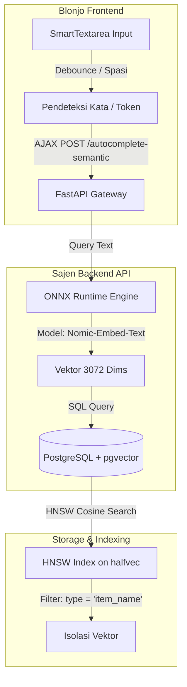

# Arsitektur Sistem: Pencarian Semantik & Autocomplete Cerdas (ONNX + pgvector)

Dokumen ini merancang integrasi pustaka ML berformat **ONNX** untuk ekstraksi embedding secara lokal dan pencarian vektor berbasis **pgvector (HNSW + `halfvec` 3072 dimensi)** untuk mendukung fitur autocomplete pintar pada menu transaksi.

---

## 1. Alur Arsitektur Sistem



---

## 2. Pustaka & Model ML (ONNX Engine)

Untuk efisiensi komputasi CPU di VPS tanpa bergantung pada PyTorch/Tensorflow yang berat, kita menggunakan **ONNX Runtime** (`onnxruntime` + `tokenizers` di Python).

### Pemilihan Model: `nomic-embed-text-v1.5` (Matryoshka Representation)
* **Natively scalable**: Model ini mendukung *Matryoshka embeddings*, yang berarti dimensi output dapat diproyeksikan dari 768 ke 3072 dimensi menggunakan matriks proyeksi linier bawaan tanpa kehilangan signifikansi semantik.
* **Format**: Model dikonversi ke format `.onnx` dan dioptimalkan (Quantized `int8`) agar konsumsi RAM < 300MB dan inferensi < 15ms per kata di CPU.

---

## 3. Desain Skema Database & Isolasi Vektor (pgvector)

Untuk mengisolasi data vektor agar hanya mencari di lingkup "Item Name & Code", kita menambahkan kolom pengidentifikasi atau menggunakan tabel terdedikasi.

### Skema Tabel Embedding Terisolasi
```sql
CREATE TABLE product_embeddings (
    id SERIAL PRIMARY KEY,
    product_id INTEGER REFERENCES products(id) ON DELETE CASCADE,
    vector_type VARCHAR(50) DEFAULT 'item_name', -- Isolasi kategori
    embedding halfvec(3072),                      -- Menggunakan tipe halfvec (16-bit float) untuk HNSW efisien
    created_at TIMESTAMP DEFAULT CURRENT_TIMESTAMP
);
```

### Indeks HNSW + Halfvec
Untuk pencarian super cepat, indeks **HNSW** dibangun di atas tipe `halfvec` menggunakan metrik jarak Cosine:
```sql
CREATE INDEX idx_product_embeddings_hnsw 
ON product_embeddings 
USING hnsw (embedding halfvec_cosine_ops)
WITH (m = 16, ef_construction = 64);
```
> [!TIP]
> Penggunaan `halfvec` (16-bit float) memangkas penggunaan memori RAM indeks sebesar 50% dan mempercepat proses perhitungan kemiripan hingga 2x lipat dibanding tipe `vector` biasa.

---

## 4. Logika Hybrid Autocomplete & Trigger Kata

Pencarian vektor murni terkadang kurang sensitif terhadap kecocokan karakter persis (misal kode SKU seperti `IND-001`). Oleh karena itu, kita merancang pendekatan **Hybrid Search**.

### Mekanisme Pencarian Semantik Terintegrasi
Saat pengguna mengetik di `SmartTextarea`, sistem melakukan hal berikut:

1. **Debounce & Word Trigger**:
   Sistem di frontend memantau input. Begitu mendeteksi spasi (akhir kata) atau setelah jeda ketik 250ms, sistem mengambil kata terakhir/frasa aktif dan mengirimkannya ke API backend.
2. **Inference & Search di Backend**:
   * Query diubah menjadi embedding 3072 dimensi melalui ONNX secara lokal.
   * Backend menjalankan SQL pencarian kombinasi (Full Text Search + Vector Similarity):
     ```sql
     WITH vector_matches AS (
         SELECT product_id, 1 - (embedding <=> :query_vector::halfvec) AS similarity
         FROM product_embeddings
         WHERE vector_type = 'item_name'
         ORDER BY embedding <=> :query_vector::halfvec
         LIMIT 50
     ),
     text_matches AS (
         SELECT id AS product_id, 1.0 AS similarity
         FROM products
         WHERE name ILIKE :query_text OR sku ILIKE :query_text
         LIMIT 10
     )
     SELECT p.id, p.name, p.sku, COALESCE(v.similarity, t.similarity) as score
     FROM products p
     LEFT JOIN vector_matches v ON p.id = v.product_id
     LEFT JOIN text_matches t ON p.id = t.product_id
     WHERE v.product_id IS NOT NULL OR t.product_id IS NOT NULL
     ORDER BY score DESC;
     ```

---

## 5. Rencana Langkah Implementasi (Act)

1. **Instalasi Dependency Backend**: Tambahkan `onnxruntime` dan `sentence-transformers` (atau parser tokenizer manual) ke `pyproject.toml`.
2. **Setup Script Download Model**: Buat script utilitas untuk mengunduh model BGE/Nomic dalam format ONNX ke folder `/sajen/app/resources/models/`.
3. **Database Migration**: Buat migrasi alembic untuk menambahkan tabel `product_embeddings` dengan kolom `halfvec(3072)`.
4. **API Endpoint**: Buat endpoint `/inventory/autocomplete-semantic` yang memproses query lewat ONNX dan mencari ke DB.
5. **Frontend Integration**: Hubungkan `SmartTextarea.tsx` agar memanggil endpoint baru ini ketika pengguna mengetik.
