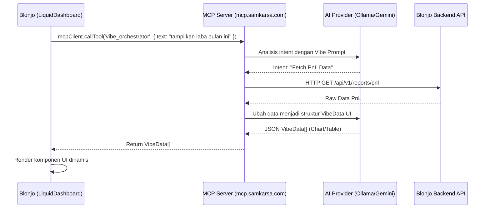

# Rancangan Fase 3: Optimasi Vibe Orchestrator & Omnibar via MCP

**Tujuan:**
Memindahkan beban penalaran (AI reasoning) dari *backend* Blonjo ke **MCP Server** secara penuh, menjadikan MCP sebagai *Agentic Router* yang cerdas untuk menerjemahkan bahasa natural (baik teks maupun suara) menjadi instruksi UI dinamis (Server-Driven UI) ataupun perintah eksekusi *database*.

## 1. Analisis Alur Saat Ini (Status Quo)
Saat ini di `LiquidDashboard.tsx`, setiap input dari `Omnibar` dikirim ke *backend* Blonjo via `fetchClient('/vibe/intent', { text })`. Backend merespons dengan format array `VibeData[]` (seperti pesan sukses, *chart*, atau *table*) yang kemudian di-*render* oleh `VibeRenderer`.

Masalah: *Backend* Blonjo seharusnya hanya fokus pada transaksi dan penyimpanan data, bukan pengolahan AI.

## 2. Alur Baru Berbasis MCP (Agentic Loop)



## 3. Langkah Implementasi

**Tahap 3A: Penambahan Tool di MCP Server**
Kita akan membuat *tool* baru di `mcp-server/src/index.ts` bernama `vibe_orchestrator`.
- **Input**: Teks dari Omnibar, informasi *tenant*, dan konteks halaman saat ini.
- **Proses**: 
  1. *Prompting* ke LLM untuk mendeteksi *intent*.
  2. Jika *intent* butuh data (*read*), MCP Server akan menembak *endpoint* GET milik Backend Blonjo.
  3. LLM di MCP Server membungkus hasil tersebut ke dalam spesifikasi `VibeData[]` (misalnya `type: 'chart'` atau `type: 'table'`).
- **Output**: Array JSON yang siap di-*render* oleh `VibeRenderer`.

**Tahap 3B: Integrasi OCR/Document Scanner via MCP**
Omnibar juga mendukung *file upload*. Kita bisa menambahkan *tool* `ocr_document` di MCP Server yang akan menerima URL/Base64 gambar, lalu menggunakan *Vision Model* (Gemini Flash Vision atau Llama Vision) untuk mengekstrak datanya.

**Tahap 3C: Refactor di Blonjo Frontend**
Di dalam `LiquidDashboard.tsx`, kita akan mengganti logika:
```typescript
// LAMA:
const data = await fetchClient('/vibe/intent', { method: 'POST', body: ... });

// BARU:
const result = await mcpClient.callTool('vibe_orchestrator', { 
    text: intent, 
    has_file: !!file, 
    // jika ada file, kirim base64-nya
});
const data = JSON.parse(result.content[0].text);
setVibeItems(data.items);
```

## 4. Keunggulan Arsitektur Ini
- **Extensibility**: Anda bisa menambahkan kemampuan baru untuk Omnibar (misal: "Analisis tren penjualan saya") hanya dengan mengedit *prompt* di MCP Server, tanpa perlu mengubah dan *re-deploy* aplikasi Blonjo.
- **Multimodal AI**: Karena MCP Server menggunakan `AiProviderService` Anda, kita bisa mem-pass gambar/suara langsung ke LLM di sisi server secara efisien.
- **Server-Driven UI Sejati**: MCP secara dinamis memutuskan komponen apa yang paling cocok untuk ditampilkan kepada *user* berdasarkan jawaban dari AI.
