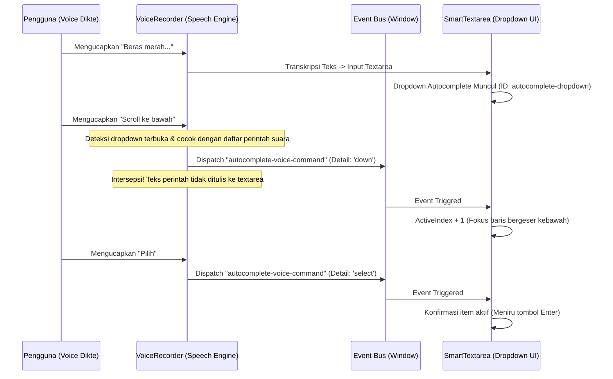

# Rencana Integrasi Perintah Suara Autocomplete (Fase 2)

Dokumen ini mendokumentasikan arsitektur dan cetak biru (blueprint) untuk mengintegrasikan perintah suara navigasi pada dropdown autocomplete secara hands-free.

---

## 1. Arsitektur Alur Kerja (Workflow)



---

## 2. Definisi Perintah Suara (Voice Commands)

Navigasi suara ini hanya aktif jika elemen `#autocomplete-dropdown` terdeteksi ada di DOM.

| Perintah Suara (Speech) | Variasi Kata Kunci | Aksi Internal (UI Event) |
| :--- | :--- | :--- |
| **Pindah ke Bawah** | `"bawah"`, `"scroll bawah"`, `"scroll ke bawah"` | `setActiveIndex(prev => (prev + 1) % suggestions.length)` |
| **Pindah ke Atas** | `"atas"`, `"scroll atas"`, `"scroll ke atas"` | `setActiveIndex(prev => (prev - 1 + length) % length)` |
| **Konfirmasi Pilihan** | `"pilih"`, `"pilih baris aktif"`, `"ok"`, `"oke"`, `"enter"` | `handleSelect(suggestions[activeIndex])` |

---

## 3. Strategi Intersepsi & Filter Transkripsi (Penting)

Masalah utama pada integrasi suara adalah mencegah kalimat perintah navigasi masuk ke dalam tulisan dokumen utama. Intersepsi dilakukan pada dua tahapan:

### A. Penyaringan Hasil Sementara (Interim Result)
Saat pengguna sedang berbicara, browser memancarkan event *interim transcription*. Perintah suara harus disaring agar tidak berkedip di dalam textarea.
```typescript
const lowerInterim = transcript.toLowerCase().trim();
const isDropdownOpen = !!document.getElementById('autocomplete-dropdown');

if (isDropdownOpen && (
    /^(?:scroll\s+)?(?:ke\s+)?(?:bawah|atas)$/.test(lowerInterim) ||
    /^(?:pilih|pilih\s+baris\s+aktif|ok|oke|enter)$/.test(lowerInterim)
)) {
    // Lewati penempelan teks sementara ke state
    continue; 
}
```

### B. Eksekusi Hasil Akhir (Final Result)
Ketika ucapan dideteksi sebagai hasil final oleh Web Speech API, jalankan event custom dan batalkan penambahan teks ke paragraf.
```typescript
if (isDropdownOpen) {
    if (/^(?:scroll\s+)?(?:ke\s+)?bawah$/.test(lower)) {
        window.dispatchEvent(new CustomEvent('autocomplete-voice-command', { detail: { command: 'down' } }));
        continue; // Lewati segment teks
    }
    // ... perintah atas & pilih ...
}
```

---

## 4. Blueprint Implementasi Komponen (Fase Lanjutan)

### A. Di sisi `SmartTextarea.tsx`
Menyematkan listener untuk mendengarkan custom event dari window dan memperbarui indeks dropdown:
```typescript
useEffect(() => {
  const handleVoiceCommand = (e: Event) => {
    const customEvent = e as CustomEvent;
    const command = customEvent.detail?.command;
    if (suggestions.length === 0) return;
    
    if (command === 'down') {
      setActiveIndex(prev => (prev + 1) % suggestions.length);
    } else if (command === 'up') {
      setActiveIndex(prev => (prev - 1 + suggestions.length) % suggestions.length);
    } else if (command === 'select') {
      const active = suggestions[activeIndex];
      if (active) handleSelect(active);
    }
  };

  window.addEventListener('autocomplete-voice-command', handleVoiceCommand);
  return () => window.removeEventListener('autocomplete-voice-command', handleVoiceCommand);
}, [suggestions, activeIndex]);
```

### B. Antarmuka Visual & UX Feedback
Pada Fase 2, sangat disarankan menambahkan indikator suara aktif di sebelah dropdown.
* Tampilkan mikrofon berkedip kecil di pojok dropdown yang menandakan: *"Mendengarkan kontrol suara..."*
* Menambahkan animasi mikro-interaksi (*glow*) pada baris dropdown ketika berhasil bergeser menggunakan perintah suara.
